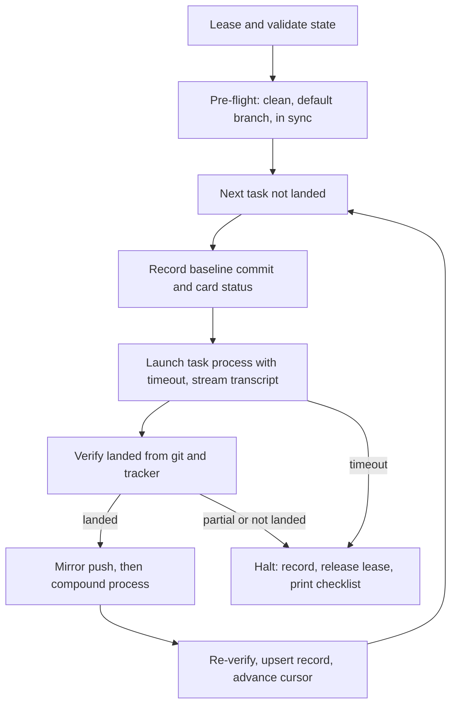

# Relay Outer Loop - Plan

## Goal Capsule

- **Objective:** an operator can hand Relay a list of independent tasks and walk away, and later find each task either landed (merged or in an open PR, with the tracker card closed and named against the landing commit) or halted with a stated reason, never silently half done.
- **Means:** a runner that launches one fresh headless `claude -p` process per task, verifies the landed state itself between tasks, and runs the compound judgment as a separate short process.
- **Product authority:** this document. `README.md` states the three qualifying properties and is the seed; where the two differ, this document wins.
- **Open blockers:** none. The two assumptions once listed as Resolve Before Planning were both answered on 2026-08-25; see Outstanding Questions.

---

## Product Contract

### Summary

Relay is a Claude Code plugin that runs a manifest of pre-defined tasks through the compound-engineering pipeline, serially, one fresh process per task, with no human present. The runner is project-agnostic; every project-specific fact lives in a manifest. Between tasks the runner checks git and the tracker directly, never the run's own claim of success, and decides whether a compound learning is worth writing.

### Problem Frame

The compound-engineering plugin ships a strong single-task pipeline. `lfg` plans, works, reviews, and ships to an open PR without stopping. `ce-work` has a `mode:return-to-caller` seam so an outer caller can own the shipping tail. Neither calls `ce-compound`, and neither takes the next ticket.

Running several tasks inside one interactive session fails on context: the window compacts, earlier decisions blur, and the last task in a batch is planned with a degraded memory of the first. Running them by hand, one session per card, costs an operator's attention for every launch and every post-run check.

The hand-built proof on 2026-08-25 (`support-workbench/plans/run-sweep.sh`, gitignored there) confirmed the mechanics: `claude -p` with `--permission-mode dontAsk` and an `mcp__atlassian__*` allowlist runs plugin skills headless and lets Jira writes through. It also showed what a shell script cannot do well. The card list, model, and effort were hardcoded. The brief was a hand-written markdown file that a single run could ignore in part. The JSON output file stayed empty until exit, so the operator watched a transcript path by hand. Nothing bounded a run's wall clock. A denied Jira write was invisible: the code could merge while the card stayed in Backlog. There was no resume; a halt meant editing the card list and re-launching.

Nobody ships this outer loop. Anthropic Routines are per-trigger and GitHub only. `continuous-claude` loops one spec, GitHub only. Relay is the outer loop and nothing more.

### Key Decisions

- **The runner knows nothing project-specific.** Every tracker, path, gate, and rule is manifest data. Governs R1, R2, R9.
- **One fresh process per task, serial, never parallel.** Context isolation is the product; parallelism would reintroduce shared state through the working tree. Governs R14, R15.
- **The landed state is verified by the runner, from git and the tracker, never from the run's report.** A headless run has every incentive to report success. Governs R20, R21, R22, R23.
- **Compound judgment is a separate short process, not a step inside the task run.** `lfg` and `ce-work` never call `ce-compound` (verified by grep of plugin 3.23.4 on 2026-08-25), and a task session at the end of its context is the worst judge of its own learning. Governs R26, R27, R28.
- **`dontAsk`, never `bypassPermissions`.** Relay runs on a real machine with live credentials. A tool not on the allowlist is denied, not prompted, and the manifest carries a disallow list on top. Governs R10, R11.
- **Two shipping modes, chosen per manifest: PR-terminal via `lfg`, or local merge via `ce-work mode:return-to-caller` plus a runner-owned merge.** Solo repos with no PR flow (support-workbench) and team repos with CI (GitHub Projects repos) both qualify. Governs R12, R13.
- **Three qualifying properties gate every project, and the `/relay` skill refuses a manifest that fails one.** Independent tasks, durable state in git or the board, an external gate that refuses broken changes. Governs R3, R4.
- **Resumable by design, using the ce-sweep state pattern of lease, cursor, and per-item upsert.** A halt at task four must not mean re-running tasks one through three. Governs R30, R31, R32, R33.
- **Observability is the session transcript, streamed, plus a wall-clock timeout per task.** `--output-format json` is silent until exit and CLI 2.1.245 has no `--max-turns`; the transcript jsonl under `~/.claude/projects/<slug>/` is the only live signal. Governs R34, R35, R36.

### Actors

- A1. **Operator.** Writes or approves the manifest, launches Relay, reads the summary afterwards. Absent during the run.
- A2. **Runner.** The Relay process. Reads the manifest, holds state, launches and bounds task processes, verifies landed state, launches the compound judgment, advances or halts.
- A3. **Task process.** One `claude -p` invocation per task. Runs `lfg` or `ce-work mode:return-to-caller` against one task. Knows nothing of other tasks.
- A4. **Compound process.** One short `claude -p` invocation per landed task. Judges whether the task produced a learning and, if so, runs `ce-compound mode:non-interactive`.
- A5. **Tracker.** Jira via the Atlassian MCP, GitHub Projects via `gh project`, or a markdown file. Source of the task list and the destination of status writes.
- A6. **External gate.** A pre-push hook or CI. Refuses a broken change regardless of what any Claude process believes.

### Requirements

**Manifest**

- R1. A manifest is one file per project and carries every project-specific fact the runner needs: repo path, tracker adapter and its identifiers, task list, shipping mode, mirror rule, allowlist, disallow patterns, per-task timeout, and the brief the task process reads.
- R2. Each task entry names at least a tracker id, a model, and an effort; the runner passes model and effort through to `claude -p` unchanged.
- R3. A manifest states, as data, how each of the three qualifying properties is satisfied for this project: which gate refuses broken changes and how it is invoked, where durable state lives, and that the listed tasks are independent.
- R4. The `/relay` skill writes a manifest from a conversation with the operator and refuses to launch when a qualifying property has no stated satisfier.
- R5. A manifest can mark a task as excluded from unattended runs with a reason, so a task whose brief says stop and ask is never picked up by a run with no one to ask.
- R6. A manifest carries a mirror rule when the project keeps a second branch or remote in sync, stated as a push the runner performs after verify-landed and re-verifies.
- R7. The manifest brief for a task is generated by the runner from the manifest plus the task id, not hand-written per run, and it instructs the task process to handle one task only.
- R8. A manifest is valid without any Relay-specific field in the target repo; Relay adds nothing to a project it runs against beyond what the pipeline itself commits.
- R9. The runner rejects a manifest that carries executable instructions where data is expected; the only code that runs is the runner and the CLI.

**Permissions and safety**

- R10. Every task process runs with `--permission-mode dontAsk`, an explicit `--allowedTools` list from the manifest, and a `--disallowedTools` list from the manifest that at minimum blocks force push, hard reset, recursive delete, and clean of untracked files.
- R11. Relay never uses `bypassPermissions` and provides no manifest switch that enables it.

**Shipping modes**

- R12. In PR-terminal mode the task process runs `lfg`; a task is landed when an open PR exists for the task branch, CI is decided green, and the tracker card references the PR.
- R13. In local-merge mode the task process runs `ce-work mode:return-to-caller` and the shipping tail is owned outside the task process; a task is landed when the default branch on the remote contains the task's commits, the working tree is clean on the default branch, and the tracker card references the merge commit.

**Process isolation and sequencing**

- R14. Tasks run one at a time; the runner launches the next task process only after verify-landed passes and the compound process has exited.
- R15. Nothing carries from one task process to the next except the manifest, the git state, and the tracker state; the runner passes no transcript, summary, or memory of a prior task into a later one.
- R16. A task process is started from a clean working tree on the default branch, in sync with the remote, and the runner halts before launch if any of those fail.
- R17. The runner records, before launch, the default branch commit and the tracker status of the task, so verify-landed can compare against a known baseline rather than an inferred one.

**Tracker adapters**

- R18. Day one ships three adapters: Jira through the Atlassian MCP, GitHub Projects through `gh project`, and a markdown file with one task per line. Each adapter exposes the same operations to the runner: list candidate tasks, read one task's status, and confirm a closing reference is present.
- R19. Adapter writes happen inside the task process through the pipeline's own tracker steps; the runner uses adapters to read and verify only, so a runner bug can never move a card.

**Verify-landed**

- R20. After each task process exits, the runner determines landed or not landed from git and the tracker alone, and never from the process exit code, the JSON result, or any text the process printed.
- R21. Verify-landed checks, in local-merge mode: working tree clean, on the default branch, local head equals remote head, the mirror (if any) equals head, and the default branch contains at least one commit that was not the baseline from R17.
- R22. Verify-landed checks, in both modes, that the tracker card reached its terminal status and that its closing comment or link names the landing commit or PR; a task whose code landed but whose card did not move is reported as a partial landing and halts the run.
- R23. A task process that exits with no new commit on the default branch and no PR is classified as blocked, not failed, and the runner reads the tracker for the blocker comment the brief required.
- R24. Verify-landed runs the project's external gate command from the manifest against the landed head when the manifest names one that can run locally, so a gate that only fires on push is not the sole guard.
- R25. Any verify-landed failure halts the run, leaves everything as found, records the failure in state, and prints exactly what the operator must check.

**Compound judgment**

- R26. After verify-landed passes, the runner launches a separate short `claude -p` process whose only job is to decide whether the landed task produced a learning a future session would get wrong without it, and to run `ce-compound mode:non-interactive` when it did.
- R27. The compound process receives the task id, the landing commit range, the plan path if one was committed, and the tracker comments; it does not receive the task process transcript.
- R28. The compound process ends on the `ce-compound` terminal signal, `Documentation complete` or `Documentation skipped`, and the runner treats either as success; a compound doc it wrote is committed and pushed by the compound process itself under the same gate as any other commit, and the runner re-runs verify-landed afterwards.
- R29. The compound process is bounded by its own shorter timeout and uses the model and effort the manifest sets for compound, defaulting to a cheaper tier than the task.

**Resumability**

- R30. The runner keeps a state file per manifest with a schema version, a lease, a cursor over the task list, and one record per task carrying status, baseline commit, landing commit or PR, verify result, and compound outcome.
- R31. A second runner started against the same manifest while a lease is live refuses to start; a stale lease past its TTL is reclaimed and reported.
- R32. Re-launching after a halt resumes at the first task whose record is not landed, and never re-runs a task whose record carries a verified landing.
- R33. A task record marked landed must carry the landing commit or PR and the verification timestamp; on startup the runner downgrades any landed record missing either back to pending, mirroring the ce-sweep `validate` rule.

**Observability**

- R34. The runner streams the task process's session transcript to the operator's terminal and to a per-task log file as it is written, because the CLI's JSON output is silent until exit.
- R35. Each task has a wall-clock timeout from the manifest; on expiry the runner terminates the process, treats the task as not landed, and runs verify-landed to classify what was left behind.
- R36. At the end of a run, and on halt, the runner prints a summary naming each task, its outcome, its landing commit or PR, its compound outcome, its wall-clock and cost when the CLI reports it, and the checks an operator should still make by hand.
- R37. The runner detects a denied tool call in the transcript stream and surfaces it in the summary, because a denied tracker write is otherwise silent.

**Installability**

- R38. Relay installs as a Claude Code plugin with a `/relay` skill and a runner script; installing it into a fresh machine that has the compound-engineering plugin and the relevant tracker CLI or MCP requires no edit to Relay itself.
- R39. Relay depends on the compound-engineering plugin by name and states the minimum version whose `ce-work mode:return-to-caller` and `lfg` contracts it was built against.
- R40. Relay's own repo carries no reference to any specific project, tracker instance, or person beyond the example manifests in its docs.

### Key Flows

- F1. Normal run
  - **Trigger:** operator launches the runner with a manifest.
  - **Actors:** A1, A2, A3, A4, A5, A6
  - **Steps:** runner acquires the lease and validates state; pre-flight check per R16; for each task not landed: record baseline (R17), generate brief (R7), launch task process with model, effort, allowlist, disallow list, and timeout (R2, R10, R35), stream transcript (R34), wait; verify-landed (R20 to R24); apply mirror rule (R6); launch compound process (R26 to R29); re-verify; upsert the task record; advance the cursor. Release the lease and print the summary (R36).
  - **Covered by:** R2, R6, R7, R10, R14 to R17, R20 to R29, R30, R34 to R36

- F2. Halt and resume
  - **Trigger:** verify-landed fails or a task times out.
  - **Actors:** A1, A2
  - **Steps:** runner records the failure on the task record, releases the lease, prints the summary with the operator's checklist (R25). Operator repairs by hand. Operator re-launches; runner validates state (R33), resumes at the first non-landed task (R32).
  - **Covered by:** R25, R30 to R33, R35

- F3. Manifest authoring
  - **Trigger:** operator invokes `/relay` in a project.
  - **Actors:** A1, A2, A5
  - **Steps:** skill reads the tracker for candidate tasks, asks the operator to confirm the list, model, effort, shipping mode, and exclusions (R5); asks how each qualifying property is satisfied (R3); writes the manifest; refuses to launch on a missing satisfier (R4).
  - **Covered by:** R1 to R5, R18

### Acceptance Examples

- AE1. **Covers R20, R22.** Given a task process that prints DONE and exits 0, when the card is still in Backlog because the MCP write was denied, then the runner reports a partial landing and halts; it does not start the next task.
- AE2. **Covers R23.** Given a task whose brief says comment the blocker and stop, when the process exits leaving main unchanged and clean, then the task record reads blocked, the runner reads the card's blocker comment into the summary, and the run continues to the next task.
- AE3. **Covers R32, R33.** Given a state file where task two is marked landed with no verification timestamp, when the runner starts, then task two is downgraded to pending and is the first task run.
- AE4. **Covers R35.** Given a task with a 90 minute timeout, when the process is still running at 90 minutes, then it is terminated, verify-landed runs on whatever was left, and the run halts with the working tree state in the summary.
- AE5. **Covers R37.** Given a transcript line showing a denied `mcp__atlassian__transitionJiraIssue` call, when the run summary prints, then that denial is listed against the task.
- AE6. **Covers R4.** Given a manifest with no gate satisfier, when the operator asks `/relay` to launch, then it refuses and names the missing property.
- AE7. **Covers R13, R21.** Given local-merge mode and a task process that merged to main but did not push, when verify-landed runs, then local head differs from remote head and the run halts before the compound process.
- AE8. **Covers R28.** Given a compound process that writes a solutions doc and commits it, when the pre-push gate rejects the push, then verify-landed after compound fails on unpushed work and the run halts, so a gate failure in the compound step is never hidden.

### Scope Boundaries

Deferred for later:

- Parallel task execution, worktrees, or any run of more than one task process at a time.
- Adapters beyond Jira, GitHub Projects, and markdown.
- A runner that schedules itself on a cron or reacts to tracker events; Relay is launched by an operator.
- Cost caps enforced by Relay; `--max-budget-usd` is API-only and the CLI has no turn bound, so wall clock is the only bound on day one.
- Automatic repair after a halt; the operator repairs by hand and resumes.

Outside this product's identity:

- Any part of the per-task pipeline: planning, implementation, review, PR babysitting. Those belong to the compound-engineering plugin and Relay calls them.
- Deciding what to build; Relay takes a task list it did not write.
- Project-specific logic in the runner.

### Dependencies and Assumptions

- Depends on compound-engineering plugin 3.23.4 or later: `lfg` PR-terminal behavior, `ce-work mode:return-to-caller` envelope, `ce-compound mode:non-interactive` terminal signals.
- Depends on Claude Code CLI 2.1.245 or later: `--model`, `--effort`, `--permission-mode dontAsk`, `--allowedTools`, `--disallowedTools`, and the session transcript path under `~/.claude/projects/<slug>/`.
- Assumes tracker credentials are already configured on the machine (Atlassian MCP authenticated, `gh` logged in). Relay carries no secrets.
- Assumes the target project's external gate exists and is enforced at push or merge; Relay verifies its presence but does not build one.

### Outstanding Questions

Resolved 2026-08-25, before planning:

- **Where the shipping tail lives in local-merge mode: the runner owns it.** Settled by the plugin contract rather than by experiment. `ce-work/references/execution-engines.md` (plugin 3.23.4, line 155) states that return-to-caller mode "performs implementation and local verification only, then returns the structured summary in references/return-to-caller.md (standalone_shipping_skipped: true). Does not run simplify/review/PR/CI, the caller owns those." The task process therefore ends on its feature branch with commits and the structured envelope; the runner performs the merge to the default branch, the push, and the mirror push, and then runs verify-landed. The envelope shape the runner receives is defined in `ce-work/references/return-to-caller.md`: `status` (`complete`, `blocked`, `failed`), `changed_files`, `u_ids_completed`, `verification_evidence`, `blockers`, `recovery_path`, and `standalone_shipping_skipped: true`. R13 stands as written, with "owned outside the task process" now meaning owned by the runner.
- **Pre-push hook under a headless process: it works.** support-workbench's pre-push hook ran the full 75 second gate and passed during a non-interactive push on 2026-08-25. No tty block was observed. Caveat: the push was made by a non-interactive process, not by a `claude -p` process specifically; treat the tty question as answered and keep R24 and R35 as written. The gate's runtime counts against the task timeout, so the manifest's per-task timeout must leave headroom for the gate.

Deferred to Planning:

- Manifest file format (YAML versus JSON versus TOML) and where the state file lives relative to the target repo, given that Relay adds nothing to the target repo (R8).
- Whether the compound process reads the task's committed plan and tracker comments directly or receives a runner-composed digest (R27 sets what it receives, not how).
- How the markdown adapter marks a task closed without a tracker write from inside the task process (R19 makes the runner read-only; the markdown adapter may be the one exception, and planning decides).
- Transcript slug derivation for the live monitor path, and how the runner finds the right session file when several Claude sessions run on the machine.
- The default per-task timeout and the default compound model tier.

### Sources

- `README.md` in this repo: the seed, the three qualifying properties, the runner, manifest, skill shape.
- Decision record and verified headless facts: `Integrel/.claude/memory/project_relay.md` (outside this repo).
- Hand-built proof: `Integrel/support-workbench/plans/run-sweep.sh` and `plans/2026-08-25-build-ready-sweep.md` (gitignored there).
- Per-task pipeline contracts: compound-engineering plugin 3.23.4, `skills/lfg/SKILL.md`, `skills/lfg/references/shipping-tail.md`, `skills/lfg/references/work-return.md`, `skills/ce-work/references/return-to-caller.md`, `skills/ce-compound/SKILL.md`.
- State pattern: `skills/ce-sweep/references/state-schema.md` in the same plugin.
- Ecosystem check 2026-08-25: Anthropic Routines, `continuous-claude`; neither ships a tracker-driven serial outer loop.
