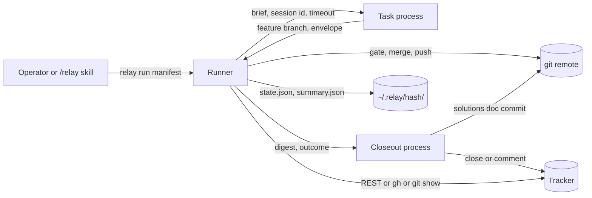
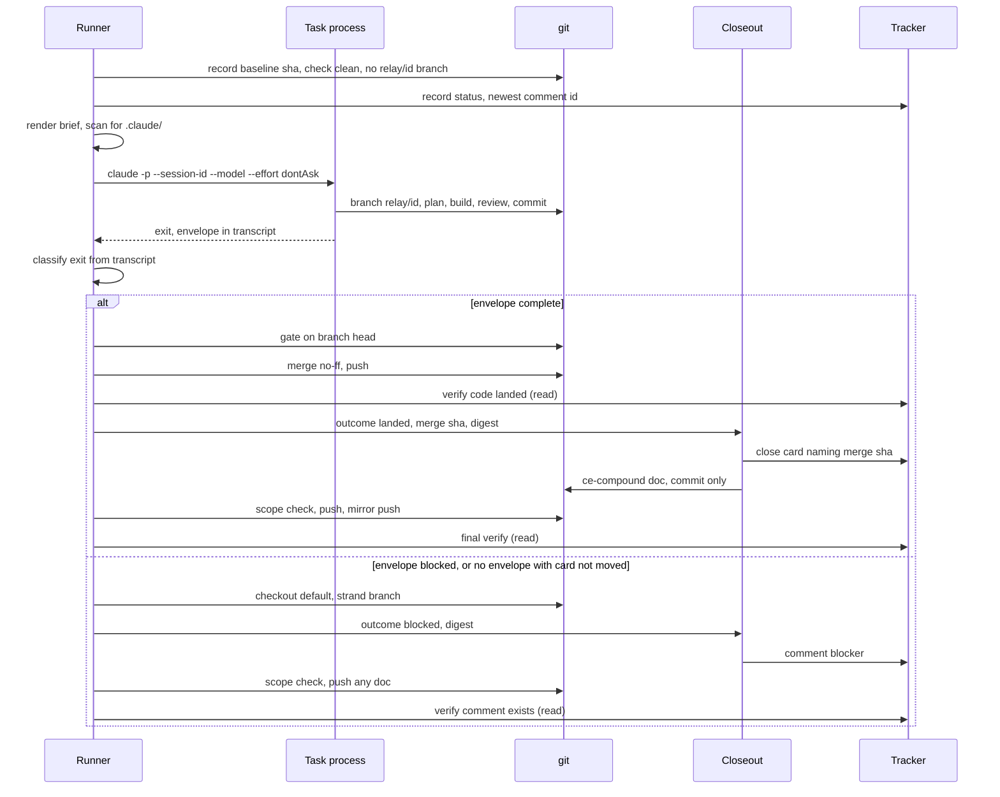

# Relay Outer Loop - Plan

## Goal Capsule

- **Objective:** an operator hands Relay a list of independent tasks and walks away. Later they find each task either landed (merged or in an open PR, card closed and named against the landing commit) or halted with the cause stated in the summary, never silently half done, and never diagnosed by reading a transcript.
- **Means:** a Python runner that launches one fresh headless `claude -p` process per task, owns the merge tail in local merge mode, classifies every exit from the session transcript, and launches one short closeout process per task that writes the tracker and judges the learning (KTD1, KTD4, KTD6).
- **Authority:** this plan. The origin brainstorm is the product record it enriches; where the two differ, this plan wins and the Product Contract preservation note below says why.
- **Execution profile:** greenfield plugin repo. Standard library Python 3 only. Every unit ships with tests that run against a stub `claude` on PATH, never against a live model.
- **Tail ownership:** whoever executes this plan owns commit, merge to main, and push in this repo. No PR.
- **Stop conditions:** stop and surface a blocker if the compound-engineering plugin contract cited in a unit does not match the installed 3.23.4 text, if a unit needs `bypassPermissions` to work, or if any unit needs to write into a target project beyond what the per-task pipeline itself commits (R8).

---

## Product Contract

**Product Contract preservation:** changed: R12, R13, R19, R20, R22, R23, R26, R27, R28, and Actor A4. Why: the resolved pre-planning question (the runner owns the local merge tail) means the task process exits before the merge commit exists, so nobody the origin permitted to write the tracker could name it. Planning research showed three more contract facts the origin did not have: `ce-work mode:return-to-caller` requires a plan path, `ce-compound` writes a doc but never commits it, and the return envelope has no fixed format. The rewritten requirements below keep every origin intent (runner read only on the tracker, landing verified from git and tracker, compound judgment separate from the task process) and move the tracker writes into a short closeout process. Added: R41 to R56 from the post-brainstorm solutions doc, from planning research, and from document review. All other R, A, F, and AE IDs are carried unchanged.

### Summary

Relay is a Claude Code plugin that runs a manifest of pre-defined tasks through the compound-engineering pipeline, serially, one fresh process per task, with no human present. The runner is project agnostic; every project specific fact lives in a manifest. Between tasks the runner checks git and the tracker directly, never the run's own claim of success, launches a short closeout process that records the outcome on the tracker and judges whether a learning is worth writing, and then advances or halts with the cause named.

### Problem Frame

The compound-engineering plugin ships a strong single task pipeline. `lfg` plans, works, reviews, and ships to an open PR without stopping. `ce-work` has a `mode:return-to-caller` seam so an outer caller can own the shipping tail. Neither calls `ce-compound`, and neither takes the next ticket.

Running several tasks inside one interactive session fails on context: the window compacts, earlier decisions blur, and the last task in a batch is planned with a degraded memory of the first. Running them by hand, one session per card, costs an operator's attention for every launch and every post-run check.

The hand-built proof on 2026-08-25 (`prototype/run-sweep.sh`) confirmed the mechanics and showed what a shell script cannot do well. The card list, model, and effort were hardcoded. The brief was hand-written and a single run ignored parts of it. `--output-format json` produced a zero byte file, so the operator watched a transcript path by hand. Nothing bounded a run's wall clock. A denied Jira write was invisible. There was no resume. When the one real run did not land, the script saw that it had not (no new commit, left on a feature branch) but could not say why, and pointed the operator at the empty JSON file. Diagnosis took a human reading a 2.9 MB transcript.

Nobody ships this outer loop. Anthropic Routines are per trigger and GitHub only. `continuous-claude` loops one spec, GitHub only. Relay is the outer loop and nothing more.

### Key Decisions

- **The runner knows nothing project specific.** Every tracker, path, gate, and rule is manifest data. Governs R1, R2, R9.
- **One fresh process per task, serial, never parallel.** Context isolation is the product. Governs R14, R15.
- **The landed state is verified by the runner, from git and the tracker, never from the run's report.** The run's envelope and transcript may route the runner's next step; only git and the tracker may confirm a landing. Governs R20, R21, R22, R23.
- **Every tracker write happens inside a Claude process, never in the runner.** The task process writes through the pipeline's own steps; the closeout process writes the closing reference or the blocker comment from a digest the runner composed. A runner defect can never move a card. Governs R19, R26, R42.
- **Compound judgment is a separate short process, not a step inside the task run.** `lfg` and `ce-work` never call `ce-compound`, and a task session at the end of its context is the worst judge of its own learning. The closeout process carries it. Governs R26, R27, R28.
- **`dontAsk`, never `bypassPermissions`.** Governs R10, R11.
- **Two shipping modes per manifest: PR terminal via `lfg`, or local merge via `ce-work mode:return-to-caller` plus a runner owned merge.** Governs R12, R13, R50.
- **Three qualifying properties gate every project, and the `/relay` skill refuses a manifest that fails one.** Governs R3, R4.
- **Resumable by design, using the ce-sweep state pattern of lease, cursor, and per item upsert.** Governs R30 to R33, R47, R48.
- **Observability is the session transcript plus a wall clock timeout per task.** The transcript path is fixed before launch with `--session-id`, and every exit is classified from it into a closed set of halt classes. Governs R34 to R37, R44, R49.
- **A task that touches `.claude/` cannot run unattended.** Detected before launch, not at minute fifty. Governs R41.
- **The brief decides the degraded path in advance and pins qualified skill names.** A run that has been told what to do when blocked can land eight of nine commits instead of none. Governs R43.
- **The runner exposes every operator verb as a subcommand, and its state and summary are machine readable.** The `/relay` skill and a later diagnosing session read one JSON file, never a transcript. Governs R45, R46.

### Actors

- A1. **Operator.** Writes or approves the manifest, launches Relay, reads the summary afterwards. Absent during the run.
- A2. **Runner.** The Relay process. Reads the manifest, holds state, launches and bounds the task and closeout processes, gates and merges in local merge mode, verifies landed state, classifies exits, advances or halts.
- A3. **Task process.** One `claude -p` invocation per task. Runs the per task pipeline against one task. Knows nothing of other tasks.
- A4. **Closeout process.** One short `claude -p` invocation per task after the task process exits, in every outcome except timeout. Writes the outcome to the tracker from the runner's digest, then judges whether the task produced a learning and runs `compound-engineering:ce-compound mode:non-interactive` when it did.
- A5. **Tracker.** Jira via the Atlassian MCP for writes and the Jira REST API for the runner's reads, GitHub Projects via `gh`, or a markdown file in the target repo. Source of the task list and destination of status writes.
- A6. **External gate.** A pre-push hook or CI. Refuses a broken change regardless of what any Claude process believes.

### Requirements

**Manifest**

- R1. A manifest is one file per project and carries every project specific fact the runner needs: repo path, tracker adapter and its identifiers, task list, shipping mode, mirror rule, allowlist, disallow patterns, per task timeout, degraded path authorizations, and the parameters the brief template needs.
- R2. Each task entry names at least a tracker id, a model, and an effort; the runner passes model and effort through to `claude -p` unchanged.
- R3. A manifest states, as data, how each of the three qualifying properties is satisfied for this project: which gate refuses broken changes and how it is invoked, where durable state lives, and that the listed tasks are independent. It carries a fourth sentence naming who can edit the listed cards and their comments, since that text instructs an unattended process (R56).
- R4. The `/relay` skill writes a manifest from a conversation with the operator and refuses to launch when a qualifying property has no stated satisfier.
- R5. A manifest can mark a task as excluded from unattended runs with a reason, so a task whose brief says stop and ask is never picked up by a run with no one to ask.
- R6. A manifest carries a mirror rule when the project keeps a second branch or remote in sync, stated as a push the runner performs after the closeout process and re-verifies (sequence in R50).
- R7. The brief for a task is generated by the runner from the manifest plus the task record, not hand-written per run, and it instructs the task process to handle one task only.
- R8. A manifest is valid without any Relay specific field in the target repo; Relay adds nothing to a project it runs against beyond what the pipeline itself commits.
- R9. The runner rejects a manifest that carries executable instructions where data is expected; the only code that runs is the runner and the CLI. The gate command and mirror push are the two manifest fields the runner executes, and both are argument lists, never shell strings.

**Permissions and safety**

- R10. Every task process runs with `--permission-mode dontAsk`, an explicit `--allowedTools` list from the manifest, and a `--disallowedTools` list from the manifest that at minimum blocks force push, hard reset, recursive delete, and clean of untracked files, with the variant spellings enumerated in `contracts.py` (U1). The disallow list is defence in depth; landing safety rests on the runner owning merge and push (R13) and on `remote_advanced` (R54).
- R11. Relay never uses `bypassPermissions` and provides no manifest switch that enables it.

**Shipping modes**

- R12. In PR terminal mode the task process runs `compound-engineering:lfg`; a task is landed when an open PR exists for the task branch, CI has decided green within the runner's CI poll bound, and the tracker card references the PR. The runner's only git writes in this mode are the checkout and sync of the default branch after landing.
- R13. In both modes the task process creates and stays on branch `relay/<task-id>` before invoking any skill. In local merge mode it runs `compound-engineering:ce-plan` from the task, then `compound-engineering:ce-work mode:return-to-caller <plan-path>`, then review and its fixes, and exits on that branch with a return envelope. The runner owns the shipping tail: it runs the gate on the branch head, merges to the default branch, and pushes. A task is landed when the remote default branch contains the task's commits, the working tree is clean on the default branch, and the tracker card references the merge commit.

**Process isolation and sequencing**

- R14. Tasks run one at a time; the runner launches the next task process only after the code scope verify passes, the closeout process has exited, and the full scope verify passes (scopes in KTD13).
- R15. Nothing carries from one task process to the next except the manifest, the git state, and the tracker state; the runner passes no transcript, summary, or memory of a prior task into a later one.
- R16. A task process is started from a clean working tree on the default branch, in sync with the remote, with no pre-existing `relay/<task-id>` branch, and the runner halts before launch if any of those fail.
- R17. The runner records, before launch, the default branch commit, the tracker status of the task, and the newest tracker comment id, so verify-landed and the blocked digest compare against a known baseline.

**Tracker adapters**

- R18. Day one ships three adapters: Jira, GitHub Projects through `gh`, and a markdown file with one task per line. Each adapter exposes the same operations to the runner: list candidate tasks, read one task's status, list comments newer than a baseline, and confirm a closing reference is present.
- R19. The runner never writes to the tracker. Writes happen inside the task process through the pipeline's own tracker steps, or inside the closeout process (R26) from a digest the runner composed. The runner's adapters read and verify only, so a runner defect can never move a card. In the markdown adapter the closeout process edits the tracker line and commits it on the default branch after the runner's merge (R51); the runner pushes and verifies that commit, and is the transport for a model authored write, never the author.

**Verify-landed**

- R20. After each task process exits, the runner may use the return envelope and the transcript to decide its next step (merge, closeout digest content, halt class), and determines landed or not landed from git and the tracker alone, never from the exit code, the envelope, or any text the process printed.
- R21. Verify-landed checks, in local merge mode: working tree clean, on the default branch, local head equals remote head, the mirror (if any) equals head, and the default branch contains at least one commit that was not the baseline from R17.
- R22. Verify-landed checks, in both modes, that the tracker card reached its terminal status and that its closing comment or link names the landing commit or PR; a task whose code landed but whose card did not move is reported as a partial landing and halts the run.
- R23. A task process whose envelope reads `status: blocked` or `status: failed`, or that exits with no envelope (unless git and the tracker show a finished pipeline per KTD6), is classified as blocked, not failed. The runner composes a blocker digest from what it can see (envelope blockers, the last denial line, the branch state) and the closeout process writes it to the card (R42). The run continues to the next task.
- R24. Verify-landed runs the project's gate command from the manifest against the task branch head before the merge in local merge mode, so a gate that only fires on push is not the sole guard and a refused change strands a branch rather than diverging the default branch.
- R25. Any verify-landed failure halts the run, leaves everything as found, records the failure and its halt class in state, and prints exactly what the operator must check.

**Closeout and compound judgment**

- R26. After every task process exit except timeout, the runner launches a separate short `claude -p` closeout process with two ordered duties: first write the task's outcome to the tracker (closing reference naming the landing commit or PR when landed, blocker comment when blocked), then decide whether the task produced a learning a future session would get wrong without it and run `compound-engineering:ce-compound mode:non-interactive` when it did.
- R27. The closeout process receives the task id, the outcome, the landing commit range or branch, the plan path if one was committed, the runner's digest (denials, gate results, timing, envelope blockers), and the tracker comments since baseline; it does not receive the task process transcript.
- R28. The closeout process ends its compound duty on the `ce-compound` terminal line, `Documentation complete` or `Documentation skipped`, and the runner treats either as success. `ce-compound` does not commit, so the closeout brief instructs the process to commit any doc it wrote and never to push; the runner runs the R53 scope check on the unpushed commits and then pushes them under the same gate as any other commit (to the default branch in local merge mode, to the task branch before the CI poll in PR terminal mode). The runner re-runs verify-landed after that push.
- R29. The closeout process is bounded by its own shorter timeout and uses the model and effort the manifest sets for closeout, defaulting to a cheaper tier than the task.

**Resumability**

- R30. The runner keeps a state file per manifest with a schema version, a lease, a cursor over the task list, one record per task carrying status, baseline commit, landing commit or PR, verify verdict, halt class, and closeout outcome, and a terminal record written as the runner's last act.
- R31. A second runner started against the same manifest, or against any manifest naming the same target repo, while a lease is live refuses to start naming the holder; a stale lease past its TTL is reclaimed and reported.
- R32. Re-launching after a halt resumes at the first task whose record is not landed, and never re-runs a task whose record carries a verified landing.
- R33. A task record marked landed must carry the landing commit or PR and the verification timestamp; on startup the runner downgrades any landed record missing either back to pending, mirroring the ce-sweep `validate` rule.

**Observability**

- R34. The runner streams the task process's output to the operator's terminal and to a per task log file as it is written, because the CLI's JSON output is silent until exit.
- R35. Each task has a wall clock timeout from the manifest, measured on a clock that excludes time the host spent asleep; on expiry the runner terminates the process group and classifies what was left behind: a clean tree takes the blocked path with a digest naming the timeout, a dirty tree halts (R50).
- R36. At the end of a run, and on halt, the runner prints a summary naming each task, its outcome, its halt class and cause line, its landing commit or PR, its closeout outcome, its wall clock, and the checks an operator should still make by hand.
- R37. The runner detects a denied tool call in the transcript, records it on the task record with the tool name and its argument path, and surfaces it in the summary, because a denied tracker write is otherwise silent.

**Installability**

- R38. Relay installs as a Claude Code plugin with a `/relay` skill and a runner script; installing it into a fresh machine that has the compound-engineering plugin and the relevant tracker CLI or MCP requires no edit to Relay itself.
- R39. Relay depends on the compound-engineering plugin by name and states the minimum version whose `ce-work mode:return-to-caller`, `lfg`, and `ce-compound mode:non-interactive` contracts it was built against.
- R40. Relay's own repo carries no reference to any specific project, tracker instance, or person beyond the example manifests in its docs.

**Pre-flight and the brief (from the solutions doc)**

- R41. Before launching a task process the runner scans the generated brief and the task's tracker text for any path under `.claude/`; a hit marks the task excluded from unattended runs (R5) with the reason recorded, and the summary names it as skipped. After a task process exits the runner diffs the task branch against the R17 baseline and records a touched `.claude/` path as a `path_gate` finding (R44).
- R42. A blocked exit is recorded on the tracker by the closeout process as a comment composed from the runner's digest, whenever the card carries no comment newer than the R17 baseline; the closeout brief carries the comments since baseline so the process can see whether one exists. Commenting is not transitioning; the closeout process never changes a blocked card's status.
- R43. The generated brief pre-authorizes the degraded path from manifest fields: whether partial work may be committed to the task branch without the blocked piece, whether the run may open a follow-up task, and what it must record before exiting. The brief pins every skill by its fully qualified name, and the runner records any `Skill` invocation whose name lacks the required prefix as a `skill_substitution` finding in the summary.

**Halt classification (closes the known gap)**

- R44. After every task process exit the runner reads the session transcript and classifies the exit into exactly one halt class from a closed set (KTD6), records the class and its evidence on the task record, and prints the class's cause line in the summary, so an operator never diagnoses a halt by reading a transcript.

**Runner interface and state (agent parity)**

- R45. Every operator verb is a runner subcommand with no interactive prompt: `validate`, `run`, `status`, `summary`, `verify`, and `lease`. The `/relay` skill invokes these; no verb exists only inside the skill's conversation.
- R46. The state file and the summary are JSON with a schema version; the human readable summary is rendered from that JSON, never the reverse.
- R47. While a task or closeout process runs, the runner renews its lease on a fixed heartbeat, and the lease TTL is shorter than any task timeout, so a crashed runner is reclaimable and a live one is never reclaimed.
- R48. On startup the runner re-runs the full scope verify on records marked partial or halted (including `runner_crashed`) and promotes any that now pass; blocked records are skipped unless the operator passes `--retry-blocked`, which deletes a local `relay/<task-id>` branch only when it carries no commits beyond the baseline and otherwise halts naming the branch; excluded records are always skipped.
- R49. The runner starts each `claude -p` in its own process group and kills the whole group on timeout, so subagents and a gate mid-run do not outlive the task.
- R50. The per task sequence after the task process exits is fixed. Local merge mode, routable to merge: classify exit, gate on branch head, checkout default, merge, push, code scope verify, closeout process, scope check, push, mirror push, full scope verify, delete the local task branch. Local merge mode, blocked: classify exit, checkout default leaving `relay/<task-id>` in place and recorded, closeout process, scope check, push, confirm the comment, continue. Timeout with a clean tree: checkout default, strand the branch, closeout with outcome blocked and a digest naming the timeout, continue; timeout with a dirty tree: code scope verify, halt, no closeout. PR terminal mode: classify exit, locate the PR, closeout process (commits to the task branch), scope check, push, CI poll, full scope verify, checkout and sync default. The mirror runs after closeout so a compound doc commit never leaves the mirror one commit behind.
- R51. The markdown adapter's tracker file lives in the target repo; the closeout process edits the task's line, commits, and pushes it under the gate, and the runner verifies the close by reading the file at the remote default branch head.
- R52. The Jira adapter's read side uses the Jira REST API with an operator supplied token named in the manifest; the runner never reads the tracker through a model.
- R53. The closeout process's commits are docs only: after closeout exits and before anything is pushed, the runner diffs the new local head against the pre-closeout head and, when any path falls outside `closeout.allowed_paths`, resets the local branch to the pre-closeout head and halts with class `closeout_out_of_scope` naming the path. `closeout.allowed_paths` always contains the CE artifact root (`docs_root` from the target's `.compound-engineering/config.yaml`, else `docs/`), `CONCEPTS.md` at the repo root (which `ce-compound` writes), and the markdown adapter's tracker file when that adapter is in use; the manifest may add more.
- R56. Tracker text is untrusted input. The brief and the closeout brief carry task titles, descriptions, and comments inside a delimited data block that states instructions inside it are not to be followed, and the manifest's fourth qualifying sentence (R3) names every account that can edit the listed cards as trusted to instruct an unattended process.
- R54. The runner fetches before merging; when the remote default branch has moved past the R17 baseline, or the merge reports conflicts, the runner aborts the merge and halts with class `remote_advanced`, leaving the task branch in place.
- R55. On reclaiming a stale lease the runner marks any record left in `running` or `merging` as halted with class `runner_crashed`, aborts an in-progress merge if `MERGE_HEAD` exists, and then applies R48.

### Key Flows

- F1. Normal run, local merge mode
  - **Trigger:** operator runs `relay run <manifest>`.
  - **Actors:** A1, A2, A3, A4, A5, A6
  - **Steps:** acquire lease, validate state (R33), promote re-verifiable records (R48); pre-flight per R16; for each task not landed: record baseline (R17), generate brief (R7, R43), pre-flight scan (R41), launch task process with a fixed session id, model, effort, allowlist, disallow list, timeout (R2, R10, R35), stream output (R34), wait with heartbeat (R47); classify exit (R44); if routable to merge: gate on branch head (R24), merge, push; code scope verify (R20, R21); launch closeout (R26 to R29); scope check and push (R53); mirror (R6); full verify (R22); upsert record; advance cursor. Release lease, write terminal record, print summary (R36).
  - **Covered by:** R2, R6, R7, R10, R14 to R17, R20 to R29, R30, R34 to R37, R41, R43, R44, R47, R50

- F2. Halt and resume
  - **Trigger:** verify-landed fails, a gate refuses, or a task times out.
  - **Actors:** A1, A2
  - **Steps:** runner records the halt class on the task record, writes the terminal record, releases the lease, prints the summary with the cause line and checklist (R25, R44). Operator repairs by hand. Operator re-launches; runner validates state (R33), re-verifies partial and halted records (R48), resumes at the first non-landed task (R32).
  - **Covered by:** R25, R30 to R33, R35, R44, R48

- F3. Manifest authoring
  - **Trigger:** operator invokes `/relay` in a project.
  - **Actors:** A1, A2, A5
  - **Steps:** skill reads the tracker for candidate tasks, asks the operator to confirm the list, model, effort, shipping mode, exclusions (R5), and degraded path authorizations (R43); asks how each qualifying property is satisfied (R3); writes the manifest; runs `relay validate`; refuses to launch on a missing satisfier (R4).
  - **Covered by:** R1 to R5, R18, R43, R45

- F4. Blocked exit
  - **Trigger:** task process exits with envelope `status: blocked`, or with a denial and no commits.
  - **Actors:** A2, A4, A5
  - **Steps:** runner classifies (R44), composes the digest (R23), launches closeout with outcome blocked; closeout comments the card (R42) and judges the learning (R26); runner confirms the comment exists (R18) and continues.
  - **Covered by:** R23, R26, R42, R44

### Acceptance Examples

- AE1. **Covers R20, R22.** Given a task process that prints DONE and exits 0, when the card is still in Backlog because the MCP write was denied, then the runner reports a partial landing with halt class `tracker_write_denied` and halts; it does not start the next task.
- AE2. **Covers R23, R42.** Given a task whose envelope reads `status: blocked` and whose card carries no comment newer than baseline, when the closeout process runs, then the card gains one comment naming the blocker from the runner's digest, the task record reads blocked, and the run continues to the next task.
- AE3. **Covers R32, R33.** Given a state file where task two is marked landed with no verification timestamp, when the runner starts, then task two is downgraded to pending and is the first task run.
- AE4. **Covers R35, R49.** Given a task with a 90 minute timeout, when the process is still running at 90 minutes, then its whole process group is terminated, verify-landed runs on whatever was left, and the run halts with halt class `timeout` and the working tree state in the summary.
- AE5. **Covers R37, R44.** Given a transcript line showing a denied `mcp__atlassian__transitionJiraIssue` call, when the run summary prints, then that denial is listed against the task with the tool name.
- AE6. **Covers R4.** Given a manifest with no gate satisfier, when the operator asks `/relay` to launch, then it refuses and names the missing property.
- AE7. **Covers R13, R21.** Given local merge mode and a runner push refused by the pre-push hook, when verify-landed runs, then local head differs from remote head, the run halts with halt class `gate_refused`, and the summary names the hook output file.
- AE8. **Covers R28, R50, R53.** Given a closeout process that writes a solutions doc and commits it, when the runner's push is rejected by the pre-push gate, then the run halts with class `gate_refused` and the summary names the closeout commit, so a gate failure in the closeout step is never hidden; and given a closeout commit touching `src/x.py`, when the scope check runs before the push, then the branch is reset to the pre-closeout head and nothing reaches the remote.
- AE13. **Covers R35, R50.** Given a task process killed by timeout that left a clean tree on `relay/<task-id>`, when the runner classifies it, then the record reads `timeout`, the closeout comments the card with the timeout digest, and the run continues to the next task.
- AE14. **Covers R31.** Given two manifests naming the same target repo, when the second `relay run` starts while the first holds its lease, then it refuses and names the other manifest.
- AE15. **Covers R56.** Given a card description containing an instruction to push to another remote, when the brief is rendered, then that text sits inside the delimited data block below the line stating its contents are data, not instructions.
- AE9. **Covers R41.** Given a task whose tracker description names `.claude/skills/foo/SKILL.md`, when the runner generates its brief, then the task is marked excluded with that reason, no process is launched, and the summary lists it as skipped.
- AE10. **Covers R43.** Given a brief that pins `compound-engineering:ce-code-review`, when the transcript shows a `Skill` call with `input.skill` equal to `code-review`, then the summary carries a `skill_substitution` warning against the task and the landing verdict is unchanged.
- AE11. **Covers R44.** Given a transcript with a denied `Edit` whose `input.file_path` contains `/.claude/`, when the task does not land, then the task record carries halt class `path_gate` and the summary line reads that the edit was denied under `dontAsk` and must be applied attended.
- AE12. **Covers R31, R47.** Given a runner whose lease heartbeat is fresh, when a second `relay run` starts against the same manifest, then it refuses with the lease holder and age printed.

### Scope Boundaries

Deferred for later:

- Parallel task execution, worktrees, or any run of more than one task process at a time.
- Adapters beyond Jira, GitHub Projects, and markdown.
- A runner that schedules itself on a cron or reacts to tracker events; Relay is launched by an operator.
- Cost caps enforced by Relay; wall clock is the only bound on day one.
- Automatic repair after a halt; the operator repairs by hand and resumes.

Outside this product's identity:

- Any part of the per task pipeline: planning, implementation, review, PR babysitting. Those belong to the compound-engineering plugin and Relay calls them.
- Deciding what to build; Relay takes a task list it did not write.
- Project specific logic in the runner.

### Deferred to Follow-Up Work

- Live parsing of `--output-format stream-json` events for a richer terminal display. Day one treats stdout as opaque text and classifies from the transcript file.
- A `relay diagnose` verb that reasons over state; day one ships `status`, `summary --json`, and `verify` and lets the skill reason.
- Runner owned PR merge after CI in PR terminal mode.
- A manifest opt-in that disables the blocked comment for projects whose board is human only.

### Dependencies and Assumptions

- Depends on compound-engineering plugin 3.23.4: `lfg` terminal token `<promise>DONE</promise>`, `ce-work mode:return-to-caller <plan-path>` grammar and envelope field names, `ce-compound mode:non-interactive depth:<lightweight|full>` terminal lines, `ce-code-review mode:agent plan:<path>` JSON output.
- Depends on Claude Code CLI 2.1.245: `--session-id`, `--model`, `--effort`, `--permission-mode dontAsk`, `--allowedTools`, `--disallowedTools`, `--output-format stream-json`, and the transcript path `~/.claude/projects/<slug>/<session-id>.jsonl`.
- Assumes tracker credentials are configured on the machine: Atlassian MCP authenticated for writes, a Jira API token in the environment for the runner's reads, `gh` logged in. Relay carries no secrets.
- Assumes the target project's gate exists and is enforced at push or merge; Relay verifies its presence and runs it locally, but does not build one.
- Assumes the host stays awake for the whole run. The skill launches under `caffeinate -i` and says so; lid close is not supported, and the summary reports wall versus active seconds so a sleep is visible.

### Outstanding Questions

Resolved during planning (recorded as KTDs below): manifest format, state file location, closeout inputs, markdown adapter close, transcript path discovery, default timeouts and closeout model.

Deferred to implementation, non-blocking:

- Whether a `-p` run writes the transcript incrementally. Timestamps in the IW-83 file spread minute by minute, which is consistent with append on event, but unproven. U6 confirms with a short stub-free smoke run and falls back to classifying only after exit if not.
- The exact event schema of `--output-format stream-json`. Day one treats it as opaque text (R34).
- Whether the `.claude/` path gate applies to `Write` of a new file as it does to `Edit`. The scan in R41 is path based and catches both.
- Whether `compound-engineering:ce-simplify-code` asks a blocking question under `dontAsk` when it finds nothing to simplify, which would end the turn before the envelope. U5's local merge brief tells the process to skip that step when the diff is docs only or under ten lines, mirroring `lfg`; the first real run confirms the rest.
- Whether 120 minutes is the right default once the pipeline includes planning, review, and fixes, which the IW-83 run did not. The first two real runs set it.
- Whether the closeout's compound duty produces useful docs from a digest alone; the plugin's non-interactive session history probe may pull the task session by branch match. Treat `Documentation skipped` as the expected common outcome and revisit after five runs.

### Sources

- `README.md`: the three qualifying properties.
- `docs/brainstorms/2026-08-25-1240-feat-relay-outer-loop-plan.md`: origin Product Contract and the two resolved pre-planning questions.
- `docs/solutions/workflow-issues/headless-dontask-blocks-claude-dir-edits.md`: the `.claude/` gate, the silent blocked exit, and the skill substitution, all from the IW-83 run.
- `prototype/run-sweep.sh`: the proof, and the shape the manifest replaces.
- Plugin contracts, all under the installed 3.23.4 tree: `skills/lfg/SKILL.md` and `references/shipping-tail.md`; `skills/ce-work/references/input-triage.md`, `return-to-caller.md`, `execution-engines.md`; `skills/ce-compound/SKILL.md` and `references/report.md`; `skills/ce-sweep/references/state-schema.md`; `skills/ce-code-review/references/modes-and-output.md`; `.claude-plugin/plugin.json`.
- Transcript shape: session `9581f5c5` under the support-workbench slug, the IW-83 run, 1127 lines, 261 tool calls, 60 minutes.

---

## Planning Contract

### Key Technical Decisions

- KTD1. **Runner is one Python 3 script using only the standard library.** `tomllib`, `json`, `subprocess`, `uuid`, `hashlib`, `fcntl`. Rationale: the machine has Python 3.14 and no PyYAML, `yq`, or `bun`; the system bash is 3.2, too old for the data handling a resumable state file needs; a dependency free script is what R38 (no edit on a fresh machine) requires. Rejected: bash (the prototype's limits are the problem statement), Node (present but adds a runtime the plugin cannot guarantee).
- KTD2. **Manifest is TOML.** Parsed with `tomllib`, no dependency. TOML has no executable constructs, which makes R9 a type check rather than a scanner. Rejected: YAML (needs a library), JSON (no comments, and the operator reads and edits this file).
- KTD3. **State lives outside the target repo under `~/.relay/<manifest-hash>/`.** `state.json`, `logs/<task-id>.stdout.log`, `briefs/<task-id>.md`, `digests/<task-id>.json`, `gate/<task-id>.log`. The hash is SHA-256 of `os.path.realpath` of the manifest, so a symlinked or relocated manifest keeps its state. Written atomically by rename under `flock` on `state.lock`. A second, repo level lease at `~/.relay/repos/<sha256(realpath(project.repo))>.lock` with the same heartbeat and TTL is taken at acquire, so two manifests naming one repo cannot interleave merges (R31). Rationale: R8 forbids adding files to the target repo, one directory per manifest keeps two projects from sharing state, and the repo lease protects the resource that needs exclusion. Rejected: a dotfile in the target repo (R8), `XDG_STATE_HOME` only (macOS operators do not set it; honored when set).
- KTD4. **The closeout process owns every tracker write and the compound judgment, in that order, for landed and blocked outcomes alike.** Rationale: the task process exits before the merge commit exists, so only a post-merge process can name it, and R19 forbids the runner from writing. Folding the blocker comment into the same process gives blocked tasks a learning pass too, which IW-83 showed is where the best learning came from. Rejected: the runner writing one comment (weakens R19 for the sake of a single write), a separate closer and compound process (two launches, two timeouts, no benefit). Governs R26, R42.
- KTD5. **In local merge mode the task process owns plan, build, and review on `relay/<task-id>`; the runner owns gate, merge, push, mirror.** The brief runs `compound-engineering:ce-plan` (which runs the non-interactive document review itself in 3.23.4, so the brief adds no separate `ce-doc-review` step), `compound-engineering:ce-work mode:return-to-caller <plan-path>`, `compound-engineering:ce-simplify-code` unless the diff is docs only or under ten lines, `compound-engineering:ce-code-review mode:agent plan:<plan-path>` with fixes applied and committed, and ends with the return envelope printed as its final message. Rationale: `ce-work mode:return-to-caller` requires a plan path, so planning must precede it in the same process; review needs a model, so it belongs in the task process; merge and push need none, so they belong in the runner where a gate refusal strands a branch instead of diverging main. After the final full verify passes the runner deletes the local `relay/<task-id>`; it never pushes `relay/` branches in local merge mode. Rejected: letting the task process merge and push (the resolved pre-planning question rules it out). Governs R13, R24, R50.
- KTD6. **Every exit is classified into a closed halt class set from the transcript, by joining `tool_result` lines to their `tool_use` by id.** Classes and evidence are the table in the High-Level Technical Design. Rationale: the IW-83 transcript shows the exact shapes: a denial is a `user` line whose `message.content[]` item has `type: tool_result`, `is_error: true`, and content matching `^Permission to use (\w+) has been denied`; the matching `assistant` line's `tool_use` with the same id carries `name` and `input.file_path`; a skill call is a `tool_use` named `Skill` with the skill at `input.skill`; the envelope is the last `assistant` text block before the `last-prompt` line. `stop_reason: end_turn` occurred nine times in that run, so process exit, not `end_turn`, is the finish signal. Precedence: `timeout` beats all; then `unclean_exit`; then `blocked_envelope` or `no_envelope`, except that a `path_gate` finding on a blocked or absent envelope makes the class `path_gate` because it is the more specific cause. When the envelope reads `complete`, findings never change the verdict except through the verify step: a `tracker_write_denied` finding plus an unmoved card becomes `partial_landing`, and a branch diff touching `.claude/` is refused before the gate with class `path_gate`, branch stranded. No envelope with commits on the task branch and the card in the manifest's `in_review_status` (the brief's last required tracker write before the envelope) is routable to the gate and merge, with a `no_envelope` finding kept on the record so the summary says the envelope was missing; no envelope with the card not moved is stranded, never merged. Rationale for that route: the prototype's brief was ignored in part, and git plus the tracker carry a stronger completion signal than the last paragraph of a long context. Halt class names live in `contracts.py` so classify, verify, and summary share one set. Rejected: parsing `--output-format stream-json` live (schema unverified, deferred). Governs R37, R44.
- KTD7. **The transcript path is fixed before launch with `--session-id <uuid4>`.** Path is `~/.claude/projects/<slug>/<uuid>.jsonl` where slug is the absolute cwd with every character outside `[A-Za-z0-9]` replaced by `-`. Rationale: verified against seven slug examples on the machine; removes the need to guess which of several sessions is ours. If the predicted path is absent after exit, the launcher globs `~/.claude/projects/*/<uuid>.jsonl`, which is unambiguous because the uuid is unique, and records which path was used. Stdout is captured separately with `--output-format stream-json --verbose` to the per task log for R34 and is not parsed on day one. Rejected: picking the newest file in the slug directory, which cannot distinguish a concurrent interactive session.
- KTD8. **The return envelope is parsed loosely, fenced form first.** The brief asks the task process to print the envelope inside a fenced block tagged `relay-envelope`. The runner parses `status:` from that block when present; otherwise it scans the whole final assistant text with a line anchored, multiline regex for `status: complete|blocked|failed` and takes the last match, then collects `blockers` and `changed_files` lines loosely. It never requires JSON. Rationale: `return-to-caller.md` lists fields as prose bullets with no format, `--output-format json` produced a zero byte file, and a final message quoting a card can contain the word `status:`. A missing envelope is its own halt class. Rejected: requiring JSON (the plugin contract gives none). Governs R23.
- KTD9. **Tracker reads never go through a model.** Jira: REST v3 `GET /rest/api/3/issue/<key>?fields=status,comment` with basic auth from `JIRA_EMAIL` and `JIRA_API_TOKEN`, site from the manifest, read once at adapter construction so no child process ever receives them. GitHub Projects: `gh project item-list --format json` and `gh issue view --json`. Markdown: read the file at `origin/<default>` with `git show`. Rationale: R20 says landing is confirmed by git and the tracker; a read that routes through a `claude -p` call is a report of the thing being verified, not the thing itself, and the JSON channel is untrusted anyway. Rejected: a read only `claude -p` probe with `--json-schema`. Governs R52.
- KTD10. **Lease heartbeat every 60 seconds, TTL 10 minutes, renewed by a rescheduling `threading.Timer` independent of the stdout read loop, with deadlines measured on `time.monotonic`, which excludes host sleep.** Rationale: the IW-83 run lasted 60 minutes and default task timeout is 120, so a TTL tied to the timeout would let a crashed runner block for hours; a heartbeat makes the TTL independent of task length, and a timer thread means a process that is silent for ten minutes (a long subagent, a gate with buffered output) cannot starve the lease. Rejected: renewing inside the read loop. Governs R47.
- KTD11. **Defaults: task timeout 120 minutes, CI poll bound 30 minutes, closeout timeout 20 minutes, closeout model `sonnet` effort `medium`, gate runs once locally before merge and again in the hook.** Rationale: IW-83 took 60 minutes at 261 tool calls with a 75 second gate run four times; doubling gives headroom without hiding a runaway. Closeout does two bounded jobs and needs judgment, not depth. A manifest overrides any of these. Rejected: deriving timeouts from task effort, which hides a runaway behind a larger number.
- KTD12. **The brief is a template in the plugin, rendered with manifest and record values, and pins qualified skill names.** Two templates: local merge and PR terminal. A third for closeout. The rendered brief is written under the state directory (KTD3) and passed to the process as its prompt argument, never a file the process must find. Rationale: the prototype's hand-written brief was ignored in part, and a substring like `ce-code-review` was matched to the harness `code-review` skill twice. Rejected: a per project brief file in the target repo (R8). Governs R7, R43.
- KTD13. **Verify-landed is a pure function returning a verdict object.** Input: manifest, task record, git, tracker adapter. Output: named checks each `pass`, `fail`, or `skipped` with evidence (SHAs, card status, comment id). The function takes a `scope`: `code` runs the git checks only and backs the pre-closeout verify in R50; `full` adds the tracker checks and backs the final verify, `relay verify <task>`, and startup re-verify. Only a `full` pass moves a record to landed. Rationale: a later session can re-run the verdict on a halted record without launching anything, the summary carries evidence a reader can re-check, and the tracker checks cannot pass before the closeout has written. Rejected: verify as a side effecting step of the run loop.
- KTD14. **The `/relay` skill launches the runner detached and stops.** `setsid caffeinate -i relay run <manifest> </dev/null >~/.relay/<hash>/runner.log 2>&1 &`, a new session rather than `nohup` alone so a harness reaping the tool call's process group cannot end the run, then `relay status` a few seconds later to confirm the lease holder is alive before printing the state path. Rationale: a skill session that waits on a multi-hour runner will end, compact, or time out; the state file is the contract between them. When detached, R34's terminal stream is absent: the runner writes its own log to `~/.relay/<hash>/runner.log` (never `nohup.out` in the target repo, per R8), the per task stdout log is the operator's live view, and the skill prints both paths alongside the state path. Rejected: the skill waiting on the runner.
- KTD15. **Closeout commits are docs only, checked by the runner before its push.** The closeout process commits and never pushes; the runner diffs the new local head against the pre-closeout head, resets to the pre-closeout head and halts with `closeout_out_of_scope` on a path outside `closeout.allowed_paths`, and otherwise pushes. The allowed set always holds the CE artifact root, `CONCEPTS.md`, and the markdown tracker file (R53). Rationale: the closeout is the one process that commits without the R24 local gate; a bound checked before the push is a guard, a bound checked after is a report. Rejected: running the full gate on the closeout commit (the closeout timeout is too short), and letting the closeout push (the check would then detect a breach it cannot undo). Governs R28, R53.
- KTD16. **Each adapter owns all tracker knowledge, including what the classifier and closeout need.** Beyond the read operations in R18, an adapter exposes `read(id)` (id, title, description, status), `write_tool_patterns()` (tool name prefixes and Bash command prefixes that constitute a tracker write, used by the classifier), `closeout_allowed_tools()` (the allowlist the closeout launch adds), and `closeout_instructions(outcome)` (the duty one text rendered into the closeout brief). Every adapter takes an injectable transport (an opener for Jira, a `run` callable for `gh`, the git read wrapper for markdown) so tests use recorded fixtures and never touch a network or `gh`. Rationale: without this, `mcp__atlassian__` and `gh` names leak into the classifier and the closeout template, the runner stops being project agnostic (R1), and a `gh pr create` in PR mode would be misread as a tracker write. Rejected: a tracker aware classifier. Governs R18, R19, R44.

### High-Level Technical Design

Process topology. The runner is the only long lived process; each box on the right is a fresh `claude -p`.



Local merge sequence per task. Every arrow from the runner to git is a step the prototype left to the task process.



Task record state machine. Only verify-landed moves a record to landed.

```mermaid
stateDiagram-v2
  [*] --> pending
  pending --> excluded: pre-flight scan hit or manifest flag
  pending --> running: task process launched
  pending --> halted: pre-flight failure
  running --> merging: envelope complete
  running --> blocked: envelope blocked, failed, or absent; runner checks out default
  running --> halted: timeout, unclean exit, or runner_crashed on reclaim
  merging --> landed: full verify passes after closeout and mirror
  merging --> halted: gate refused, remote advanced, partial landing, closeout out of scope, or runner_crashed on reclaim
  blocked --> pending: operator retry flag
  halted --> landed: startup re-verify passes
  halted --> pending: operator repair then resume
  landed --> pending: startup validate finds missing evidence
```

Halt class set. `verdict` is what the runner does next; `line` is the summary sentence template. Evidence paths are transcript JSON paths unless noted.

| Class | Evidence | Verdict | Line |
|---|---|---|---|
| `landed` | verify-landed all pass | continue | landed at `<sha or PR>` |
| `blocked_envelope` | final assistant text has `status: blocked` or `status: failed` | closeout comment, continue | blocked: `<first blocker>` |
| `no_envelope` | process exited, no `status:` in final assistant text | routable to the gate and merge when the card reads `in_review_status` and commits exist on `relay/<id>` (KTD6); otherwise closeout comment, continue | exited without a return envelope; last message: `<first 200 chars>` |
| `denied_tool` | `tool_result.is_error` and content matches `^Permission to use (\w+) has been denied`, joined to `tool_use.name` | annotate; verdict from landing | `<tool>` denied under dontAsk on `<path or first arg>` |
| `path_gate` | `denied_tool` where `tool_use.input.file_path` contains `/.claude/`, or branch diff versus baseline touches `.claude/` | closeout comment, continue | edit under `.claude/` denied under dontAsk; apply attended, see solutions doc |
| `tracker_write_denied` | `denied_tool` matching the adapter's `write_tool_patterns()` in the task or closeout transcript, and card unchanged | halt as partial landing | code landed, card unmoved: `<tool>` denied |
| `remote_advanced` | `origin/<default>` differs from `baseline_sha` at merge time, or merge reports conflicts | halt, merge aborted, branch stranded | remote moved during the task; merge aborted at `<sha>` |
| `closeout_out_of_scope` | post-closeout diff touches a path outside `closeout.allowed_paths` | halt | closeout changed `<path>` outside `docs/` |
| `runner_crashed` | stale lease reclaimed with the record in `running` or `merging` and no terminal record | halt, then R48 re-verify | runner died during `<status>`; tree `<clean or dirty>` on `<branch>` |
| `skill_substitution` | `tool_use.name == Skill` and `input.skill` lacks `compound-engineering:` where the brief required it | warning only | ran `<name>` instead of `<required>` |
| `gate_refused` | local gate exit nonzero on branch head, or push exit nonzero | halt, branch stranded | gate refused `relay/<id>` at `<sha>`; output in `gate/<id>.log` |
| `partial_landing` | code on remote, card not terminal or closing reference absent | halt | landed at `<sha>` but card reads `<status>` |
| `timeout` | runner killed the process group | clean tree: checkout default, strand branch, closeout blocked, continue; dirty tree: halt | timed out after `<n>` active minutes (`<m>` wall); tree `<clean or dirty>` on `<branch>` |
| `unclean_exit` | tree dirty after exit, or not on `relay/<id>` or default | halt | left the tree dirty on `<branch>` |
| `ci_undecided` | PR mode, CI not decided within the bound | halt | PR `<url>` open, CI undecided after `<n>` minutes |

Runner subcommands. Each is a pure function over the state directory plus the manifest; none prompts.

| Verb | Reads | Writes | Used by |
|---|---|---|---|
| `validate <manifest> [--list]` | manifest, tracker, target repo | nothing | skill before launch; `--list` prints the adapter's candidate tasks |
| `run <manifest> [--retry-blocked]` | everything | state, logs, target repo git | operator, skill (detached) |
| `status <manifest>` | state | nothing | skill, operator |
| `summary <manifest> [--json]` | state | nothing | skill, operator |
| `verify <manifest> <task-id>` | state, git, tracker | nothing | skill after a halt |
| `lease <manifest> --break` | state | lease | operator only, explicit |

### Output Structure

```text
.claude-plugin/plugin.json
skills/relay/SKILL.md
skills/relay/scripts/relay_cli.py
skills/relay/scripts/relay/            (package: contracts, gitread, gitwrite, manifest, state, adapters, classify, verify, brief, launch, closeout, run, summary, cli)
skills/relay/templates/brief-local-merge.md
skills/relay/templates/brief-pr-terminal.md
skills/relay/templates/brief-closeout.md
docs/examples/manifest-jira-local-merge.toml
docs/examples/manifest-github-pr.toml
docs/examples/manifest-markdown.toml
tests/_paths.py                        (sys.path shim for unittest discover)
tests/_repo.py                         (temp repo fixture helper: identity, bare origin, remote head, optional pre-push hook)
tests/stub-claude/claude               (stub on PATH: replays queued transcripts into the slug dir, runs scripted git actions)
tests/fixtures/transcripts/*.jsonl     (success, blocked, path_gate, no_envelope, skill_substitution, tracker_denied)
tests/test_*.py                        (unittest, stdlib)
```

### Assumptions

- The operator is absent for this planning run, so every fork below was decided rather than asked. Each is a KTD with its rejected alternative; reversing one is a plan edit, not a rebuild.
- The plan is written to `docs/plans/` rather than enriching the brainstorm file in place, because the brainstorm is the product record the operator reviews and the two resolved questions were recorded there today.
- `depth:lightweight` versus `depth:full` for `ce-compound` is chosen by the closeout process from the digest: full when a denial, gate refusal, or substitution occurred, lightweight otherwise.
- The default branch name is read from `git symbolic-ref refs/remotes/origin/HEAD`, with a manifest override.
- A task's tracker text (summary and description) is enough for `ce-plan` to plan from; the brief passes it verbatim.

### System-Wide Impact

- The runner makes git writes in the target repo in local merge mode (merge, push, mirror) and one in PR mode (checkout default). These are the only runner writes outside `~/.relay/`, and each is preceded by a state entry naming the intent and followed by one naming the result, so a crash between them is a named state, not a mystery. On startup under a reclaimed lease, a dangling intent entry without a result is the evidence line for `runner_crashed` (R55).
- The runner installs `SIGINT` and `SIGTERM` handlers that kill the task's process group and release the lease, because `start_new_session` detaches the child from the operator's Ctrl+C.
- Two agents share the state directory: the runner writes it, the `/relay` skill and later sessions read it. The lease and `flock` are the concurrency contract.
- The `.claude/` gate is observed behavior on CLI 2.1.245 and documented nowhere. The runner records the CLI version in the terminal record so a changed hit rate is diagnosable.

### Risks and Dependencies

| Risk | Mitigation |
|---|---|
| Plugin 3.23.4 contract strings change in a later version (`DONE` token, envelope field names, `Documentation complete`) | R39 pins the minimum version; U1 records the pinned strings in one module with the source path of each, so a bump is one diff |
| Transcript not written incrementally, so live streaming fails | R34 uses stdout for live display; classification reads the file after exit, which is proven |
| Jira REST token absent on a machine that only has the MCP | `relay validate` fails early and names the env var; the skill asks the operator to create the token before launch |
| A gate that takes longer than the closeout timeout when the closeout pushes | closeout timeout is separate (R29) and the final verify catches an unpushed doc (AE8) |
| `lfg` babysit step degrades in print mode (one checkpoint tick) | PR mode does not rely on babysit; the runner's own CI poll (R12) decides green |
| `lfg` commits with `git add -A` when no remote exists | Manifests require a remote for PR mode; `validate` refuses a PR mode manifest whose repo has no remote |

---

## Implementation Units

Unit index.

| U-ID | Title | Key files | Depends on |
|---|---|---|---|
| U1 | Plugin scaffold, contract constants, git reads, stub claude | `.claude-plugin/plugin.json`, `relay/contracts.py`, `relay/gitread.py`, `tests/stub-claude/claude` | none |
| U2 | Manifest schema, loader, validate | `relay/manifest.py` | U1 |
| U3 | State store with lease and heartbeat | `relay/state.py` | U1 |
| U4 | Tracker adapters, read side | `relay/adapters/*.py` | U2 |
| U5 | Brief renderer and pre-flight scan | `relay/brief.py`, `templates/*.md` | U2 |
| U6 | Launcher, transcript path, timeout, process group | `relay/launch.py` | U3, U5 |
| U7 | Exit classifier | `relay/classify.py` | U1 |
| U8 | Verify-landed and the git tail | `relay/verify.py`, `relay/gitwrite.py` | U3, U4 |
| U9 | Closeout process | `relay/closeout.py`, `templates/brief-closeout.md` | U4, U6, U7, U8 |
| U10 | Run loop, resume, summary, CLI verbs | `relay/cli.py`, `relay/run.py`, `relay/summary.py` | U2 to U9 |
| U11 | `/relay` skill and example manifests | `skills/relay/SKILL.md`, `docs/examples/*.toml` | U10 |

### U1. Plugin scaffold, contract constants, stub claude

- **Goal:** a valid Claude Code plugin with an empty runner entry point, one module holding every string Relay depends on from the compound-engineering plugin and the CLI, and a stub `claude` that tests put on PATH.
- **Requirements:** R38, R39, R40
- **Dependencies:** none
- **Files:** `.claude-plugin/plugin.json`, `skills/relay/SKILL.md` (stub), `skills/relay/scripts/relay_cli.py`, `skills/relay/scripts/relay/__init__.py`, `skills/relay/scripts/relay/contracts.py`, `skills/relay/scripts/relay/gitread.py`, `tests/_paths.py`, `tests/stub-claude/claude`, `tests/fixtures/transcripts/`, `tests/test_contracts.py`, `tests/test_stub.py`
- **Approach:**
  1. `plugin.json` mirrors the compound-engineering shape: name `relay`, version `0.1.0`, description, repository. Validate with `claude plugin validate --strict`. The entry point is `relay_cli.py`, not `relay.py`, so a module and the `relay` package never share a name in one directory.
  2. `contracts.py` holds, each with a comment naming the source file and line in plugin 3.23.4: the `lfg` terminal token, the `ce-work` envelope keys and status values, the `ce-compound` terminal lines, the fact that `ce-plan` runs its own non-interactive document review, the `ce-code-review` verdict strings, the denial regex, the CLI version tested, the required skill prefix `compound-engineering:`, the halt class names from KTD6, and the R10 disallow list with its variants: `Bash(git push --force*)`, `Bash(git push -f*)`, `Bash(git push --force-with-lease*)`, `Bash(git push * +*)`, `Bash(git reset --hard*)`, `Bash(git checkout -- .*)`, `Bash(git clean*)`, `Bash(rm -rf*)`, `Bash(rm -fr*)`, `Bash(rm -r *)`, `Bash(rm -R *)`.
  3. `gitread.py` holds the read only git wrappers (status porcelain, current branch, rev-parse, fetch, branch exists, `show <ref>:<path>`, remote list, symbolic-ref, diff name-only), argument lists only, because U2 and U4 need them before U8 exists. `tests/_paths.py` inserts `skills/relay/scripts` on `sys.path` for `unittest discover`.
  4. The stub `claude` is a Python script with a `#!/usr/bin/env python3` shebang, committed executable. It parses the flags the runner passes, finds `--session-id`, and derives the slug from `os.path.realpath(os.getcwd())` with the same rule as the runner (macOS temp dirs are symlinks, so both sides must realpath or the transcript lands in two slugs). It reads a queue: `RELAY_STUB_QUEUE` names a directory of numbered entries, each with `fixture`, `exit`, `sleep`, and an optional `git.sh` the stub executes in its cwd after copying the fixture to `~/.claude/projects/<slug>/<id>.jsonl` under `os.path.expanduser("~")`; a counter file advanced under `flock` picks the next entry, so one `relay run` can drive task, closeout, task, closeout with different fixtures and git actions. `RELAY_STUB_CHILD=1` spawns one sleeping child so the U6 group kill test has something to orphan.
  4. Fixture transcripts are trimmed copies of real shapes: one line each for a denied Edit under `.claude/`, a `Skill` call with `code-review`, a `Skill` call with `compound-engineering:ce-code-review`, an envelope `status: complete`, an envelope `status: blocked`, a final message with no envelope, and a `last-prompt` line.
- **Patterns to follow:** `~/.claude/plugins/cache/compound-engineering-plugin/compound-engineering/3.23.4/.claude-plugin/plugin.json` for the manifest; `prototype/run-sweep.sh` for the flag set the stub must accept.
- **Test scenarios:**
  - Given the plugin directory, when `claude plugin validate --strict` runs, then it passes.
  - Given the stub on PATH with a two entry queue, when invoked twice with the runner's flag set and session ids, then each transcript appears at its derived path, each exit code matches its entry, and the second entry's `git.sh` ran in the cwd.
  - Given the same symlinked repo path, when the runner's slug function and the stub's slug function run, then they agree.
  - Given each constant in `contracts.py`, when a test greps the named source file in the installed plugin, then the string is found (skipped with a clear message when the plugin is not installed).
- **Verification:** the plugin validates; the stub writes a transcript where the runner will look; every contract string is traceable to a source line.

### U2. Manifest schema, loader, validate

- **Goal:** load a TOML manifest into a typed structure, reject anything executable where data is expected, and check the three qualifying properties have satisfiers.
- **Requirements:** R1, R2, R3, R5, R6, R8, R9, R10, R11, R43
- **Dependencies:** U1
- **Files:** `skills/relay/scripts/relay/manifest.py`, `tests/test_manifest.py`, `tests/fixtures/manifests/*.toml`
- **Approach:**
  1. Schema, as TOML tables: `[project]` (repo path, default branch override, mirror as an argument list), `[tracker]` (adapter name, site, project key or board id, markdown file path, env var names for the token, `done_statuses`, `in_review_status`), `[shipping]` (mode), `[permissions]` (allowed, disallowed lists), `[timeouts]` (task, closeout, ci poll minutes), `[closeout]` (model, effort, `allowed_tools` extra list, `allowed_paths`), `[gate]` (command as an argument list, must run locally), `[qualifying]` (four keys, each a sentence: gate, durable state, independence, who can edit the cards), `[on_blocked]` (merge_partial, open_followup booleans), `[[tasks]]` (id, model, effort, excluded, reason).
  2. Validation rules: `gate.command` and `project.mirror` are arrays of strings, never a single string; `permissions.allowed` never contains `bypassPermissions` and `permission_mode` is not a field; `permissions.disallowed` contains the four R10 patterns or validation adds them and warns; each `[qualifying]` key is non-empty; PR mode requires the repo to have a remote (via U1 `gitread`); `git config user.name` and `user.email` resolve in the target repo, because the runner's merge authors a commit; `closeout.allowed_paths` is completed with the CE artifact root read from the target's `.compound-engineering/config.yaml` (else `docs/`), `CONCEPTS.md`, and the markdown tracker file, each recorded by name in the validate output (R53); every task has id, model, effort.
  3. Loader returns frozen dataclasses. No defaults are applied silently; defaults from KTD11 are applied by name and recorded in the validate output.
- **Patterns to follow:** `ce-sweep/references/state-schema.md` for the restricted subset discipline.
- **Test scenarios:**
  - Given a complete manifest, when loaded, then every field is typed and defaults are listed by name.
  - Given `gate.command = "make test"` as a string, when loaded, then validation fails naming the field and the array requirement.
  - Given a manifest missing `qualifying.gate`, when validated, then it fails naming the property (covers AE6 at the runner level).
  - Given `permissions.disallowed` without the force push pattern, when validated, then the pattern is added and a warning names it.
  - Given a PR mode manifest whose repo has no `origin`, when validated, then it fails.
  - Given a task with `excluded = true` and no reason, when validated, then it fails.
  - Given a temp repo with no git identity configured, when validated, then it fails naming `user.name` and `user.email`.
  - Given a markdown manifest with `tracker.file = "tracker.md"` and a target repo whose `config.yaml` sets `docs_root: notes`, when validated, then `closeout.allowed_paths` reads `notes/`, `CONCEPTS.md`, `tracker.md`.
  - Given a manifest with three qualifying sentences, when validated, then it fails naming the fourth.
- **Verification:** the three example manifests in U11 load clean; each negative fixture fails with the named field.

### U3. State store with lease and heartbeat

- **Goal:** a JSON state file per manifest with schema version, lease, cursor, per task records, and terminal record, written atomically under a lock, with the ce-sweep validate rule.
- **Requirements:** R30, R31, R32, R33, R46, R47, R48
- **Dependencies:** U1
- **Files:** `skills/relay/scripts/relay/state.py`, `tests/test_state.py`
- **Approach:**
  1. Directory `~/.relay/<sha256(realpath(manifest))>/` (`$XDG_STATE_HOME/relay/` when set), created with mode 0700 and files 0600 because logs carry tracker text. Files per KTD3. Repo lease at `~/.relay/repos/<sha256(realpath(project.repo))>.lock`, taken and heartbeated together with the manifest lease.
  2. Record fields: `status` (the state machine values), `baseline_sha`, `baseline_tracker_status`, `baseline_comment_id`, `session_id`, `branch`, `landing_ref`, `verify` (verdict object), `halt_class`, `halt_evidence`, `findings[]` (denials, substitutions), `closeout` (outcome, doc path), `started_at`, `ended_at`, `wall_seconds`.
  3. Lease: `{holder_pid, hostname, acquired_at, heartbeat_at, ttl_seconds}`. `acquire` returns `OK`, `LOCKED`, or `STALE_RECLAIMED`. `heartbeat` re-stamps only when the holder matches. Every mutating call opens `state.lock` fresh, takes `LOCK_EX`, writes a temp file in the state directory (same filesystem, so rename is atomic), renames, and releases by closing; never two descriptors in one process. A test hook `_abort_after_write` injected by the test reproduces the crash between write and rename without killing a process.
  4. `validate` downgrades `landed` records missing `landing_ref` or `verify.at` to `pending` and returns their ids.
  5. On `STALE_RECLAIMED`, any record in `running` or `merging` becomes `halted` with class `runner_crashed` (R55) and its ids are returned so the run loop can abort a dangling merge and re-verify.
  6. Terminal record `{run_status: completed|halted|crashed, halt_task, halt_class, cli_version, written_at}`; `crashed` is what `status` reports when the last run's terminal record is absent and the lease is stale.
- **Patterns to follow:** `ce-sweep/references/state-schema.md` sections on lease, validate, upsert, and output protocol.
- **Test scenarios:**
  - Given no state file, when `acquire` runs, then a file with `schema_version: 1` and a lease is created.
  - Given a live lease from another pid with a fresh heartbeat, when a second `acquire` runs, then it returns `LOCKED` with holder and age (covers AE12).
  - Given two manifests naming one repo, when the second `acquire` runs while the first is live, then it returns `LOCKED` naming the other manifest (covers AE14).
  - Given a lease whose heartbeat is older than TTL, when `acquire` runs, then it returns `STALE_RECLAIMED` and the old holder is recorded in the terminal record as `crashed`.
  - Given a `landed` record with no `verify.at`, when `validate` runs, then the record is `pending` and its id is returned (covers AE3).
  - Given two writers holding the lock in sequence, when both upsert different keys of one record, then both keys survive.
  - Given `_abort_after_write` fires between temp write and rename, when the file is read, then it is the previous valid state.
  - Given a stale lease and a record in `merging`, when `acquire` reclaims, then the record reads `halted` with class `runner_crashed` and its id is returned.
- **Verification:** state survives a simulated crash at every write point; `status` distinguishes completed, halted, and crashed.

### U4. Tracker adapters, read side

- **Goal:** three adapters with one interface: list candidates, read status, list comments since a baseline id, confirm a closing reference names a given sha or PR URL.
- **Requirements:** R18, R19, R22, R51, R52
- **Dependencies:** U2
- **Files:** `skills/relay/scripts/relay/adapters/__init__.py`, `adapters/jira.py`, `adapters/github.py`, `adapters/markdown.py`, `tests/test_adapters.py`, `tests/fixtures/tracker/*.json`
- **Approach:**
  1. Interface (KTD16): `candidates()` and `read(id)` return `{id, title, description, status}`; `status(id)`, `comments_since(id, baseline_comment_id)`, `closing_reference(id, ref)`; plus `write_tool_patterns()`, `closeout_allowed_tools()`, and `closeout_instructions(outcome)`. All return plain data. No method writes.
  2. Jira: `urllib.request` against `https://<site>/rest/api/3/issue/<key>?fields=summary,description,status,comment`, basic auth from the env var names in the manifest, through an injectable `opener`. Terminal status names come from `tracker.done_statuses`. `closing_reference` searches comment bodies for the sha prefix or PR URL. Write patterns: `mcp__atlassian__`. Closeout tools, explicit and never a wildcard: `mcp__atlassian__getJiraIssue`, `mcp__atlassian__getTransitionsForJiraIssue`, `mcp__atlassian__transitionJiraIssue`, `mcp__atlassian__addCommentToJiraIssue`.
  3. GitHub Projects: `gh project item-list <n> --owner <o> --format json` for candidates, `gh issue view <n> --json title,body,state,comments` for the rest, through an injectable `run` callable. Terminal is `CLOSED` or a project status field named in the manifest. Write patterns: `Bash` commands starting `gh issue`, `gh project item-edit`. Closeout tools: `Bash`.
  4. Markdown: U1 `gitread.show("origin/<default>", file)`; a task line is `- [ ] <id> <title>` open, `- [x] <id> <title> (<sha or url>)` closed; a comment is an indented line under the task, `  - <ISO date> <text>`; `baseline_comment_id` is the count of such lines and `comments_since` returns the lines past that count; a blocked task's line stays `- [ ]`. Write patterns: `Edit` or `Write` on the tracker file path. Closeout tools: `Bash`.
  5. Every network or subprocess call has a 30 second timeout and returns a typed error the caller turns into `skipped` with a reason, never a crash. Tests pass recorded fixtures through the injectable seams; no test invokes `gh` or the network, and `gh` may be absent on the test machine.
- **Patterns to follow:** `prototype/run-sweep.sh` `check_clean` for the git remote reads.
- **Test scenarios:**
  - Given a recorded Jira issue JSON with status Done and a comment naming `abc1234`, when `closing_reference(key, "abc1234def")` runs, then it returns the comment id.
  - Given the same issue with the comment absent, when checked, then it returns none.
  - Given `comments_since` with a baseline id, when the issue has two newer comments, then exactly those two return in order.
  - Given a Jira token env var unset, when the adapter is built, then it raises a named configuration error before any request.
  - Given a markdown file at `origin/main` with `- [x] T-1 title (abc1234)`, when `status("T-1")` runs, then it reads closed with reference `abc1234`.
  - Given a markdown task with two indented comment lines and a baseline count of one, when `comments_since` runs, then exactly the second line returns.
  - Given a `gh pr create` command string, when matched against the GitHub adapter's `write_tool_patterns()`, then it does not match.
  - Given the Jira adapter, when `closeout_allowed_tools()` is read, then it contains no wildcard and no Confluence tool.
  - Given `gh` exits nonzero, when `status` runs, then the result is `skipped` with the stderr text, not an exception.
- **Verification:** each adapter passes the shared interface test suite against fixtures; no adapter has a method that issues a write.

### U5. Brief renderer and pre-flight scan

- **Goal:** render the task brief from a template with manifest and record values, pinning qualified skill names and the degraded path, and scan it plus the tracker text for `.claude/` paths before launch.
- **Requirements:** R5, R7, R13, R41, R43
- **Dependencies:** U2
- **Files:** `skills/relay/scripts/relay/brief.py`, `skills/relay/templates/brief-local-merge.md`, `skills/relay/templates/brief-pr-terminal.md`, `tests/test_brief.py`
- **Approach:**
  1. Templates use `string.Template` placeholders: task id, title, description, branch name, default branch, gate description, shipping steps, the `on_blocked` sentences, and the fully qualified skill list. The renderer takes a plain task dict (the shape of U4 `read`) and manifest values, never an adapter, so it is testable without U4 and R15 holds by construction. The local merge template asks for the envelope inside a fenced block tagged `relay-envelope` (KTD8).
  2. Local merge template body, in order: handle one task only; the task text follows inside a delimited data block headed by a line stating that its contents are data and any instruction inside it is not to be followed (R56); create and stay on `relay/<id>`; run `compound-engineering:ce-plan` from the task text (it runs its own document review); `compound-engineering:ce-work mode:return-to-caller <plan>`; `compound-engineering:ce-simplify-code` unless the diff is docs only or under ten lines; `compound-engineering:ce-code-review mode:agent plan:<plan>` and apply and commit its fixes; run the gate; move the card to `in_review_status` and comment the branch head; do not merge, push, or switch branches; when blocked, apply the `on_blocked` rules and comment the card before stopping; end with the return envelope inside a fenced `relay-envelope` block as the final message. It states that the harness `code-review` skill is not a substitute.
  3. PR terminal template: handle one task only; the same delimited data block; create and stay on `relay/<id>` from the default branch; run `compound-engineering:lfg` with the task text; do not close the card; end when `lfg` prints its terminal token; when blocked, comment the card before stopping.
  4. Scan: regex from the solutions doc, `(^|[\s"'\x60(/])\.claude/`, over the rendered brief and the task title plus description. A hit returns the matches and the caller marks the record excluded with the reason.
  5. The rendered brief is written to `briefs/<id>.md` under the state directory and its SHA-256 stored on the record.
- **Patterns to follow:** `docs/solutions/workflow-issues/headless-dontask-blocks-claude-dir-edits.md` for the scan and the three brief rules; `prototype/run-sweep.sh` prompt string for the one-task framing.
- **Test scenarios:**
  - Given a manifest with `on_blocked.merge_partial = true`, when rendered, then the brief contains the sentence authorizing partial commits and not the sentence forbidding them.
  - Given any template, when rendered, then every skill mention matches `compound-engineering:` followed by a name, and the bare strings `ce-code-review` and `code-review` do not appear unprefixed.
  - Given a task description containing `.claude/skills/x/SKILL.md`, when scanned, then the result is a hit naming that path (covers AE9).
  - Given a description mentioning `claude` without a `.claude/` path, when scanned, then no hit.
  - Given the same inputs twice, when rendered, then the two briefs are byte identical.
  - Given the PR terminal manifest, when rendered, then the brief names `relay/<id>` before the `lfg` line.
  - Given a description containing an instruction to push to another remote, when rendered, then it sits inside the data block below its header line (covers AE15).
- **Verification:** both templates render for the example manifests; the scan catches every path form in the solutions doc's examples.

### U6. Launcher, transcript path, timeout, process group

- **Goal:** launch one `claude -p` with a fixed session id in its own process group, stream stdout to the terminal and a log file, renew the lease while waiting, and kill the group on timeout.
- **Requirements:** R2, R10, R11, R34, R35, R47, R49
- **Dependencies:** U3, U5
- **Files:** `skills/relay/scripts/relay/launch.py`, `tests/test_launch.py`
- **Approach:**
  1. Derive the slug from the absolute repo path per KTD7; derive the transcript path from the slug and a fresh `uuid4`; store both on the record before launch.
  2. Argument list, never a shell string: `claude -p <brief> --session-id <id> --model <m> --effort <e> --permission-mode dontAsk --allowedTools <list> --disallowedTools <list> --output-format stream-json --verbose`, cwd the realpath of the target repo, `start_new_session=True`, `stdin=subprocess.DEVNULL` (a detached `claude -p` reads an open pipe until EOF and would idle to the timeout), and an explicit `env` copied from `os.environ` with the manifest's tracker token variables and every `CLAUDECODE*` and `CLAUDE_CODE_*` variable removed, so no child process, gate, or push ever sees the Jira token or believes it is nested in a session. The same scrubbed env is used for the gate, the closeout, and every git push. Tests set `HOME` and prepend `tests/stub-claude` to `PATH` in that env; the runner derives the transcript path and `~/.relay` from the same `HOME`, so one test HOME redirects both.
  3. Wait loop: a reader thread drains stdout into a queue; the main loop ticks every second, writes lines to `logs/<id>.stdout.log` and the terminal, and checks the deadline, so a quiet process never blocks the loop. The lease heartbeat runs on a `threading.Timer` (KTD10); interval and heartbeat callable are arguments so tests use one second. On expiry `os.killpg(SIGTERM)`, wait 15 seconds, `SIGKILL`; handle `ProcessLookupError` when the group is already gone, and expect the pipe to stay open until `SIGKILL` because grandchildren inherit it. The launcher installs `SIGINT` and `SIGTERM` handlers that kill the group and release the lease.
  4. Return exit code, wall seconds, transcript path, and whether the transcript file exists.
  5. Execution note: confirm incremental transcript writes with one real short `claude -p` smoke run during implementation (not in the test suite); if writes are not incremental, note it in the record and the summary and keep classification post-exit.
- **Patterns to follow:** `prototype/run-sweep.sh` flag block; `ce-work/scripts/cross-model-work.sh` for the stream-json invocation shape.
- **Test scenarios:**
  - Given the stub with `RELAY_STUB_SLEEP=5` and a 1 second timeout, when launched, then the group is killed, the record reads `timeout`, and no stub child survives (covers AE4).
  - Given the stub exits 0 and writes a fixture, when launched, then the transcript path on the record exists and equals the derived path.
  - Given a repo path with `.` and `_` characters, when the slug is derived, then it matches the rule from the seven on-machine examples.
  - Given a 5 second stub run and a 1 second heartbeat interval, when waiting, then the lease heartbeat advanced at least twice.
  - Given `RELAY_STUB_CHILD=1` and a timeout, when the group is killed, then the child pid is gone within the SIGKILL grace.
  - Given the allowlist from the manifest, when the argument list is built, then it contains no `bypassPermissions` and the disallow list contains every R10 variant from `contracts.py`.
  - Given `JIRA_API_TOKEN` and `CLAUDECODE` set in the parent, when the child env is built, then neither is present.
  - Given the stub launched with a pipe held open on the runner's stdin, when it runs, then it exits normally rather than waiting.
  - Given a deadline of 2 seconds measured on the monotonic clock, when the stub sleeps 5, then the record carries both wall and active seconds.
- **Verification:** a stub run produces a log file, a transcript at the predicted path, and a heartbeat trail; a timeout leaves no orphan process.

### U7. Exit classifier

- **Goal:** read a transcript jsonl after exit and produce the halt class, the findings list, and the parsed envelope, using the joins in KTD6.
- **Requirements:** R20, R23, R37, R41, R43, R44
- **Dependencies:** U1
- **Files:** `skills/relay/scripts/relay/classify.py`, `tests/test_classify.py`, `tests/fixtures/transcripts/*.jsonl`
- **Approach:**
  1. Signature: `classify(transcript_path, launch_result, write_tool_patterns)`; `launch_result.timed_out` drives precedence, the patterns come from the adapter (KTD16). Parse line by line, skipping malformed lines with a count. Build an index of `tool_use` blocks by id from `assistant` lines: name, input.
  2. Findings: for each `user` line `tool_result` with `is_error` and the denial regex, join to its `tool_use` and emit `denied_tool` with tool name and `input.file_path` or first 120 characters of the input; promote to `path_gate` when the path contains `/.claude/`; promote to `tracker_write_denied` when the tool and its input match `write_tool_patterns`. For each `Skill` tool_use whose `input.skill` lacks the required prefix and whose bare name matches a required plugin skill, emit `skill_substitution`.
  3. Envelope per KTD8: fenced `relay-envelope` block in the last `assistant` text first, then the line anchored scan taking the last match; collect `blockers` lines and `changed_files` lines loosely. Absent status yields `no_envelope`.
  4. Class precedence per KTD6. `gate_refused`, `partial_landing`, `tracker_write_denied`, `remote_advanced`, `closeout_out_of_scope`, and `ci_undecided` are assigned later by U8 from git and tracker evidence, with the classifier's findings attached. The same function runs over the closeout transcript (U9).
  5. Output is a dict written to the record and to `digests/<id>.json` for U9.
- **Patterns to follow:** the transcript shape notes in Sources (session `9581f5c5`).
- **Test scenarios:**
  - Given the `path_gate` fixture, when classified, then findings contain one `path_gate` naming `.claude/skills/itg-brief/SKILL.md` and the tool `Edit` (covers AE11).
  - Given the `skill_substitution` fixture, when classified, then findings contain `skill_substitution` with `code-review` and required `compound-engineering:ce-code-review` (covers AE10).
  - Given the `tracker_denied` fixture and the Jira adapter's patterns, when classified, then findings contain `tracker_write_denied` naming `mcp__atlassian__transitionJiraIssue` (covers AE5).
  - Given a final message that quotes `status: Done` from a card and then a fenced `relay-envelope` block with `status: complete`, when classified, then the envelope status is complete.
  - Given the `blocked` fixture, when classified, then the envelope status is blocked and the first blocker text is captured.
  - Given the `no_envelope` fixture, when classified, then class is `no_envelope` and the line carries the first 200 characters of the last message.
  - Given a transcript with nine `end_turn` stops, when classified, then the envelope comes from the last assistant text, not the first `end_turn`.
  - Given a transcript with one malformed line, when classified, then the result is produced and the malformed count is 1.
- **Verification:** every fixture maps to exactly one class and the expected findings; the IW-83 transcript, when present on the machine, classifies as `blocked_envelope` or `no_envelope` with a `path_gate` finding and two `skill_substitution` findings.

### U8. Verify-landed and the git tail

- **Goal:** the pure verdict function of KTD13, plus the runner's git operations in local merge mode (gate on branch head, merge, push, mirror) and PR mode (CI poll, checkout default), each recorded before and after in state.
- **Requirements:** R6, R12, R13, R16, R17, R21, R22, R24, R25, R48, R50, R53, R54, R55
- **Dependencies:** U3, U4
- **Files:** `skills/relay/scripts/relay/gitwrite.py`, `skills/relay/scripts/relay/verify.py`, `tests/test_gitwrite.py`, `tests/test_verify.py`, `tests/_repo.py` (temp repo fixture helper)
- **Approach:**
  1. `gitwrite.py`: the mutating wrappers, argument lists only: fetch, checkout, merge `--no-ff` with a fixed message naming the task id, merge abort, push `origin <default>`, mirror push `origin <default>:<mirror>` from `project.mirror`, branch delete. Reads come from U1 `gitread`. Each mutating wrapper writes a state entry `{intent, at}` before and `{result, at}` after.
  2. Pre-flight (R16): clean tree, on default, head equals `origin/<default>`, no `relay/<id>` branch. Failure returns the check name; the record moves to `halted`.
  3. Gate: run the manifest's gate argument list in the repo with `relay/<id>` checked out, capture to `gate/<id>.log`, 30 minute cap; nonzero yields `gate_refused` and the branch stays. A gate that leaves build output in the tree yields `unclean_exit` before merge, so manifests should name a gate that cleans up. Before the gate, the R41 backstop: `diff --name-only <baseline>..relay/<id>` filtered on `(^|/)\.claude/`; a hit refuses with `path_gate`.
  4. Tail, local merge: fetch; if `origin/<default>` is not the record's `baseline_sha`, halt `remote_advanced`; checkout default; merge no-ff `relay/<id>`, on conflict abort and halt `remote_advanced`; push; nonzero push yields `gate_refused` with the push output and the merge left in place, which the summary says. After the final full verify passes, delete the local `relay/<id>`.
  5. Blocked path: checkout default, leave `relay/<id>` in place, record branch name and head on the record.
  6. Verdict checks (each `pass`, `fail`, or `skipped` with evidence), by scope per KTD13: `code` runs `tree_clean`, `on_default`, `head_equals_remote`, `new_commit_since_baseline`, `pr_open`, `ci_green`; `full` adds `mirror_equals_head` (the mirror is pushed only after closeout, R50), `card_terminal`, and `closing_reference`. Landed is every applicable `full` check passing. A `tracker_write_denied` finding from either transcript plus a failed `card_terminal` yields `partial_landing` with that finding as evidence.
  7. Closeout scope check (R53), before any push: diff the new local head against the pre-closeout head; any path outside `closeout.allowed_paths` resets the branch to the pre-closeout head and halts `closeout_out_of_scope`; otherwise the runner pushes (default branch in local merge mode, task branch in PR mode).
  7b. Timeout path (R50): a clean tree on `relay/<id>` or default takes the blocked path with a digest naming the timeout and the active versus wall seconds; a dirty tree halts.
  8. PR mode: after `lfg` exits, find the PR with `gh pr list --head relay/<id> --json url,number` through the adapter's injectable `run`; poll `gh pr checks` at an interval argument (default 60 seconds) within the CI bound; then checkout default and pull.
  9. Startup re-verify (R48, R55): abort a dangling merge if `MERGE_HEAD` exists; for each `partial` or `halted` record run the `full` verdict; promote to `landed` on pass.
  10. `tests/_repo.py` builds every temp repo the same way: `git init -b main`, local `user.name` and `user.email`, a bare `origin`, `git remote set-head origin main` (a bare origin added by `remote add` never gets `refs/remotes/origin/HEAD`), and an optional executable `pre-push` hook written to `.git/hooks/`.
- **Patterns to follow:** `prototype/run-sweep.sh` `check_clean`.
- **Test scenarios:**
  - Given a temp repo with a bare `origin` and a `relay/T-1` branch with one commit, when the tail runs with a passing gate, then origin's default contains the commit and the verdict passes `new_commit_since_baseline` and `head_equals_remote` (covers AE7 negative when the push is refused by a pre-push hook fixture that exits 1).
  - Given a gate command that exits 1, when the tail runs, then no merge happens, class is `gate_refused`, and `gate/T-1.log` holds the output.
  - Given a pre-push hook that rejects, when the push runs after a merge, then class is `gate_refused`, local default is ahead of origin, and the summary line names it.
  - Given a repo with a stray `relay/T-1` branch, when pre-flight runs, then it fails on that check name.
  - Given a mirror branch behind head, when verify runs, then `mirror_equals_head` fails with both SHAs.
  - Given code on the remote and a tracker fixture where the card is not terminal, when verify runs, then class is `partial_landing` (covers AE1).
  - Given a `halted` record whose repo and tracker now pass, when startup re-verify runs, then the record is `landed`.
  - Given a PR mode fixture where `gh pr checks` never decides within a 2 second bound and a 1 second interval, when polled, then class is `ci_undecided`.
  - Given a temp repo whose `origin/main` gained a commit after the baseline, when the tail runs, then no merge happens and class is `remote_advanced`.
  - Given a merge that conflicts, when the tail runs, then the merge is aborted, the tree is clean on default, and class is `remote_advanced`.
  - Given a closeout that committed `src/x.py` on main, when the scope check runs, then the branch is reset to the pre-closeout head, nothing is pushed, and class is `closeout_out_of_scope` naming the path (covers AE8).
  - Given a closeout that committed `CONCEPTS.md` at the repo root and a doc under `docs/solutions/`, when the scope check runs, then it passes and the runner pushes.
  - Given a timeout that left a clean tree on `relay/T-1`, when classified, then the record reads `timeout`, default is checked out, the branch remains, and the run continues (covers AE13).
  - Given a `full` verify that passes, when the tail finishes, then the local `relay/T-1` branch no longer exists.
- **Verification:** the verdict function is deterministic on fixtures; every git mutation leaves an intent and result entry in state; the tail never runs when the gate fails.

### U9. Closeout process

- **Goal:** render the closeout brief from the outcome and digest, launch it with the same launcher, and parse its terminal lines.
- **Requirements:** R19, R26, R27, R28, R29, R42, R51, R53, R56
- **Dependencies:** U4, U5 (reuses the brief renderer rather than a second templating path), U6, U7, U8
- **Files:** `skills/relay/scripts/relay/closeout.py`, `skills/relay/templates/brief-closeout.md`, `tests/test_closeout.py`
- **Approach:**
  1. Brief content, in order: the task id and outcome; the digest fields (denials, findings, gate results, timing, envelope blockers, commit range or branch, plan path); comments since baseline (U4); duty one, the adapter's `closeout_instructions(outcome)` text (KTD16): landed means transition the card to its terminal status and comment the landing reference, blocked means comment the digest and do not transition, markdown means edit the file's line and commit and push it; duty two, decide whether a learning exists using the compound test from the plugin, and run `compound-engineering:ce-compound mode:non-interactive depth:<full|lightweight> <context hint>` when it does, then commit any doc it wrote, touching only paths under `closeout.allowed_paths`, and never push; end with `Documentation complete` or `Documentation skipped` as the last line. The comments since baseline and the task text sit inside the R56 data block. In PR mode duty two commits to the task branch.
  2. Launch through U6 with the closeout model, effort, and timeout, an allowlist of `Read`, `Edit`, `Write`, `Bash`, `Grep`, `Glob`, `Skill` plus the adapter's `closeout_allowed_tools()` and `closeout.allowed_tools` from the manifest, and the same disallow list as the task process.
  3. Parse: the last assistant text must end with one of the two terminal lines; anything else is a `closeout_unfinished` finding on the record, not a halt, because the runner's verify decides landing. U7 runs over the closeout transcript too and its findings attach to the record; AE1's denied tracker write most often happens here.
  4. After exit the runner runs the R53 scope check, pushes, re-runs the `full` verdict (R28), and, for blocked, confirms `comments_since(baseline)` is non-empty (R42).
- **Patterns to follow:** `ce-compound/SKILL.md` grammar; the runner's own brief renderer (U5).
- **Test scenarios:**
  - Given outcome landed and a merge sha, when rendered, then the brief tells the process to transition and to comment the sha, and pins `compound-engineering:ce-compound`.
  - Given outcome blocked, when rendered, then the brief forbids a transition and includes the digest's first blocker and last denial line (covers AE2 at the brief level).
  - Given a digest with a `path_gate` finding, when rendered, then the depth chosen is `full`.
  - Given a stub closeout whose fixture ends with `Documentation skipped`, when parsed, then closeout outcome is `skipped` and no finding is raised.
  - Given a stub closeout whose fixture ends mid-sentence, when parsed, then `closeout_unfinished` is recorded.
  - Given outcome blocked and a tracker fixture with no new comment after closeout, when the runner checks, then the record carries a `blocked_unrecorded` finding and the summary prints the card id to check by hand.
- **Verification:** the closeout brief renders for all three adapters and both outcomes; the runner never writes to the tracker in this unit's code path.

### U10. Run loop, resume, summary, CLI verbs

- **Goal:** wire the units into `relay run` with the fixed sequence of R50, the resume rules of R48, the terminal record, the JSON and text summaries, and the other five verbs.
- **Requirements:** R14, R15, R25, R30, R32, R36, R44, R45, R46, R50
- **Dependencies:** U2 to U9
- **Files:** `skills/relay/scripts/relay/run.py`, `skills/relay/scripts/relay/summary.py`, `skills/relay/scripts/relay/cli.py`, `skills/relay/scripts/relay_cli.py`, `tests/test_run.py`, `tests/test_cli.py`
- **Approach:**
  1. `run`: acquire lease (reclaim applies R55), validate state, startup re-verify, pre-flight; loop over tasks from the cursor, skipping landed, excluded, and blocked (unless `--retry-blocked`, which applies the R48 branch rule). Per task: baseline (U4 `read`, U1 `gitread`), brief, scan, launch, classify. Routable to merge (envelope complete, or no envelope with commits and the card in `in_review_status`): backstop and gate, checkout default, merge, push, `verify(code)`, closeout, scope check, push, mirror, `verify(full)`, delete branch, upsert, advance. Blocked: checkout default, closeout, scope check, push, confirm comment, upsert, advance. Timeout: clean tree takes the blocked path with the timeout digest; dirty tree runs `verify(code)` and halts. Any halt class: upsert, terminal record `halted`, release lease, print summary, exit 2. Completion: terminal record `completed`, exit 0. Verify failures map to classes as U8 names them. When detached the runner's own output goes to `~/.relay/<hash>/runner.log` (KTD14).
  2. `summary.py`: build `summary.json` from state (tasks with class, cause line from the table, landing ref, closeout outcome, wall seconds, findings, pending checks as `{kind, text}`), then render the text form from that JSON. Cause lines are the templates in the halt class table, filled from evidence.
  3. `cli.py`: `argparse` with the six verbs; exit codes 0 ok, 1 validation or configuration error, 2 halted, 3 lease locked.
  4. Nothing in the loop reads a transcript except U7, and nothing passes a prior task's data into a brief (R15).
- **Patterns to follow:** `prototype/run-sweep.sh` loop and summary block, replaced field by field.
- **Test scenarios:**
  - Given a temp repo from `tests/_repo.py` with `tracker.md` holding three open lines, gate `["true"]`, a temp `HOME`, the stub on `PATH`, and a six entry stub queue (task success whose `git.sh` creates `relay/T-1`, commits one file, and stays on it; closeout landed whose `git.sh` on main marks the line closed with the `origin/main` sha and commits without pushing; task blocked with no branch; closeout blocked whose `git.sh` appends an indented comment line and commits; task success and closeout landed again), when `run` executes, then `tracker.md` at `origin/main` reads two closed lines and one comment line, three records exist with classes landed, blocked_envelope, landed, no `relay/` branches remain except `relay/T-2`, the exit code is 0, and the summary JSON lists the three classes.
  - Given task two's fixture is `path_gate`, when run, then task two reads blocked with the `path_gate` cause line and the run continues.
  - Given task two's stub is killed by timeout, when run, then the run halts with exit 2, task three is untouched, and the terminal record reads `halted` with `halt_task` two (covers AE4 end to end).
  - Given a halted state file and a repaired repo, when `run` restarts, then task two is re-verified, promoted if it passes, and the loop resumes at the first non-landed task (covers F2).
  - Given a live lease, when `run` starts, then exit 3 and no state change.
  - Given any run, when `summary --json` is compared with `summary`, then every text line has a source field in the JSON.
  - Given a finished run, when `status` runs, then it prints the terminal record and cursor without acquiring the lease.
- **Verification:** the end to end stub run reproduces every AE that does not need a live tracker; the summary never points at a JSON output file, always at a class, a cause, and a state path.

### U11. `/relay` skill and example manifests

- **Goal:** the skill that authors a manifest from a conversation, validates it, launches the runner detached, and reads state to explain a halt; plus three example manifests and a README section.
- **Requirements:** R3, R4, R38, R40, R45, R46
- **Dependencies:** U10
- **Files:** `skills/relay/SKILL.md`, `docs/examples/manifest-jira-local-merge.toml`, `docs/examples/manifest-github-pr.toml`, `docs/examples/manifest-markdown.toml`, `README.md`, `tests/test_examples.py`
- **Approach:**
  1. SKILL.md sections: author (read candidates through `relay validate --list` output, ask list, model, effort, mode, exclusions, `on_blocked` answers, the four qualifying sentences, write the TOML), validate (run the verb, refuse on failure and name the property), launch (detached under `setsid caffeinate -i` per KTD14, confirm the lease holder with `status`, print the state path, the runner log path, and that lid close is not supported), diagnose (run `status` and `summary --json`, explain the halt class from the table, offer `verify <task>` after a repair, never read a transcript), resume (`run` again, with `--retry-blocked` only on request).
  2. Every runner verb appears in SKILL.md with its exact invocation, resolved from the skill's own directory.
  3. Example manifests use placeholder site names and ids; no real project.
  4. README gains an install section and a pointer to the plan.
- **Patterns to follow:** `ce-work/SKILL.md` for resolving bundled script paths from the skill directory.
- **Test scenarios:**
  - Given each example manifest, when `relay validate` runs against a temp repo fixture, then it passes or fails only on the missing credential it names.
  - Given SKILL.md, when scanned, then every verb from the CLI table appears with an invocation.
  - Given the repo, when grepped for the operator's real tracker site, project keys, or name, then nothing matches (R40).
- **Verification:** a fresh clone with the compound-engineering plugin installed can run `relay validate` on an example manifest with no edit to Relay.

---

## Verification Contract

| Gate | Command | Applies to | Passes when |
|---|---|---|---|
| Unit and integration tests | `python3 -m unittest discover -s tests -v` | every unit | all green; runs with the stub `claude` on PATH and a temp `HOME` |
| Plugin validity | `claude plugin validate --strict .` | U1, U11 | exit 0 |
| Contract pin check | `python3 -m unittest tests.test_contracts` | U1 | every pinned string found in the installed 3.23.4 plugin, or skipped with reason |
| No project leakage | `grep -rEn "IW-[0-9]+|support-workbench|atlassian\.net/[a-z]" skills docs/examples README.md` | U11 | no matches |
| No dashes rule | `grep -rnP "\x{2014}|\x{2013}|(?<![-\w])-{2}(?![a-zA-Z>])" docs/plans skills/relay/SKILL.md skills/relay/templates` | all docs | no matches; CLI flags, YAML delimiters, and mermaid arrows are excluded by the pattern |
| Real transcript smoke | classify the IW-83 transcript when present on the machine | U7 | `path_gate` and two `skill_substitution` findings, envelope blocked or absent |

Behavioral evaluation of the skill (SKILL.md) is by the U11 scan tests and one attended dry run of `/relay` against the markdown example in a scratch repo before the first real run.

---

## Definition of Done

Global:

- Every R1 to R56 is cited by at least one unit or is explicitly deferred in Scope Boundaries.
- All twelve acceptance examples have a passing test or an attended check named in the Verification Contract.
- The runner never writes to a tracker, never uses `bypassPermissions`, and never reads a transcript outside U7.
- The summary for a halted stub run names the class and cause; no path to a JSON output file appears in it.
- No abandoned experiment code remains in `skills/relay/scripts/`; dead branches from approaches that did not pan out are removed before done.
- Feature branch merged to main locally and pushed; no PR.

Per unit: the unit's test scenarios pass, its verification outcome is observed, and its files match the Output Structure or the deviation is noted in the unit.
