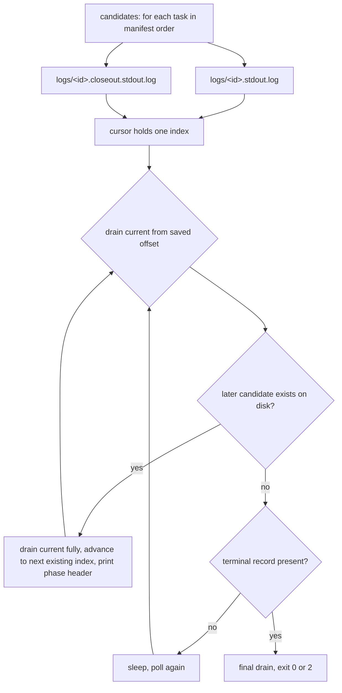
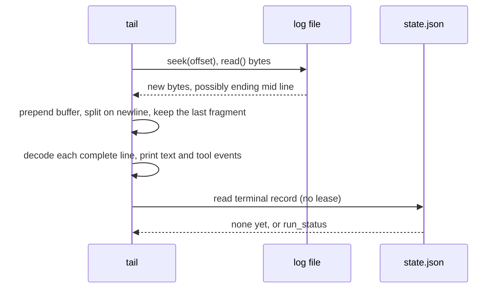

# Relay tail verb - Plan

## Goal Capsule

- **Objective:** an operator who was not watching a Relay run can see what the run is doing, and what it did, from one command, without a second terminal and without a hand written follower script.
- **Means:** a seventh CLI verb, `tail`, that follows the task process stdout logs already written under the state directory and prints them decoded (KTD1, KTD3).
- **Authority:** the tracker task text is the product authority. The requirements below restate it. Where a requirement and a KTD disagree, the requirement wins on behavior and the KTD wins on mechanism.
- **Stop conditions:** stop and report rather than proceeding if `tail` cannot be built without editing `run.py`, `state.py`, or a halt class, or if the suite cannot be made green.
- **Execution profile:** additive. One new module, one new verb, one opt in stub key, three documentation edits. No existing runner behavior changes.
- **Tail ownership:** the runner keeps the lease, the merge, and the push. `tail` is a reader and owns nothing.

---

## Product Contract

### Summary

Add `python3 skills/relay/scripts/relay_cli.py tail <manifest>`. It reads the per task stdout logs the runner already writes under the state directory, decodes each stream json line into one human line per event, and follows the run forward across task boundaries until the run reaches a terminal record. It takes no lease, so it can run beside a live runner. It works whether it starts before, during, or after the run.

### Problem Frame

A Relay run is invisible while it runs. The runner writes each task process's stdout to `<state>/logs/<task-id>.stdout.log` as `--output-format stream-json --verbose`, which is one JSON object per line and unreadable at a glance. Today an operator who wants to see progress opens a second terminal and points a hand written script at that file. That script is `~/.relay/manifests/watch.py`, a throwaway prototype that lives outside the repository, knows only one task's log, and stops at the end of it. `docs/backlog.md` line one records this as the first thing wrong with an unattended run.

### Requirements

**The verb**

- R1. `tail <manifest>` is a seventh subcommand of `relay_cli.py`, alongside `validate`, `run`, `status`, `summary`, `verify`, and `lease`.
- R2. `tail` never acquires the manifest lease or the repository lease, the same rule `status` follows.
- R3. `tail` prints one line per decoded event rather than the raw stream json.

**Decoding**

- R4. For an `assistant` line, print the text of each `text` content block.
- R5. For a `tool_use` content block, print the tool name and the first present of `command`, `file_path`, `pattern`, `skill`, `description`.
- R6. A line that is not valid JSON, or that carries no decodable content, is skipped rather than printed raw or raised.

**Following**

- R7. `tail` works when started before the run, during the run, and after the run has finished.
- R8. `tail` follows across a task boundary rather than stopping at the end of one task's log, in manifest task order, including the closeout log that follows each task.
- R9. `tail` names the task and the phase whose log it has moved to, so an operator can tell one task's output from the next.

**Exit**

- R10. `tail` exits 0 when the run reaches a terminal record whose `run_status` is not `halted`.
- R11. `tail` exits 2 when the run's terminal record reads `halted`.
- R12. A `Ctrl+C` while following exits without a traceback.

### Scope Boundaries

**In scope:** the `tail` verb, its decoder, its tests, and its documentation in `skills/relay/SKILL.md` and `README.md`.

**Outside this task, already on the backlog:**

- `/relay` staying in the foreground and showing live status automatically after launch.
- macOS notifications on phase change and halt.

**Deferred to follow up work:**

- Attributing an event to the subagent that produced it. Real stdout carries `parent_tool_use_id`, `subagent_type`, and `task_description` on assistant lines, so subagent work is interleaved into the stream undifferentiated. Marking it would make a busy task more legible, and it is beyond the decoding this task specifies.
- Following the runner's own `runner.log` alongside the task logs, which would show merge, gate, and verify phases that no task log carries.
- Replaying only the current run when a log carries more than one. `launch.launch` opens each task log with mode `a`, so a second run of the same manifest appends to the same file and `tail` replays both. This is a known limitation, not a defect to fix here.

**Not to be touched:** `run.py`, `state.py`, and the halt class set in `contracts.py`.

---

## Planning Contract

### Key Technical Decisions

- KTD1. **Follow the per task stdout logs.** The runner already writes every task process's stdout to `<state>/logs/`, and the prototype proves that file decodes. Two other sources were available and both were rejected. The session transcript under `~/.claude/projects/` is the classifier's input and is written by the CLI on its own schedule, so it is the wrong source for a live follower. `<state>/runner.log` is closer: `cmd_run` passes a `stream` writer into `launch.launch`, so a detached run's `runner.log` already carries every task's stream json interleaved with the runner's own phase lines, in one ordered file. It loses on two counts. A foreground `relay run` streams to the terminal and writes no `runner.log` at all, while `launch.launch` writes the per task log either way, so only the per task logs let `tail` work against every run. And a `runner.log` line carries no task id, so R9's phase headers could not be derived from it. Governs R3, R7, R9.

- KTD2. **Read bytes, buffer the incomplete tail, decode each complete line.** A follower reads a file another process is appending to, so a read lands mid line routinely. The prototype's `json.loads` on a partial line fails and drops the event silently. Open the log in binary, keep the trailing fragment after the last `\n` in a buffer, prepend it to the next read, and decode only complete lines. Binary rather than text also keeps a multi byte character split across a read boundary from being corrupted by `errors="replace"`. Governs R6.

- KTD3. **The log sequence is derived from the manifest, and advance is driven by what exists on disk.** For each task in `manifest.tasks` order the candidates are `logs/<id>.stdout.log` then `logs/<id>.closeout.stdout.log`. `tail` holds an index into that fixed list. It advances when a later candidate exists on disk, skipping candidates that never appeared. This handles the three cases that break a simpler rule: an excluded task writes no log at all, a task whose closeout did not run writes no closeout log, and a run started later begins mid list. Governs R7, R8.

- KTD4. **Terminate on the terminal record, after a final drain.** The runner writes the terminal record at the end of `run()`, after the last closeout log is closed. `tail` drains every reachable log, then reads `store.terminal()`, then drains once more before exiting, so the last lines are never cut off by the record appearing first. A terminal record already present at startup ends the follow on the first pass, after the replay. That is R7's "after it has finished" case, and it is the same state as a manifest whose previous run finished and whose next run has not started, which no reading of `state.json` can tell apart. The finished run wins: `tail` replays and exits rather than waiting. An operator who wants to watch the next run starts `tail` after `relay run`, which is the order the skill already documents for `status`. Governs R7, R10, R11.

- KTD5. **Exit code mapping mirrors `cmd_summary`.** `halted` maps to `EXIT_HALTED`, every other terminal `run_status` maps to `EXIT_OK`. `crashed` mapping to 0 was considered and rejected as a change: `cmd_summary` at `skills/relay/scripts/relay/cli.py:204` already draws the line at `RUN_HALTED` alone, and a second, wider mapping in a sibling verb is how two readers of one state file come to disagree. Governs R10, R11.

- KTD6. **The follow loop takes an injected `sleep`, and the CLI verb passes the real one.** A test drives before, during, and after in one deterministic pass by injecting a `sleep` that appends the next chunk of log and writes state between polls. This avoids both a real time race and a `--once` flag that would exist only for tests. Governs R7.

- KTD7. **The stub gains an opt in `stream` key rather than always echoing.** `tests/stub-claude/claude` prints only `system` and `result` lines today, so a stub driven run produces logs with nothing to decode. An optional `"stream": "<fixture>"` in `entry.json` echoes that fixture's lines to stdout. Absent by default, so every existing test is unchanged.

- KTD8. **The decoder is also pinned against a captured real stdout fixture.** KTD7 makes the stub produce decodable lines, which means the stub and the decoder would otherwise agree by construction, which is the failure `docs/solutions/logic-errors/stubbed-seams-agree-by-construction-first-live-run-found-five-contract-defects.md` documents. A second fixture built from real `--output-format stream-json --verbose` line shapes, following the `tests/fixtures/transcripts/_make.py` convention, tests the decoder against shapes the stub did not invent: `thinking` blocks, `tool_progress` and `rate_limit_event` line types, and a `tool_use` whose input carries none of the five argument keys.

### Assumptions

- The five argument keys in R5 are the whole set the operator wants. A real 1159 line task log carried 224 of 240 tool calls with at least one of them; the misses were `ToolSearch`, `TaskOutput`, and two `Read` calls. Those print as a bare tool name, which is accepted rather than extended with a sixth key.
- `thinking` content blocks stay unprinted. The prototype ignores them and they were 130 of 432 assistant blocks in the same log, which would bury the text and tool lines.
- The task log is readable while the process that writes it is still running. `launch.launch` writes each line and calls `log.flush()` immediately, at `skills/relay/scripts/relay/launch.py:309` to `:310`, so a follower sees a line as soon as the reader thread drains it. If that flush were removed, `tail` would show nothing until the task process exited and the whole verb would stop being a follower.
- Creating the state directory is acceptable for a lease free reader. `state.StateStore.__init__` calls `_ensure_dirs()`, so `cmd_status` already creates it on a manifest that has never run. R2 is a rule about the lease, not about touching the filesystem, and `tail` follows `status` here rather than inventing a second convention.

### High-Level Technical Design

The log sequence and the advance rule:

One poll of one log:

### Sequencing

U1 then U2 then U3. U4 depends on U3. U5 last, because it documents what U3 named.

---

## Implementation Units

### U1. The event decoder

- **Goal:** turn one raw stdout line into zero or more printable event lines.
- **Requirements:** R3, R4, R5, R6.
- **Dependencies:** none.
- **Files:**
  - `skills/relay/scripts/relay/tail.py` (create)
  - `tests/fixtures/stdout/_make.py` (create)
  - `tests/fixtures/stdout/real_stream.jsonl` (create, generated by `_make.py`)
  - `tests/test_tail.py` (create)
- **Approach:**
  1. Add a module docstring saying what the file follows and why the stdout log rather than the transcript, in the voice of the other modules in the package.
  2. Write a decode function taking one `bytes` or `str` line and returning a list of rendered strings. Parse the JSON, take `message.content` when it is a list, and walk the blocks.
  3. A `text` block on a line whose `type` is `assistant` renders as the stripped text, bounded to a character cap held in a module constant.
  4. A `tool_use` block renders as the tool name and the first present of `command`, `file_path`, `pattern`, `skill`, `description`, bounded to its own constant. A block with none of them renders as the tool name alone.
  5. Any parse failure, non dict payload, or absent content returns an empty list.
- **Patterns to follow:** `classify.read_transcript` at `skills/relay/scripts/relay/classify.py:149` for counting a malformed line and continuing rather than raising. `classify.ARGUMENT_CHARS` for the shape of a truncation constant. `tests/fixtures/transcripts/_make.py` for the generated fixture convention, including the docstring that names where the line shapes were copied from.
- **Test scenarios:**
  - An `assistant` line with one `text` block renders one line carrying that text.
  - An `assistant` line with a `tool_use` block naming `Bash` and an input carrying `command` renders one line with both the tool name and the command.
  - A `tool_use` whose input carries `file_path` but no `command` renders the file path.
  - A `tool_use` whose input carries none of the five keys renders the tool name and no argument, and does not raise.
  - An `assistant` line carrying a `thinking` block and a `text` block renders only the text.
  - A line that is not valid JSON returns no events.
  - A line whose `message.content` is a string rather than a list returns no events.
  - A `tool_progress` line and a `rate_limit_event` line each return no events.
  - Decoding every line of `real_stream.jsonl` in order produces the expected event lines, proving the decoder against captured CLI output rather than against the stub.
- **Verification:** `python3 -m unittest test_tail` from `tests/` passes, and `real_stream.jsonl` regenerates identically from `_make.py`.

### U2. The follow loop

- **Goal:** walk the manifest's log sequence forward, tolerate partial lines, and decide when to stop.
- **Requirements:** R2, R6, R7, R8, R9, R10, R11.
- **Dependencies:** U1.
- **Files:**
  - `skills/relay/scripts/relay/tail.py` (modify)
  - `tests/test_tail.py` (modify)
- **Approach:**
  1. Add a candidates function building the ordered path list from `manifest.tasks` and the store: `logs/<id>.stdout.log` then `logs/<id>.closeout.stdout.log` per task, per KTD3.
  2. Add a per file reader holding a path, a byte offset, and a leftover buffer. One drain call opens the file in binary, seeks the offset, reads to the end, prepends the buffer, splits on newline, keeps the final fragment as the new buffer, and returns the complete lines. A missing file drains to nothing rather than raising.
  3. Add the follow function taking the manifest, the store, an output writer, a `sleep`, and a poll interval. It holds one cursor into the candidate list.
  4. Per poll: drain the cursor's file and write the decoded events; if a later candidate exists on disk, drain the cursor's file once more, advance to the next existing candidate, and write the phase header naming the task id and whether it is the task or the closeout.
  5. Terminate per KTD4: after draining, read `store.terminal()`; when it is present, drain every remaining candidate once more, then return the exit code per KTD5.
  6. When no state and no log exists yet, write one waiting line and then stay silent, so a `tail` started early does not fill the terminal.
- **Patterns to follow:** `cmd_status` at `skills/relay/scripts/relay/cli.py:166` for reading state without a lease. `state.StateStore.path` for composing a path under the state directory. `launch.launch`'s `stream` parameter for the shape of an injected output writer.
- **Test scenarios:**
  - Started after a finished run, `tail` replays every task's log in manifest order and returns `EXIT_OK`.
  - Started after a halted run, `tail` returns `EXIT_HALTED`.
  - Started with no state directory content, `tail` writes the waiting line, and on a later poll picks up the first log that appears.
  - Started against a store that already carries a terminal record, `tail` replays and exits on the first pass rather than waiting for a further run, per KTD4.
  - With an injected `sleep` that appends one chunk per call, `tail` prints each chunk once and never reprints an earlier one.
  - A drain that lands mid line buffers the fragment and emits the event only once the rest of the line arrives, and emits it exactly once.
  - A chunk split inside a multi byte UTF-8 character decodes to the correct character once complete.
  - The sequence advances from `T-1` task to `T-1` closeout to `T-2` task, writing a phase header at each boundary that names the task id.
  - A task with no log at all, standing in for an excluded task, is skipped and the cursor lands on the next existing candidate.
  - A task whose closeout log never appears advances straight to the next task's log.
  - The terminal record appearing between two polls does not truncate the final lines of the last log.
  - Running the whole follow against a store whose lease is held by another `StateStore` leaves `state.json` byte identical, proving R2.
- **Verification:** the follow tests pass without wall clock sleeps, and a run of the suite shows no new test taking more than a second.

### U3. The `tail` CLI verb

- **Goal:** expose the follow loop as the seventh verb with the project's exit code convention.
- **Requirements:** R1, R2, R10, R11, R12.
- **Dependencies:** U2.
- **Files:**
  - `skills/relay/scripts/relay/cli.py` (modify)
  - `tests/test_cli.py` (modify)
- **Approach:**
  1. Add a `tail` subparser taking a `manifest`, with a help string in the register of the other six.
  2. Add `cmd_tail(args, env, out)`: load the manifest through `_load`, build the store through `_store_for`, and call the follow function. Do not validate the manifest the way `cmd_run` does; a reader should still follow a run whose manifest has since been edited, and `_load` already fails a manifest it cannot parse.
  3. Catch `KeyboardInterrupt` around the follow call and return `EXIT_OK`, per R12.
  4. Register `tail` in the `VERBS` dict.
  5. Update the module docstring's "six verbs" to seven.
- **Patterns to follow:** `cmd_status` for the load then store then read shape and for the docstring line stating that the verb never acquires the lease.
- **Test scenarios:**
  - `tail` on a completed run exits `EXIT_OK` and its output carries text from the task fixtures.
  - `tail` on a halted run exits `EXIT_HALTED`.
  - `tail` on a manifest that does not exist exits `EXIT_CONFIG` and names the manifest, matching the other verbs.
  - `tail` run while another `StateStore` holds the lease leaves `state.json` unchanged and still exits, mirroring `test_status_never_takes_the_lease`.
  - A `KeyboardInterrupt` raised from the injected follow returns `EXIT_OK` and no traceback reaches the caller.
- **Verification:** `python3 -m unittest test_cli` passes, and `relay tail --help` lists the verb.

### U4. Decodable stub output and the end to end test

- **Goal:** drive a real stub run whose logs contain assistant text and tool calls, and follow it.
- **Requirements:** R3, R7, R8, R9.
- **Dependencies:** U3.
- **Files:**
  - `tests/stub-claude/claude` (modify)
  - `tests/test_run.py` (modify, `RunCase.queue_entry` only)
  - `tests/test_tail.py` (modify)
- **Approach:**
  1. Add an optional `"stream"` key to the stub's queue entry protocol: when present, resolve it the same way `fixture` is resolved and echo each of its lines to stdout before the `result` line.
  2. Document the key in the stub's docstring queue protocol block, beside `fixture`, `exit`, and `sleep`.
  3. Add a `stream=None` keyword to `RunCase.queue_entry` that writes the key when given. Existing callers pass nothing and are unaffected.
  4. Add an end to end case that queues a three task run with `stream` set, runs it, then tails it, and asserts the decoded output.
- **Patterns to follow:** the queue protocol docstring in `tests/stub-claude/claude:9`, and `RunCase.queue_entry` at `tests/test_run.py:169`.
- **Test scenarios:**
  - A stub entry with no `stream` key writes the same stdout it writes today, proving the key is opt in.
  - A stub entry with `stream` set writes that fixture's lines to stdout, and the runner's log for that task contains them.
  - Tailing the finished run prints the decoded `Skill` calls from the task fixture and the decoded `Edit` call from the closeout fixture, in that order, with the phase headers between them.
  - The tail output for a three task run carries all three task ids in manifest order.
- **Verification:** the full suite is green, and the end to end tail test fails if the phase headers or the ordering are removed.

### U5. Documentation

- **Goal:** the verb is discoverable in the two places the other six are.
- **Requirements:** R1.
- **Dependencies:** U3.
- **Files:**
  - `skills/relay/SKILL.md` (modify)
  - `README.md` (modify)
  - `tests/test_examples.py` (modify)
- **Approach:**
  1. In `skills/relay/SKILL.md`, change "The six verbs:" to seven and add a `python3 <runner> tail <manifest>` line in the block, with a comment in the register of the neighbouring lines saying it follows the run and never takes the lease. The line must start at column zero to satisfy the existing invocation test.
  2. In `README.md`, add the `tail` invocation to the verb list.
  3. Add `"tail"` to the `VERBS` tuple at `tests/test_examples.py:21`, which is what makes the SKILL.md invocation check cover it.
  4. Keep every added sentence free of dashes of any kind, per the repository's prose rule.
- **Patterns to follow:** the existing verb lines in both files, including the trailing comments in `SKILL.md`.
- **Test scenarios:** `test_every_runner_verb_appears_with_an_invocation` covers `tail` once the tuple gains it, and fails if the SKILL.md line is missing or indented.
- **Verification:** `python3 -m unittest test_examples` passes with the widened tuple.

---

## Verification Contract

| Gate | Command | Applies to |
|---|---|---|
| Full suite | `python3 -m unittest discover -s tests` from the repo root | U1 to U5, and the project gate |
| Single module | `python3 -m unittest test_tail` from `tests/` | U1, U2 |
| Verb wiring | `python3 -m unittest test_cli` from `tests/` | U3 |
| Documentation | `python3 -m unittest test_examples` from `tests/` | U5 |
| Fixture regeneration | run `tests/fixtures/stdout/_make.py` and confirm no diff | U1 |

The suite takes about two and a half minutes. A local pre push hook runs it again on every push.

**The live run caveat.** This change adds a reader of the CLI's stdout stream json, which is a contract with a program this repository does not own, and `CLAUDE.md` requires one live task against a throwaway target after a contract change. Two facts bound what that run can prove here. The captured fixture in U1 already pins the decoder against real CLI output, which is the part the stub cannot produce. And per `docs/solutions/workflow-issues/self-hosted-run-cannot-observe-the-code-its-own-tasks-land.md`, a Relay run that lands this change is executing the `cli.py` it imported at launch, so it cannot exercise its own new verb. The instrument for `tail` is the next run, or a direct invocation against a finished run's state directory.

---

## Definition of Done

- Every requirement R1 to R12 is covered by a named test.
- `tail` appears in `relay_cli.py --help`, in `skills/relay/SKILL.md`, and in `README.md`.
- `run.py`, `state.py`, and the halt class set are unchanged.
- Every existing test passes without modification, except `tests/test_examples.py`'s verb tuple and `RunCase.queue_entry`'s new optional keyword.
- The full suite is green from the repo root.
- No exploratory or abandoned code remains: the follow loop has one drain path, one advance rule, and one exit mapping.
- No prose added to the repository contains a dash of any kind.
