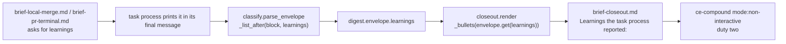

# Envelope learnings key - Plan

## Goal Capsule

- **Objective:** the Closeout process's compound judgment (duty two, `skills/relay/scripts/relay/closeout.py:150`) can see what a task itself learned, not only the runner's own digest and a two-clause hint (`"relay task N, outcome X"`), and it still never reads the task's raw transcript.
- **Means:** a fifth, optional envelope key, `learnings`, threaded from the two task briefs through `classify.parse_envelope` into the closeout brief (KTD1 to KTD4).
- **Authority:** the tracker task text for this task is the product authority, and it states the decision directly: the choice between an envelope learnings section and handing the closeout the transcript path has been made, in favor of the envelope section. `docs/backlog.md` line two is the earlier open question that decision resolves; the line itself still reads as an either/or pending a later review ("Decide after the first Cratekit run's closeout is read"), so it is background, not the record of resolution. The requirements below restate the task text's decision; they do not reopen it.
- **Stop conditions:** stop and report rather than proceeding if adding the key would require a new halt class, a change to `HALT_NO_ENVELOPE`, a change to how `status` is read, a change to the top level `DIGEST_KEYS` contract, or if the full suite cannot be made green.
- **Execution profile:** additive. Five files change: one constants module, one envelope parser, one closeout renderer plus its template, and two task brief templates. No runner, state, or halt class changes.
- **Tail ownership:** this task process only. The runner outside this session owns the merge and the push; this plan does not touch or resolve any tracker card.

---

## Product Contract

### Summary

Add `learnings` as a fifth key in Relay's own return envelope, alongside `status`, `blockers`, `changed_files`, and `plan_path`. A task process may report, in its own words, what a future session would get wrong without knowing it. `classify.parse_envelope` carries that text into the digest the same way it already carries blockers. `closeout.render` prints it into the Closeout brief next to the blockers it reports today, so `ce-compound`'s non-interactive judgment call is informed by the task's own account, not only by the runner's evidence and a bare outcome hint.

### Problem Frame

The Closeout process runs `ce-compound` on the digest the runner composed, never the task transcript (R27, `closeout.py:150`), and the command it runs carries only `"relay task N, outcome X"` as its hint (`closeout.py:164`). That is deliberate: reading the transcript would put an end of context, minimally supervised process in the position of re-reading the most token expensive artifact in the run to answer a question the task process itself is better placed to answer. But the envelope the task already prints carries `status`, `blockers`, `changed_files`, and `plan_path`, and nothing about what the task learned along the way. A blocked task's best learning already comes from its blocker text; a landed task's best learning has nowhere to go today except the transcript that duty two is not allowed to read.

### Requirements

**The new key**

- R1. `contracts.py` gains `ENVELOPE_LEARNINGS_KEY = "learnings"`, a fifth key in Relay's own envelope vocabulary, defined the same way as the other four.
- R2. `ENVELOPE_LEARNINGS_KEY` is not added to `PLUGIN_PINS`. It is Relay's own addition to its own envelope convention, not part of the plugin's `ce-work` return-to-caller contract the other four keys are pinned against (KTD1).

**Asking for it**

- R3. `skills/relay/templates/brief-local-merge.md`'s return envelope block gains a `learnings:` line, with one sentence telling the task process what belongs there and that it may be left empty.
- R4. `skills/relay/templates/brief-pr-terminal.md` gains an equivalent ask, in that mode's own idiom: one line, `Learnings: <one line, or "none">`, printed before the session stops, naming the same criteria in short form (KTD3). This is forward design only: `pr_terminal` is unimplemented (Scope Boundaries), so R4 delivers no part of the Objective by itself until a later plan gives that mode a working completion contract; it exists so that follow up work has the ask already named.

**Carrying it**

- R5. `classify.parse_envelope` parses `learnings` the same way it parses `blockers` and `changed_files`, using the existing `_list_after` helper, so it accepts an inline value, a bulleted list, or a bare paragraph (KTD2).
- R6. `learnings` is only present when an envelope is found at all; a transcript with no `status` line still yields no envelope and no learnings, unchanged from today.
- R7. Omitting the key, or leaving it empty, yields `learnings: []`, identical in shape to how an absent or empty `blockers` behaves today.

**Reporting it**

- R8. `closeout.render` reads `envelope.get("learnings")` and renders it through the existing `_bullets` helper, the same defanging and flattening every other envelope-derived line already gets.
- R9. `skills/relay/templates/brief-closeout.md` prints a new "Learnings the task process reported:" section, directly after the existing "Blockers the task process reported:" section, so `ce-compound` receives it as part of the closeout's own context.

**What must not change**

- R10. No new halt class is added, `HALT_NO_ENVELOPE` is unchanged, and how `status` is read is unchanged.
- R11. `contracts.DIGEST_KEYS` is unchanged. `learnings` lives inside the `envelope` dict, which is already one of the guaranteed top level digest keys; it is not a new top level key.
- R12. `closeout.compound_command`'s hint string, `"relay task N, outcome X"`, is unchanged. This plan feeds duty two through the brief body, not through the command line hint.

### Scope Boundaries

**In scope:** the `learnings` key in `contracts.py`, its ask in both task brief templates, its parsing in `classify.py`, and its rendering in `closeout.py` and `brief-closeout.md`, plus tests for the key present, absent, and present but empty.

**Deferred to follow up work:**

- Giving `pr_terminal` its own working completion contract. `pr_terminal` is unimplemented today (`manifest.UNIMPLEMENTED_SHIPPING_MODES`; `run.py` halts before launching one), so its brief has no `status` line for `parse_envelope` to anchor on, and R4's ask cannot surface into a digest until that mode gains its own envelope story. R4 asks for the text in the mode's own idiom now, so that work has both pieces already named (KTD3). Building that completion contract itself is out of scope here.
- Any change to the `ce-compound` hint string or to what evidence duty two receives beyond the brief body.

**Not to be touched:** `run.py`, `state.py`, the halt class set in `contracts.py`, `contracts.DIGEST_KEYS`, and `closeout.compound_command`.

---

## Planning Contract

### Key Technical Decisions

- KTD1. **`learnings` is Relay's own vocabulary, not a plugin pin.** The four existing envelope keys carry a `PLUGIN_PINS` entry because they are pinned against strings that actually appear in the installed `compound-engineering` plugin's `ce-work/references/return-to-caller.md`, which is the contract Relay borrows its envelope shape from. `learnings` is not part of that plugin contract; it is Relay's own addition on top of it, per this task's own decision (Goal Capsule Authority). A `PLUGIN_PINS` entry whose needle does not appear in the named plugin source fails `test_contracts.py`'s `test_every_pin_is_found_in_its_named_source` by construction, so adding one here would be wrong on its face. Governs R1, R2.

- KTD2. **Reuse `_list_after` for parsing rather than a new free text field.** `classify._list_after` (`classify.py:100`) already accepts an inline value, a `- item` list, or a bare multi line paragraph, which are exactly the shapes a task's own account of a learning is likely to take, and the paragraph shape is already in production use for `blockers` per the docstring's own history (`classify.py:103`). A dedicated free text capture, reading to the end of the block, was considered and rejected: it would special case one field's shape for no material benefit, and it would leave `parse_envelope` with two different parsing strategies instead of one. `_list_after`'s bare paragraph branch stops at the first line matching `KEY_LINE_RE`, any bare word followed by a colon, not only the five real envelope keys, so a learnings paragraph that structures itself with an internal colon led line (`Cause: ...`, `Fix: ...`) truncates there. This is existing, shared behavior `_list_after` already has for `blockers`; U2 pins it with a test rather than changing the shared regex, and U4's ask tells task processes to write plain prose without a colon led sub header inside `learnings` text, so the boundary is documented and avoided rather than silently hit. Governs R5, R7.

- KTD3. **`pr_terminal`'s ask is additive text, not a new fenced envelope block.** `pr_terminal` is unimplemented (`manifest.py:29`) and its template is kept only as forward design work, per `brief.py`'s own comment at `brief.py:35`. `parse_envelope` requires a `status` match before it returns anything at all (`classify.py:137`), and `pr_terminal`'s brief has no `status` line; it relies entirely on the `lfg` skill's own terminal token. Adding a fenced `relay-envelope` block there without a `status` line would still not surface into the digest, so it would only reshape one inert contract into a different, still inert one. The minimal correct move is to ask for the same information, in the mode's own idiom, as one plain line after the terminal token, so a future implementer of `pr_terminal`'s completion contract has both pieces already named. This is a documented limitation, not a defect this plan fixes. Governs R4.

- KTD4. **The Closeout brief places learnings directly after blockers, rendered by the same `_bullets` helper.** This matches the existing pairing of blockers, denials, and other findings, and `_bullets` already defangs and flattens tracker adjacent text, so no new escaping logic is needed. Placing it next to blockers keeps the two operator facing signals duty two already reasons about side by side. Governs R8, R9.

### Assumptions

- This task's own tracker text, not `docs/backlog.md` line two by itself, is what settles the choice for this plan: an envelope learnings section, not the transcript path. The backlog line records the open either/or and a deferred trigger to decide it later; the task text is where that trigger resolved. This plan treats the task text as authoritative and does not re-litigate the choice.
- No live task run against a throwaway target is possible from inside this session, because this session is itself building Relay rather than running as a launched Relay task against a `claude` CLI target. `CLAUDE.md`'s live task requirement for an envelope grammar change is satisfied by naming this explicitly in the return envelope, per the outer task's own instruction, rather than by attempting it here.

### High-Level Technical Design

The learnings key's path from ask to `ce-compound`:

### Sequencing

U1 first, since U2 through U5 all read `contracts.ENVELOPE_LEARNINGS_KEY`. U2 then U3, because the closeout only renders what the parser already carries. U4 and U5 depend only on U1 and can land in either order relative to U2 and U3.

---

## Implementation Units

### U1. The envelope key

- **Goal:** define `learnings` as Relay's own envelope vocabulary.
- **Requirements:** R1, R2.
- **Dependencies:** none.
- **Files:**
  - `skills/relay/scripts/relay/contracts.py` (modify)
- **Approach:**
  1. Add `ENVELOPE_LEARNINGS_KEY = "learnings"` immediately after `ENVELOPE_PLAN_PATH_KEY = "plan_path"`.
  2. Add a one line comment above it stating it is Relay's own addition to the envelope, not part of the plugin's return-to-caller contract the other four keys pin against, citing `docs/backlog.md` line two, in the register of the file's other explanatory comments.
  3. Do not add an entry to `PLUGIN_PINS` (KTD1).
- **Patterns to follow:** the four `ENVELOPE_*_KEY` constants immediately above it, and the file's existing habit of a short comment naming why a constant exists.
- **Test scenarios:** Test expectation: none -- a bare string constant with no branching behavior; its use is proven by U2 through U5's tests.
- **Verification:** `python3 -c "from relay import contracts; print(contracts.ENVELOPE_LEARNINGS_KEY)"` from `tests/` prints `learnings`.

### U2. Parse the key into the envelope

- **Goal:** `classify.parse_envelope` carries a task's reported learnings into the digest the same way it already carries blockers.
- **Requirements:** R5, R6, R7.
- **Dependencies:** U1.
- **Files:**
  - `skills/relay/scripts/relay/classify.py` (modify)
  - `tests/test_classify.py` (modify)
- **Approach:**
  1. In `parse_envelope`, add `"learnings": _list_after(block, contracts.ENVELOPE_LEARNINGS_KEY)` to the returned dict, alongside `blockers` and `changed_files`.
  2. Make no other change to `parse_envelope`: the existing `status` match gate that decides whether to return `None` at all stays exactly as it is (R6).
- **Patterns to follow:** the existing `"blockers"` and `"changed_files"` lines two above the insertion point, and the `ParagraphBlockers` test class (`tests/test_classify.py:211`) for the shape of the new tests.
- **Test scenarios:**
  - A fenced envelope carrying `learnings:` followed by one bulleted item returns that one item in `env["learnings"]`.
  - A fenced envelope carrying no `learnings:` key at all (the existing complete-envelope shape) returns `env["learnings"] == []`, proving the absent case is unchanged.
  - A `learnings:` key present but empty, immediately followed by another key, returns `env["learnings"] == []`, mirroring `test_an_empty_blockers_key_followed_by_another_key_stays_empty`.
  - A multi line paragraph under `learnings:` collects one item per line and stops at the next key, mirroring `test_a_multi_line_paragraph_stops_at_the_next_key`.
  - A learnings paragraph containing an internal single word colon line (for example `Cause: the timeout was upstream` on its own line) truncates at that line, pinning `_list_after`'s existing shared behavior (KTD2) rather than treating it as a surprise.
  - A transcript with no `status` line anywhere still returns `None` for the whole envelope, even when a `learnings:` line is present, proving R6.
- **Verification:** `python3 -m unittest test_classify` from `tests/` passes.

### U3. Render the key into the Closeout brief

- **Goal:** `ce-compound` receives the task's reported learnings as part of the Closeout brief body.
- **Requirements:** R8, R9, R11, R12.
- **Dependencies:** U2.
- **Files:**
  - `skills/relay/scripts/relay/closeout.py` (modify)
  - `skills/relay/templates/brief-closeout.md` (modify)
  - `tests/test_closeout.py` (modify)
- **Approach:**
  1. In `closeout.render`'s `values` dict, add `"learnings": _bullets(envelope.get("learnings") or [])`, next to the existing `"blockers"` line.
  2. In `brief-closeout.md`, add a `Learnings the task process reported:` heading and a `$learnings` placeholder directly after the existing `Blockers the task process reported:` block, before the `Denied tool calls` heading.
  3. Make no change to `compound_command` or the hint string it builds (R12).
- **Patterns to follow:** the existing `blockers` line in `render`'s `values` dict, the `Blockers the task process reported:` block in `brief-closeout.md`, and the `TranscriptTextIsData` test class's `carrying` helper (`tests/test_closeout.py:331`) for the shape of the new tests.
- **Test scenarios:**
  - A digest whose envelope carries one learnings entry renders it inside the closeout brief's data block, using a helper analogous to `carrying` that overrides `digest["envelope"]` with a `learnings` list.
  - A digest whose envelope carries no `learnings` key at all (the existing `success.jsonl` fixture) renders `none` for that section, proving the absent case matches today's `blockers` default.
  - A learnings entry carrying the data block terminator cannot close the block early, mirroring `test_a_blocker_carrying_the_terminator_cannot_close_the_block`.
  - A multiline learnings entry is flattened into its own bullet and cannot leave it, mirroring `test_a_multiline_blocker_is_flattened_so_it_cannot_leave_its_bullet`.
- **Verification:** `python3 -m unittest test_closeout` from `tests/` passes.

### U4. Ask for it in the local merge brief

- **Goal:** a task running under `local_merge` is told what belongs under `learnings` and that it may be left empty.
- **Requirements:** R3, R7.
- **Dependencies:** U1.
- **Files:**
  - `skills/relay/templates/brief-local-merge.md` (modify)
  - `tests/test_brief.py` (modify)
- **Approach:**
  1. Add a `learnings:` line to the fenced envelope block in the "The return envelope" section, after `plan_path: <the plan path from step 2>`.
  2. Add two sentences after the existing "List one blocker per line under `blockers:` when there are any." sentence. One names what belongs under `learnings` in the same terms duty two already uses in `brief-closeout.md` (a cause that was not where it looked, a contract or seam whose rules are not visible in the code, a decision reversed with a reason, or a trap that cost real time), tells the task to judge it rather than fill it by reflex, and states it should be left empty on an ordinary run. The other tells the task to write plain prose, with no colon led sub header line (`Cause:`, `Fix:`), since `_list_after`'s paragraph parsing stops at the first such line (KTD2).
- **Patterns to follow:** the existing `blockers:` line and its explanatory sentence in the same section.
- **Test scenarios:**
  - `test_the_envelope_is_asked_for_inside_a_fenced_relay_envelope_block` gains an assertion that `contracts.ENVELOPE_LEARNINGS_KEY` appears in the rendered text.
  - A new test confirms the instruction sentence naming what belongs under `learnings` is present, by asserting on a distinguishing phrase from it.
- **Verification:** `python3 -m unittest test_brief` from `tests/` passes.

### U5. Ask for it in the pr terminal brief

- **Goal:** a task running under `pr_terminal` is asked for the same information, in that mode's own idiom (KTD3).
- **Requirements:** R4.
- **Dependencies:** U1.
- **Files:**
  - `skills/relay/templates/brief-pr-terminal.md` (modify)
  - `tests/test_brief.py` (modify)
- **Approach:**
  1. Add one line after the existing "Stop when it prints its terminal token" step, instructing the task to print `Learnings: <one line, or "none">` before it stops, naming the same criteria as U4 in short form.
  2. Do not add a fenced `$envelope_tag` block; `pr_terminal` keeps its existing single token completion contract (KTD3).
- **Patterns to follow:** the existing numbered steps in the file, and U4's instruction language for the criteria.
- **Test scenarios:**
  - A new test in the `PrTerminalTemplate` test class confirms the word `Learnings` appears in the rendered `pr_terminal` text.
  - The existing `PrTerminalTemplate` tests (terminal token present, "do not close") continue to pass unmodified.
- **Verification:** `python3 -m unittest test_brief` from `tests/` passes.

---

## Verification Contract

| Gate | Command | Applies to |
|---|---|---|
| Full suite | `python3 -m unittest discover -s tests` from the repo root | U1 to U5, and the project gate |
| Envelope parsing | `python3 -m unittest test_classify` from `tests/` | U2 |
| Closeout rendering | `python3 -m unittest test_closeout` from `tests/` | U3 |
| Brief templates | `python3 -m unittest test_brief` from `tests/` | U4, U5 |
| Contract pins | `python3 -m unittest test_contracts` from `tests/` | U1, confirms `PLUGIN_PINS` and `DIGEST_KEYS` are unchanged |

The suite takes about two and a half minutes. A local pre push hook runs it again on every push.

**The live run caveat.** This change edits the envelope grammar, a contract between the task process, the Closeout process, and `classify.py`, and `CLAUDE.md` requires one live task against a throwaway target before a contract change is done. This session cannot run that: it is itself building Relay, not running as a launched Relay task against a `claude` CLI target. The return envelope for this task states this explicitly, per the outer task's own instruction, rather than attempting a live run from inside this session.

---

## Definition of Done

- Every requirement R1 to R12 is covered by a named test, except R2 and R12, which are negative requirements confirmed by `test_contracts.py`'s existing pin and digest key guards staying green with no new entries.
- Omitting `learnings` from a task's envelope leaves every existing test passing unmodified, proving R6, R7, R10, and R11 by construction.
- `run.py`, `state.py`, the halt class set, `contracts.DIGEST_KEYS`, and `closeout.compound_command` are unchanged.
- The full suite is green from the repo root.
- No prose added to the repository contains a dash of any kind.
