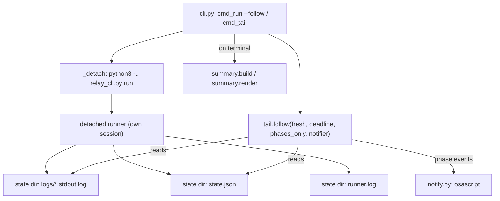
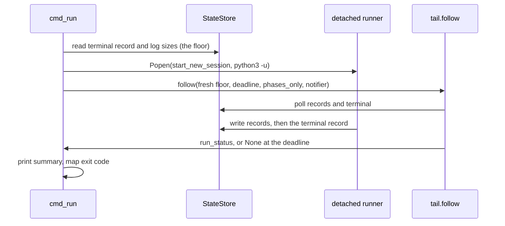

# Relay Foreground Follower and Halt Notifications - Plan

## Goal Capsule

- **Objective:** an operator who starts a Relay run from `/relay` sees the run's progress in the session they started it in, and learns that a run halted without having watched it.
- **Means:** keep the launching process alive as a bounded, low volume follower, and fire macOS notifications from that follower (KTD1, KTD4, KTD6).
- **Authority:** this plan governs the follower, the CLI verbs, and `skills/relay/SKILL.md`. The Halt class set in `skills/relay/scripts/relay/contracts.py` is closed and this plan does not open it. The runner still holds no tracker write path.
- **Execution profile:** Python 3 standard library only. Every test runs against the stub `claude` under a temporary `HOME`. No test may fire a real desktop notification.
- **Stop conditions:** stop and report if a change here would require a new Halt class, a tracker write from the runner, or a third party package.
- **Tail ownership:** the implementer runs the suite and commits. Merge, push, and the tracker card belong to the outer runner.

---

## Product Contract

### Summary

Add a foreground follow mode to `relay run`, give the follower a bound, a phase only mode, and optional macOS notifications, then fix two smaller visibility defects: a `status` line that describes a previous, longer manifest as though it described the current one, and a `runner.log` that a detached run does not flush until it exits.

### Problem Frame

The `tail` verb landed in T-6 (`85d3efe`) and gave a later session a way to follow a run from any terminal. It was scoped to the CLI verb on purpose, so the rest of the original visibility item is still open. Today `/relay` launches the runner with `run --detach` and stops. The operator has to open a second terminal and type `tail` to see anything, and if they walk away nothing tells them the run halted. That was the pain raised during the first Cratekit run.

Two smaller defects were found while confirming a `--detach` launch on the relay-proof T-4 run. `status` printed `cursor: 3 of 1 task(s)` after a three task manifest was cut to one, because the state directory is keyed on the manifest's real path and survives an edit to the manifest's contents. And `runner.log` stayed empty for the length of the run, because the detached child is a block buffered Python process writing to a file, so `SKILL.md`'s "logs to `runner.log`" reads as followable and is not.

### Requirements

**Foreground follow**

- R1. `run` accepts `--follow`, which detaches the runner exactly as `--detach` does today and then follows it in the launching process.
- R2. `--follow` implies `--detach`. A foreground `run` is already in the foreground, so there is nothing to follow.
- R3. A follower started by `--follow` reports only what this launch produced, and never replays output or a terminal record left on disk by a previous run against the same state directory.
- R4. Interrupting a follower ends the follower, leaves the run alive, and prints how to start following again.
- R5. On reaching this run's terminal record the follower prints the run summary and returns the exit code a foreground `run` would have returned for that terminal record.
- R16. When the process `--follow` launched exits without writing a terminal record, the follower stops, names the runner log, and returns that process's own exit code rather than waiting for the bound.

**Bounded and quiet following**

- R6. The follower accepts a wall clock bound in seconds. On reaching the bound it prints where the run has got to and exits 0, without a terminal record.
- R7. The follower accepts a phase only mode that prints phase events and suppresses decoded task activity.
- R8. A phase event is one of three things: a task's log first appears, a task's record status changes, or the run reaches a terminal record.
- R17. The first poll establishes the baseline for status changes and emits no phase event from it, so a follower started against a state directory that already holds records does not announce history as news.

**Notifications**

- R9. The follower fires one macOS desktop notification per phase event when notifications are enabled, and the terminal notification names the run status, and for a halt the task and the Halt class.
- R10. Notifications are off unless the operator asks for them.
- R11. A host without `osascript`, or a host that is not macOS, runs the follower with notifications silently disabled rather than failing.

**Status honesty**

- R12. `status` says when the state directory holds a run of a longer manifest than the one it just loaded, rather than printing a cursor larger than the task count as though it were current.
- R13. `status` marks each record whose task id is not in the current manifest.

**Runner log**

- R14. A detached run's `runner.log` grows as the run goes rather than at process exit.

**Documentation**

- R15. `SKILL.md`'s Launch section tells the skill session to follow in the foreground, names the bound and the tool timeout it needs, and says what to do when the bound is reached rather than the run ending.

### Success Criteria

- An operator who runs `/relay` sees task and closeout transitions in the same session, with no second terminal and no instruction to open one.
- A `/relay` session following a multi hour run does not have its context consumed by decoded task activity.
- An operator away from the machine gets a desktop notification when the run halts.
- `status` never prints a number that reads as current and describes a previous run.

### Scope Boundaries

**Deferred for later**

- The runner does not notify. A run launched with plain `--detach` and no follower notifies nobody. KTD4 records why, and the cost is accepted for now.
- Notifications on Linux and Windows. `osascript` is the only backend.
- `tail` keeps its current default behavior: the full decoded stream, unbounded, with no notifications and no summary at the end. It gains the same three follower options so the two paths share one implementation, and nothing about running it bare changes.

**Outside this work**

- A new Halt class. A new outcome is a finding attached to a record, per `CLAUDE.md`.
- Any tracker write from the runner.
- Attributing a subagent line to its parent in the decoder. That remains deferred from T-6.

---

## Planning Contract

### Key Technical Decisions

- KTD1. **`--follow` is a flag on `run`, not an eighth verb.** The ask is one command that launches and watches. A separate verb would need the same manifest and launch arguments, and would race the launch it is meant to follow.

- KTD2. **A follower started by a launch means "start from now".** `follow` gains a `fresh` argument. When true it seeds each reader's offset at the log file's current size and ignores the terminal record it read at entry, by identity against that record. Without this, `--follow` on a re-run against the same state directory does two wrong things: `launch.py:298` opens each task log in append mode so the previous run's output replays first, and `tail.py`'s existing rule that a terminal record already present wins would end the follower immediately on the previous run's record. Comparing the record object read at entry avoids any reasoning about clock resolution. Governs R3.

- KTD3. **`_Reader` gains `start_offset` and an `active()` predicate.** `active()` is "this file has bytes beyond where this follower started", and it replaces `exists()` in `frontier()` and in the phase header guard. Without it a seeded offset still satisfies `os.path.exists`, so on the first poll the frontier jumps to the last pre existing log, the cursor advances past every earlier task, and new output at those earlier candidates is never drained. Governs R3.

- KTD4. **Notifications fire from the follower, not from the run loop.** The follower is the component a human is attached to, and keeping a desktop side effect out of the run loop means a failed notification can never touch a run's outcome. The cost is that a plain `--detach` launch with nobody following notifies nobody, which Scope Boundaries names.

- KTD5. **Notifications are opt in through `--notify`.** A side effect on the operator's desktop should not be a default. Opt in also makes the suite hermetic by construction: no test passes the flag, so no test can fire one, rather than relying on an environment variable every future test has to remember. Governs R10.

- KTD6. **`--for` and `--phases` are what "stays in the foreground" costs, not conveniences.** A skill session's foreground command is capped by the harness at ten minutes, so an unbounded follower there is killed mid stream with no ending and no exit code. And a full decoded stream of a multi hour run, one line per tool call, would consume the session's context and leave the session unable to report anything. Bounded plus phase only is what makes the requirement work inside a session rather than only in a terminal. Governs R6, R7.

- KTD7. **`status` reports staleness rather than clamping the number.** The cursor and the terminal record are true facts about the previous run against that state directory. Clamping would delete evidence. The defect is that they read as though they describe the manifest just loaded, so the fix is a line that says otherwise. Governs R12, R13.

- KTD9. **The follower watches the process it launched, not only the state file.** A detached runner that refuses the manifest, loses the lease race, or dies before its first write leaves no terminal record, and a follower keyed only on that record would sit until its bound with nothing to say. `cmd_run` already holds the `Popen`, so it passes a liveness callable. The check is ordered the way the existing terminal read is: notice the exit, drain every log once more, then read the terminal record again, and only call it a silent death when there is still no record. Governs R16.

- KTD10. **`--for` binds to `dest="for_seconds"`.** `for` is a Python keyword, so the argparse default destination would make `args.for` unparseable. Naming the destination is not cosmetic here.

- KTD8. **The unbuffered fix is pinned by a test on the built argv, not by timing.** A test that polls `runner.log` while a run is in flight is a race against the run finishing first. Extract the command construction from `_detach` into a small helper and assert `-u` is in it. Governs R14.

### High-Level Technical Design

Component topology. The follower is the only new consumer, and it reads the same two things `status` reads plus the per task logs.

Ordering for `run --detach --follow`. The floor is captured before the child starts, which is what makes "start from now" exact.

Follower modes, by flag:

| Flag | Default | Effect |
|---|---|---|
| `--follow` (on `run` only) | off | detach, then follow this launch from now |
| `--phases` | off | print phase events only, suppress decoded activity |
| `--for <seconds>` | unbounded | stop following at the bound and report position |
| `--notify` | off | one macOS notification per phase event |

### Assumptions

- The harness caps a foreground command at 600000 ms, so `--for 540` leaves headroom inside a ten minute tool timeout. If the cap differs, only the number in `SKILL.md` changes.
- Two runs against one state directory cannot write terminal records with an identical `written_at` string, since `_iso` carries microseconds and a full run takes far longer than that. KTD2's identity comparison rests on this.
- `osascript` is present on the operator's macOS host. R11 covers its absence rather than assuming it.

### Sequencing

U1 and U4 and U5 are independent of each other. U2 depends on U1. U3 depends on U2. U6 depends on U3.

---

## Implementation Units

### U1. The notifier

- **Goal:** a small module that sends a macOS desktop notification, refuses to exist on a host that cannot, and is injectable so no test shells out.
- **Requirements:** R9, R10, R11.
- **Files:** `skills/relay/scripts/relay/notify.py` (new), `tests/test_notify.py` (new).
- **Approach:** expose `available()` returning True only on `darwin` with `osascript` on `PATH`, and `build(enabled)` returning a callable `(title, body)` or `None`. `None` is the disabled form, so every caller's guard is one `if`. The sender builds an argv list for `osascript -e`, never a shell string, and escapes backslashes and double quotes inside the AppleScript string literal so a Halt class or task id carrying a quote cannot break the script. Injecting the subprocess runner is what lets the tests assert the argv without executing it. A failure to send is swallowed: a notification is never worth ending a follower over.
- **Test scenarios:**
  - `build(False)` returns `None`, and `build(True)` returns `None` when `available()` is False.
  - The argv passed to the injected runner is `["osascript", "-e", ...]` and the script text carries the title and the body.
  - A body containing a double quote and a backslash produces a script whose quoting is intact, asserted on the escaped string rather than by running it.
  - A runner that raises `OSError` leaves `send` returning without propagating.
  - `available()` is False when the platform is not `darwin`, with the platform injected.
- **Verification:** `cd tests && python3 -m unittest test_notify`.

### U2. The follower: start from now, phase events, bound, notifier

- **Goal:** `tail.follow` can start from a floor, emit phase events, stop at a deadline, suppress decoded activity, and hand each phase event to a notifier.
- **Requirements:** R3, R6, R7, R8, R9.
- **Files:** `skills/relay/scripts/relay/tail.py`, `tests/test_tail.py`.
- **Approach:** add `start_offset` to `_Reader` and an `active()` method per KTD3, then replace both `exists()` call sites in `follow` with `active()`. Add five arguments to `follow`: `fresh` (per KTD2, seed offsets at current size and hold the terminal record read at entry as a floor), `deadline_seconds` (checked against `clock=time.monotonic`, injectable so the tests stay deterministic), `phases_only`, `notifier`, and `runner_alive` (per KTD9, a callable defaulting to one that always returns True). Emit a phase event when a candidate first becomes active, when a record's status changes against the statuses read on the previous poll, and when the terminal record appears. Seed the status map on the first poll without emitting, per R17. One helper renders a phase event to a line and offers the same text to the notifier, so the printed line and the notification cannot drift. `follow` returns `None` when it stopped at the deadline, which is distinct from a `run_status`. Keep the module docstring current: it already explains why the source is the per task stdout log, and the floor and the `active()` rule belong beside it.
- **Test scenarios:**
  - With `fresh=True` and a log already carrying a previous run's lines, none of those lines are printed and lines appended afterwards are.
  - With `fresh=True` and a terminal record already present, `follow` keeps waiting; when the store writes a new terminal record `follow` returns its `run_status`.
  - With `fresh=True` and pre existing logs for T-1 through T-3, new output appended to T-1 is still printed, which is the cursor stranding KTD3 names.
  - With `fresh=False` (the default), every existing case in `test_tail.py` still passes unchanged.
  - A zero byte log does not print a phase header, since `active()` requires bytes.
  - `deadline_seconds` with an injected clock returns `None` at the bound and prints no terminal line.
  - A follower started against a store that already holds records emits no status phase event on its first poll, and one on the next poll that changes a status.
  - A `runner_alive` callable that goes False with no terminal record ends the follow after one more drain, and the same callable going False on the same poll the terminal record appears still returns that record's `run_status`.
  - `phases_only=True` prints the phase events and none of the decoded text or tool lines from the same logs.
  - A record moving from `running` to `landed` produces exactly one phase event, and a second poll with no change produces none.
  - The terminal phase event for a halted run names the halt task and the Halt class from the terminal record.
  - A recording notifier receives one call per printed phase event and none for decoded activity.
  - `notifier=None` prints the same lines and calls nothing.
- **Verification:** `cd tests && python3 -m unittest test_tail`.

### U3. The CLI: `--follow` and the shared follower options

- **Goal:** `run --follow` launches, follows from now, prints the summary at the end, and returns the run's exit code. `--phases`, `--for`, and `--notify` are available on both `run` and `tail`.
- **Requirements:** R1, R2, R4, R5, R6, R7, R9, R10, R16.
- **Files:** `skills/relay/scripts/relay/cli.py`, `tests/test_cli.py`.
- **Approach:** one `_add_follow_options(parser)` helper adds `--phases`, `--for` (with `dest="for_seconds"`, per KTD10), and `--notify` to both subparsers, so the two paths cannot drift. In `cmd_run`, treat `--follow` as implying `--detach`, capture the floor before `Popen` returns, and call `follow` with `fresh=True` and a `runner_alive` closure over `proc.poll()`. Three endings: a returned `run_status` prints `summary.render(summary.build(...))` and maps to `EXIT_HALTED` or `EXIT_OK` the way `cmd_summary` does; `None` from the deadline prints the run's current position and the state directory and returns `EXIT_OK`; a silent death per R16 names `runner.log` and returns `proc.returncode`. Catch `KeyboardInterrupt` around the follow call in both verbs, print that the run is still going with the `tail` command that resumes following, and return `EXIT_OK`; `cmd_tail` already has this handler and gains the message. `tail` keeps every current default: no summary, no bound, no notifications, and `runner_alive` left at its default.
- **Test scenarios:**
  - `run --follow` over the stub prints the same detach line, then the tasks' activity, then the run summary, and exits `EXIT_OK` on a complete run.
  - `run --follow` on the halted stub run exits `EXIT_HALTED` and the summary names the Halt class.
  - `run --follow` given without `--detach` still prints the `runner detached: pid` line, which is the observable that separates the two paths.
  - `run --follow` against a manifest whose lease is already held by a live holder returns the child's nonzero exit code and names `runner.log`, rather than following until the bound.
  - A second `run --follow` against a state directory that already holds a completed run does not reprint the first run's task lines.
  - `--for 0` returns `EXIT_OK` and prints a still running line naming the state directory, with no summary.
  - `--phases` output contains the phase headers and not the decoded tool lines the same run produces without it.
  - A `KeyboardInterrupt` raised from a patched `follow` under `run --follow` exits `EXIT_OK` and prints the `tail` command.
  - Without `--notify`, the notifier the CLI builds is `None`, asserted by patching `notify.build` and recording its argument.
  - Every existing `TailVerb` and `TailAStubRun` case passes unchanged, which is what pins `tail`'s bare behavior.
- **Verification:** `cd tests && python3 -m unittest test_cli`.

### U4. Unbuffer the detached runner's log

- **Goal:** `runner.log` grows during a detached run.
- **Requirements:** R14.
- **Files:** `skills/relay/scripts/relay/cli.py`, `tests/test_cli.py`.
- **Approach:** extract the argv construction in `_detach` into a module level helper taking the entry path, the manifest path, and the retry flag, and add `-u` after `sys.executable`. The `caffeinate -i` wrapper stays outside the interpreter arguments. Per KTD8 the test asserts on the helper's output rather than on timing.
- **Test scenarios:**
  - The helper's argv has `-u` immediately after the interpreter and before the entry script.
  - The helper carries `--retry-blocked` through when asked and omits it otherwise.
  - The existing `DetachedRun` end to end case still completes and still finds `relay run completed` in `runner.log`.
- **Verification:** `cd tests && python3 -m unittest test_cli`.

### U5. `status` stops describing a previous manifest as current

- **Goal:** `status` says when the state it is reading belongs to a different, longer manifest.
- **Requirements:** R12, R13.
- **Files:** `skills/relay/scripts/relay/cli.py`, `tests/test_cli.py`.
- **Approach:** in `cmd_status`, build the set of task ids from the loaded manifest. The state is stale when the cursor exceeds the task count or when any record's id is outside that set. When stale, print one line after the cursor saying the state directory is keyed on the manifest path and carries a previous run of a longer manifest, and annotate the terminal record line as belonging to that previous run. Annotate each record whose id is outside the set. Keep the existing lines otherwise unchanged, since the `/relay` skill and the `StatusVerb` cases read them.
- **Test scenarios:**
  - A completed three task run, then the manifest cut to one task: `status` still prints `cursor: 3 of 1 task(s)` and adds the stale line naming the previous shape.
  - The same case marks the T-2 and T-3 records as not in the current manifest and leaves T-1 unmarked.
  - The same case annotates the terminal record line rather than printing it bare.
  - An unchanged manifest after a complete run prints no stale line, and `test_status_prints_the_terminal_record_and_the_cursor` passes unchanged.
  - A manifest that grew rather than shrank, with a cursor below the new task count and every record still present, prints no stale line.
  - `status` still takes no lease in the stale case.
- **Verification:** `cd tests && python3 -m unittest test_cli`.

### U6. The skill and the vocabulary

- **Goal:** `SKILL.md` tells the session to follow in the foreground, and `CONCEPTS.md` names the Follower.
- **Requirements:** R15.
- **Files:** `skills/relay/SKILL.md`, `CONCEPTS.md`.
- **Approach:** rewrite the Launch section. The launch command becomes `run <manifest> --follow --phases --notify --for 540`, run with the harness tool timeout set to 600000 ms. Say what each ending means: a summary means the run finished, a still running line means the bound was reached and the run continues, and the session should report the position and hand the operator the bare `tail` command for their own terminal. Delete the current instruction not to run `tail` in the session, since it is now wrong for the follow path, and keep it for bare `tail`, which is still unbounded. Add a `### Follower` entry to `CONCEPTS.md` under "The loop": the reader attached to a run, which takes no Lease, decides nothing, and is the only component that notifies. Note there that a run with no Follower notifies nobody.
- **Test expectation:** none, documentation only. `tests/test_examples.py` covers the manifest examples, not `SKILL.md`, and no test reads the Launch section.
- **Verification:** read the seven verb block against `build_parser()` in `cli.py` and confirm every flag named exists.

---

## Verification Contract

| Gate | Command | Applies to |
|---|---|---|
| Full suite | `python3 -m unittest discover -s tests` from the repo root | every unit, and the merge bar |
| Single module | `cd tests && python3 -m unittest test_<name>` | while iterating on U1 through U5 |
| Flag audit | read `build_parser()` against the verb block in `SKILL.md` | U6 |

The full suite takes about two and a half minutes. A local pre-push hook, not tracked in git, runs it again on every push.

**No live run is required for this change.** `CLAUDE.md` requires one live task against a throwaway target after changing a contract between processes: the envelope grammar, the closeout terminal line, a brief template, the halt record, or the classify digest keys. Nothing here touches any of those. The follower reads the stdout stream json the CLI already produces, and `-u` changes only how the parent's own log is flushed. If an implementer does change one of those contracts while working, the throwaway target is `~/Documents/PhilAI/relay-proof`.

---

## Definition of Done

**Global**

- The full suite passes from the repo root.
- No new Halt class, no tracker write from the runner, no third party import.
- No dashes of any kind in the prose added to `SKILL.md`, `CONCEPTS.md`, or the new docstrings.
- No abandoned approach is left in the diff. The prototype at `~/.relay/manifests/watch.py` is the operator's own file and stays untouched.
- Running the suite fires no desktop notification.

**Per unit**

| Unit | Done when |
|---|---|
| U1 | `notify.build` returns `None` in every disabled case and a working callable otherwise, with the argv asserted and never executed |
| U2 | `fresh=True` shows only this launch, the deadline returns `None`, `phases_only` suppresses activity, and every pre existing `test_tail.py` case passes unchanged |
| U3 | `run --follow` launches, follows, summarises, and maps its exit code, a runner that dies without a terminal record ends the follow, and an interrupt leaves the run alive with the resume command printed |
| U4 | the built argv carries `-u` and the existing detached end to end case still passes |
| U5 | the shrunk manifest case prints the stale line and marks the orphan records, and the unchanged manifest case prints neither |
| U6 | every flag `SKILL.md` names exists in `build_parser()`, and `CONCEPTS.md` carries a Follower entry |
