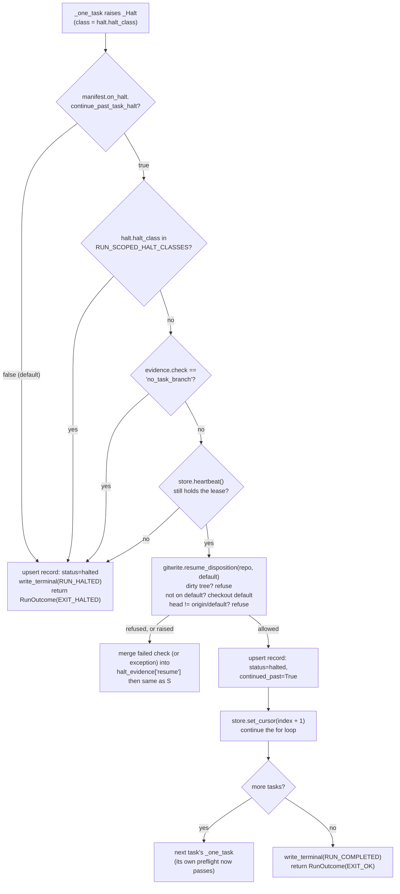

# Continue Past a Task-Scoped Halt

## Goal Capsule

- **Objective:** an unattended overnight Relay run of several independent tasks is not stopped in full by one task's own halt; only a halt that leaves the shared repo, the remote, or the runner's own state in question stops every later task.
- **Means:** after a halt, the runner decides from the repo's actual state whether the next task could start (KTD1), and a manifest opts into pausing that one task and advancing when it could (KTD2, KTD3).
- **Authority hierarchy:** this plan is authoritative for scope and design; `docs/solutions/` and `CONCEPTS.md` are authoritative for existing vocabulary and prior traps; the implementer's own read of `run.py` and `gitwrite.py` settles any mechanical detail this plan leaves open.
- **Stop conditions:** a run-scoped halt class (`HALT_REMOTE_ADVANCED`, `HALT_RUNNER_CRASHED`, `HALT_UNEXPECTED_ERROR`) always stops the whole run, whether or not the opt-in is set (R2). So does any halt whose aftermath fails the resume disposition (R2, KTD1).
- **Execution profile:** single-repo, Python standard library, no new process or external dependency. Verified entirely against the existing stub-`claude` test suite; a live run was considered and deliberately not run (see Assumptions).
- **Tail ownership:** implementer's own commit and local merge to `main`, per this repo's solo workflow; no PR.

---

## Product Contract

### Summary

Relay stops an entire unattended run the moment any one task halts, even when the halt is local to that task's own branch and every later task is independent (`qualifying.independence` already asserts this in every manifest). This plan lets an operator opt a manifest into continuing past a halt when the repo is left in a state the next task can start from, while keeping today's full stop for a halt that puts shared state, the remote, the repo, or the runner process itself, in question.

### Problem Frame

Issue #15: "today a halt of any class stops the entire run; every later task waits on operator intervention even when it doesn't depend on the one that halted." Raised 2026-08-28 during a live Relay-on-Relay run, where a gate failure on one task blocked every task queued after it overnight.

### Requirements

- R1. When a task halts, the halt class is not run-scoped (KTD1), the repo passes the resume disposition after the runner returns it to the default branch (KTD1), and the manifest sets `on_halt.continue_past_task_halt = true` (KTD2), the runner records that task `halted`, marks it continued past, and advances to the next task instead of stopping the run.
- R2. When a halt is run-scoped, or the resume disposition fails, the runner stops the whole run exactly as it does today, regardless of `on_halt.continue_past_task_halt`.
- R3. `on_halt.continue_past_task_halt` defaults to `false` when the manifest has no `[on_halt]` table, and the default is recorded in `defaults_applied` per KTD11 (no default applies silently).
- R4. A run that ends `completed` with one or more tasks continued past lists each of them as a check-by-hand item in `relay summary`, the same way a `blocked` task already does.
- R5. Resuming after a continued-past halt retries that task automatically on the next `relay run`, using the same repair-and-rerun path a full-stop halt already uses. No new CLI flag.
- R6. `CONCEPTS.md`'s "Halt class" entry names the run-scoped set and the resume disposition, so the vocabulary this plan introduces has one canonical home.
- R7. The `/relay` skill's manifest-authoring walkthrough asks the operator for `on_halt.continue_past_task_halt` alongside the two `on_blocked` answers it already asks for, so the choice is made when the manifest is written rather than discovered after a run stopped.

### Key Decisions

- **Decide continuation from repo state, not from the halt class name.** Governs R1, R2. Document review traced every raise site and found the class name is the wrong seam: `HALT_GATE_REFUSED` is raised both when the gate command fails (task branch only, default untouched) and when the post-merge push fails (local default ahead of `origin`, so every later preflight refuses), and `HALT_PATH_GATE` does stop a run today through `gitwrite.local_merge_tail`'s `claude_dir_backstop` return. What the next task needs is what `gitwrite.preflight` already checks: clean tree, on the default branch, head equal to the remote. So the runner asks that question directly after the halt (KTD1) instead of maintaining a hand-classified list that has to be re-traced every time a raise site moves.
- **Reuse `STATUS_HALTED` for a continued-past task; no new record status.** Governs R1, R4, R5. Every consumer that already reads `STATUS_HALTED` (`verify.startup_reverify`, `_one_task`'s status fallthrough, `tail.py`'s per-task notifications) needs no change, and `RUN_COMPLETED` already coexists with a non-landed task status (`STATUS_BLOCKED`) today, so a `completed` run with a continued-past task is not a new shape. One boolean record field, `continued_past`, tells the summary which halted records the run stepped over.
- **Opt-in, default off; not a new default.** Governs R1, R3, R7. `[on_blocked]` is the direct precedent for a per-manifest behavior table defaulting to today's conservative behavior; flipping the runner's stop-on-halt default without an explicit choice would change what an unattended run promises today. Because the default is off, the authoring walkthrough has to ask (R7), or a manifest written the same way as the one behind issue #15 reproduces issue #15.
- **A dirty tree always stops.** Governs R2. `gitwrite.timeout_disposition` already draws this line for timeouts: a clean tree continues, a dirty one halts because nobody can tell from the runner whether the half-written state is safe to discard. A hard reset would make the tree clean and destroy the evidence the operator needs. The same rule applies to every halt.
- **A continued-past task's own stranded branch, and a lost lease, refuse before the disposition runs.** Governs R1, R2, R5. Code review on the first draft found that `resume_disposition` checks only the general repo state (tree, branch, remote), never the specific task's own branch, and nothing in this plan deletes that branch. So a continued-past task's `relay/<id>` branch survives to the next `relay run`, where `_one_task`'s own preflight refuses it on `no_task_branch` before any task process launches; that refusal is itself a candidate for continuation, and letting it through would mark the task `continued_past` again with no progress, forever, while the run keeps reporting `completed`. `_continue_past` refuses this specific case unconditionally, restoring the exact full-stop behavior this raise site had before the opt-in existed: the operator's repair is the same branch deletion `ResumeAfterHalt` already exercises for a full-stop halt. Review also found the disposition's one repo mutation, the checkout back to default, ran with no lease check, unlike every other mutating step in `run.py`; `_continue_past` now refuses when `store.heartbeat()` reports the lease is gone, mirroring `_merge_route`'s `still_ours` guard.

### Scope Boundaries

- No new CLI flag or `--retry-blocked`-style override. Resume already retries a `STATUS_HALTED` task automatically (R5).
- No change to `HALT_CI_UNDECIDED` or `pr_terminal` handling; both are unreachable today (`manifest.UNIMPLEMENTED_SHIPPING_MODES`) and out of scope until that mode ships.
- No repair of the repo beyond checking out the default branch. The runner never resets, stashes, or deletes anything to make the disposition pass; a repo that needs that is the operator's to repair, exactly as today.
- No mid-run alert when several tasks in a row are continued past. A systemic failure (a broken gate command, say) surfaces at the end through R4's check-by-hand list. This is the accepted cost of the opt-in; an operator who wants the earlier stop leaves the flag off.
- No change to the `HALT_LINES` cause-line templates or to any halt class's evidence shape. This plan only changes whether the existing stop-the-run behavior fires, never what a halt records.

### Open Questions

None blocking. Issue #15 raised three design questions; each is resolved here rather than left open:
1. Opt-in vs. new default: resolved as opt-in, defaulting off (Key Decisions, KTD2).
2. How resume re-verifies a continued-past task among otherwise-landed ones: already solved. `verify.startup_reverify` re-verifies every `STATUS_HALTED` record on the next `relay run` regardless of whether the run stopped there or continued past it, and `_one_task` has no special case for `STATUS_HALTED`, so it retries the task exactly like a full-stop halt does today (proven by the existing `ResumeAfterHalt` test in `tests/test_run.py`). No code change.
3. Composition with #12's halt notifications: already solved. `tail.follow`'s `note_statuses` already announces every per-task status transition, including a move to `halted`, independent of the run's terminal write; `finish()`'s run-level "run halted" line only fires from the terminal record, which a continued-past halt no longer writes. No code change (Sources).

---

## Planning Contract

### Key Technical Decisions

- KTD1. **One closed tuple, `contracts.RUN_SCOPED_HALT_CLASSES`, plus a repo-state check, `gitwrite.resume_disposition`.** The tuple holds `HALT_REMOTE_ADVANCED` (the runner's "sole writer of `default` between tasks" assumption may be violated), `HALT_RUNNER_CRASHED` (the lease was lost; another runner may be live), and `HALT_UNEXPECTED_ERROR` (an unanticipated defect with unknown blast radius). Every other class is a candidate, decided by `resume_disposition(repo, default_branch)`: if the tree is dirty, refuse; if the checkout is not on the default branch, check it out (a clean checkout of a branch that exists cannot fail); then if the local default head differs from `origin/<default>`, refuse; otherwise allow. It returns a small result naming the failed check and evidence, in the shape of `gitwrite.PreflightResult`, so the runner can record why it stopped. The task branch is left in place, as `blocked_path` leaves it for a blocked task; the next task's preflight checks only its own branch name, so a stranded branch from an earlier task does not block it. Governs R1, R2. There is no `TASK_SCOPED_HALT_CLASSES` tuple: the disposition is the classification.
- KTD2. **New optional `[on_halt]` manifest table, one field: `continue_past_task_halt: bool`, default `false`.** Mirrors `manifest.OnBlocked`'s exact `pick(raw.get(table, {}), table, key, default)` shape (`manifest.py:218-220`); not in `REQUIRED_TABLES`. Governs R1, R3.
- KTD3. **`run()`'s per-task except handler consults the opt-in, two unconditional refusals, and the disposition, in that order, before writing the terminal record.** After the three existing `except` branches settle `halt`, a new `_continue_past(cfg, halt)` helper decides: opted out, or `halt.halt_class in RUN_SCOPED_HALT_CLASSES` → refuse. `halt.evidence.get("check") == "no_task_branch"` (this exact task's own branch from an earlier halt is still in the way) → refuse unconditionally, never touching the repo. `not cfg.store.heartbeat()` (the lease is gone) → refuse before the disposition's checkout can run. Otherwise call `gitwrite.resume_disposition`. When it allows, keep the existing `store.upsert(..., status=STATUS_HALTED, ...)` call, add `continued_past=True` to it, then `store.set_cursor(index + 1)` and `continue`. Every refusal keeps today's stop-write-terminal-return path unchanged, with the refusing check and evidence merged into `halt_evidence` under a `resume` key so the record says why the run did not continue. The disposition runs inside the same `try` discipline as the rest of the handler: any exception from it, not only `GitError`, is a stop recorded the same way, never an escape (a hung checkout can raise `TimeoutExpired`, which is not a `GitError`). Governs R1, R2, R5.
- KTD4. **`summary._pending_checks` gains one branch keyed on `continued_past`.** A record with `status == STATUS_HALTED` and `continued_past` true gets its own "repair by hand, then run again" check-by-hand line naming its class. The existing `run_status == RUN_HALTED` check keeps covering the single full-stop record, which never carries `continued_past`, so no record is listed twice. Governs R4.

### High-Level Technical Design

What the disposition decides for each halt the runner can raise today, so the implementer can check the mechanism against the raise sites rather than trust a list. Rows already refused by the `no_task_branch` or lease guard above never reach `resume_disposition` at all:

| Raise site | Class | Repo after the halt | Disposition |
|---|---|---|---|
| `local_merge_tail`, gate command failed | `gate_refused` | on task branch, clean | checkout default, allow |
| `local_merge_tail`, push after merge failed | `gate_refused` | on default, local ahead of origin | refuse (`head_equals_remote`) |
| `_merge_route`, code-scope verify failed after a successful merge and push | `gate_refused` | on default, already pushed | allow |
| `_run_closeout`, closeout push failed | `gate_refused` | on default, local ahead of origin | refuse (`head_equals_remote`) |
| `_merge_route`, mirror push failed | `gate_refused` | on default, origin already pushed | allow |
| `local_merge_tail`, `.claude/` backstop | `path_gate` | on task branch, clean | checkout default, allow |
| `local_merge_tail`, gate left tree dirty | `unclean_exit` | on task branch, dirty | refuse (`tree_clean`) |
| `local_merge_tail`, task branch missing (defensive; `_routable`'s own commits check makes this unreachable in practice) | `unclean_exit` | unchanged | disposition decides |
| `_one_task`, preflight refused on `no_task_branch` | `unclean_exit` | this task's own stranded branch from an earlier continued-past halt | refuse unconditionally, before the disposition runs (KTD3) |
| `_one_task`, preflight refused on `tree_clean` or `head_equals_remote` | `unclean_exit` | whatever preflight found | refuse (same check, via the disposition) |
| `_one_task`, complete with no commits | `unclean_exit` | on the task branch, clean | checkout default, allow |
| `_timeout_route`, dirty tree | `timeout` | dirty | refuse (`tree_clean`) |
| `_merge_route`, final verify | `partial_landing` | on default, pushed | allow |
| `_run_closeout`, scope check, out of scope or uncommitted-in-scope | `closeout_out_of_scope` or `unclean_exit` | reset to the pushed pre-closeout head | allow |
| `run()`, `GitError` catch-all | `unclean_exit` | unknown | disposition decides |

`_one_task`, `_timeout_route`, `_merge_route`, `_blocked_route`, `_run_closeout`, and `verify.startup_reverify` are unchanged: they already raise `_Halt` the same way, and a `STATUS_HALTED` record they leave behind is already retried on the next `relay run` once the operator's repair (branch deletion, same as any full-stop halt) has happened (Open Questions, item 2).

### Assumptions

- `on_halt.continue_past_task_halt` defaults to `false`, matching `on_blocked`'s established precedent for an opt-in behavior table (Key Decisions).
- **A live run against the throwaway proof target was considered and not run; this is a judgment call, not a settled fact, recorded here rather than left implicit.** `CLAUDE.md` names "the halt record" as one of the contract surfaces a live run is required for after a change, with no textual qualifier limiting that to fields a subprocess produces. Document review (two independent passes) read that literally and flagged this Assumption's earlier wording as an unstated narrowing. The narrowing is this: every other named surface (envelope grammar, closeout terminal line, brief template, classify digest keys) is a contract between the Runner process and a `claude -p` subprocess it cannot fully control, which is why `docs/solutions/logic-errors/stubbed-seams-agree-by-construction-first-live-run-found-five-contract-defects.md` names the mechanism a live run guards against: a stub and a hand-written parser, authored by the same hands, agreeing on a shape neither has seen a real process violate. `halt_evidence` and `continued_past` are read by exactly two consumers, `summary.py` and `state.py` (checked directly, not by grep alone), both inside the Runner's own process; nothing in this diff changes what a `claude -p` process writes or how the Runner parses it. The bug this document review actually found (the `no_task_branch` trap fixed above) confirms the point rather than undercutting it: it was a pure control-flow defect, fully reachable and provable in the existing stub suite, with no dependency on real subprocess behavior a live run could have surfaced differently. On that reasoning a live run is not run for this change. An operator who reads `CLAUDE.md`'s rule as unconditional should treat that as the standing instruction and run one before treating this as fully done.

### Sources

- `skills/relay/scripts/relay/run.py:159-212`, the per-task except handler and terminal-write sequence this plan branches inside.
- `skills/relay/scripts/relay/gitwrite.py:239-260` (`preflight`), `:388-394` (`blocked_path`), `:397-404` (`timeout_disposition`), the three existing readers of the same repo state `resume_disposition` composes.
- `skills/relay/scripts/relay/gitwrite.py:315-383` (`local_merge_tail`), every `TailResult` the table above classifies, including the `claude_dir_backstop` return at `:334-337` and the push-failure return at `:378-383`.
- `skills/relay/scripts/relay/verify.py:331-350` (`startup_reverify`) and `run.py` `_one_task`'s status dispatch (no `STATUS_HALTED` case), together why resume needs no change (Open Questions, item 2).
- `skills/relay/scripts/relay/tail.py:281-315` (`note_statuses`, `finish`), why notification composition with #12 needs no change (Open Questions, item 3).
- `skills/relay/scripts/relay/manifest.py:96-98,177,218-220` (`OnBlocked`), the precedent KTD2 mirrors.
- `skills/relay/SKILL.md` line 62, where the authoring walkthrough already asks for the two `on_blocked` answers (R7).
- `skills/relay/scripts/relay/state.py`'s `heartbeat` and `launch.py`'s `_Heartbeat`, the pattern `_merge_route`'s `still_ours` guard already uses and the new lease refusal in `_continue_past` mirrors.
- `tests/test_run.py` `TimeoutHalts` / `TimeoutContinues` / `ResumeAfterHalt`, and the `DIRTY_AND_HANG_SH` fixture, which dirties the default branch directly and so exercises the `tree_clean` refusal.
- `docs/solutions/logic-errors/cause-line-contract-split-degraded-to-placeholders.md`, why this plan changes no `HALT_LINES` template or evidence shape (Scope Boundaries): that contract has already broken silently once from an uncoordinated edit. The new `halt_evidence["resume"]` value is a nested dict, so it is inert to every `HALT_LINES` template today; a future template must never name a field living inside it directly, or it degrades the same silent way that document describes.
- `docs/solutions/logic-errors/stubbed-seams-agree-by-construction-first-live-run-found-five-contract-defects.md`, the reasoning the live-run Assumption above narrows against.

---

## Implementation Units

### U1. Run-scoped classes and the resume disposition

**Goal:** give `run.py` the two inputs KTD1 names: the closed run-scoped tuple and a repo-state check that answers "could the next task start here".

**Requirements:** R1, R2 (KTD1)

**Dependencies:** none

**Files:**
- `skills/relay/scripts/relay/contracts.py`
- `skills/relay/scripts/relay/gitwrite.py`
- `tests/test_contracts.py`
- `tests/test_gitwrite.py`

**Approach:**
1. Add `RUN_SCOPED_HALT_CLASSES` directly after `HALT_CLASSES` in `contracts.py`, each entry with a one-line comment naming why it implicates every later task. Do not touch `HALT_CLASSES`, `FINDING_CLASSES`, or `LINE_CLASSES`.
2. Add `resume_disposition(repo, default_branch, ops=None, task_id=None, env=None)` to `gitwrite.py` beside `timeout_disposition`. Order of checks per KTD1: dirty tree refuses first; then checkout of the default branch through the existing `checkout` helper so the git op is recorded like every other mutation; then head against `origin/<default>`. Reuse `PREFLIGHT_CHECKS` names for the failed check so the summary vocabulary stays one set.
3. Return `PreflightResult` (already a dataclass with `ok`, `failed`, `evidence`); no new result type.

**Patterns to follow:** `gitwrite.preflight` for the checks and evidence dict; `gitwrite.blocked_path` for the checkout-back-to-default step; `contracts.py`'s `IN_FLIGHT_STATUSES` comment style.

**Test scenarios:**
- `RUN_SCOPED_HALT_CLASSES` is exactly the three-member set named in KTD1, every member is in `HALT_CLASSES`, and none is in `FINDING_CLASSES`.
- A clean checkout of the task branch with default equal to `origin/default`: the disposition allows, and the repo is on the default branch afterward.
- A clean checkout of the default branch already equal to `origin/default`: allows, no checkout op recorded.
- A dirty tree on the task branch: refuses with `tree_clean`, no checkout attempted (the tree is left exactly as found).
- A dirty tree on the default branch: refuses with `tree_clean`.
- A clean default branch one commit ahead of `origin/default` (the push-failed shape): refuses with `head_equals_remote`, evidence carries both shas.
- A stranded task branch from an earlier task does not affect the result (the disposition never looks at other branches).

**Verification:** the new assertions pass under `python3 -m unittest test_contracts test_gitwrite` from `tests/`.

---

### U2. `[on_halt]` manifest opt-in and the authoring prompt

**Goal:** let a manifest opt into continuing past a halt, defaulted off, and make the `/relay` skill ask for the value when it writes a manifest.

**Requirements:** R1, R3, R7 (KTD2)

**Dependencies:** none

**Files:**
- `skills/relay/scripts/relay/manifest.py`
- `skills/relay/SKILL.md`
- `tests/test_manifest.py`
- `docs/examples/manifest-jira-local-merge.toml`
- `docs/examples/manifest-github-projects.toml`
- `docs/examples/manifest-markdown.toml`

**Approach:**
1. Add a frozen `OnHalt` dataclass with one field, `continue_past_task_halt: bool`.
2. In `load()`, mirror `on_blocked`'s read exactly: `oh = raw.get("on_halt", {})`, `OnHalt(continue_past_task_halt=bool(pick(oh, "on_halt", "continue_past_task_halt", False)))`, add `on_halt` to the `Manifest` dataclass and its construction. `on_halt` is not added to `REQUIRED_TABLES`.
3. In `SKILL.md`'s manifest-authoring walkthrough (the sentence at line 62 that names the two `on_blocked` answers), add `on_halt.continue_past_task_halt` as a third degraded-path answer, with one sentence saying what it trades: later independent tasks keep running past a contained halt, at the cost of no mid-run stop when several halt in a row.
4. Add an `[on_halt]` block to each of the three example manifests beside `[on_blocked]`, set to `continue_past_task_halt = false`, illustrating the default explicitly rather than omitting the table.

**Patterns to follow:** `manifest.py`'s `OnBlocked` dataclass and `pick()` load at `manifest.py:218-220`; the example manifests' existing `[on_blocked]` blocks; the walkthrough's existing phrasing for the `on_blocked` questions.

**Test scenarios:**
- A manifest with no `[on_halt]` table loads `manifest.on_halt.continue_past_task_halt is False`, and `"on_halt.continue_past_task_halt"` appears in `defaults_applied`.
- A manifest with `[on_halt]\ncontinue_past_task_halt = true` loads `True`, and the key is absent from `defaults_applied`.
- `validate()` raises no new error or warning for either value.
- The `SKILL.md` change has no test. Test expectation: none. Prose in a skill brief, verified by reading.

**Verification:** `python3 -m unittest test_manifest` from `tests/`; `relay validate` against each updated example manifest still passes.

---

### U3. `run()` continues past an allowed halt

**Goal:** the run loop advances past a halt when the manifest opts in, the class is not run-scoped, and the disposition allows; it keeps today's full stop otherwise.

**Requirements:** R1, R2, R5 (KTD3)

**Dependencies:** U1, U2

**Files:**
- `skills/relay/scripts/relay/run.py`
- `tests/test_run.py`

**Approach:**
1. In `run()`'s task loop, after the three `except` branches settle `halt` and before the existing `store.upsert` / `write_terminal` / `return` sequence, insert the KTD3 decision as one `_continue_past(cfg, halt)` helper returning a bool, so the loop body reads as the sequence in the diagram.
2. In order: opted out, or `halt.halt_class in RUN_SCOPED_HALT_CLASSES` → return `False`, no repo access. `halt.evidence.get("check") == "no_task_branch"` → record `halt.evidence["resume"] = {"check": "no_task_branch"}` and return `False`, before calling the disposition. `not cfg.store.heartbeat()` → record `{"check": "lease_lost"}` and return `False`, before the disposition's checkout can run. Otherwise call `gitwrite.resume_disposition`.
3. When allowed: the existing `store.upsert(...)` call gains `continued_past=True`; then `store.set_cursor(index + 1)` and `continue`. Do not call `write_terminal`; do not return.
4. When the disposition refuses: merge `dict(result.evidence, check=result.failed)` into `halt.evidence["resume"]` before the existing upsert, then fall through to today's stop path unchanged.
5. Any exception from the disposition, not only `GitError`, is caught, recorded under `halt.evidence["resume"]` (`"check": "git_error"` or `"unexpected_error"`), and treated as a refusal — never allowed to escape the loop as a traceback. A hung checkout can raise `subprocess.TimeoutExpired`, which is not a `GitError`.

**Test scenarios:**
- Gate refused, continued: opt-in on, T-2's gate command exits nonzero (use a manifest gate that fails on a marker file T-2's stub commits), T-1 and T-3 land, T-2 ends `STATUS_HALTED` with `halt_class == HALT_GATE_REFUSED` and `continued_past` true, the repo is on the default branch after the run, `outcome.exit_code == EXIT_OK`, `terminal["run_status"] == RUN_COMPLETED`, `terminal["halt_task"] is None`.
- Dirty timeout, refused: opt-in on, `DIRTY_AND_HANG_SH` on T-2 (the existing `TimeoutHalts` shape), the run still stops at T-2 with `EXIT_HALTED`, `halt_evidence["resume"]["check"] == "tree_clean"`, T-3 never launched.
- Opt-out preserved: the same dirty-timeout fixture with `continue_past_task_halt` absent reproduces today's `TimeoutHalts` result byte for byte, and no `resume` key appears in the evidence.
- Run-scoped override: opt-in on, a lease-lost fixture (`HALT_RUNNER_CRASHED`) on T-2 still stops the run at T-2 exactly as today, and no disposition is recorded.
- Multiple continued halts: opt-in on, T-1 and T-3 each fail the gate (clean trees), T-2 lands, both halted records carry `continued_past`, the run reaches `RUN_COMPLETED` / `EXIT_OK`.
- Push failed after merge, refused: opt-in on, a fixture where `origin` refuses the push of T-2's merge (a pre-receive hook on the bare remote returning nonzero), the run stops with `HALT_GATE_REFUSED` and `halt_evidence["resume"]["check"] == "head_equals_remote"`.
- **A continued-past task whose branch was not deleted halts on the next run rather than looping green.** Rerun without operator repair: the second `relay run` stops at T-2 with `EXIT_HALTED` and `halt_evidence["resume"] == {"check": "no_task_branch"}`, never a second `continued_past` record. Only after the operator deletes the stranded branch (mirroring `ResumeAfterHalt`) does a third run land it.
- `_continue_past`'s two guard refusals and two exception paths, exercised directly against the function: `no_task_branch` evidence refuses without calling the disposition; a lease held by another `StateStore` on the same repo refuses before any checkout; a `GitError` and a plain `Exception` raised from a monkeypatched `resume_disposition` both refuse with the right `resume` shape instead of propagating.

**Verification:** `python3 -m unittest test_run` from `tests/`; `TimeoutHalts`, `TimeoutContinues`, and `ResumeAfterHalt` continue to pass unmodified (they exercise the default-off path).

---

### U4. `relay summary` lists a continued-past task as a check-by-hand item

**Goal:** an operator running `relay summary` after a `completed` run sees every task the run stepped over, not just the tasks that ended `blocked`.

**Requirements:** R4 (KTD4)

**Dependencies:** U3

**Files:**
- `skills/relay/scripts/relay/summary.py`
- `tests/test_summary.py`

**Approach:**
1. `_task_entry` carries `continued_past` from the record (default false) so the JSON is the summary, per R46.
2. In `_pending_checks`, beside the existing `STATUS_BLOCKED` branch: when `entry["status"] == STATUS_HALTED and entry["continued_past"]`, append a `continued_past` check naming the task and class, plus the record's own `entry["branch"]` when present, since that is exactly the branch a rerun's own pre-flight refuses on until it is deleted (Key Decisions).
3. `lines()` needs no change: check-by-hand lines already render from `pending_checks`.

**Patterns to follow:** the existing `STATUS_BLOCKED` / `STATUS_EXCLUDED` branches in `_pending_checks`; `_task_entry`'s field passthrough style.

**Test scenarios:**
- A record with `status=STATUS_HALTED`, `halt_class=HALT_GATE_REFUSED`, `continued_past=True`, in a run whose terminal `run_status` is `RUN_COMPLETED`, appears in `pending_checks` with `kind == "continued_past"` and a text naming the task id and class.
- A record with `status=STATUS_HALTED` and no `continued_past`, where it is `terminal["halt_task"]` in a `RUN_HALTED` run, appears in exactly one `pending_checks` entry (the existing `halted` kind).
- A `RUN_HALTED` run holding one continued-past record and one full-stop record lists both, once each, with different kinds.
- `STATUS_LANDED` and `STATUS_BLOCKED` records are unaffected.
- `render()` output includes the new line under "check by hand:" and the `lines()` source for it is `pending_checks[N].text`.

**Verification:** `python3 -m unittest test_summary` from `tests/`.

---

### U5. Name the distinction in `CONCEPTS.md`

**Goal:** the run-scoped / resume-disposition vocabulary this plan introduces has one documented home.

**Requirements:** R6

**Dependencies:** U1

**Files:**
- `CONCEPTS.md`

**Approach:**
1. Extend the existing "Halt class" entry with one short paragraph: three classes are run-scoped and always stop the run, named in `contracts.RUN_SCOPED_HALT_CLASSES`; any other halt can be continued past when the manifest opts in and the repo, after the Runner returns it to the default branch, is one the next Task could start from (a clean tree at the remote's head), which the Runner checks rather than infers from the class. A Task continued past stays `halted` and is retried on the next run like any other halt.
2. Fold into the existing entry; do not add a new heading (a refinement of an existing entry is not a new term).

**Test scenarios:** Test expectation: none. Documentation-only change, no executable behavior.

**Verification:** the added paragraph reads correctly alongside the existing entry and agrees with KTD1's table.

---

## Verification Contract

- Full suite: `python3 -m unittest discover -s tests` from the repo root (about two and a half minutes).
- Targeted, from `tests/`: `python3 -m unittest test_contracts test_gitwrite test_manifest test_run test_summary`.
- A live run against the throwaway proof target was deliberately not run; see Assumptions for the reasoning and the standing instruction it narrows.
- `relay validate` against each of the three updated example manifests in `docs/examples/` still passes with no new error.

## Definition of Done

- U1 through U5 landed; every test scenario in each unit passes.
- `python3 -m unittest discover -s tests` is green from the repo root.
- `TimeoutHalts`, `TimeoutContinues`, and `ResumeAfterHalt` in `tests/test_run.py` still pass unmodified, proving the default-off path is today's behavior.
- A rerun of a continued-past task whose branch was never deleted halts the run rather than reporting `completed`; the earlier draft of this plan and its first implementation both missed this and code review caught it (see the Key Decisions entry on the stranded branch).
- The table in High-Level Technical Design matches the raise sites in the shipped code; a row the implementer finds wrong is corrected in the plan in the same commit.
- No leftover experimental code (an abandoned `TASK_SCOPED_HALT_CLASSES` tuple, a second record status) remains in the diff.
