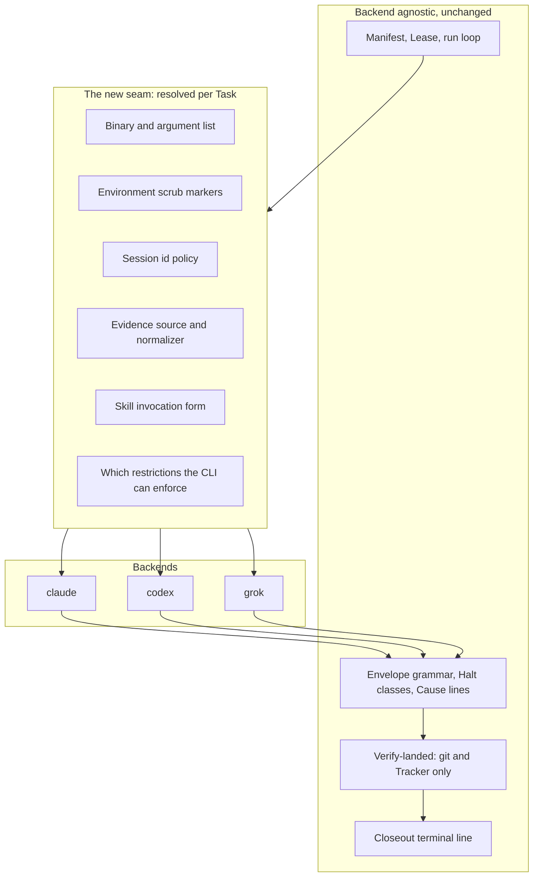
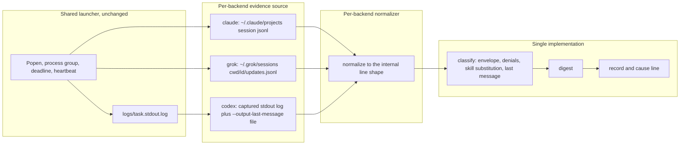
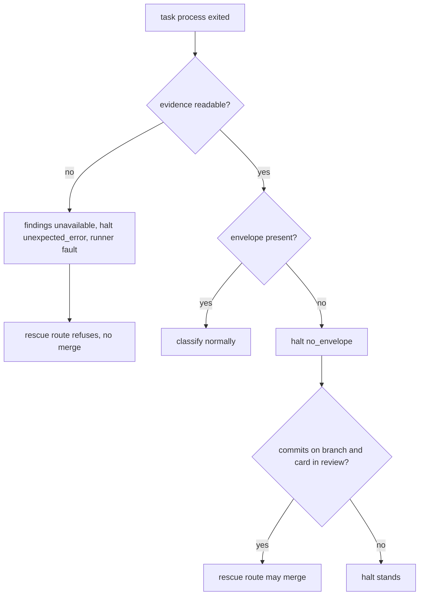

# Pluggable CLI Backends - Plan

> KTD numbers in this plan are local to this plan. Decisions from the outer-loop plan are cited by
> path, for example `docs/plans/2026-08-25-1346-feat-relay-outer-loop-plan.md` KTD6, the closed
> halt-class set.

## Goal Capsule

- **Objective:** An operator can put a Task on whichever coding CLI suits it and get the same outcome vocabulary and the same landing verdict as any other Task. Which CLI ran a Task becomes a routing choice, not a difference in how much rigor that Task received or how its result can be read.
- **Means:** Resolve the CLI per Task at the launch seam, normalize each backend's evidence into the one shape the classifier already reads, and keep every outcome contract shared (KTD1, KTD2).
- **Product authority:** Relay's own `README.md` and `CONCEPTS.md`. This work adds a Task attribute and an evidence seam. It does not change what a Runner, Lease, Envelope, Halt class, or Verify-landed means.
- **Execution profile:** Backward-compatible by construction. A manifest with no backend key anywhere runs exactly as it does today. U1 is a spike whose findings every later unit depends on.
- **Stop conditions:** Stop and report rather than proceeding if U1 finds that the compound-engineering plugin does not install or does not function on a backend, or that a backend's only non-interactive mode is its bypass equivalent. Either finding removes that backend from scope and the parity claim with it.
- **Tail ownership:** The caller owns commit, push, and PR. This plan does not land itself through Relay.
- **Open blockers:** None.

---

## Product Contract

**Product Contract preservation:** changed. R1 to R18 are unchanged in meaning and ID. Added R19 to
R23, all consequences of settled decisions rather than new direction: R19 and R21 make settled
decision 4 enforceable, R20 and R23 close safety holes the per-backend seam opens, and R22 records a
compatibility limit research found. The five labeled Key Decisions keep their annotations, and their
`Governs` links are re-pointed to include the new IDs.

### Summary

A Task in a Relay manifest names its backend, one of `claude`, `codex`, or `grok`, and the Runner launches both that Task's Task process and its Closeout process on that CLI. Every backend runs the identical pipeline through the compound-engineering plugin installed natively on it. The `/relay` skill proposes a backend per Task from a written rubric and the operator overrides before the manifest is written.

### Problem Frame

Relay's value is the outer loop: the Manifest, the Lease, the Halt classes, Verify-landed. None of that is specific to one vendor's CLI, but every line of the launch path is. `build_args()` emits a fixed `claude` argv, `cli_version()` probes only `claude --version`, `find_transcript()` globs only `~/.claude/projects/`, and `child_env()` scrubs only `CLAUDECODE*` markers. The result is an outer loop with no vendor opinion sitting on a launcher that has nothing but.

That coupling has a cost the operator feels in three ways. Usage on one account bounds how much unattended work a day can hold, and there is no way to spend a different account's budget on the tasks that do not need the strongest model. A rate limit or an outage on one vendor stalls a queue that has no reason to care which model drives it. And the judgment about which model suits which kind of work has nowhere to live, so it stays in the operator's head and is re-derived every time a manifest is written.

The premise that made this look large was wrong. The compound-engineering plugin installs natively on Codex and on Grok Build, so a Task process on either can invoke `ce-plan`, `ce-work`, `ce-simplify`, `ce-code-review`, and `ce-compound` exactly as it does on Claude. What is missing is not a portable pipeline. It is a launch seam, an evidence reader that knows more than one shape, and somewhere to keep the routing knowledge.

### Key Decisions

- **Full pipeline parity across all three backends.** Every backend runs plan, work, simplify, review, gate, tracker write, and compound judgment. (session-settled: user-directed, chosen over a lighter single-prompt mode for non-Claude Tasks: the plugin already installs on all three, so a reduced pipeline would be a self-inflicted limitation.) Governs R3, R4.
- **Backend is a per-Task attribute.** A manifest may mix backends across its Tasks. (session-settled: user-approved, chosen over one backend per manifest: routing per tracker item is the point, and splitting a queue into per-backend manifests would defeat it.) Governs R1, R2.
- **The Closeout process runs on its Task's own backend.** (session-settled: user-directed, chosen over always running Closeout on Claude: the tracker write and the compound judgment belong where the work happened, and pinning them to one vendor would reintroduce the dependency this work removes.) Governs R5.
- **A backend that cannot enforce a restriction at launch carries it in the Brief, records it as unenforced, and has the bound enforced at the landing instead.** (session-settled: user-approved, chosen over holding Codex until it gains launch-time denial: Verify-landed and the Lease were always the real guards, and a misbehaving process is caught the same way regardless of backend.) Governs R10, R19, R21.
- **Routing is a rubric-guided recommendation made in `/relay` while the manifest is authored, never a runtime Runner decision.** (session-settled: user-approved, chosen over a static attribute-to-backend table and over runtime selection by the Runner: a rubric holds judgment a table cannot, and keeping the choice at authoring time leaves the Runner's decision surface unchanged.) Governs R14, R15, R16.
- **Backend readiness is verified, not asserted.** Binary presence, plugin presence, and adapter compatibility are machine-checkable, so they are a preflight probe rather than a prose sentence the operator writes. Governs R17, R18, R22.

The seam this work introduces, and what stays on either side of it:

### Requirements

**Backend selection**

R1. A Task names the backend that runs it, from the closed set `claude`, `codex`, `grok`. A manifest may declare a default that every Task inherits unless it names its own.

R2. A manifest may name different backends on different Tasks, and the run loop treats a mixed manifest exactly as it treats a single-backend one.

**Pipeline parity**

R3. Every backend runs the same pipeline stages a Claude Task runs today: plan, work, simplify, review, the project gate, the tracker write, and the compound judgment. No backend receives a reduced pipeline.

R4. A Brief carries the same instructions for every backend. It differs only where a fact does not exist on that CLI, such as how a skill is invoked or which restriction flags the launch supports.

R5. The Closeout process for a Task runs on that Task's backend, with both of its duties intact.

**Launch seam**

R6. Launching a process resolves the binary, the argument list, and the environment markers to scrub from the Task's backend, rather than from a fixed `claude` argv.

R7. The Runner records the observed CLI version of every backend a run used, and the version each backend was tested against.

R8. Where a backend accepts a runner-chosen session id, the Runner chooses it before launch. Where it does not, the Runner names the evidence file itself instead of discovering it afterwards.

R9. Evidence discovery resolves the source that the Task's backend actually writes.

R10. A restriction the manifest names that a backend cannot enforce at launch is carried in that Task's Brief instead, and the run's record names which restrictions went unenforced.

R23. A Task process receives only its own backend's credentials. Every other backend's credential variables are scrubbed from its environment.

**Outcome contracts**

R11. The Envelope grammar, the Halt classes, the Cause lines, and the Closeout terminal line are identical across backends, so a Task's outcome reads the same regardless of which CLI produced it.

R12. Verify-landed continues to read git and the Tracker alone, so a landing verdict never depends on which backend did the work.

R13. Where a backend's evidence cannot be read or parsed, the Task still receives its landing verdict, and the findings that would have come from that evidence are recorded as unavailable rather than as none found.

R20. A Task whose evidence the Runner could not read does not land through the no-envelope rescue route. Unreadable evidence is a Runner fault, not the Task's silence.

**Enforcement**

R21. On a backend that cannot enforce the manifest's restrictions at launch, the Runner checks the Task's own commit against the manifest's allowed paths before it merges, and refuses the merge when the commit falls outside them.

**Routing recommendation**

R14. `/relay` proposes a backend for each Task from a written rubric and states a one-line reason for each proposal.

R15. The operator sees every proposal and can change any of them before the manifest is written. No Task reaches a manifest with a backend the operator did not see.

R16. The rubric is a durable artifact in the repository that an operator can read and edit, not judgment held only inside one conversation.

**Preflight**

R17. Every backend a manifest names must be installed and carry the compound-engineering plugin. This is checked before a run starts.

R18. A named backend that is absent, or present without the plugin, refuses the run before any Task launches, naming the backend and which of the two conditions failed.

R19. When any Task names a backend that cannot enforce the manifest's tool restrictions at launch, the manifest must carry the operator's own sentence accepting that condition, and validation refuses without it.

R22. A backend and Tracker adapter combination whose Closeout cannot perform its tracker write is refused before a run starts, naming the pair.

### Key Flows

- F1. Authoring a manifest across backends
  - **Trigger:** The operator asks `/relay` to build a manifest from a list of tracker items.
  - **Steps:** The skill reads each item, applies the rubric, and proposes a backend with a one-line reason. The operator accepts or changes each. Validation checks every named backend for the binary, the plugin, and adapter compatibility. The skill writes the manifest and validates it.
  - **Outcome:** A manifest whose every Task carries a backend the operator saw, on a machine where each of those backends can run.
  - **Covered by:** R1, R2, R14, R15, R17, R18, R19, R22

- F2. One Task on a non-Claude backend
  - **Trigger:** The run loop reaches a Task whose backend is `codex` or `grok`.
  - **Steps:** The Runner renders the Brief for that backend, resolves the binary and arguments, launches the Task process bounded as any other, and reads its Envelope. It normalizes that backend's evidence and classifies the exit. It runs Verify-landed from git and the Tracker. On an unenforced backend it checks the Task commit against the allowed paths before merging. It launches the Closeout process on the same backend and reads the terminal line.
  - **Outcome:** A Task record indistinguishable in vocabulary from a Claude Task's, carrying the backend that produced it.
  - **Covered by:** R3, R4, R5, R6, R8, R9, R11, R12, R13, R20, R21

### Acceptance Examples

- AE1. Missing plugin refuses before launch
  - **Covers R17, R18.**
  - **Given:** A manifest names `codex` on one Task, and `codex` is installed but the compound-engineering plugin is not.
  - **When:** The operator starts the run.
  - **Then:** The run refuses before launching any Task, and says that `codex` is installed without the plugin. No Task process starts, including the Claude ones.

- AE2. An unenforceable restriction is carried, recorded, and bounded at the landing
  - **Covers R10, R19, R21.**
  - **Given:** A manifest names a disallow list, a Task on `codex`, and the operator's acceptance sentence.
  - **When:** That Task runs and its commit touches a path outside the manifest's allowed paths.
  - **Then:** The Brief carried the restriction as an instruction, the record names it unenforced at launch, and the Runner refuses the merge because the commit fell outside the allowed paths.

- AE3. Unreadable evidence yields a verdict and never a rescue merge
  - **Covers R13, R20.**
  - **Given:** A Task on `grok` whose evidence cannot be located or parsed, with commits on its branch and its card in the in-review status.
  - **When:** The Runner decides the Task's outcome.
  - **Then:** Verify-landed produces the landing verdict from git and the Tracker as usual, the transcript-derived findings are recorded as unavailable rather than none found, and the no-envelope rescue route does not merge the branch.

- AE4. A non-Claude Closeout ends on the same contract
  - **Covers R5, R11.**
  - **Given:** A Task on `grok` that landed.
  - **When:** The Closeout process runs.
  - **Then:** It runs on `grok`, writes the outcome to the Tracker, makes the compound judgment, and ends with the same terminal line a Claude Closeout ends with.

- AE5. The operator's override wins
  - **Covers R14, R15.**
  - **Given:** The rubric proposes `codex` for a Task and states its reason.
  - **When:** The operator changes it to `claude`.
  - **Then:** The manifest carries `claude` for that Task, and nothing re-applies the rubric to it afterwards.

- AE6. An unsupported pair is refused by name
  - **Covers R22.**
  - **Given:** A manifest whose adapter is `jira` and one of whose Tasks names `codex`.
  - **When:** The manifest is validated.
  - **Then:** Validation refuses and names the `jira` and `codex` pair, before any Task launches.

### Success Criteria

- One Task lands end to end on each of the three backends against a throwaway target repository, using the real CLIs rather than the stub.
- Three records produced by running the same trivial Task once per backend are equal on status, halt class, Envelope status, presence of a landing reference, presence of a tracker reference, and Closeout result, and differ only on session id, evidence path, timings, tool-call count, and backend.
- A run summary for a mixed-backend manifest reads in the same vocabulary as a single-backend one. An operator who was not watching can tell what happened without knowing which CLI ran which Task.

### Scope Boundaries

**Deferred for later**

- Runtime routing: the Runner choosing or changing a Task's backend during a run, or reacting to a rate limit or an outage by moving work.
- A rubric informed by past backend outcomes, which needs a cross-run ledger that does not exist.
- Per-backend timeout defaults and cost accounting.

**Outside this work**

- Mixed-backend handoff inside one Task. A Task has one backend for its whole life, including its Closeout.
- A per-backend Halt class set. The closed set holds and backends produce findings instead.
- The `pr_terminal` shipping mode, which stays named in the schema and refused by validation.
- Relay reimplementing the compound-engineering pipeline for a backend that lacks the plugin. The natively installed plugin is the entire premise.
- The `/relay` skill itself running anywhere but Claude Code. Only the launched processes vary.

### Dependencies and Assumptions

- The compound-engineering plugin installs natively on both alternates through their own plugin systems. Neither install exists on this machine yet, so U1 performs both by hand.
- Observed on this machine: `codex-cli 0.149.0` at `/opt/homebrew/bin/codex`, `grok 1.0.5` at `~/.grok/bin/grok`, `claude 2.1.250`. Note that `contracts.CLI_VERSION_TESTED` currently pins `2.1.245`, so Claude has already drifted.
- Grok Build's headless flags mirror Claude Code's closely: `-p/--single`, `-s/--session-id` (runner-chosen UUID for a new conversation), `-m/--model`, `--effort`, `--permission-mode` with the same `dontAsk` and `bypassPermissions` vocabulary, `--allow`/`--deny` accepting Claude-style `Bash(...)` rules, and `--output-format streaming-json`. Sessions persist under `~/.grok/sessions/<url-encoded-cwd>/<session-id>/` with `updates.jsonl` as the authoritative log.
- Codex `exec` runs non-interactively with `--sandbox workspace-write` as its non-bypass posture, assigns its own session id, and offers `--output-last-message <file>` and `--json`. It has no per-tool deny flag.
- Neither alternate writes state into a working tree. Both keep sessions under their own home directory, so the dirty-tree risk from CLI droppings is assumed absent and is confirmed in U1.
- **Assumption, operator-visible:** R21 extends the existing Closeout scope check to the Task commit on unenforced backends. This is more than the settled decision literally required, which was to record the restriction as unenforced. It is included because a recorded bound is a report and a checked bound is a guard, and the mechanism already exists. If this is unwanted, R21 and its part of U10 can be dropped without disturbing anything else.
- **Assumption:** the manifest-level default lives in a `[defaults]` table rather than in `[project]`, so later per-Task defaults have somewhere to go without another schema move.

### Outstanding Questions

**Deferred to Planning: all resolved.** The five questions the requirements-only artifact carried are settled in KTD2, KTD4, KTD8, KTD11, and KTD12.

**Deferred to implementation, resolved by U1's spike**

- The exact skill invocation form on Grok. Codex is `$ce-plan`; Claude is the `compound-engineering:` prefix; Grok reads Claude-compatible manifests but its documented surface is `/skills`, so the form is confirmed by running one skill on it.
- Whether Grok's `--allow` rule vocabulary accepts a bare `Skill` entry, which `closeout.BASE_TOOLS` includes and Grok's documented prefix list does not name.
- The event shape each alternate emits on stdout, which fixes the normalizers in U6.

---

## Planning Contract

### Key Technical Decisions

KTD1. **The backend seam is a set of primitives plus a capability record, not a workflow object.** Mirror the enforcement shape of `skills/relay/scripts/relay/adapters/__init__.py`: a frozen `INTERFACE` tuple, a `build()` dispatch by name with local imports inside each branch, `ConfigurationError` raised at construction so validation names the problem before a run, and one shared test asserting each backend's public surface is exactly the interface. Do not adopt its scope. Launching, bounding, killing the process group, heartbeating the lease, merging, pushing, and verifying stay in the shared run loop. Rationale: the three coupled invariants in `docs/solutions/logic-errors/process-group-kill-resolves-target-lazily.md` are load-bearing and would have to be re-asserted per backend the moment a backend supplied its own `Popen` or teardown, and the suite would stay green if one were dropped. Chosen over the lighter alternative of a plain dict keyed by backend name, the shape `brief.TEMPLATES` uses for Shipping modes: a backend carries behavior, not only a value, and the shared surface test is what stops one backend from quietly growing a method the others lack. Governs R6.

KTD2. **One classifier, three normalizers.** Each backend turns its own evidence into the line shape `classify.py` already consumes. The Envelope parser, the denial join by `tool_use_id`, the `last_message` and `last_message_tail` split, and the skill-substitution check stay single-implementation. `tail.decode` gets the same treatment: a per-backend stdout event normalizer, not a per-backend Follower. Rationale: three parsers put one contract in three places, which is the shape `docs/solutions/logic-errors/cause-line-contract-split-degraded-to-placeholders.md` documents degrading into six wrong lines out of sixteen. Governs R9, R11.

KTD3. **Brief templates are not forked per backend.** Keep one template per Shipping mode and render per-backend inserts through the existing `values()` substitution: the skill invocation form and the unenforced-restriction instruction. Rationale: the templates carry Relay's outcome contract, and forking triples the surface on which that contract can drift. This reverses the speculation in issue 16 that each backend needs its own templates. If U1 proves a backend cannot follow the shared template, that reopens this decision as a finding rather than an assumption. Governs R4.

KTD4. **Codex needs no session-id recovery.** `codex exec --output-last-message <file>` writes the final agent message, which is exactly where the Envelope and the Closeout terminal line live, and `--json` puts the event stream on stdout, which the launcher already captures to `logs/<task>.stdout.log`. Both Codex evidence sources are therefore named by the Runner before launch. The outer-loop plan's KTD7 invariant, that the Runner names the evidence rather than discovering it, is satisfied by different means rather than inverted. Governs R8, R9.

KTD5. **Evidence that could not be read is a Runner fault, never the Task's silence.** `transcript_present: False` stops falling through to `no_envelope` and routes to `unexpected_error`, whose documented remedy already says the fault is in the runner or the manifest rather than the task. It must also stop satisfying the rescue route in `run._routable()`. Rationale: today an unreadable transcript is recorded as "the process ran and printed no envelope, with no findings", and with commits on the branch and the card in the in-review status the rescue route merges anyway. That is a latent defect for Claude and would be the routine path on any backend whose evidence went missing. Governs R13, R20.

KTD6. **Per-backend permission posture, with the forbidden mode named per backend.** Claude and Grok use `--permission-mode dontAsk` and forbid `bypassPermissions`. Codex uses `--sandbox workspace-write` and forbids `--dangerously-bypass-approvals-and-sandbox`. Rationale: the existing refusal of a bypass mode is a safety floor, and each backend needs its own spelling of both halves or the refusal silently stops applying. Governs R6, R10.

KTD7. **An unenforceable restriction becomes an enforced landing bound.** On a backend that cannot enforce the manifest's restrictions at launch, the Runner diffs the Task commit against the manifest's allowed paths before merging and refuses the merge when it falls outside, reusing the Closeout scope-check mechanism that already exists. Additionally, the classifier scans that backend's normalized evidence for tool calls matching the manifest's disallow patterns and raises a finding carrying the tool, the argument, and the line, escalating to a halt only when the match is in the destructive set. (session-settled: user-approved, chosen over holding Codex until it gains launch-time denial: Verify-landed and the Lease were always the real guards, and a misbehaving process is caught the same way regardless of backend.) Governs R10, R19, R21.

KTD8. **The version pin and the version probe become per-backend maps.** `CLI_VERSION_TESTED` becomes one entry per backend, and the terminal record carries one observed entry per backend the run actually used. Each backend supplies its own version parsing. Rationale: verified directly, both alternates lead their `--version` output with a name token, so the current leading-digit token regex returns `None` for each and the drift signal would be permanently blank. The probe keeps its fail-closed contract from `docs/solutions/logic-errors/version-probe-between-lease-acquire-and-try-finally-must-never-raise.md`, including `ValueError` in the except tuple, because an unfamiliar binary emitting a banner or a non-UTF-8 byte is likelier than `claude` doing it. Governs R7.

KTD9. **Backend readiness is checked inside `manifest.validate()` under its existing environment-probing flag.** Not in skill prose, and not through `launch.cli_version`, which fails closed to `None` by contract and runs after the lease is taken. Rationale: `validate` already reaches the environment under `check_repo`, which is the same shape as asking whether a binary is on `PATH`, and it is the one gate the skill is already required to respect. Governs R17, R18.

KTD10. **A backend and adapter pair whose Closeout cannot write is refused, mirroring the named-but-refused precedent.** The `jira` adapter's Closeout tools are `mcp__atlassian__*` names registered in a Claude MCP configuration, so `jira` with `codex` or `grok` cannot perform duty one. Refuse the pair in validation the way `pr_terminal` is refused, rather than making the adapter interface backend-aware. Rationale: refusing is cheaper than a cross-product interface and keeps the eight-method adapter surface frozen. The `github` and `markdown` adapters use `("Bash",)` and port unchanged. Governs R22.

KTD11. **The manifest-level backend default flows through the existing `defaults_applied` reporting.** A defaulted backend is reported by `validate`, never silent. Rationale: the outer-loop plan's KTD11 already established that nothing is defaulted silently, and the current `pick()` helper is keyed by table rather than by array element, so this needs a small extension rather than a new mechanism. Governs R1.

KTD12. **The routing rubric is a file under `skills/relay/references/` that `SKILL.md` points at.** When a Task's backend differs from the manifest default, the manifest carries a reason string, mirroring the existing rule that an excluded Task carries a reason. When it matches the default, no reason is required. (session-settled: user-approved, chosen over a static attribute-to-backend table and over runtime selection by the Runner: a rubric holds judgment a table cannot, and keeping the choice at authoring time leaves the Runner's decision surface unchanged.) Governs R14, R15, R16.

### High-Level Technical Design

**Evidence flow.** The change is to Relay's evidence supply, not to its process launcher. One classifier consumes normalized lines from whichever source that backend actually writes.

**The routing fix.** Today an unreadable transcript and a silent process are the same state, and the rescue route merges on it.

**Per-backend launch facts.** These are the values the capability record carries. U1 confirms each against the installed CLI before any of it is written down as a pin.

| Fact | claude | codex | grok |
|---|---|---|---|
| Non-interactive invocation | `claude -p` | `codex exec` | `grok -p` |
| Session id | runner-chosen `--session-id` | assigned by the CLI, not needed (KTD4) | runner-chosen `-s` |
| Structured output | `--output-format stream-json --verbose` | `--json` | `--output-format streaming-json` |
| Final message | from the transcript | `--output-last-message <file>` | from the transcript |
| Permission posture | `--permission-mode dontAsk` | `--sandbox workspace-write` | `--permission-mode dontAsk` |
| Forbidden mode | `bypassPermissions` | `--dangerously-bypass-approvals-and-sandbox` | `bypassPermissions` |
| Tool allow and deny | `--allowedTools` / `--disallowedTools` | none | `--allow` / `--deny` |
| Enforces restrictions at launch | yes | no | yes |
| Evidence source | `~/.claude/projects/<slug>/<id>.jsonl` | captured stdout log | `~/.grok/sessions/<cwd>/<id>/updates.jsonl` |
| Skill invocation | `compound-engineering:<name>` | `$<name>` | confirmed in U1 |

### Assumptions

- The Runner-level environment scrub becomes the union of every backend's nesting markers, because `child_env` is built once per run at `run.py:121` before any Task is in scope, and that same environment is what the git operations, the adapters, and the version probes use. The per-Task refinement inside `launch.launch` is optional; the run-level union is not.
- Adding a digest key is cheap: `tests/test_contracts.py` derives reader keys by grepping the runner source, so a new key passes once `classify` sets it and it is in the pinned set.
- `state.upsert` keeps unknown keys deliberately, so `RECORD_FIELDS` is for reader safety rather than enforcement, and adding fields there is additive.

### Sequencing

U1 is a spike and everything depends on it. U2 and U3 are the schema and the gate, and they can land before any launch code. U4 through U7 are the seam proper and are ordered by dependency. U8 and U9 depend on U6's normalizers. U10 through U13 close the loop. U14 is last and is not optional.

U7 is worth landing early even if a backend is later dropped, because it fixes a defect that exists today on Claude alone.

---

## Implementation Units

| U-ID | Title | Files touched | Depends on |
|---|---|---|---|
| U1 | Backend spike, install, and pins | `tests/fixtures/`, `contracts.py` | none |
| U2 | Backend on the Task, default, and validation | `manifest.py`, `docs/examples/` | U1 |
| U3 | Backend readiness preflight | `manifest.py`, `cli.py` | U2 |
| U4 | Backend package and capability record | `backends/` | U1, U2 |
| U5 | Launch seam per backend | `launch.py`, `run.py` | U4 |
| U6 | Evidence normalizers | `classify.py`, `tail.py`, `backends/` | U4, U5 |
| U7 | Unreadable evidence is a Runner fault | `classify.py`, `run.py`, `contracts.py` | U6 |
| U8 | Per-backend permission posture and skill form | `contracts.py`, `brief.py`, templates | U4, U6 |
| U9 | Closeout on the Task's backend | `closeout.py`, `run.py` | U5, U8 |
| U10 | Unenforced restrictions: record and bound | `run.py`, `classify.py`, `gitwrite.py` | U6, U9 |
| U11 | Record and summary shape | `state.py`, `summary.py`, `contracts.py` | U5, U9 |
| U12 | Test stubs for codex and grok | `tests/stub-claude/`, `tests/` | U5, U6 |
| U13 | Rubric, skill, and docs | `SKILL.md`, `references/`, `README.md`, `CONCEPTS.md` | U2, U3, U10 |
| U14 | Live proof runs, one per backend | none, produces evidence | all |

### U1. Backend spike, install, and pins

**Goal:** Establish, by running each CLI, every fact the rest of the plan pins. Nothing below is written down as a constant until this unit observed it.

**Requirements:** R17, and the evidence facts behind R8, R9, R4.

**Dependencies:** none.

**Files:** `tests/fixtures/backends/` (new, captured artifacts), `skills/relay/scripts/relay/contracts.py`.

**Approach:**

1. Install the compound-engineering plugin on both alternates. Codex already has the marketplace registered, so `codex plugin add compound-engineering@compound-engineering-plugin`. Grok tracks the repo directly with `grok plugin install EveryInc/compound-engineering-plugin`.
2. Run one trivial task on each against `~/Documents/PhilAI/relay-proof`, invoking one compound-engineering skill, and capture the artifacts verbatim.
3. Record per backend: the working headless argv, the structured stdout shape, the evidence location and shape, whether the session id is runner-choosable, the plugin version, the skill invocation form, and whether anything is written into the working tree.
4. Write the confirmed values into the capability record's pins.

**Execution note:** This is discovery, not construction. Capture artifacts verbatim into fixtures rather than paraphrasing them; the fixtures are what U6 and U12 are tested against, and a paraphrased fixture reproduces the defect class this repo already paid for.

**Test scenarios:**
- Each captured fixture parses as the format its backend documents, checked by reading it, not by a normalizer that does not exist yet.
- The plugin version reported by each CLI is recorded and is at or above the pinned floor.

**Verification:** Five artifact shapes exist per backend under `tests/fixtures/backends/`: a session transcript, a stdout stream, a final message carrying an Envelope, a blocked Envelope with prose blockers, and a Closeout message whose terminal line sits past the 200 character head. A spike that cannot produce all five for a backend has found a blocker, and the Goal Capsule's stop condition applies.

### U2. Backend on the Task, default, and validation

**Goal:** A Task carries a backend, a manifest may default it, and an invalid value is refused.

**Requirements:** R1, R2. Realizes the manifest half of F1. Cites KTD11.

**Dependencies:** U1.

**Files:** `skills/relay/scripts/relay/manifest.py`, `docs/examples/manifest-github-projects.toml`, `docs/examples/manifest-jira-local-merge.toml`, `docs/examples/manifest-markdown.toml`, `tests/test_manifest.py`, `tests/fixtures/manifests/complete.toml`.

**Approach:**

1. Add `BACKENDS = ("claude", "codex", "grok")` beside the existing `ADAPTERS` tuple, and a `backend` field on the `Task` dataclass.
2. Add a `[defaults]` table carrying `backend`, resolved through the existing default machinery so the applied default is reported rather than silent (KTD11). Absence of the table and of every per-Task key means `claude`.
3. Validate the enum inside the existing per-Task loop, beside the check that `id`, `model`, and `effort` are non-empty.
4. Update the three example manifests: leave two on the default and give one a mixed pair, so the examples carry the shape.

**Patterns to follow:** the `ADAPTERS` enum check and its "must be one of" message; the existing table-keyed default helper, extended minimally to reach an array element.

**Test scenarios:**
- A manifest with no backend key anywhere loads with every Task on `claude` and runs unchanged.
- A `[defaults] backend` value is inherited by a Task that names none, and the default is reported as applied.
- A per-Task backend overrides the default.
- An unrecognized backend is refused with a message naming the valid set.
- An empty-string backend is refused rather than silently defaulted.
- Every file under `docs/examples/` still validates against a temporary repository.

**Verification:** `python3 -m unittest test_manifest test_examples` passes from `tests/`, and a pre-change manifest loads with identical behavior.

### U3. Backend readiness preflight

**Goal:** A run refuses before launching anything when a named backend is unusable.

**Requirements:** R17, R18, R22. Realizes the readiness step of F1. Enforces AE1 and AE6. Cites KTD9, KTD10.

**Dependencies:** U2.

**Files:** `skills/relay/scripts/relay/manifest.py`, `skills/relay/scripts/relay/cli.py`, `tests/test_manifest.py`, `tests/test_cli.py`.

**Approach:**

1. Add a readiness probe to `validate` under the same flag that already gates its repository reads, so a pure schema check stays offline.
2. Per distinct backend named in the manifest, check the binary is on `PATH` and the plugin is installed at or above the pinned floor. Report which of the two failed.
3. Refuse a `jira` adapter paired with any backend whose Closeout tools are not available on it, naming the pair (KTD10).
4. Surface the results through the existing validate output so the authoring skill can read them.

**Approach note:** do not use the version probe as the gate. It fails closed to `None` by contract and runs after the lease is taken.

**Test scenarios:**
- A manifest naming a backend whose binary is absent is refused, and the message names the backend and says the binary is missing.
- A manifest naming a backend whose binary is present but plugin is absent is refused, and the message distinguishes that case from the missing binary.
- A `jira` manifest with a `codex` Task is refused naming the pair; the same manifest with all Tasks on `claude` validates.
- A `github` manifest with a `codex` Task validates.
- Schema-only validation with the environment flag off performs no probe and refuses nothing on a machine missing a backend.

**Verification:** `validate` refuses with a distinct message for each of the three failure shapes, and `run` never reaches a launch when it does.

### U4. Backend package and capability record

**Goal:** One place that answers, per backend, every question the seam asks.

**Requirements:** R6. Cites KTD1.

**Dependencies:** U1, U2.

**Files:** `skills/relay/scripts/relay/backends/__init__.py`, `backends/claude.py`, `backends/codex.py`, `backends/grok.py` (all new), `tests/test_backends.py` (new).

**Approach:**

1. Mirror the adapter package's enforcement shape: a module docstring naming the contract, a frozen `INTERFACE` tuple, a `build(name)` dispatch with local imports per branch, and `ConfigurationError` on an unknown name.
2. Keep the function surface to the primitives only: argument list, environment markers, version probe and parse, evidence source, transcript normalizer, stream normalizer, and skill invocation form. Everything that is pure data, including whether the backend enforces restrictions at launch, its permission flags, its tested version, and its plugin floor, lives in a capability record rather than behind a function.
3. Add one shared test asserting each backend's public surface is exactly the interface.

**Patterns to follow:** `adapters/__init__.py`'s `INTERFACE` tuple, `build()` if-chain with local imports, and the shared surface test in `tests/test_adapters.py`.

**Test scenarios:**
- Each backend module's public surface is exactly the interface tuple, no more and no fewer names.
- `build()` returns the right module for each valid name.
- `build()` on an unknown name raises the configuration error rather than returning `None`.
- Building a backend performs no subprocess call and touches no filesystem, so a machine missing two CLIs can still build the third.
- Every capability record carries every declared field with a non-placeholder value.

**Verification:** `python3 -m unittest test_backends` passes, and the surface test fails when a method is added to one backend and not the others.

### U5. Launch seam per backend

**Goal:** The launcher builds the right command for the Task's backend and scrubs the right environment, with the bounding machinery untouched.

**Requirements:** R6, R7, R23. Cites KTD1, KTD6, KTD8.

**Dependencies:** U4.

**Files:** `skills/relay/scripts/relay/launch.py`, `skills/relay/scripts/relay/run.py`, `skills/relay/scripts/relay/contracts.py`, `tests/test_launch.py`.

**Approach:**

1. `build_args` already receives the Task, so it derives the backend without a new parameter. Delegate the argument list to the backend and keep the manifest-resolved allow and deny lists flowing into whichever flags that backend supports, or into none.
2. `find_transcript` grows a backend parameter. Both of its call sites are inside `launch()`, which already has the Task in scope.
3. `cli_version` becomes per-backend, keeping its fail-closed contract and its `ValueError` clause, and gains per-backend version parsing. `run.py` probes once per distinct backend in the manifest rather than once per run.
4. `child_env` scrubs the union of every backend's nesting markers, and additionally scrubs every backend's credential variables except the running Task's own (R23).
5. Do not let a backend supply its own `Popen`, its own teardown, or its own deadline. The process group capture, the unconditional deadline, and the reader-join-before-close ordering stay exactly where they are.

**Execution note:** the three process-group invariants are the reason this unit constrains what a backend may supply. Re-read `docs/solutions/logic-errors/process-group-kill-resolves-target-lazily.md` before touching `launch()`, and keep the existing orphan-survival test green.

**Test scenarios:**
- The argument list for each backend starts with that backend's binary and carries that backend's own flag set.
- A Task on a backend without a deny flag produces an argument list containing no deny flag and does not crash resolving the manifest's disallow list.
- The version probe returns a parsed version for each of the three real version output shapes, including both alternates' name-leading output.
- The version probe returns `None` rather than raising for a missing binary, a nonzero exit, a timeout, and non-UTF-8 output.
- A Claude Task's environment carries no Codex or Grok credential variables, and the same in each direction.
- Every backend's nesting markers are absent from the child environment regardless of which backend runs.
- A timeout kills the whole process group with no surviving grandchild, for each backend stub.

**Verification:** `python3 -m unittest test_launch` passes, including the existing orphan test, and the per-backend argument assertions replace the single flat flag tuple.

### U6. Evidence normalizers

**Goal:** Each backend's evidence becomes the one line shape the classifier and the Follower already read.

**Requirements:** R9, R11. Cites KTD2, KTD4.

**Dependencies:** U4, U5.

**Files:** `skills/relay/scripts/relay/classify.py`, `skills/relay/scripts/relay/tail.py`, `backends/*.py`, `tests/test_classify.py`, `tests/test_tail.py`.

**Approach:**

1. Factor the transcript read so the line-shape normalization is the backend's job and everything downstream, the Envelope parse, the denial join, the skill-substitution check, and the last-message split, stays single-implementation.
2. Give `tail.decode` the same treatment: a per-backend stream normalizer feeding one Follower.
3. For Codex, the evidence sources are the captured stdout log and the file named by `--output-last-message` (KTD4). The normalizer tolerates non-JSON lines, because the launcher merges the child's stderr into the same stream and Codex writes human-readable progress there.
4. Add a Follower guard: a Task log that has grown past a byte threshold while producing zero decoded events prints one warning naming the backend and its normalizer.

**Approach note:** the denial detector and the skill-substitution detector are matched against Claude's literal English denial string and the Claude skill prefix today. Each backend either supplies its own detector or declares the finding not detectable on it, which U7 records as unavailable rather than as none found.

**Test scenarios:**
- Each backend's captured fixture from U1 normalizes into lines the shared classifier reads, producing the same Envelope for the same logical content.
- A blocked Envelope with prose blockers under `blockers:` yields the blocker text on every backend.
- A Closeout message that explains itself for more than 200 characters before printing its terminal line is read from the tail and classified complete, on every backend.
- The Codex normalizer skips interleaved non-JSON stderr lines without losing the JSON events around them.
- A malformed line raises nothing and is counted, on every backend.
- A log that grows with zero decoded events emits exactly one Follower warning, not one per poll.
- The Follower prints phase events for each backend from its own captured stream fixture.

**Verification:** `python3 -m unittest test_classify test_tail` passes against the U1 fixtures, and the same logical run on three backends produces the same Envelope and the same finding classes.

### U7. Unreadable evidence is a Runner fault

**Goal:** A Task whose evidence the Runner could not read is never reported as a silent Task, and never merges through the rescue route.

**Requirements:** R13, R20. Enforces AE3. Cites KTD5.

**Dependencies:** U6.

**Files:** `skills/relay/scripts/relay/classify.py`, `skills/relay/scripts/relay/run.py`, `skills/relay/scripts/relay/contracts.py`, `tests/test_classify.py`, `tests/test_run.py`.

**Approach:**

1. Stop conflating an absent evidence source with an empty one. When the source could not be read, do not assign the no-envelope class and do not append its finding; assign the runner-fault class instead.
2. Record the transcript-derived findings as unavailable rather than as an empty list, so a reader can tell "we looked and found none" from "we could not look".
3. Check that unavailable state in the rescue route as well, not only in the summary. With commits on the branch and the card in the in-review status, the rescue route currently merges on a class that unreadable evidence produces.
4. Keep the halt-class set closed. This routes to an existing class and adds a finding, per the outer-loop plan's KTD6.

**Execution note:** this unit fixes a defect that exists today for Claude, independent of any backend. Prove it with a Claude-only test before adding a backend to the picture.

**Test scenarios:**
- A Claude run whose transcript file is deleted before classification yields the runner-fault class, not the no-envelope class.
- The same run's findings are marked unavailable rather than reported as none.
- A run with unreadable evidence, commits on its branch, and its card in the in-review status does not merge.
- A run with readable evidence, no Envelope, commits on its branch, and its card in review still merges, so the rescue route is narrowed rather than removed.
- The digest carries the unavailable marker and the pinned key set still matches.

**Verification:** `python3 -m unittest test_classify test_run` passes, and the rescue-route test proves both the refuse and the still-merges cases.

### U8. Per-backend permission posture and skill form

**Goal:** Each backend gets its own spelling of the safety floor and of how a skill is named.

**Requirements:** R4, R10. Cites KTD3, KTD6.

**Dependencies:** U4, U6.

**Files:** `skills/relay/scripts/relay/contracts.py`, `skills/relay/scripts/relay/brief.py`, `skills/relay/templates/brief-local-merge.md`, `skills/relay/templates/brief-closeout.md`, `tests/test_brief.py`, `tests/test_contracts.py`.

**Approach:**

1. Make the permission mode and the forbidden mode per-backend values, and keep the existing refusal of a bypass posture applying to each backend's own spelling (KTD6).
2. Make the skill invocation form a backend-resolved value. The single helper in `brief.py` that qualifies a skill name is the only place this changes.
3. Turn the template's prefix rule into a rendered value rather than a Claude-specific sentence, and add the unenforced-restriction instruction as a per-backend insert. Do not fork the templates (KTD3).
4. Where a backend cannot detect skill substitution, declare it undetectable so U7 records it as unavailable rather than as none found.

**Test scenarios:**
- A Brief rendered for each backend names that backend's skill invocation form and no other.
- A Brief rendered for a backend that cannot enforce restrictions carries the unenforced-restriction instruction; a Brief for one that can does not.
- Every rendered Brief still carries the Envelope fence tag, the status vocabulary, and the ordered steps, on every backend.
- A manifest naming a bypass posture is refused for each backend's own spelling of it.
- The pinned-string test passes against the plugin as installed on each CLI.

**Verification:** `python3 -m unittest test_brief test_contracts` passes, and a rendered Brief per backend is diffed against the Claude one to confirm only the intended inserts differ.

### U9. Closeout on the Task's backend

**Goal:** A Task's Closeout runs where its Task process ran.

**Requirements:** R5. Realizes the Closeout step of F2. Enforces AE4. Cites the Closeout Key Decision.

**Dependencies:** U5, U8.

**Files:** `skills/relay/scripts/relay/closeout.py`, `skills/relay/scripts/relay/run.py`, `tests/test_closeout.py`.

**Approach:**

1. The synthesized Closeout Task currently carries only the Closeout's own model and effort and knows nothing of the original Task. Give it the backend, passed from the Task the caller already holds.
2. Leave the Closeout's narrower allowlist and its extra deny list flowing through whichever flags the backend supports.
3. Leave the terminal-line contract untouched. It is read from the tail of the last message on every backend.

**Test scenarios:**
- A Task on each backend produces a Closeout launched on that same backend.
- A Closeout whose terminal line is the complete form is classified complete, on every backend.
- A Closeout whose terminal line is the skipped form is classified skipped, on every backend.
- A Closeout that ends with neither line is recorded unfinished as a finding, not a halt, on every backend.
- A Closeout that times out is recorded unfinished without consulting its message.

**Verification:** `python3 -m unittest test_closeout` passes, and the rendered Closeout Brief for a Codex Task is diffed against a Claude one to prove the backend reached the consumer. Do not verify this from the digest JSON, whose key set is identical whether the value took effect or not.

### U10. Unenforced restrictions: record and bound

**Goal:** What a backend cannot refuse at launch, the Runner refuses at the landing.

**Requirements:** R10, R19, R21. Realizes the pre-merge bound in F2. Enforces AE2. Cites KTD7.

**Dependencies:** U6, U9.

**Files:** `skills/relay/scripts/relay/run.py`, `skills/relay/scripts/relay/classify.py`, `skills/relay/scripts/relay/gitwrite.py`, `skills/relay/scripts/relay/manifest.py`, `tests/test_run.py`, `tests/test_gitwrite.py`.

**Approach:**

1. Require the operator's acceptance sentence when any Task names a backend that cannot enforce restrictions, and refuse validation without it (R19). This is a prose assertion because acceptance of a trust condition is not machine-checkable, unlike readiness.
2. Record which restrictions went unenforced on the Task record, as a plain scalar so a Cause line can render it.
3. Before merging a Task from such a backend, diff its commit against the manifest's allowed paths and refuse the merge when it falls outside, reusing the existing Closeout scope-check mechanism.
4. Scan the normalized evidence for tool calls matching the manifest's disallow patterns and raise a finding carrying the tool, the argument, and the line. Escalate to a halt only when the match is in the destructive set.

**Test scenarios:**
- A manifest with a Codex Task and no acceptance sentence is refused; adding the sentence lets it validate.
- A Codex Task whose commit stays inside the allowed paths merges.
- A Codex Task whose commit touches a path outside them is refused and halts, and the branch is left for the operator.
- A Codex Task that ran a disallowed non-destructive tool lands, with a finding naming the tool, the argument, and the line.
- A Codex Task that ran a tool in the destructive set halts rather than landing.
- A Claude Task is unaffected by all of the above, because it enforced at launch.

**Verification:** `python3 -m unittest test_run test_gitwrite` passes, and the out-of-scope case proves the merge did not happen rather than only that a finding was recorded.

### U11. Record and summary shape

**Goal:** An operator reading a record can tell which CLI produced the evidence in front of them.

**Requirements:** R7, R11. Cites KTD8.

**Dependencies:** U5, U9.

**Files:** `skills/relay/scripts/relay/state.py`, `skills/relay/scripts/relay/summary.py`, `skills/relay/scripts/relay/contracts.py`, `tests/test_state.py`, `tests/test_summary.py`.

**Approach:**

1. Record the backend on the Task record at launch, beside the session id, because a manifest can be edited between a halt and a resume and every consumer must read what actually ran.
2. Turn the single observed version on the terminal record into one entry per backend the run used, and the tested pin into one entry per backend.
3. Render the backend in the summary. Keep any value a Cause line names a plain scalar, since structured values are silently dropped by the line renderer.
4. Also record the resolved binary path and the argument list actually used, so a bad classification can be diagnosed from the record.

**Test scenarios:**
- A record carries the backend that launched it, and a resume after a manifest edit reads the recorded backend rather than the edited one.
- A mixed-backend run's terminal record carries an observed version for each backend used and none for the unused one.
- The summary renders a mixed-backend run and names each Task's backend.
- A Cause line naming the backend renders the value rather than dropping it.
- Every Cause line template still renders from a record produced by the production path, for every class.

**Verification:** `python3 -m unittest test_state test_summary` passes, and the set-level Cause line test walks every class performing the production operation rather than comparing names.

### U12. Test stubs for codex and grok

**Goal:** The suite can exercise three backends without launching a real CLI.

**Requirements:** supports R6, R9.

**Dependencies:** U5, U6.

**Files:** `tests/stub-claude/codex` (new), `tests/stub-claude/grok` (new), `tests/stub-claude/_stub.py` (new), `tests/stub-claude/claude`, `tests/test_stub.py`.

**Approach:**

1. Factor the existing stub's shared machinery, the queue read under a lock, the entry loading, the child spawning, into a module the three thin binaries import, rather than copying it twice.
2. Each stub reproduces its own backend's real surface: its own version output shape, its own flag grammar, and above all its own evidence location. The Codex stub invents a session id the Runner never named and writes its final message to the file the Runner did name.
3. The stub directory is already on `PATH` at all four setup sites, so adding binaries there needs no test-harness change.

**Execution note:** three stubs written alongside three normalizers in the same session agree by construction and prove nothing. The stubs exist to exercise the run loop's branching; the normalizers are proven against U1's captured fixtures and U13's live runs, not against these.

**Test scenarios:**
- Each stub's evidence path rule agrees end to end with the locator its backend declares.
- Each stub's version output parses through its backend's version parser.
- A queue shared by a Task on one backend and a Closeout on another consumes entries in order.
- Each stub honors the orphan-spawning flag so the group-kill test runs per backend.
- Each stub's flag grammar accepts exactly the argument list its backend builds.

**Verification:** `python3 -m unittest discover -s tests` passes with the three stubs in place, and the full suite still runs in roughly its current time.

### U13. Rubric, skill, and docs

**Goal:** The operator can author a mixed manifest with guidance, and the vocabulary names what the system now has.

**Requirements:** R14, R15, R16. Realizes the authoring steps of F1. Enforces AE5. Cites KTD12.

**Dependencies:** U2, U3, U10.

**Files:** `skills/relay/references/backend-rubric.md` (new), `skills/relay/SKILL.md`, `README.md`, `CONCEPTS.md`.

**Approach:**

1. Write the rubric as its own file the skill points at. It names what actually distinguishes the backends for routing, and states plainly that what degrades on a backend that cannot enforce restrictions is one layer of defence in depth, not the landing guarantee, so the operator neither over-fears nor under-fears that backend.
2. In the skill: propose a backend per Task with a one-line reason during authoring, require a reason string when a Task's backend differs from the default, add the backend to the task list shown before launch, and add one clause to the validate section for readiness.
3. Document the new field, the `[defaults]` table, the acceptance sentence, and the refused pairs. Add a Backend entry to `CONCEPTS.md`, which is where the term joins the vocabulary now that it names something the system has. Keep the README's statement that `/relay` itself runs in Claude Code, since only the launched processes vary.

**Test scenarios:**
- The rubric file exists, is referenced by the skill, and names all three backends.
- A manifest whose Task backend differs from the default without a reason string is refused; with one it validates.
- A manifest whose Task backend matches the default needs no reason string.
- Every file under `docs/examples/` still validates and still passes the leak scan.
- `CONCEPTS.md` defines Backend in the format its existing entries use.

**Verification:** an operator reading only the rubric and the skill can author a mixed manifest without reading the runner source.

### U14. Live proof runs, one per backend

**Goal:** Each backend has actually landed a task through the real CLI, because the stub cannot prove a contract between processes.

**Requirements:** the Success Criteria. Realizes F2 end to end.

**Dependencies:** all.

**Files:** none in the repository. This unit produces evidence, and any defect it finds is fixed in the unit that owns the code.

**Approach:**

1. Run one task per backend against `~/Documents/PhilAI/relay-proof`, serially, each on a fresh manifest.
2. Confirm the parity partition from the Verification Contract across the three records.
3. Run the negative-parity cases per backend: a deliberate block, a timeout with a surviving grandchild, unlocatable evidence, and a Closeout whose terminal line sits past the truncation head.
4. Capture any real output shape that differs from U1's fixtures back into the fixtures.

**Execution note:** this work spans a live Brief template and frozen Runner modules, so it must not be landed through Relay running against Relay in one run. The Runner in flight would hold the old modules and read the new template, and would stop at the first use that needs the two to agree. Land it by hand, and do not read a self-hosted run's own record as evidence. Each live run costs real tokens on that vendor's account, so run them deliberately rather than in a loop.

**Test scenarios:**
- One task lands on each backend, and Verify-landed confirms both halves of the landing on each.
- The three records are equal on every field the parity partition names as equal.
- The three records differ only on the fields the partition allows.
- Each backend's deliberate block produces a parseable Envelope carrying the blocker prose.
- Each backend's timeout leaves no surviving grandchild.

**Verification:** three landed tasks, three records satisfying the partition, and every negative-parity case observed rather than assumed.

---

## System-Wide Impact

This change reaches nine modules and three surfaces that read a Task process's output. Each is named here because none of them is obvious from the unit list alone.

- **The Follower can go dark without saying so.** `tail.decode` returns nothing for a line it cannot parse, deliberately, so one malformed line never kills a Follower. Applied to a whole backend whose stream shape differs, that silence becomes total: `run --follow` prints nothing, fires no notification, and reports no error, closing the operator's only live window into an unattended run. U6 adds the byte-threshold warning that makes the silence audible.
- **The run-level environment is shared by more than the Task process.** `child_env` is built once per run, before any Task, and the same environment is what the git operations, the Tracker adapters, and every version probe use. The scrub therefore widens to the union of all backends' markers at run level (R23), and getting it wrong fails silently in both directions: too much scrubbing and a Task cannot authenticate, too little and a Task process holds a credential it should never see.
- **Four finding classes become unreachable on a backend without a detector.** Denied tool, path gate, tracker write denied, and skill substitution are all detected by matching Claude's literal denial string and Claude's skill prefix. On another backend they are not false, they are unknown, and U7's unavailable state is what keeps that distinction visible rather than reporting a clean run.
- **Resume already survives a backend swap, by construction.** Verify-landed reads git and the Tracker alone and a landed Task is never re-run, so nothing about resume depends on the backend. Two consequences follow: a record must name the backend that produced it (U11), because a manifest can be edited between a halt and a resume; and retrying a halted Task on a different backend is a legitimate operator move that the record should show rather than hide.
- **Process bounding generalizes; session identity does not.** The new session, the process-group kill, and the null stdin are POSIX facts, so timeout and orphan behavior carry to any binary unchanged. The runner-chosen session id does not carry, and it is the assumption every transcript-derived finding rests on. KTD4 keeps the Runner naming Codex's evidence rather than discovering it.
- **The permission preflight is calibrated to one CLI.** The path-gate scan and its Cause line describe a gate observed on one Claude version and documented nowhere else. Run unchanged against another backend it produces false positives and a Cause line that names a mode that backend does not have, which is why KTD6 makes the whole posture per-backend.
- **Three plugin installs drift independently.** The pinned-string test greps the installed plugin for strings the Briefs depend on. With the plugin installed natively on three CLIs, they can sit at three versions, and a backend on an older plugin silently changes the Envelope grammar the single classifier reads.

## Risks and Dependencies

| Risk | Consequence | Mitigation |
|---|---|---|
| The plugin does not install or function on a backend | The parity premise fails for that backend and the rubric would be recommending something Relay cannot deliver | U1 is a spike whose failure triggers the Goal Capsule's stop condition, before any seam code is written |
| Three stubs and three normalizers written together agree by construction | A green suite that proves only that the fixtures match the parsers, which is exactly the failure this repo already paid for once | Normalizers are tested against U1's captured-from-real fixtures, never against the stubs, and U14 is a shipping requirement rather than a follow-up |
| A backend leaves state in or near the working tree | A leftover file reads as an unclean exit and blames the Task for the backend's droppings | Checked in U1. Both alternates are believed to keep sessions under their own home directory, so this is confirmation rather than discovery |
| Codex interleaves human-readable progress with its JSON events | The normalizer loses events around the noise, silently | The launcher merges the child's stderr into one stream by design, so the Codex normalizer skips non-JSON lines rather than failing on them, and U6 tests that directly |
| The version drift signal reads blank rather than wrong | An operator sees no version and assumes no drift | Verified already: both alternates' version output defeats the current parse, so KTD8 makes parsing per-backend rather than leaving the blank in place |
| Landing this work through Relay running against Relay | The Runner in flight holds the old modules and reads the new template, and stops at the first use needing the two to agree | U14's execution note forbids it. Land by hand |
| Each live proof run spends real tokens on another vendor's account | Cost the operator did not choose per run | U14 runs are deliberate and serial, not looped, and the operator authorizes the spend by starting them |

**Dependencies.** The compound-engineering plugin must be installable on both alternates, which U1 performs and confirms. Both alternates must be authenticated on the machine running the proof. Nothing in the runner package gains a third-party dependency; it stays Python 3 standard library only.

---

## Verification Contract

| Gate | Command | Applies to |
|---|---|---|
| Full suite | `python3 -m unittest discover -s tests` from the repo root, about two and a half minutes | every unit |
| Single module | `python3 -m unittest test_<name>` from `tests/` | during a unit |
| Backward compatibility | a manifest with no backend key anywhere loads and runs exactly as before | U2 |
| Rendered-artifact proof | diff the rendered Closeout Brief for a non-Claude Task against a Claude one | U9 |
| Live proof, per backend | one task landed against `~/Documents/PhilAI/relay-proof` | U14 |

**The parity partition.** Run one trivially verifiable task on the throwaway repository three times, changing only the backend. The three records must be **equal** on status, halt class, Envelope status, presence of a landing reference, presence of a tracker reference, and Closeout result. They are **allowed to differ** on session id, evidence path, wall and active timings, tool-call count, and backend. Naming both halves is what makes this an outcome check rather than an implementation check.

**Negative parity, per backend.** A deliberate block produces a parseable Envelope with blocker text. A timeout kills the whole process group with no surviving orphan. Unlocatable evidence produces the runner-fault class and never the no-envelope class. A Closeout that explains itself before printing its terminal line is read from the tail and classified complete.

**The stub is not evidence for a contract between processes.** `docs/solutions/logic-errors/stubbed-seams-agree-by-construction-first-live-run-found-five-contract-defects.md` is the governing constraint: a test that stubs both producer and consumer tests only that the fixture matches the parser. Three backends is three contracts, so it is three live runs.

---

## Definition of Done

**Global**

- Every unit's test scenarios are implemented and the full suite passes from the repo root.
- A manifest with no backend key anywhere behaves exactly as it did before this work.
- One live task has landed on each of the three backends against the throwaway repository, and the parity partition holds.
- The unreadable-evidence fix is proven on Claude alone, since it is a defect that exists today independent of any backend.
- Every new pin in the capability record was observed in U1 against the installed CLI, not inferred from documentation.
- No dead-end or experimental code from an approach that did not pan out remains in the diff.
- Prose in every touched file, including code comments and docstrings, uses no dashes of any kind.
- No co-author trailer on any commit.

**Per unit**

Each unit is done when its own Verification line holds and its test scenarios pass. U1 is done only when all five artifact shapes exist per backend, or when it has reported a blocker that triggers the Goal Capsule's stop condition. U14 is done only when three tasks have actually landed, one per backend, and is never satisfied by the stub.

**Not done by this plan**

The work is not landed through Relay running against Relay, for the reason in U13's execution note.

---

## Sources and Research

**Verified against the code this session, with line references.**

- `skills/relay/scripts/relay/launch.py`: `build_args()` emits a fixed `claude` argv at 109 to 119 and already receives the Task, so it needs no new parameter. `cli_version()` probes only `claude --version` at 85. `find_transcript()` globs only the Claude projects layout at 128 and is called only from inside `launch()` at 254 and 355. `SCRUB_PREFIXES` at 37. `child_env` is called once per run at `run.py:121`, before any Task is in scope.
- `skills/relay/scripts/relay/manifest.py`: `Task` at 101 to 107 has no backend field. `ADAPTERS` at 21 is the enum precedent; `SHIPPING_MODES` and `UNIMPLEMENTED_SHIPPING_MODES` at 22 and 29 with the refusal at 317 to 322 are the named-but-refused precedent. The per-Task validation loop is at 351 to 364. The only defaulting helper is at 161 to 168 and is keyed by table, not by array element. `resolved_disallowed` at 394 runs the whole validator on every `build_args` call.
- `skills/relay/scripts/relay/classify.py`: one parser, no format parameter. An unreadable transcript is caught at 190 to 194, leaves `transcript_present` false, and falls through to the same branch as a genuinely empty run, producing the no-envelope class with an empty findings list.
- `skills/relay/scripts/relay/run.py`: `_routable()` at 99 to 110 treats the no-envelope class as the rescue route and merges when the branch has commits and the card is in the in-review status. This is the path unreadable evidence currently reaches.
- `skills/relay/scripts/relay/closeout.py`: `_closeout_task()` at 220 to 224 synthesizes a Task from the Closeout's own model and effort and knows nothing of the original Task. Its caller at `run.py:508` to 515 holds the Task. `BASE_TOOLS` at 39 is Claude tool vocabulary.
- `skills/relay/scripts/relay/adapters/`: the `INTERFACE` tuple, the `build()` if-chain with local imports, `ConfigurationError` at construction, and the shared surface test are the pattern KTD1 mirrors. The `jira` adapter's Closeout tools are `mcp__atlassian__` names; `github` and `markdown` use `("Bash",)` and port unchanged.
- `skills/relay/scripts/relay/tail.py`: the Follower decodes Claude's stream shape and returns an empty list for anything it cannot parse, deliberately, which is why a whole backend going undecoded would be silent.
- `skills/relay/scripts/relay/contracts.py`: `PERMISSION_MODE` at 107, `OUTPUT_FORMAT` at 109, `SKILL_PREFIX` at 79, `CLI_VERSION_TESTED` at 14, `CLI_FLAGS` at 97 to 106, the sixteen-member closed halt-class set at 182 to 199, the Cause line templates at 216 to 239 of which three carry Claude-specific wording, and `DIGEST_KEYS` at 244.
- `skills/relay/scripts/relay/state.py`: `RECORD_FIELDS` at 32 to 37; `new_record` fills every field so readers never key-error; `upsert` keeps unknown keys deliberately.
- `tests/`: the stub directory is prepended to `PATH` at four sites, so additional stub binaries in the same directory need no harness change. `tests/test_launch.py` asserts a single flat flag tuple against the argument list, which must become per-backend.
- `skills/relay/SKILL.md`: four qualifying sentences, and no check of the CLI binary or the plugin before launch today.

**Institutional learnings that shaped decisions.**

- `docs/solutions/logic-errors/stubbed-seams-agree-by-construction-first-live-run-found-five-contract-defects.md`: the governing verification constraint, and the source of the five artifact shapes U1 must capture.
- `docs/solutions/logic-errors/process-group-kill-resolves-target-lazily.md`: the three coupled invariants behind KTD1's restriction on what a backend may supply.
- `docs/solutions/logic-errors/version-probe-between-lease-acquire-and-try-finally-must-never-raise.md`: the fail-closed contract KTD8 preserves.
- `docs/solutions/logic-errors/cause-line-contract-split-degraded-to-placeholders.md`: why KTD2 and KTD3 keep one contract in one place, and why U11's Cause line test performs the production operation.
- `docs/solutions/workflow-issues/envelope-key-effect-only-visible-in-rendered-closeout-brief-not-digest.md`: why U9 verifies from the rendered Brief rather than the digest.
- `docs/solutions/workflow-issues/change-spanning-a-live-template-and-a-frozen-module-breaks-the-landing-run.md`: why U13 must not be landed through Relay on Relay.
- `docs/solutions/workflow-issues/headless-dontask-blocks-claude-dir-edits.md`: observed on one CLI version, so its constants are per-backend rather than global.

**External, verified by running the installed binaries.**

- `codex exec --help`, version 0.149.0: `--sandbox` with `read-only`, `workspace-write`, `danger-full-access`; `--dangerously-bypass-approvals-and-sandbox`; `--json`; `-o/--output-last-message <FILE>`; no per-tool deny flag.
- `grok --help`, version 1.0.5: `-p/--single`, `-s/--session-id` for a new conversation, `--permission-mode` with `dontAsk` and `bypassPermissions`, `--allow`/`--deny` accepting Claude-style rules, `--tools`/`--disallowed-tools`, `--max-turns`, `--output-format`.
- Version output shapes, checked directly: `claude` leads with a digit; `codex-cli 0.149.0` and `grok 1.0.5 (...)` lead with a name token, so the current leading-digit parse returns nothing for both.
- The compound-engineering plugin's own `README.md` and its `.codex-plugin/` and `.grok-plugin/` manifests document both install paths, and state that Codex invokes skills as `$skill-name`.
