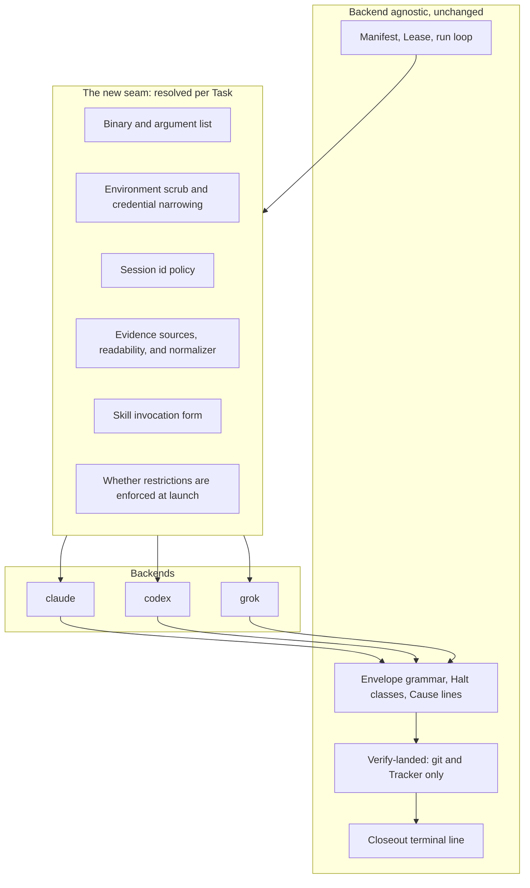
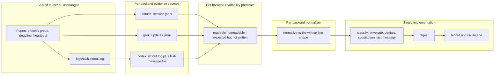
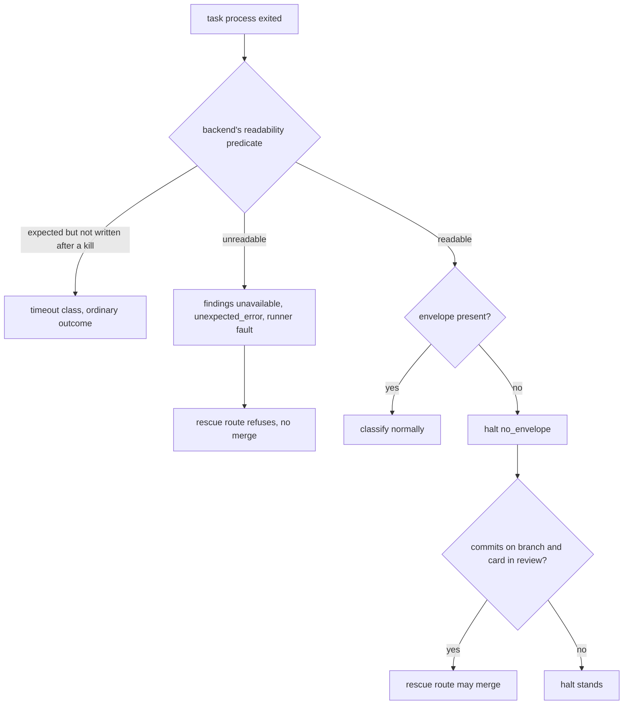
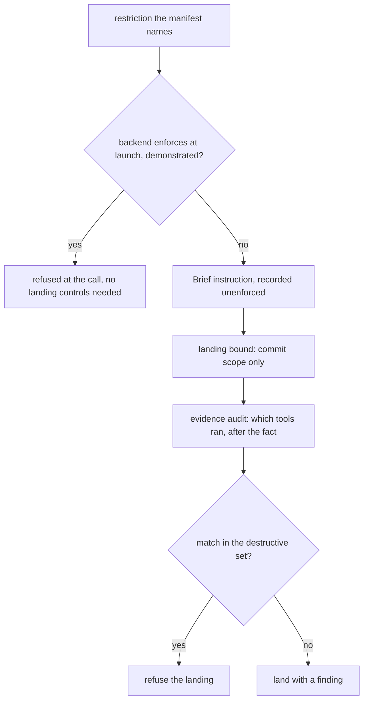

# Pluggable CLI Backends - Plan

> KTD numbers in this plan are local to this plan. Decisions from the outer-loop plan are cited by
> path, for example `docs/plans/2026-08-25-1346-feat-relay-outer-loop-plan.md` KTD6, the closed
> halt-class set.

## Goal Capsule

- **Objective:** An operator can spend a different account's budget on a Task that does not need the strongest model, and keep working when one vendor is unavailable, without giving up any of the rigor or the outcome vocabulary a Task gets today.
- **Means:** Resolve the CLI per Task at the launch seam, normalize each backend's evidence into the one shape the classifier already reads, and keep every outcome contract shared (KTD1, KTD2).
- **Product authority:** Relay's own `README.md` and `CONCEPTS.md`. This work adds a Task attribute and an evidence seam. It does not change what a Runner, Lease, Envelope, Halt class, or Verify-landed means.
- **Execution profile:** Backward-compatible by construction. A manifest with no backend key anywhere runs exactly as it does today. U1 is a spike whose findings every later unit depends on. **This plan spends real tokens on three vendor accounts: roughly nine full-pipeline runs in U1 and sixteen in U14, about twenty-five in total.** That is the honest floor, not an estimate of three.
- **Stop conditions:** Stop and report rather than proceeding when U1 finds any of these: the compound-engineering plugin does not install on a backend; it installs but one or more of the seven pipeline stages does not run there; a backend's only non-interactive mode is a bypass posture; or a backend claiming launch-time enforcement cannot demonstrate a refusal. Partial degradation is a stop condition in its own right, not a variant of total failure.
- **Tail ownership:** The caller owns commit, push, and PR. This plan does not land itself through Relay.
- **Open blockers:** None.

---

## Product Contract

**Product Contract preservation:** changed. R1 to R18 keep their meaning and IDs. R19 to R25 were added
during planning. R19, R21, R23, and R24 are plan-time additions, not consequences of a settled
decision, and each is labeled as such where it appears; an earlier draft folded the landing bound into
the text of settled decision 4, which misrepresented what the operator chose, and that text is restored
below. R20, R22, and R25 close holes the per-backend seam opens. `Governs` links are re-pointed to the
resulting IDs.

### Summary

A Task in a Relay manifest names its backend, one of `claude`, `codex`, or `grok`, and the Runner launches both that Task's Task process and its Closeout process on that CLI. Every backend runs the identical pipeline through the compound-engineering plugin installed natively on it. The `/relay` skill proposes a backend per Task from a written rubric and the operator overrides before the manifest is written.

### Problem Frame

Relay's value is the outer loop: the Manifest, the Lease, the Halt classes, Verify-landed. None of that is specific to one vendor's CLI, but every line of the launch path is. `build_args()` emits a fixed `claude` argv, `cli_version()` probes only `claude --version`, `find_transcript()` globs only `~/.claude/projects/`, and `child_env()` scrubs only `CLAUDECODE*` markers. The result is an outer loop with no vendor opinion sitting on a launcher that has nothing but.

That coupling has a cost the operator feels in two ways. Usage on one account bounds how much unattended work a day can hold, and there is no way to spend a different account's budget on the tasks that do not need the strongest model. And the judgment about which model suits which kind of work has nowhere to live, so it stays in the operator's head and is re-derived every time a manifest is written.

A third cost is only partly addressed here, and the boundary matters. When a vendor rate-limits or goes down, an operator can author the next run to avoid it. What this work does not do is rescue a run already in flight: a Task that halts still stops the queue behind it, including Tasks assigned to a healthy backend, until the operator resumes by hand. Moving work between backends mid-run is deferred, so the benefit is choosing the right backend before a run rather than surviving an outage during one.

The premise that made this look large was wrong. The compound-engineering plugin installs natively on Codex and on Grok Build, so a Task process on either can invoke `ce-plan`, `ce-work`, `ce-simplify`, `ce-code-review`, and `ce-compound` exactly as it does on Claude. What is missing is not a portable pipeline. It is a launch seam, an evidence reader that knows more than one shape, and somewhere to keep the routing knowledge.

### Key Decisions

- **Full pipeline parity across all three backends.** Every backend runs plan, work, simplify, review, gate, tracker write, and compound judgment. (session-settled: user-directed, chosen over a lighter single-prompt mode for non-Claude Tasks: the plugin already installs on all three, so a reduced pipeline would be a self-inflicted limitation.) Governs R3, R4.
- **Backend is a per-Task attribute.** A manifest may mix backends across its Tasks. (session-settled: user-approved, chosen over one backend per manifest: routing per tracker item is the point, and splitting a queue into per-backend manifests would defeat it.) Governs R1, R2.
- **The Closeout process runs on its Task's own backend.** (session-settled: user-directed, chosen over always running Closeout on Claude: the tracker write and the compound judgment belong where the work happened, and pinning them to one vendor would reintroduce the dependency this work removes.) Governs R5.
- **A backend that cannot enforce a restriction at launch carries it in the Brief and records it as unenforced.** (session-settled: user-approved, chosen over holding Codex until it gains launch-time denial: Verify-landed and the Lease were always the real guards, and a misbehaving process is caught the same way regardless of backend.) Governs R10, R19.
- **Routing is a rubric-guided recommendation made in `/relay` while the manifest is authored, never a runtime Runner decision.** (session-settled: user-approved, chosen over a static attribute-to-backend table and over runtime selection by the Runner: a rubric holds judgment a table cannot, and keeping the choice at authoring time leaves the Runner's decision surface unchanged.) Governs R14, R15, R16.
- **Backend readiness is verified, not asserted.** Binary presence, plugin presence, adapter compatibility, and a backend's claim to enforce restrictions at launch are all checkable, so each is demonstrated rather than declared. Governs R17, R18, R22, R25.
- **What a backend cannot refuse at launch is bounded at the landing and audited afterwards.** This is a plan-time addition, not part of the settled decision above: the operator settled on carrying the restriction in the Brief and recording it, and this adds two compensating controls on top. Governs R21, R24.

The seam this work introduces, and what stays on either side of it:

### Requirements

**Backend selection**

R1. A Task names the backend that runs it, from the closed set `claude`, `codex`, `grok`. A manifest may declare a default that every Task inherits unless it names its own.

R2. A manifest may name different backends on different Tasks, and the run loop treats a mixed manifest exactly as it treats a single-backend one.

**Pipeline parity**

R3. Every backend runs the same pipeline stages a Claude Task runs today: plan, work, simplify, review, the project gate, the tracker write, and the compound judgment. No backend receives a reduced pipeline. A backend on which any stage does not run is out of scope rather than partially supported.

R4. A Brief carries the same instructions for every backend. It differs only where a fact does not exist on that CLI, such as how a skill is invoked or which restriction flags the launch supports.

R5. The Closeout process for a Task runs on that Task's backend, with both of its duties intact.

**Launch seam**

R6. Launching a process resolves the binary, the argument list, and the environment treatment from the Task's backend, rather than from a fixed `claude` argv.

R7. The Runner records the observed CLI version of every backend a run used, and the version each backend was tested against.

R8. Where a backend accepts a runner-chosen session id, the Runner chooses it before launch. Where it does not, the Runner names the evidence file itself instead of discovering it afterwards.

R9. Evidence discovery resolves the sources that the Task's backend actually writes, and each backend decides what counts as readable evidence for it.

R10. A restriction the manifest names that a backend cannot enforce at launch is carried in that Task's Brief instead, and the run's record names which restrictions went unenforced.

R23. A Task process's environment carries only its own backend's credential variables, and every other backend's are removed from it. Each backend declares the variable names and prefixes that are its credentials, and the manifest may name more. This bound is environmental only: a credential a backend keeps in a file under the operator's home is not isolated by it, and R19's acceptance sentence covers that residual condition.

**Outcome contracts**

R11. The Envelope grammar, the Halt classes, the Cause lines, and the Closeout terminal line are identical across backends, so a Task's outcome reads the same regardless of which CLI produced it.

R12. Verify-landed continues to read git and the Tracker alone, so a landing verdict never depends on which backend did the work.

R13. Where a backend's evidence cannot be read or parsed, the Task still receives its landing verdict, and the findings that would have come from that evidence are recorded as unavailable rather than as none found.

R20. A Task whose evidence the Runner could not read does not land through the no-envelope rescue route. Unreadable evidence is a Runner fault, not the Task's silence.

**Bounding an unenforced backend** (plan-time additions)

R21. On a backend that cannot enforce the manifest's restrictions at launch, the Runner checks the Task's commit against the manifest's Task path bound before it merges, and refuses the merge when the commit falls outside it. The bound covers commit scope only. It does not observe which tools the Task invoked, and it is a different set from the Closeout's own path allowance.

R24. After such a Task's process exits, the Runner scans its normalized evidence for tool calls matching the manifest's disallow patterns, records each match as a finding naming the tool and its argument, and refuses the landing when a match falls in the named destructive set. This is detection after execution, not prevention: a matched call has already run.

**Routing recommendation**

R14. `/relay` proposes a backend for each Task from a written rubric and states a one-line reason for each proposal.

R15. The operator sees every proposal and can change any of them before the manifest is written. No Task reaches a manifest with a backend the operator did not see.

R16. The rubric is a durable artifact in the repository that an operator can read and edit, not judgment held only inside one conversation.

**Preflight**

R17. Every backend a manifest names must be installed and carry the compound-engineering plugin. This is checked before a run starts.

R18. A named backend that is absent, or present without the plugin, refuses the run before any Task launches, naming the backend and which of the two conditions failed.

R19. When any Task names a backend that cannot enforce the manifest's tool restrictions at launch, the manifest must carry the operator's own sentence accepting that condition, and validation refuses without it. The authoring skill asks for this sentence and writes only what the operator supplies.

R22. A backend and Tracker adapter combination whose Closeout cannot perform its tracker write is refused before a run starts, naming the pair.

R25. A backend is recorded as enforcing restrictions at launch only when it has demonstrated a refusal of a denied tool. A backend that cannot demonstrate one is recorded as not enforcing, which routes it through R19, R21, and R24.

### Key Flows

- F1. Authoring a manifest across backends
  - **Trigger:** The operator asks `/relay` to build a manifest from a list of tracker items.
  - **Steps:** The skill reads each item, applies the rubric, and proposes a backend with a one-line reason. The operator accepts or changes each. Where a chosen backend does not enforce restrictions at launch, the skill states the condition and asks the operator to write the acceptance sentence, recording only what they wrote. Validation checks every named backend for the binary, the plugin, adapter compatibility, the acceptance sentence, and the Task path bound. The skill writes the manifest and validates it.
  - **Outcome:** A manifest whose every Task carries a backend the operator saw, on a machine where each of those backends can run.
  - **Covered by:** R1, R2, R14, R15, R17, R18, R19, R22

- F2. One Task on a non-Claude backend
  - **Trigger:** The run loop reaches a Task whose backend is `codex` or `grok`.
  - **Steps:** The Runner renders the Brief for that backend, resolves the binary and arguments, narrows the environment to that backend's own credentials, and launches the Task process bounded as any other. It normalizes that backend's evidence, applies that backend's readability rule, and classifies the exit; evidence it could not read routes to a Runner fault rather than to the Task's silence. It runs Verify-landed from git and the Tracker. On an unenforced backend it checks the Task commit against the Task path bound and audits the evidence for disallowed calls before merging. It launches the Closeout process on the same backend and reads the terminal line.
  - **Outcome:** A Task record indistinguishable in vocabulary from a Claude Task's, carrying the backend that produced it.
  - **Covered by:** R3, R4, R5, R6, R8, R9, R11, R12, R13, R20, R21, R23, R24

### Acceptance Examples

- AE1. Missing plugin refuses before launch
  - **Covers R17, R18.**
  - **Given:** A manifest names `codex` on one Task, and `codex` is installed but the compound-engineering plugin is not.
  - **When:** The operator starts the run.
  - **Then:** The run refuses before launching any Task, and says that `codex` is installed without the plugin. No Task process starts, including the Claude ones.

- AE2. A commit outside the Task path bound is refused, without losing the branch
  - **Covers R10, R19, R21.**
  - **Given:** A manifest names a disallow list, a Task on `codex`, the operator's acceptance sentence, and a Task path bound narrower than the repository.
  - **When:** That Task's commit touches a path outside the bound.
  - **Then:** The Brief carried the restriction as an instruction, the record names it unenforced at launch, the Runner refuses the merge, and the Task's branch is left intact for the operator rather than reset.

- AE3. Unreadable evidence yields a verdict and never a rescue merge
  - **Covers R13, R20.**
  - **Given:** A Task on `grok` whose evidence cannot be located or parsed, with commits on its branch and its card in the in-review status.
  - **When:** The Runner decides the Task's outcome.
  - **Then:** Verify-landed produces the landing verdict from git and the Tracker as usual, the transcript-derived findings are recorded as unavailable rather than none found, and the no-envelope rescue route does not merge the branch.

- AE4. A non-Claude Closeout ends on the same contract
  - **Covers R5, R11.**
  - **Given:** A Task on `grok` that landed.
  - **When:** The Closeout process runs.
  - **Then:** It runs on `grok`, invokes the compound judgment in the form `grok` recognizes, writes the outcome to the Tracker, and ends with the same terminal line a Claude Closeout ends with.

- AE5. The operator's override wins
  - **Covers R14, R15.**
  - **Given:** The rubric proposes `codex` for a Task and states its reason.
  - **When:** The operator changes it to `claude`.
  - **Then:** The manifest carries `claude` for that Task, and nothing re-applies the rubric to it afterwards.

- AE6. An unsupported pair is refused by name
  - **Covers R22.**
  - **Given:** A manifest whose adapter is `jira` and one of whose Tasks names `codex`.
  - **When:** The manifest is validated.
  - **Then:** Validation refuses and names the `jira` and `codex` pair, before any Task launches.

- AE7. A disallowed call on an unenforced backend is caught after the fact
  - **Covers R24.**
  - **Given:** A Task on `codex` whose evidence shows a call matching a manifest disallow pattern.
  - **When:** The Runner classifies the exit.
  - **Then:** A finding names the tool and its argument, the Task still lands when the pattern is outside the destructive set, and the landing is refused when it is inside it. The same Task on `claude` produces a launch-time denial instead, and no audit finding.

- AE8. An undemonstrated enforcement claim downgrades the backend
  - **Covers R25.**
  - **Given:** A backend whose flags suggest launch-time denial, and a spike run in which a denied tool was invoked and not refused.
  - **When:** U1 records that backend's capabilities.
  - **Then:** The backend is recorded as not enforcing at launch, and every Task on it requires the acceptance sentence, the path bound, and the evidence audit.

### Success Criteria

- One Task lands end to end on each of the three backends against a throwaway target repository, using the real CLIs rather than the stub, and all seven pipeline stages are observed to run on each.
- Three records produced by running the same trivial Task once per backend are equal on status, halt class, Envelope status, presence of a landing reference, presence of a tracker reference, and Closeout result, and differ only on session id, evidence path, timings, tool-call count, and backend.
- One mixed manifest, naming at least two backends across its Tasks, completes live, and its run summary reads in the same vocabulary as a single-backend one.
- The routing rubric survives contact with its first real manifest: after authoring one, the operator either kept its proposals or recorded why they changed, so the rubric's first correction is captured rather than lost.

**Not measured by this plan, and deliberately.** Nothing here demonstrates that routing reduced spend or improved outcomes. That needs a cross-run ledger this plan defers, so the cost and fit motivations remain judged by the operator's own observation until one exists.

### Scope Boundaries

**Deferred for later**

- Runtime routing: the Runner choosing or changing a Task's backend during a run, or reacting to a rate limit or an outage by moving work. A halt still stops the queue behind it.
- A cross-run ledger, and a rubric informed by past backend outcomes.
- Per-backend timeout defaults and cost accounting.

**Outside this work**

- Mixed-backend handoff inside one Task. A Task has one backend for its whole life, including its Closeout.
- A per-backend Halt class set. The closed set holds and backends produce findings instead.
- The `pr_terminal` shipping mode, which stays named in the schema and refused by validation. Its Brief template is still rendered under test, so it is in the diff even though the mode is refused.
- Relay reimplementing the compound-engineering pipeline for a backend that lacks the plugin. The natively installed plugin is the entire premise.
- The `/relay` skill itself running anywhere but Claude Code. Only the launched processes vary.

### Dependencies and Assumptions

- The compound-engineering plugin installs natively on both alternates through their own plugin systems. Neither install exists on this machine yet, so U1 performs both by hand. U1 also records how each CLI reports an installed plugin's version, since R17's floor check needs a query that exists.
- Observed on this machine: `codex-cli 0.149.0` at `/opt/homebrew/bin/codex`, `grok 1.0.5` at `~/.grok/bin/grok`, `claude 2.1.250`. Note that `contracts.CLI_VERSION_TESTED` currently pins `2.1.245`, so Claude has already drifted. `~/.grok/bin` must be on the Runner's `PATH` or a Grok Task refuses at preflight.
- Grok Build's headless flags mirror Claude Code's closely: `-p/--single`, `-s/--session-id` (runner-chosen UUID for a new conversation), `-m/--model`, `--effort`, `--permission-mode` with the same `dontAsk` and `bypassPermissions` vocabulary, `--allow`/`--deny` accepting Claude-style `Bash(...)` rules, and `--output-format streaming-json`. Sessions persist under `~/.grok/sessions/<url-encoded-cwd>/<session-id>/` with `updates.jsonl` as the authoritative log. Whether a `--deny` rule is actually refused, and whether an unrecognized rule spelling is rejected or silently accepted, is demonstrated in U1 under R25 rather than inferred from the flag list.
- Codex `exec` runs non-interactively with `--sandbox workspace-write` as its non-bypass posture, assigns its own session id, and offers `--output-last-message <file>` and `--json`. It has no per-tool deny flag. Two of its sandbox settings are bypass postures, `danger-full-access` and `--dangerously-bypass-approvals-and-sandbox`, and both are forbidden.
- All three CLIs share the operator's home directory and keep credentials in files there, `~/.codex/auth.json` and `~/.grok/auth.json` among them. R23's environment scrub does not reach those, and neither does Codex's write sandbox, which bounds writes rather than reads. U1 records each backend's credential storage so the boundary rests on observation.
- Neither alternate writes state into a working tree, so the dirty-tree risk from CLI droppings is assumed absent and confirmed in U1.

### Outstanding Questions

**Deferred to Planning: all resolved.**

**Deferred to implementation, resolved by U1's spike**

- The exact skill invocation form on Grok. Codex is `$ce-plan`; Claude is the `compound-engineering:` prefix.
- Whether Grok's `--allow` rule vocabulary accepts a bare `Skill` entry, which `closeout.BASE_TOOLS` includes and Grok's documented prefix list does not name. U1 asserts this specifically rather than discovering it incidentally.
- The event shape each alternate emits on stdout, which fixes the normalizers in U6.
- Whether `codex exec` accepts a Brief-length prompt as a positional argument, given the launcher passes a closed stdin unconditionally.
- Whether Grok's `updates.jsonl` is flushed on process exit, since the Claude equivalent tolerates a missing predicted path by globbing.

---

## Planning Contract

### Key Technical Decisions

KTD1. **The backend seam is a set of primitives plus a capability record, not a workflow object.** Mirror the enforcement shape of `skills/relay/scripts/relay/adapters/__init__.py`: a frozen `INTERFACE` tuple, a `build()` dispatch by name with local imports inside each branch, `ConfigurationError` raised at construction so validation names the problem before a run, and one shared test asserting each backend's public surface is exactly the interface. Do not adopt its scope. Launching, bounding, killing the process group, heartbeating the lease, merging, pushing, and verifying stay in the shared run loop. Rationale: the three coupled invariants in `docs/solutions/logic-errors/process-group-kill-resolves-target-lazily.md` are load-bearing and would have to be re-asserted per backend the moment a backend supplied its own `Popen` or teardown, and the suite would stay green if one were dropped. Chosen over the lighter alternative of a plain dict keyed by backend name, the shape `brief.TEMPLATES` uses for Shipping modes: a backend carries behavior, not only a value, and the shared surface test is what stops one backend from quietly growing a method the others lack. Governs R6.

KTD2. **One classifier, three normalizers, against a written line shape.** Each backend turns its own evidence into one internal line shape that U6 writes down field by field, including which fields a normalizer may leave absent and which are Claude artifacts an alternate must synthesize or declare undetectable. The Envelope parser, the denial join, the `last_message` and `last_message_tail` split, and the skill-substitution check stay single-implementation. `tail.decode` gets the same treatment. Rationale: three parsers put one contract in three places, which is the shape `docs/solutions/logic-errors/cause-line-contract-split-degraded-to-placeholders.md` documents degrading into six wrong lines out of sixteen. Writing the shape down matters because Claude's normalizer is otherwise an identity function, so the one backend with real fixtures would never exercise the seam the other two depend on. Governs R9, R11.

KTD3. **Brief templates are not forked per backend.** Keep one template per Shipping mode and render per-backend inserts through the existing `values()` substitution: the skill invocation form and the unenforced-restriction instruction. Rationale: the templates carry Relay's outcome contract, and forking triples the surface on which that contract can drift. This reverses the speculation in issue 16 that each backend needs its own templates. If U1 proves a backend cannot follow the shared template, that reopens this decision as a finding rather than an assumption. Governs R4.

KTD4. **Codex needs no session-id recovery, and readability is a per-backend predicate.** `codex exec --output-last-message <file>` writes the final agent message, where the Envelope and the Closeout terminal line live, and `--json` puts the event stream on stdout, which the launcher already captures. Both Codex evidence sources are named by the Runner before launch, so the outer-loop plan's KTD7 invariant is satisfied by different means rather than inverted. Because the launcher creates the stdout log itself, that log always exists and always opens: readability therefore cannot be a file-open test. Each backend declares its own predicate, and evidence has three states rather than two, readable, unreadable, and expected-but-not-written. A Codex run counts as readable only when the last-message file exists and the normalizer decoded at least one event. A killed process that never wrote its last-message file is the timeout class, not a Runner fault. Governs R8, R9, R13.

KTD5. **Evidence that could not be read is a Runner fault, never the Task's silence.** Unreadable evidence stops falling through to `no_envelope` and routes to `unexpected_error`, whose documented remedy already says the fault is in the runner or the manifest rather than the task. It must also stop satisfying the rescue route in `run._routable()`. Rationale: today an unreadable transcript is recorded as "the process ran and printed no envelope, with no findings", and with commits on the branch and the card in the in-review status the rescue route merges anyway. That is a latent defect for Claude and would be the routine path on any backend whose evidence went missing. Governs R13, R20.

KTD6. **Per-backend permission posture, with every forbidden spelling named.** The forbidden mode is a tuple per backend, not a scalar. Claude and Grok use `--permission-mode dontAsk` and forbid `bypassPermissions`. Codex uses `--sandbox workspace-write` and forbids both `--dangerously-bypass-approvals-and-sandbox` and `--sandbox danger-full-access`. Rationale: the existing refusal of a bypass posture is a safety floor, and a spelling the refusal does not know is a spelling that reaches the argv. `contracts.DISALLOWED_TOOLS` already carries eleven entries for five operations for exactly this reason. Governs R6, R10.

KTD7. **What a backend cannot refuse at launch is bounded at the landing and audited afterwards, and neither control substitutes for the other.** The landing bound diffs the Task commit against a Task path bound and refuses the merge when it falls outside; it observes commit scope only and cannot see which tools ran. The audit scans the normalized evidence for disallowed calls after the process exits; it is detection, not prevention, since a matched call has already executed. Together they cover scope and visibility, not enforcement. **The reusable pieces are `gitwrite.path_allowed()` applied to `gitread.diff_name_only()` inside a new non-destructive helper. `gitwrite.closeout_scope_check()` itself is not reused: its failure path calls `reset_hard()`, which would destroy the Task branch this bound is meant to preserve.** This is a plan-time addition on top of the settled decision, which committed only to carrying the restriction in the Brief and recording it unenforced. Governs R21, R24.

KTD8. **The version pin and the version probe become per-backend maps.** `CLI_VERSION_TESTED` becomes one entry per backend, and the terminal record carries one observed entry per backend the run actually used. Each backend supplies its own version parsing. Rationale: verified directly, both alternates lead their `--version` output with a name token, so the current leading-digit token regex returns `None` for each and the drift signal would be permanently blank. The probe keeps its fail-closed contract from `docs/solutions/logic-errors/version-probe-between-lease-acquire-and-try-finally-must-never-raise.md`, including `ValueError` in the except tuple. Governs R7.

KTD9. **Backend readiness is checked inside `manifest.validate()` under its existing environment-probing flag, reading the capability record.** Not in skill prose, and not through `launch.cli_version`, which fails closed to `None` by contract and runs after the lease is taken. The probe reads each backend's binary name and plugin-detection rule from the capability record rather than hard-coding a second per-backend table inside `manifest.py`, which is why U3 depends on U4. Governs R17, R18, R25.

KTD10. **A backend and adapter pair whose Closeout cannot write is refused, mirroring the named-but-refused precedent.** The `jira` adapter's Closeout tools are `mcp__atlassian__*` names registered in a Claude MCP configuration, so `jira` with `codex` or `grok` cannot perform duty one. Refuse the pair in validation the way `pr_terminal` is refused, and refuse it outside the environment-probing flag so a schema-only validation still catches it. The `github` and `markdown` adapters use `("Bash",)` and port unchanged. Governs R22.

KTD11. **The manifest-level backend default flows through the existing `defaults_applied` reporting.** A defaulted backend is reported by `validate`, never silent. Rationale: the outer-loop plan's KTD11 already established that nothing is defaulted silently, and the current `pick()` helper is keyed by table rather than by array element, so this needs a small extension rather than a new mechanism. Governs R1.

KTD12. **The routing rubric is a file under `skills/relay/references/` that `SKILL.md` points at.** When a Task's backend differs from the manifest default, the manifest carries a reason string, mirroring the existing rule that an excluded Task carries a reason. (session-settled: user-approved, chosen over a static attribute-to-backend table and over runtime selection by the Runner: a rubric holds judgment a table cannot, and keeping the choice at authoring time leaves the Runner's decision surface unchanged.) Governs R14, R15, R16.

KTD13. **The Task path bound is a new manifest field, defaulting to the whole repository.** Add `task_allowed_paths` under `[permissions]`, using the same directory-prefix grammar `gitwrite.path_allowed()` already implements. Unset means the whole repository, which makes the bound opt-in and a refusal meaningful only where an operator narrowed it. Validation requires it to be set whenever a Task names a backend that does not enforce at launch, alongside the acceptance sentence. Rationale: R21 previously read "the manifest's allowed paths", which is not a Task-level concept; the only existing path list resolves to the documentation root and would refuse every code Task's merge. Governs R21.

KTD14. **The destructive set is a named subset of the existing disallow patterns, defined in `contracts.py`.** It names the operations whose occurrence must stop a landing rather than only annotate it: force push, hard reset, and recursive delete. It sits beside `DISALLOWED_TOOLS` and is pinned by a test naming one member and one non-member, so the boundary is fixed by test rather than by judgment at implementation time. Governs R24.

KTD15. **The skill invocation form is backend-resolved at every site that builds one.** There are four, not one: `brief._qualified()`, `closeout.compound_command()`, the `compound_skill` value `closeout.render()` supplies to the Closeout template, and `classify.required_skill_for()` for substitution detection. Rationale: an earlier draft asserted `brief.py` was the only site. It is not, and leaving the other three would hand a Codex Closeout a `compound-engineering:` invocation it does not recognize, failing the compound judgment on every non-Claude Task. Governs R4, R5.

### High-Level Technical Design

**Evidence flow.** The change is to Relay's evidence supply, not to its process launcher. One classifier consumes normalized lines from whichever sources that backend writes, through that backend's readability predicate.

**The routing fix.** Today an unreadable transcript and a silent process are the same state, and the rescue route merges on it.

**Bounding an unenforced backend.** Three controls, each covering something the others do not.

**Per-backend launch facts.** These are the values the capability record carries. U1 confirms each against the installed CLI before any of it is written down as a pin.

| Fact | claude | codex | grok |
|---|---|---|---|
| Non-interactive invocation | `claude -p` | `codex exec` | `grok -p` |
| Session id | runner-chosen `--session-id` | assigned by the CLI, not needed (KTD4) | runner-chosen `-s` |
| Structured output | `--output-format stream-json --verbose` | `--json` | `--output-format streaming-json` |
| Final message | from the transcript | `--output-last-message <file>` | from the transcript |
| Permission posture | `--permission-mode dontAsk` | `--sandbox workspace-write` | `--permission-mode dontAsk` |
| Forbidden spellings | `bypassPermissions` | `--dangerously-bypass-approvals-and-sandbox`, `danger-full-access` | `bypassPermissions` |
| Tool allow and deny | `--allowedTools` / `--disallowedTools` | none | `--allow` / `--deny` |
| Enforces at launch | demonstrated in U1 | no | demonstrated in U1 |
| Evidence sources | session jsonl | stdout log plus last-message file | `updates.jsonl` |
| Readable when | transcript parses | last-message file exists and one event decoded | log parses |
| Skill invocation | `compound-engineering:<name>` | `$<name>` | confirmed in U1 |
| Credential variables and files | confirmed in U1 | confirmed in U1 | confirmed in U1 |

### Assumptions

- **The run-level environment and the per-Task environment are narrowed differently, and both are mandatory.** `child_env` is built once per run at `run.py:121` before any Task is in scope, and that same environment is what the git operations, the Tracker adapters, and the version probes use, so it keeps every backend's credentials and scrubs the union of all backends' nesting markers. `launch.launch` then narrows the child's copy to the launching Task's own backend credentials. The per-Task narrowing is what satisfies R23 and is not optional; a run-level scrub alone can only be all-or-nothing, which either strips the running Task's own credentials or isolates nothing.
- Adding a digest key is cheap: `tests/test_contracts.py` derives reader keys by grepping the runner source, so a new key passes once `classify` sets it and it is in the pinned set.
- `state.upsert` keeps unknown keys deliberately, so `RECORD_FIELDS` is for reader safety rather than enforcement. Adding fields there is additive, but U11 also changes the type of two existing terminal-record fields, which is a migration rather than an addition.

### Sequencing

U1 is a spike and everything depends on it. **U7 depends on nothing but U1 and lands first among the code units**, because it fixes a defect that exists today on Claude alone and must not be stranded behind work a stop condition might abandon. U2 is the schema. U4 builds the capability record and U3's readiness probe reads it, so U4 precedes U3. U5 and U6 are the seam proper. U8 and U9 depend on U6's normalizers. U10 through U13 close the loop. U14 is last and is not optional.

---

## Implementation Units

| U-ID | Title | Files touched | Depends on |
|---|---|---|---|
| U1 | Backend spike, install, and pins | `tests/fixtures/`, `contracts.py` | none |
| U7 | Unreadable evidence is a Runner fault | `classify.py`, `run.py`, `contracts.py` | U1 |
| U2 | Backend on the Task, path bound, and validation | `manifest.py`, `docs/examples/` | U1 |
| U4 | Backend package and capability record | `backends/` | U1, U2 |
| U3 | Backend readiness preflight | `manifest.py`, `cli.py`, `backends/` | U2, U4 |
| U5 | Launch seam per backend | `launch.py`, `run.py`, `contracts.py` | U4 |
| U6 | Evidence line shape and normalizers | `classify.py`, `tail.py`, `backends/` | U4, U5, U7 |
| U8 | Permission posture and skill form | `contracts.py`, `brief.py`, `closeout.py`, `classify.py`, templates | U4, U6 |
| U9 | Closeout on the Task's backend | `closeout.py`, `run.py` | U5, U8 |
| U10 | Unenforced restrictions: record, bound, audit | `run.py`, `classify.py`, `gitwrite.py`, `manifest.py`, `contracts.py` | U6, U9 |
| U11 | Record and summary shape | `state.py`, `summary.py`, `contracts.py` | U5, U9 |
| U12 | Test stubs for codex and grok | `tests/stub-claude/`, `tests/` | U5, U6 |
| U13 | Rubric, skill, and docs | `SKILL.md`, `references/`, `README.md`, `CONCEPTS.md` | U2, U3, U10 |
| U14 | Live proof runs and parity | none, produces evidence | all |

### U1. Backend spike, install, and pins

**Goal:** Establish, by running each CLI, every fact the rest of the plan pins. Nothing below is written down as a constant until this unit observed it.

**Requirements:** R17, R25, and the evidence facts behind R8, R9, R4, R23.

**Dependencies:** none.

**Files:** `tests/fixtures/backends/` (new, captured artifacts), `skills/relay/scripts/relay/contracts.py`.

**Approach:**

1. Install the compound-engineering plugin on both alternates. Codex already has the marketplace registered, so `codex plugin add compound-engineering@compound-engineering-plugin`. Grok tracks the repo directly with `grok plugin install EveryInc/compound-engineering-plugin`.
2. **Run one task per backend that exercises all seven pipeline stages**, not one skill: plan, work, simplify, review, the project gate, the tracker write, and the compound judgment. Record which stages ran. A backend where any stage does not run triggers the Goal Capsule stop condition (R3).
3. Record per backend: the working headless argv; the structured stdout shape; the evidence locations and what readable means for that backend; whether the session id is runner-choosable; the plugin version **and the command that reports it**; the skill invocation form; **the credential environment variable names and prefixes, and whether the CLI authenticates from a file instead**; the nesting-marker variable names; and whether anything is written into the working tree.
4. **Demonstrate enforcement rather than assuming it (R25).** For each backend whose flags suggest launch-time denial, run a task whose Brief instructs it to invoke a denied tool, and capture the refusal verbatim. Also try an unrecognized rule spelling and record whether it is rejected or silently accepted. A backend that cannot produce a refusal is recorded as not enforcing.
5. Write the confirmed values into `contracts.py` as pins for U4 to read into the capability record.

**Execution note:** This is discovery, not construction. Capture artifacts verbatim into fixtures rather than paraphrasing them; the fixtures are what U6 and U12 are tested against, and a paraphrased fixture reproduces the defect class this repo already paid for. Expect roughly three runs per backend, about nine in total, spending real tokens on three accounts.

**Test scenarios:**
- Each captured fixture parses as the format its backend documents, checked by reading it, not by a normalizer that does not exist yet.
- The plugin version reported by each CLI is recorded, is at or above the pinned floor, and the command that reported it is recorded too.
- For each backend claiming enforcement, a captured refusal exists; where none exists, the recorded capability says it does not enforce.

**Verification:** Six artifact shapes exist per backend under `tests/fixtures/backends/`: a session transcript, a stdout stream, a final message carrying an Envelope, a blocked Envelope with prose blockers, a Closeout message whose terminal line sits past the 200 character head, and, for a backend claiming enforcement, a captured refusal. All seven pipeline stages are observed on each backend. A spike that cannot produce these for a backend has found a blocker, and the Goal Capsule's stop condition applies.

### U7. Unreadable evidence is a Runner fault

**Goal:** A Task whose evidence the Runner could not read is never reported as a silent Task, and never merges through the rescue route.

**Requirements:** R13, R20. Enforces AE3. Cites KTD5.

**Dependencies:** U1. This unit lands first among the code units and depends on no backend work, because the defect it fixes exists today on Claude alone.

**Files:** `skills/relay/scripts/relay/classify.py`, `skills/relay/scripts/relay/run.py`, `skills/relay/scripts/relay/contracts.py`, `tests/test_classify.py`, `tests/test_run.py`.

**Approach:**

1. Stop conflating an absent evidence source with an empty one. When the source could not be read, do not assign the no-envelope class and do not append its finding; assign the runner-fault class instead.
2. Record the transcript-derived findings as unavailable rather than as an empty list, so a reader can tell "we looked and found none" from "we could not look".
3. Check that unavailable state in the rescue route as well, not only in the summary.
4. Keep the halt-class set closed. This routes to an existing class and adds a finding, per the outer-loop plan's KTD6.

**Execution note:** Prove every scenario below on Claude alone, before any backend abstraction exists. That is what makes this unit independently valuable if a stop condition later drops a backend.

**Test scenarios:**
- A Claude run whose transcript file is deleted before classification yields the runner-fault class, not the no-envelope class.
- The same run's findings are marked unavailable rather than reported as none.
- A run with unreadable evidence, commits on its branch, and its card in the in-review status does not merge.
- A run with readable evidence, no Envelope, commits on its branch, and its card in review still merges, so the rescue route is narrowed rather than removed.
- The digest carries the unavailable marker and the pinned key set still matches.

**Verification:** `python3 -m unittest test_classify test_run` passes, and the rescue-route test proves both the refuse and the still-merges cases.

### U2. Backend on the Task, path bound, and validation

**Goal:** A Task carries a backend, a manifest may default it, the Task path bound exists, and invalid values are refused.

**Requirements:** R1, R2, R21. Realizes the manifest half of F1. Cites KTD11, KTD13.

**Dependencies:** U1.

**Files:** `skills/relay/scripts/relay/manifest.py`, `docs/examples/manifest-github-projects.toml`, `docs/examples/manifest-jira-local-merge.toml`, `docs/examples/manifest-markdown.toml`, `tests/test_manifest.py`, `tests/fixtures/manifests/complete.toml`.

**Approach:**

1. Add `BACKENDS = ("claude", "codex", "grok")` beside the existing `ADAPTERS` tuple, and a `backend` field on the `Task` dataclass.
2. Add a `[defaults]` table carrying `backend`, resolved through the existing default machinery so the applied default is reported rather than silent (KTD11). Absence of the table and of every per-Task key means `claude`.
3. **Add `task_allowed_paths` under `[permissions]` (KTD13),** using `gitwrite.path_allowed()`'s directory-prefix grammar. Unset means the whole repository. This is a different field from `[closeout] allowed_paths` and the two must not be conflated.
4. Validate the backend enum inside the existing per-Task loop, beside the check that `id`, `model`, and `effort` are non-empty.
5. Update the three example manifests: leave two on the default and give one a mixed pair, so the examples carry the shape.

**Patterns to follow:** the `ADAPTERS` enum check and its "must be one of" message; the existing table-keyed default helper, extended minimally to reach an array element.

**Test scenarios:**
- A manifest with no backend key anywhere loads with every Task on `claude` and runs unchanged.
- A `[defaults] backend` value is inherited by a Task that names none, and the default is reported as applied.
- A per-Task backend overrides the default.
- An unrecognized backend is refused with a message naming the valid set.
- An empty-string backend is refused rather than silently defaulted.
- `task_allowed_paths` unset resolves to the whole repository; set, it resolves to the named prefixes; and it is never confused with the Closeout's own list.
- Every file under `docs/examples/` still validates against a temporary repository.

**Verification:** `python3 -m unittest test_manifest test_examples` passes from `tests/`, and a pre-change manifest loads with identical behavior.

### U4. Backend package and capability record

**Goal:** One place that answers, per backend, every question the seam asks.

**Requirements:** R6. Cites KTD1.

**Dependencies:** U1, U2.

**Files:** `skills/relay/scripts/relay/backends/__init__.py`, `backends/claude.py`, `backends/codex.py`, `backends/grok.py` (all new), `tests/test_backends.py` (new).

**Approach:**

1. Mirror the adapter package's enforcement shape: a module docstring naming the contract, a frozen `INTERFACE` tuple, a `build(name)` dispatch with local imports per branch, and `ConfigurationError` on an unknown name.
2. Keep the function surface to the primitives only: argument list, environment treatment, version probe and parse, evidence sources, readability predicate, transcript normalizer, stream normalizer, and skill invocation form.
3. Put pure data in a capability record: whether the backend enforces restrictions at launch (as demonstrated in U1, per R25), its permission flags, **its tuple of forbidden spellings**, its tested version, its plugin floor, **its plugin-detection command**, and **its credential variable names, credential prefixes, and nesting-marker names**.
4. Add one shared test asserting each backend's public surface is exactly the interface.

**Patterns to follow:** `adapters/__init__.py`'s `INTERFACE` tuple, `build()` if-chain with local imports, and the shared surface test in `tests/test_adapters.py`.

**Test scenarios:**
- Each backend module's public surface is exactly the interface tuple, no more and no fewer names.
- `build()` returns the right module for each valid name and raises the configuration error on an unknown one.
- Building a backend performs no subprocess call and touches no filesystem, so a machine missing two CLIs can still build the third.
- Every capability record carries every declared field with a non-placeholder value, including a non-empty credential list and a non-empty forbidden-spelling tuple.

**Verification:** `python3 -m unittest test_backends` passes, and the surface test fails when a method is added to one backend and not the others.

### U3. Backend readiness preflight

**Goal:** A run refuses before launching anything when a named backend is unusable.

**Requirements:** R17, R18, R22, R25. Realizes the readiness step of F1. Enforces AE1, AE6, AE8. Cites KTD9, KTD10.

**Dependencies:** U2, U4. It reads the capability record rather than hard-coding a second per-backend table.

**Files:** `skills/relay/scripts/relay/manifest.py`, `skills/relay/scripts/relay/cli.py`, `skills/relay/scripts/relay/backends/`, `tests/test_manifest.py`, `tests/test_cli.py`.

**Approach:**

1. Add a readiness probe to `validate` under the same flag that already gates its repository reads, so a pure schema check stays offline.
2. Per distinct backend named in the manifest, read the binary name and the plugin-detection command from the capability record, check the binary is on `PATH` and the plugin is installed at or above the pinned floor, and report which of the two failed.
3. Refuse a `jira` adapter paired with any backend whose Closeout tools are unavailable on it, naming the pair. **Place this refusal outside the environment-probing flag** so a schema-only validation still catches it (KTD10, AE6).
4. Surface results through the existing validate output so the authoring skill can read them.

**Approach note:** do not use the version probe as the gate. It fails closed to `None` by contract and runs after the lease is taken.

**Test scenarios:**
- A manifest naming a backend whose binary is absent is refused, and the message names the backend and says the binary is missing.
- A manifest naming a backend whose binary is present but plugin is absent is refused, and the message distinguishes that case from the missing binary.
- A `jira` manifest with a `codex` Task is refused naming the pair, **with the environment-probing flag off**; the same manifest with all Tasks on `claude` validates.
- A `github` manifest with a `codex` Task validates.
- Schema-only validation performs no binary or plugin probe and refuses nothing on a machine missing a backend.
- A backend recorded as not enforcing at launch causes validation to require the acceptance sentence and the Task path bound.

**Verification:** `validate` refuses with a distinct message for each failure shape, and `run` never reaches a launch when it does.

### U5. Launch seam per backend

**Goal:** The launcher builds the right command for the Task's backend, narrows its environment correctly, and leaves the bounding machinery untouched.

**Requirements:** R6, R7, R8, R23. Cites KTD1, KTD6, KTD8.

**Dependencies:** U4.

**Files:** `skills/relay/scripts/relay/launch.py`, `skills/relay/scripts/relay/run.py`, `skills/relay/scripts/relay/contracts.py`, `tests/test_launch.py`.

**Approach:**

1. `build_args` already receives the Task, so it derives the backend without a new parameter. Delegate the argument list to the backend and keep the manifest-resolved allow and deny lists flowing into whichever flags that backend supports, or into none.
2. `find_transcript` grows a backend parameter and returns that backend's evidence sources. Both call sites are inside `launch()`, which already has the Task in scope. Session-id policy comes from the capability record (R8).
3. `cli_version` becomes per-backend, keeping its fail-closed contract and its `ValueError` clause, and gains per-backend version parsing. `run.py` probes once per distinct backend in the manifest rather than once per run.
4. **Split the two environment treatments.** `child_env` gains an optional backend argument. `run.py:121` passes none, so the run-level environment keeps every credential for the git operations, the adapters, and the probes, and scrubs the union of every backend's nesting markers. `launch.launch` passes the Task's backend, so the child's copy keeps only that backend's credential variables and prefixes and drops the others (R23). Unknown bare names are not scrubbed; the manifest is where an operator adds one.
5. Refuse every forbidden spelling in the backend's tuple, not one per backend (KTD6).
6. Do not let a backend supply its own `Popen`, its own teardown, or its own deadline. The process group capture, the unconditional deadline, and the reader-join-before-close ordering stay exactly where they are.

**Execution note:** the three process-group invariants are the reason this unit constrains what a backend may supply. Re-read `docs/solutions/logic-errors/process-group-kill-resolves-target-lazily.md` before touching `launch()`, and keep the existing orphan-survival test green.

**Test scenarios:**
- The argument list for each backend starts with that backend's binary and carries that backend's own flag set.
- A Task on a backend without a deny flag produces an argument list containing no deny flag and does not crash resolving the manifest's disallow list.
- The version probe returns a parsed version for each of the three real version output shapes, including both alternates' name-leading output.
- The version probe returns `None` rather than raising for a missing binary, a nonzero exit, a timeout, and non-UTF-8 output.
- The run-level environment carries every backend's credentials and no backend's nesting markers.
- A Codex Task's child environment carries Codex credentials and neither Claude's nor Grok's, and the same in each direction.
- A manifest naming any forbidden spelling is refused, for every spelling in every backend's tuple.
- A timeout kills the whole process group with no surviving grandchild, for each backend stub.

**Verification:** `python3 -m unittest test_launch` passes, including the existing orphan test, and the per-backend argument assertions replace the single flat flag tuple.

### U6. Evidence line shape and normalizers

**Goal:** Each backend's evidence becomes one written line shape the classifier and the Follower both read.

**Requirements:** R9, R11, R13. Cites KTD2, KTD4.

**Dependencies:** U4, U5, U7.

**Files:** `skills/relay/scripts/relay/classify.py`, `skills/relay/scripts/relay/tail.py`, `backends/*.py`, `tests/test_classify.py`, `tests/test_tail.py`.

**Approach:**

1. **Write the internal line shape down as a named contract, field by field**, including which fields a normalizer may leave absent and which are Claude artifacts an alternate must synthesize or declare undetectable. Without it Claude's normalizer is an identity function and the two new normalizers have no target a reviewer can hold them against.
2. Factor the evidence read so normalization is the backend's job and everything downstream stays single-implementation.
3. Give `tail.decode` the same treatment: a per-backend stream normalizer feeding one Follower.
4. Implement each backend's readability predicate (KTD4), with three outcomes rather than two. For Codex, readable means the last-message file exists and the normalizer decoded at least one event; a missing last-message file after a kill is expected-but-not-written and belongs to the timeout class, not to the Runner fault.
5. The Codex normalizer tolerates non-JSON lines, because the launcher merges the child's stderr into the same stream.
6. Add a Follower guard: a Task log that has grown past a byte threshold while producing zero decoded events prints one warning naming the backend and its normalizer. Count decoded events per Task, not per log.

**Approach note:** the denial detector and the skill-substitution detector match Claude's literal English denial string and Claude's skill prefix. Each backend either supplies its own detector or declares the finding undetectable, which U7's unavailable state records rather than reporting as none found.

**Test scenarios:**
- Each backend's captured fixture from U1 normalizes into the written line shape, producing the same Envelope for the same logical content.
- A blocked Envelope with prose blockers under `blockers:` yields the blocker text on every backend.
- A Closeout message that explains itself for more than 200 characters before printing its terminal line is read from the tail and classified complete, on every backend.
- The Codex normalizer skips interleaved non-JSON stderr lines without losing the JSON events around them.
- A Codex run whose last-message file was never written, after a kill, is the timeout class and not the runner-fault class.
- A Codex run whose stdout log exists but decoded zero events is not readable, even though the file opened.
- A malformed line raises nothing and is counted, on every backend.
- A log that grows with zero decoded events emits exactly one Follower warning, not one per poll.
- A backend with no denial detector records denied-tool findings as unavailable, not as none.

**Verification:** `python3 -m unittest test_classify test_tail` passes against the U1 fixtures, and the same logical run on three backends produces the same Envelope and the same finding classes.

### U8. Permission posture and skill form

**Goal:** Each backend gets its own spelling of the safety floor and its own way of naming a skill, at every site that builds one.

**Requirements:** R4, R10. Cites KTD3, KTD6, KTD15.

**Dependencies:** U4, U6.

**Files:** `skills/relay/scripts/relay/contracts.py`, `skills/relay/scripts/relay/brief.py`, `skills/relay/scripts/relay/closeout.py`, `skills/relay/scripts/relay/classify.py`, `skills/relay/templates/brief-local-merge.md`, `skills/relay/templates/brief-closeout.md`, `skills/relay/templates/brief-pr-terminal.md`, `tests/test_brief.py`, `tests/test_contracts.py`.

**Approach:**

1. Make the permission mode per-backend and the forbidden mode a tuple, and keep the existing refusal applying to every spelling (KTD6).
2. **Route all four skill-invocation sites through one backend-resolved form (KTD15):** `brief._qualified()`, `closeout.compound_command()`, the `compound_skill` value `closeout.render()` supplies to the Closeout template, and `classify.required_skill_for()`. Missing any one leaves a Codex Closeout with an invocation it cannot run.
3. Turn the templates' prefix rule into a rendered value rather than a Claude-specific sentence, and add the unenforced-restriction instruction as a per-backend insert. **Apply the same substitution to the `pr_terminal` template**, which the brief tests still render even though validation refuses the mode. Do not fork the templates (KTD3).
4. Where a backend cannot detect skill substitution, declare it undetectable so U6 and U7 record it as unavailable.

**Test scenarios:**
- A Brief rendered for each backend names that backend's skill invocation form and no other, in the Task template, the Closeout template, and the `pr_terminal` template.
- The Closeout brief's pinned compound invocation matches the CLI that will read it, for each backend.
- A Brief rendered for a backend that cannot enforce restrictions carries the unenforced-restriction instruction; a Brief for one that can does not.
- Every rendered Brief still carries the Envelope fence tag, the status vocabulary, and the ordered steps, on every backend.
- A manifest naming any forbidden spelling is refused, for each backend's whole tuple.
- The pinned-string test passes against the plugin as installed on each CLI.

**Verification:** `python3 -m unittest test_brief test_contracts` passes, and a rendered Brief per backend is diffed against the Claude one to confirm only the intended inserts differ.

### U9. Closeout on the Task's backend

**Goal:** A Task's Closeout runs where its Task process ran, and can invoke the compound judgment there.

**Requirements:** R5, R11. Realizes the Closeout step of F2. Enforces AE4. Cites the Closeout Key Decision, KTD15.

**Dependencies:** U5, U8.

**Files:** `skills/relay/scripts/relay/closeout.py`, `skills/relay/scripts/relay/run.py`, `tests/test_closeout.py`.

**Approach:**

1. The synthesized Closeout Task carries only the Closeout's own model and effort and knows nothing of the original Task. Give it the backend, passed from the Task the caller already holds.
2. Leave the Closeout's narrower allowlist and its extra deny list flowing through whichever flags the backend supports.
3. Leave the terminal-line contract untouched. It is read from the tail of the last message on every backend.

**Test scenarios:**
- A Task on each backend produces a Closeout launched on that same backend.
- The compound invocation in each rendered Closeout brief is the form that backend recognizes.
- A Closeout whose terminal line is the complete form is classified complete, on every backend.
- A Closeout whose terminal line is the skipped form is classified skipped, on every backend.
- A Closeout that ends with neither line is recorded unfinished as a finding, not a halt, on every backend.
- A Closeout that times out is recorded unfinished without consulting its message.

**Verification:** `python3 -m unittest test_closeout` passes, and the rendered Closeout Brief for a Codex Task is diffed against a Claude one to prove the backend reached the consumer. Do not verify this from the digest JSON, whose key set is identical whether the value took effect or not.

### U10. Unenforced restrictions: record, bound, audit

**Goal:** What a backend cannot refuse at launch is recorded, bounded at the landing, and audited afterwards, without destroying the Task's work.

**Requirements:** R10, R19, R21, R24. Realizes the pre-merge controls in F2. Enforces AE2, AE7. Cites KTD7, KTD13, KTD14.

**Dependencies:** U6, U9.

**Files:** `skills/relay/scripts/relay/run.py`, `skills/relay/scripts/relay/classify.py`, `skills/relay/scripts/relay/gitwrite.py`, `skills/relay/scripts/relay/manifest.py`, `skills/relay/scripts/relay/contracts.py`, `tests/test_run.py`, `tests/test_gitwrite.py`.

**Approach:**

1. Require the operator's acceptance sentence and a set Task path bound when any Task names a backend that does not enforce at launch, and refuse validation without either (R19, KTD13). The acceptance sentence is a prose assertion because accepting a trust condition is not machine-checkable, unlike readiness.
2. Record which restrictions went unenforced on the Task record, as a plain scalar so a Cause line can render it.
3. **Build a new non-destructive pre-merge helper from `gitwrite.path_allowed()` applied to `gitread.diff_name_only()`.** Do not call `gitwrite.closeout_scope_check()`: its failure path calls `reset_hard()`, which would destroy the branch AE2 requires be left intact, and it folds in working-tree state that is meaningless for a Task branch about to merge.
4. **Define the destructive set in `contracts.py` beside `DISALLOWED_TOOLS` (KTD14)** as a named subset covering force push, hard reset, and recursive delete.
5. Scan the normalized evidence for tool calls matching the manifest's disallow patterns and raise a finding naming the tool, the argument, and the line. Refuse the landing when the match is in the destructive set. Run this audit only on backends that did not enforce at launch, so it never duplicates a denial the CLI already refused.

**Approach note:** state in the record and in the rubric that the audit is post-execution detection. A matched destructive call has already run; refusing the landing limits the blast radius, it does not prevent the act.

**Test scenarios:**
- A manifest with a Codex Task and no acceptance sentence is refused; adding the sentence lets it validate.
- A manifest with a Codex Task and no Task path bound is refused; setting the bound lets it validate.
- A Codex Task whose commit stays inside the bound merges.
- A Codex Task whose commit touches a path outside the bound is refused and halts, **and the branch still contains the Task's commits afterwards**.
- A Codex Task that ran a disallowed non-destructive tool lands, with a finding naming the tool, the argument, and the line.
- A Codex Task that ran a tool in the destructive set has its landing refused.
- The destructive-set test names one member and one non-member, pinning the boundary.
- A Claude Task runs no audit and is unaffected by all of the above, because it enforced at launch.

**Verification:** `python3 -m unittest test_run test_gitwrite` passes, the out-of-scope case proves the merge did not happen and the branch survived, and the audit case proves the finding carries the argument.

### U11. Record and summary shape

**Goal:** An operator reading a record can tell which CLI produced the evidence in front of them, and an older state directory still opens.

**Requirements:** R7, R11. Cites KTD8.

**Dependencies:** U5, U9.

**Files:** `skills/relay/scripts/relay/state.py`, `skills/relay/scripts/relay/summary.py`, `skills/relay/scripts/relay/contracts.py`, `tests/test_state.py`, `tests/test_summary.py`.

**Approach:**

1. Record the backend on the Task record at launch, beside the session id, because a manifest can be edited between a halt and a resume and every consumer must read what actually ran.
2. Turn the single observed version on the terminal record into one entry per backend the run used, and the tested pin into one entry per backend.
3. **Handle the migration.** These two fields change type from a string to a mapping, and older records carry no `backend` key. Bump `STATE_SCHEMA_VERSION` and have the readers tolerate the old scalar shape and the missing key, so `summary` and a resume over a pre-change state directory still work.
4. Render the backend in the summary. Keep any value a Cause line names a plain scalar, since structured values are silently dropped by the line renderer.
5. Also record the resolved binary path and the argument list actually used, so a bad classification can be diagnosed from the record.

**Test scenarios:**
- A record carries the backend that launched it, and a resume after a manifest edit reads the recorded backend rather than the edited one.
- A mixed-backend run's terminal record carries an observed version for each backend used and none for the unused one.
- A state directory written before this change opens, renders a summary, and resumes, with the old scalar version field and no backend key.
- The summary renders a mixed-backend run and names each Task's backend.
- A Cause line naming the backend renders the value rather than dropping it.
- Every Cause line template still renders from a record produced by the production path, for every class.

**Verification:** `python3 -m unittest test_state test_summary` passes, and the set-level Cause line test walks every class performing the production operation rather than comparing names.

### U12. Test stubs for codex and grok

**Goal:** The suite can exercise three backends without launching a real CLI.

**Requirements:** supports R6, R9.

**Dependencies:** U5, U6.

**Files:** `tests/stub-claude/codex` (new), `tests/stub-claude/grok` (new), `tests/stub-claude/_stub.py` (new), `tests/stub-claude/claude`, `tests/test_stub.py`.

**Approach:**

1. Factor the existing stub's shared machinery, the queue read under a lock, the entry loading, the child spawning, into a module the three thin binaries import, rather than copying it twice.
2. Each stub reproduces its own backend's real surface: its own version output shape, its own flag grammar, and its own evidence locations. The Codex stub invents a session id the Runner never named and writes its final message to the file the Runner did name.
3. The stub directory is already on `PATH` at all four setup sites, so adding binaries there needs no test-harness change.
4. **Bound the suite-time cost.** Run the process-spawning cases, the timeout and the orphan survival, once per backend at the shortest viable grace, and let the cheaper argument-list and classification assertions carry the rest of the per-backend coverage.

**Execution note:** three stubs written alongside three normalizers in the same session agree by construction and prove nothing. The stubs exist to exercise the run loop's branching; the normalizers are proven against U1's captured fixtures and U14's live runs, not against these.

**Test scenarios:**
- Each stub's evidence path rule agrees end to end with the locator its backend declares.
- Each stub's version output parses through its backend's version parser.
- A queue shared by a Task on one backend and a Closeout on another consumes entries in order.
- Each stub honors the orphan-spawning flag so the group-kill test runs per backend.
- Each stub's flag grammar accepts exactly the argument list its backend builds.

**Verification:** `python3 -m unittest discover -s tests` passes with the three stubs in place. Suite time grows, and the acceptable ceiling is four minutes rather than the current two and a half.

### U13. Rubric, skill, and docs

**Goal:** The operator can author a mixed manifest with guidance, and the vocabulary names what the system now has.

**Requirements:** R14, R15, R16, R19. Realizes the authoring steps of F1. Enforces AE5. Cites KTD12.

**Dependencies:** U2, U3, U10.

**Files:** `skills/relay/references/backend-rubric.md` (new), `skills/relay/SKILL.md`, `README.md`, `CONCEPTS.md`.

**Approach:**

1. Write the rubric as its own file the skill points at. It names what distinguishes the backends for routing, and states plainly what degrades on a backend that does not enforce at launch: one layer of defence in depth, replaced by a commit-scope bound and a post-execution audit, with the landing guarantee itself untouched. It says the audit detects rather than prevents.
2. In the skill: propose a backend per Task with a one-line reason, require a reason string when a Task's backend differs from the default, add the backend to the task list shown before launch, and add one clause to the validate section for readiness.
3. **The skill asks for the acceptance sentence and writes only what the operator supplies (R19).** It must not author that sentence itself, for the same reason no backend reaches a manifest unseen. Validation can check that a sentence is present, never who meant it.
4. Document the new fields, the `[defaults]` table, `task_allowed_paths`, the acceptance sentence, and the refused pairs. Add a Backend entry to `CONCEPTS.md`. Keep the README's statement that `/relay` itself runs in Claude Code, since only the launched processes vary.

**Test scenarios:**
- The rubric file exists, is referenced by the skill, and names all three backends.
- A manifest whose Task backend differs from the default without a reason string is refused; with one it validates.
- A manifest whose Task backend matches the default needs no reason string.
- Every file under `docs/examples/` still validates and still passes the leak scan.
- `CONCEPTS.md` defines Backend in the format its existing entries use.

**Verification:** an operator reading only the rubric and the skill can author a mixed manifest without reading the runner source, and the acceptance sentence in a resulting manifest is the operator's own words.

### U14. Live proof runs and parity

**Goal:** Each backend has actually landed a task through the real CLI, and a mixed manifest has actually run, because the stub cannot prove a contract between processes.

**Requirements:** R3, and the Success Criteria. Realizes F2 end to end.

**Dependencies:** all.

**Files:** none in the repository. This unit produces evidence, and any defect it finds is fixed in the unit that owns the code.

**Approach:**

1. Run one task per backend against `~/Documents/PhilAI/relay-proof`, serially, each on a fresh manifest, and **observe that all seven pipeline stages ran on each (R3)**.
2. Confirm the parity partition from the Verification Contract across the three records.
3. Run the negative-parity cases per backend, including the fifth one: a task that deliberately attempts a disallowed tool, whose expected outcome differs per backend by design.
4. **Run one mixed manifest naming at least two backends**, which is the only way the per-distinct-backend version probe and the per-Task credential narrowing genuinely engage.
5. Capture any real output shape that differs from U1's fixtures back into the fixtures.

**Execution note:** this work spans a live Brief template and frozen Runner modules, so it must not be landed through Relay running against Relay in one run. The Runner in flight would hold the old modules and read the new template, and would stop at the first use that needs the two to agree. Land it by hand, and do not read a self-hosted run's own record as evidence. Expect roughly sixteen runs here, spending real tokens on three accounts; run them deliberately rather than in a loop.

**Test scenarios:**
- One task lands on each backend, Verify-landed confirms both halves of the landing, and all seven stages are observed.
- The three records are equal on every field the parity partition names as equal, and differ only where it allows.
- Each backend's deliberate block produces a parseable Envelope carrying the blocker prose.
- Each backend's timeout leaves no surviving grandchild.
- A deliberate disallowed-tool attempt halts on the backends that enforce at launch, and on the unenforced backend produces the audit finding with its argument, landing or refusing by whether the pattern is destructive.
- The mixed manifest completes and its summary names each Task's backend.

**Verification:** three landed tasks, one mixed-manifest run, three records satisfying the partition, and every negative-parity case observed rather than assumed.

---

## System-Wide Impact

This change reaches nine modules and three surfaces that read a Task process's output. Each is named here because none is obvious from the unit list alone.

- **The Follower can go dark without saying so.** `tail.decode` returns nothing for a line it cannot parse, deliberately, so one malformed line never kills a Follower. Applied to a whole backend whose stream shape differs, that silence becomes total: `run --follow` prints nothing, fires no notification, and reports no error, closing the operator's only live window into an unattended run. U6 adds the byte-threshold warning that makes the silence audible.
- **Two environments are narrowed differently and both matter.** The run-level environment keeps every backend's credentials, because the git operations, the Tracker adapters, and the version probes all use it, and it scrubs the union of every backend's nesting markers. The child's copy is then narrowed per Task to that backend's own credentials (R23). Getting either wrong fails silently: too much scrubbing and a Task cannot authenticate, too little and a Task process holds a credential it should never see.
- **That isolation is environmental only.** All three CLIs share the operator's home and keep credentials in files there, so a Task process on any backend can read the others' tokens and the full transcript history of prior unattended runs. Codex's sandbox bounds writes, not reads, and the landing bound inspects commits. R19's acceptance sentence is where the operator accepts that residual, and the rubric states it plainly.
- **Four finding classes become unreachable on a backend without a detector.** Denied tool, path gate, tracker write denied, and skill substitution are all detected by matching Claude's literal denial string and Claude's skill prefix. On another backend they are not false, they are unknown, and U7's unavailable state is what keeps that distinction visible rather than reporting a clean run.
- **Resume already survives a backend swap, by construction.** Verify-landed reads git and the Tracker alone and a landed Task is never re-run. Two consequences follow: a record must name the backend that produced it (U11), and retrying a halted Task on a different backend is a legitimate operator move that the record should show rather than hide.
- **Process bounding generalizes; session identity does not.** The new session, the process-group kill, and the null stdin are POSIX facts, so timeout and orphan behavior carry to any binary unchanged. The runner-chosen session id does not carry, and it is the assumption every transcript-derived finding rests on. KTD4 keeps the Runner naming Codex's evidence rather than discovering it.
- **The permission preflight is calibrated to one CLI.** The path-gate scan and its Cause line describe a gate observed on one Claude version and documented nowhere else. Run unchanged against another backend it produces false positives and a Cause line naming a mode that backend does not have, which is why KTD6 makes the whole posture per-backend.
- **Three plugin installs drift independently.** The pinned-string test greps the installed plugin for strings the Briefs depend on. With the plugin installed natively on three CLIs, they can sit at three versions, and a backend on an older plugin silently changes the Envelope grammar the single classifier reads. The floor check catches downward drift only; upward drift past the pinned grammar is caught by the pinned-string test at build time, not at run time.

## Risks and Dependencies

| Risk | Consequence | Mitigation |
|---|---|---|
| The plugin installs but one pipeline stage does not run on a backend | The parity premise fails partially, which is likelier than total failure and would otherwise surface at U14 after thirteen units | U1 exercises all seven stages per backend and partial degradation is its own named stop condition |
| A backend claims launch-time enforcement it does not perform | That backend runs with no tool restriction and skips all three compensations, a weaker posture than the backend that admits it cannot enforce | R25: the capability bit is set only from a demonstrated refusal captured in U1 |
| Three stubs and three normalizers written together agree by construction | A green suite that proves only that the fixtures match the parsers | Normalizers are tested against U1's captured fixtures, never against the stubs, and U14 is a shipping requirement |
| The landing bound is mistaken for tool enforcement | An operator believes a Codex Task cannot push when the bound only checks commit paths | KTD7 and the rubric state what each control covers, and R24's audit is named as detection rather than prevention |
| Reusing the Closeout scope check destroys the Task branch | The compensating control deletes the work it was meant to preserve | KTD7 and U10 name the two reusable pieces and forbid the wrapper whose failure path resets |
| A backend leaves state in or near the working tree | A leftover file reads as an unclean exit and blames the Task | Confirmed in U1 |
| Codex interleaves human progress with its JSON events | The normalizer loses events around the noise, silently | The Codex normalizer skips non-JSON lines, tested directly in U6 |
| The version drift signal reads blank rather than wrong | An operator sees no version and assumes no drift | Verified: both alternates defeat the current parse, so KTD8 makes parsing per-backend |
| A pre-change state directory stops opening | A resume or a summary over existing state fails after upgrade | U11 bumps the schema version and tolerates the old scalar shape and missing key |
| Landing this work through Relay running against Relay | The Runner in flight holds old modules and reads the new template | U14's execution note forbids it. Land by hand |
| The live proof cost is larger than it looks | Unbudgeted spend discovered inside U1, the unit everything depends on | The Goal Capsule states the floor: about nine runs in U1 and sixteen in U14 |

**Dependencies.** The compound-engineering plugin must be installable and fully functional on both alternates, which U1 performs and confirms. Both alternates must be authenticated, and `~/.grok/bin` must be on the Runner's `PATH`. Nothing in the runner package gains a third-party dependency; it stays Python 3 standard library only.

---

## Verification Contract

| Gate | Command | Applies to |
|---|---|---|
| Full suite | `python3 -m unittest discover -s tests` from the repo root | every unit |
| Single module | `python3 -m unittest test_<name>` from `tests/` | during a unit |
| Backward compatibility | a manifest with no backend key anywhere loads and runs exactly as before | U2 |
| State migration | a state directory written before U11 opens, summarizes, and resumes | U11 |
| Rendered-artifact proof | diff the rendered Closeout Brief for a non-Claude Task against a Claude one | U9 |
| Live proof, per backend | one task landed against `~/Documents/PhilAI/relay-proof`, all seven stages observed | U14 |
| Live proof, mixed | one manifest naming two backends completes | U14 |

**Suite time.** The current suite runs about two and a half minutes. Per-backend variants of the process-spawning cases will grow it; four minutes is the accepted ceiling, and U12 bounds the growth by running the spawn-heavy cases once per backend at the shortest viable grace.

**The parity partition.** Run one trivially verifiable task on the throwaway repository three times, changing only the backend. The three records must be **equal** on status, halt class, Envelope status, presence of a landing reference, presence of a tracker reference, and Closeout result. They are **allowed to differ** on session id, evidence path, wall and active timings, tool-call count, and backend.

**Negative parity, per backend.** Five cases, not four. A deliberate block produces a parseable Envelope with blocker text. A timeout kills the whole process group with no surviving orphan. Unlocatable evidence produces the runner-fault class and never the no-envelope class. A Closeout that explains itself before printing its terminal line is read from the tail and classified complete. **And a deliberate disallowed-tool attempt, whose expected outcome differs per backend by design: a launch-time refusal where the backend enforces, and an audit finding, with the landing refused only on a destructive match, where it does not.** Without this fifth case the partition asserts parity only where parity is free, and stays blind to the exact divergence the System-Wide Impact section predicts.

**The stub is not evidence for a contract between processes.** `docs/solutions/logic-errors/stubbed-seams-agree-by-construction-first-live-run-found-five-contract-defects.md` is the governing constraint: a test that stubs both producer and consumer tests only that the fixture matches the parser. Three backends is three contracts.

---

## Definition of Done

**Global**

- Every unit's test scenarios are implemented and the full suite passes from the repo root within the stated ceiling.
- A manifest with no backend key anywhere behaves exactly as it did before this work, and a pre-change state directory still opens.
- One live task has landed on each of the three backends and one mixed manifest has completed, all against the throwaway repository, and the parity partition holds including its fifth negative case.
- All seven pipeline stages are observed to run on every backend (R3).
- Every capability bit claiming launch-time enforcement rests on a captured refusal, not on a flag list (R25).
- The unreadable-evidence fix is proven on Claude alone, since it is a defect that exists today independent of any backend.
- Every new pin in the capability record was observed in U1 against the installed CLI, not inferred from documentation.
- No dead-end or experimental code from an approach that did not pan out remains in the diff.
- Prose in every touched file, including code comments and docstrings, uses no dashes of any kind.
- No co-author trailer on any commit.

**Per unit**

Each unit is done when its own Verification line holds and its test scenarios pass. U1 is done only when all six artifact shapes exist per backend and all seven stages were observed, or when it has reported a blocker that triggers the Goal Capsule's stop condition. U14 is done only when three tasks and one mixed manifest have actually landed, and is never satisfied by the stub.

**Not done by this plan**

The work is not landed through Relay running against Relay, for the reason in U14's execution note. Nothing here demonstrates that backend routing reduced spend or improved outcomes; that needs the deferred cross-run ledger.

---

## Sources and Research

**Verified against the code this session, with line references.**

- `skills/relay/scripts/relay/launch.py`: `build_args()` emits a fixed `claude` argv at 109 to 119 and already receives the Task. `cli_version()` probes only `claude --version` at 85. `find_transcript()` globs only the Claude projects layout at 128 and is called only from inside `launch()` at 254 and 355. `SCRUB_PREFIXES` at 37. `child_env` is called once per run at `run.py:121`, before any Task is in scope, and takes no Task.
- `skills/relay/scripts/relay/manifest.py`: `Task` at 101 to 107 has no backend field. `ADAPTERS` at 21 is the enum precedent; `SHIPPING_MODES` and `UNIMPLEMENTED_SHIPPING_MODES` at 22 and 29 with the refusal at 317 to 322 are the named-but-refused precedent. The per-Task validation loop is at 351 to 364. The only defaulting helper is at 161 to 168 and is keyed by table, not by array element. `completed_allowed_paths()` resolves to the documentation root, `CONCEPTS.md`, and the markdown tracker file, which is why R21 needed its own field.
- `skills/relay/scripts/relay/gitwrite.py`: `closeout_scope_check()` calls `reset_hard()` on failure, so it cannot be the pre-merge bound. `path_allowed()` is the reusable predicate.
- `skills/relay/scripts/relay/classify.py`: one parser, no format parameter. An unreadable transcript is caught at 190 to 194 and falls through to the same branch as a genuinely empty run. `required_skill_for()` at 87 reads the skill prefix.
- `skills/relay/scripts/relay/run.py`: `_routable()` at 99 to 110 treats the no-envelope class as the rescue route and merges when the branch has commits and the card is in review.
- `skills/relay/scripts/relay/closeout.py`: `compound_command()` at 142 and the `compound_skill` value at 185 both build a Claude-prefixed invocation, so the skill form has four sites in total, not one. `_closeout_task()` at 220 to 224 knows nothing of the original Task; its caller at `run.py:508` to 515 holds it. `BASE_TOOLS` at 39 is Claude tool vocabulary.
- `skills/relay/scripts/relay/adapters/`: the `INTERFACE` tuple, `build()` with local imports, `ConfigurationError` at construction, and the shared surface test are the pattern KTD1 mirrors. The `jira` adapter's Closeout tools are `mcp__atlassian__` names; `github` and `markdown` use `("Bash",)`.
- `skills/relay/scripts/relay/tail.py`: the Follower decodes Claude's stream shape and returns an empty list for anything it cannot parse, which is why a whole backend going undecoded would be silent. It tracks per-log offsets, not per-Task decode counts.
- `skills/relay/scripts/relay/contracts.py`: `PERMISSION_MODE` at 107, `OUTPUT_FORMAT` at 109, `SKILL_PREFIX` at 79, `CLI_VERSION_TESTED` at 14, `CLI_FLAGS` at 97 to 106, the sixteen-member closed halt-class set at 182 to 199, the Cause line templates at 216 to 239, `DIGEST_KEYS` at 244, `DISALLOWED_TOOLS` at 113 to 125 with eleven entries for five operations, and `STATE_SCHEMA_VERSION` pinned at 1.
- `skills/relay/scripts/relay/state.py`: `RECORD_FIELDS` at 32 to 37; `new_record` fills every field; `upsert` keeps unknown keys; the terminal record's two version fields are scalars.
- `tests/`: the stub directory is prepended to `PATH` at four sites. `tests/test_launch.py` asserts a single flat flag tuple against the argument list. `tests/test_brief.py` renders every shipping mode including `pr_terminal`.
- `skills/relay/SKILL.md`: four qualifying sentences, and no check of the CLI binary or the plugin before launch today.

**Institutional learnings that shaped decisions.**

- `docs/solutions/logic-errors/stubbed-seams-agree-by-construction-first-live-run-found-five-contract-defects.md`: the governing verification constraint, and the source of the artifact shapes U1 must capture.
- `docs/solutions/logic-errors/process-group-kill-resolves-target-lazily.md`: the three coupled invariants behind KTD1's restriction on what a backend may supply.
- `docs/solutions/logic-errors/version-probe-between-lease-acquire-and-try-finally-must-never-raise.md`: the fail-closed contract KTD8 preserves.
- `docs/solutions/logic-errors/cause-line-contract-split-degraded-to-placeholders.md`: why KTD2 and KTD3 keep one contract in one place, and why U11's Cause line test performs the production operation.
- `docs/solutions/workflow-issues/envelope-key-effect-only-visible-in-rendered-closeout-brief-not-digest.md`: why U9 verifies from the rendered Brief rather than the digest.
- `docs/solutions/workflow-issues/change-spanning-a-live-template-and-a-frozen-module-breaks-the-landing-run.md`: why U14 must not be landed through Relay on Relay.
- `docs/solutions/workflow-issues/headless-dontask-blocks-claude-dir-edits.md`: observed on one CLI version, so its constants are per-backend rather than global.

**External, verified by running the installed binaries.**

- `codex exec --help`, version 0.149.0: `--sandbox` with `read-only`, `workspace-write`, `danger-full-access`; `--dangerously-bypass-approvals-and-sandbox`; `--json`; `-o/--output-last-message <FILE>`; no per-tool deny flag.
- `grok --help`, version 1.0.5: `-p/--single`, `-s/--session-id` for a new conversation, `--permission-mode` with `dontAsk` and `bypassPermissions`, `--allow`/`--deny` accepting Claude-style rules, `--tools`/`--disallowed-tools`, `--max-turns`, `--output-format`.
- Version output shapes, checked directly: `claude` leads with a digit; `codex-cli 0.149.0` and `grok 1.0.5 (...)` lead with a name token, so the current leading-digit parse returns nothing for both.
- Credential storage observed on this machine: `~/.codex/auth.json` and `~/.grok/auth.json`, which is why R23 is scoped to the environment.
- The compound-engineering plugin's own `README.md` and its `.codex-plugin/` and `.grok-plugin/` manifests document both install paths, and state that Codex invokes skills as `$skill-name`.
