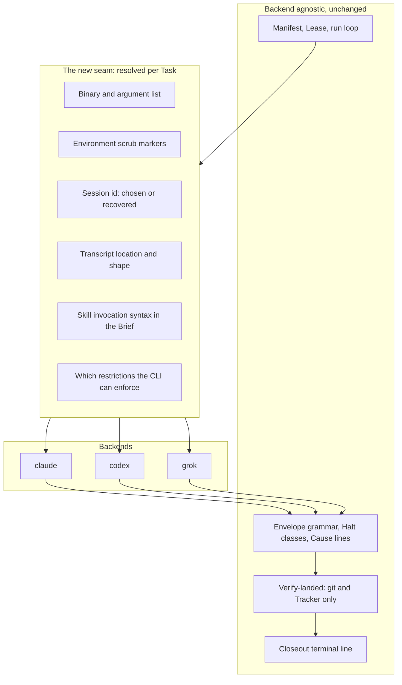

# Pluggable CLI Backends - Plan

## Goal Capsule

- **Objective:** An operator can put a Task on whichever coding CLI suits it and get the same outcome vocabulary and the same landing verdict as any other Task. Which CLI ran a Task becomes a routing choice, not a difference in how much rigor that Task received or how its result can be read.
- **Means:** Make the Task process and the Closeout process resolve their CLI per Task, and keep every contract the Runner decides outcomes with backend agnostic.
- **Product authority:** Relay's own `README.md` and `CONCEPTS.md`. This work adds a Task attribute and a launch seam; it does not change what a Runner, Lease, Envelope, Halt class, or Verify-landed means.
- **Open blockers:** None. Every question that blocked planning is resolved below.

---

## Product Contract

### Summary

A Task in a Relay manifest names its backend, one of `claude`, `codex`, or `grok`, and the Runner launches both that Task's Task process and its Closeout process on that CLI. Every backend runs the identical pipeline through the compound-engineering plugin installed natively on it. The `/relay` skill proposes a backend per Task from a written rubric and the operator overrides before the manifest is written.

### Problem Frame

Relay's value is the outer loop: the Manifest, the Lease, the Halt classes, Verify-landed. None of that is specific to one vendor's CLI, but every line of the launch path is. `build_args()` emits a fixed `claude` argv, `cli_version()` probes only `claude --version`, `find_transcript()` globs only `~/.claude/projects/`, and `child_env()` scrubs only `CLAUDECODE*` markers. The result is an outer loop with no vendor opinion sitting on a launcher that has nothing but.

That coupling has a cost the operator feels in three ways. Usage on one account bounds how much unattended work a day can hold, and there is no way to spend a different account's budget on the tasks that do not need the strongest model. A rate limit or an outage on one vendor stalls a queue that has no reason to care which model drives it. And the judgment about which model actually suits which kind of work has nowhere to live, so it stays in the operator's head and is re-derived every time a manifest is written.

The premise that made this look large was wrong. The compound-engineering plugin installs natively on Codex and on Grok Build, so a Task process on either can invoke `ce-plan`, `ce-work`, `ce-simplify`, `ce-code-review`, and `ce-compound` exactly as it does on Claude. What is missing is not a portable pipeline. It is a launch seam, a transcript reader that knows more than one layout, and somewhere to keep the routing knowledge.

### Key Decisions

- **Full pipeline parity across all three backends.** Every backend runs plan, work, simplify, review, gate, tracker write, and compound judgment. (session-settled: user-directed, chosen over a lighter single-prompt mode for non-Claude Tasks: the plugin already installs on all three, so a reduced pipeline would be a self-inflicted limitation.) Governs R3, R4.
- **Backend is a per-Task attribute.** A manifest may mix backends across its Tasks. (session-settled: user-approved, chosen over one backend per manifest: routing per tracker item is the point, and splitting a queue into per-backend manifests would defeat it.) Governs R1, R2.
- **The Closeout process runs on its Task's backend.** (session-settled: user-directed, chosen over always running Closeout on Claude: the tracker write and the compound judgment belong where the work happened, and pinning them to one vendor would reintroduce the dependency this work removes.) Governs R5.
- **A backend that cannot enforce a restriction at launch carries it in the Brief and is recorded as unenforced.** Codex has no per-tool deny equivalent to `--disallowedTools`, so its guardrails are instruction plus the Runner's own verification. (session-settled: user-approved, chosen over holding Codex until it gains launch-time denial: Verify-landed and the Lease were always the real guards, and a process that misbehaves is caught the same way regardless of backend.) Governs R10.
- **Routing is a rubric-guided recommendation made while the manifest is authored, never a runtime decision.** (session-settled: user-approved, chosen over a static attribute-to-backend table and over runtime selection by the Runner: a rubric holds judgment a table cannot, and keeping the choice at authoring time leaves the Runner's decision surface unchanged.) Governs R14, R15, R16.
- **Backend availability becomes a qualifying property.** A project qualifies for a manifest only when every backend that manifest names is installed and carries the plugin. Governs R17, R18.

The seam this work introduces, and what stays on either side of it:

### Requirements

**Backend selection**

R1. A Task names the backend that runs it, from the closed set `claude`, `codex`, `grok`. A manifest may declare a default that every Task inherits unless it names its own.

R2. A manifest may name different backends on different Tasks, and the run loop treats a mixed manifest exactly as it treats a single-backend one.

**Pipeline parity**

R3. Every backend runs the same pipeline stages a Claude Task runs today: plan, work, simplify, review, the project gate, the tracker write, and the compound judgment. No backend receives a reduced pipeline.

R4. A Brief carries the same instructions for every backend. It differs only where a fact does not exist on that CLI, such as how a skill is invoked or which restriction flags the launch supports.

R5. The Closeout process for a Task runs on that Task's backend, with both of its duties intact.

**Launch seam**

R6. Launching a process resolves the binary, the argument list, and the environment markers to scrub from the Task's backend, rather than from a fixed `claude` argv.

R7. The Runner records the observed CLI version of every backend a run used, and the version it was tested against, per backend.

R8. Where a backend accepts a runner-chosen session id, the Runner chooses it before launch. Where it does not, the Runner recovers the id the backend assigned from that process's own output.

R9. Transcript discovery resolves the storage layout of the backend that produced the transcript.

R10. A restriction the manifest names that a backend cannot enforce at launch is carried in that Task's Brief instead, and the run's record names which restrictions went unenforced.

**Outcome contracts**

R11. The Envelope grammar, the Halt classes, the Cause lines, and the Closeout terminal line are identical across backends, so a Task's outcome reads the same regardless of which CLI produced it.

R12. Verify-landed continues to read git and the Tracker alone, so a landing verdict never depends on which backend did the work.

R13. Where a backend's transcript cannot be read or parsed, the Task still receives its landing verdict, and the findings that would have come from the transcript are recorded as unavailable rather than as none found.

**Routing recommendation**

R14. `/relay` proposes a backend for each Task from a written rubric and states a one-line reason for each proposal.

R15. The operator sees every proposal and can change any of them before the manifest is written. No Task reaches a manifest with a backend the operator did not see.

R16. The rubric is a durable artifact in the repository that an operator can read and edit, not judgment held only inside one conversation.

**Preflight**

R17. Every backend a manifest names must be installed and carry the compound-engineering plugin. This is a qualifying property, checked before a run starts.

R18. A named backend that is absent, or present without the plugin, refuses the run before any Task launches, naming the backend and which of the two conditions failed.

### Key Flows

- F1. Authoring a manifest across backends
  - **Trigger:** The operator asks `/relay` to build a manifest from a list of tracker items.
  - **Steps:** The skill reads each item, applies the rubric, and proposes a backend with a one-line reason. The operator accepts or changes each. The skill checks every named backend for the binary and the plugin. It writes the manifest and validates it.
  - **Outcome:** A manifest whose every Task carries a backend the operator saw, on a machine where each of those backends can actually run.
  - **Covered by:** R1, R2, R14, R15, R17, R18

- F2. One Task on a non-Claude backend
  - **Trigger:** The run loop reaches a Task whose backend is `codex` or `grok`.
  - **Steps:** The Runner renders the Brief for that backend, resolves the binary and arguments, launches the Task process bounded as any other, and reads its Envelope. It classifies the exit from the transcript where the transcript is readable. It runs Verify-landed from git and the Tracker. It launches the Closeout process on the same backend and reads the terminal line.
  - **Outcome:** A Task record indistinguishable in vocabulary from a Claude Task's, carrying the backend that produced it.
  - **Covered by:** R3, R4, R5, R6, R8, R9, R11, R12, R13

### Acceptance Examples

- AE1. Missing plugin refuses before launch
  - **Covers R17, R18.**
  - **Given:** A manifest names `codex` on one Task, and `codex` is installed but the compound-engineering plugin is not.
  - **When:** The operator starts the run.
  - **Then:** The run refuses before launching any Task, and says that `codex` is installed without the plugin. No Task process starts, including the Claude ones.

- AE2. An unenforceable restriction is carried and recorded
  - **Covers R10.**
  - **Given:** A manifest names a disallow list, and a Task on `codex`, which has no launch-time tool denial.
  - **When:** That Task runs.
  - **Then:** The Brief carries the restriction as an instruction, and the Task's record names it as unenforced at launch. The record does not imply the restriction held.

- AE3. An unreadable transcript still yields a verdict
  - **Covers R13.**
  - **Given:** A Task on `grok` whose transcript cannot be located or parsed.
  - **When:** The Runner decides the Task's outcome.
  - **Then:** Verify-landed produces the landing verdict from git and the Tracker as usual, and the transcript-derived findings, such as denied tool calls, are recorded as unavailable rather than as none found.

- AE4. A non-Claude Closeout ends on the same contract
  - **Covers R5, R11.**
  - **Given:** A Task on `grok` that landed.
  - **When:** The Closeout process runs.
  - **Then:** It runs on `grok`, writes the outcome to the Tracker, makes the compound judgment, and ends with the same terminal line a Claude Closeout ends with.

- AE5. The operator's override wins
  - **Covers R14, R15.**
  - **Given:** The rubric proposes `codex` for a Task and states its reason.
  - **When:** The operator changes it to `claude`.
  - **Then:** The manifest carries `claude` for that Task, and nothing re-applies the rubric to it afterwards.

### Success Criteria

- One Task lands end to end on each of the three backends against a throwaway target repository, using the real CLIs rather than the stub. The stub cannot produce what a real process produces, and this work changes several contracts between processes at once.
- A run summary for a mixed-backend manifest reads in the same vocabulary as a single-backend one. An operator who was not watching can tell what happened without knowing which CLI ran which Task.

### Scope Boundaries

**Deferred for later**

- Runtime routing: the Runner choosing or changing a Task's backend during a run, or reacting to a rate limit or an outage by moving work.
- Rubric learning: the rubric adjusting itself from observed outcomes rather than being edited by hand.

**Outside this work**

- Mixed-backend handoff inside one Task, such as starting on one CLI and finishing on another. A Task has one backend for its whole life, including its Closeout.
- The `pr_terminal` shipping mode, which stays named in the schema and refused by `validate`.

### Dependencies and Assumptions

- The compound-engineering plugin installs natively on both alternates through their own plugin systems. Neither install exists on this machine yet, so the first live run on either begins with an install the operator performs by hand.
- Observed on this machine: `codex-cli 0.149.0` and `grok 1.0.5`. `claude` is the currently tested backend.
- Grok Build's headless flags mirror Claude Code's closely, including a chosen session id, an allow and deny rule syntax, a tool allowlist, a permission mode, a model, and a reasoning effort. Its sessions persist under a per-working-directory layout.
- Codex `exec` runs non-interactively with a sandbox mode rather than per-tool denial, assigns its own session id, and stores rollouts under a date-partitioned layout. This is the source of the two backend differences this contract accommodates, R8 and R10.

### Outstanding Questions

**Deferred to Planning**

- How the Codex session id is recovered from its output, and what happens to classification when that recovery fails.
- Whether the rubric lives inside the `/relay` skill or as its own file that the skill reads.
- Whether the test suite grows a stub per backend or one stub that answers to several names.
- How the tested-version constant becomes per-backend without losing the drift signal it carries today.
- Whether a manifest-level default backend is worth the schema surface, or whether every Task naming its own is simpler.

### Sources and Research

- `skills/relay/scripts/relay/launch.py`: `build_args()` emits a fixed `claude` argv with no branching; `cli_version()` probes only `claude --version`; `find_transcript()` globs only the Claude projects layout; `child_env()` scrubs only the `CLAUDECODE` and `CLAUDE_CODE_` prefixes.
- `skills/relay/scripts/relay/contracts.py`: holds `PERMISSION_MODE`, `OUTPUT_FORMAT`, `SKILL_PREFIX`, the transcript path helper, the two Closeout terminal lines, and a single tested-version constant.
- `skills/relay/scripts/relay/classify.py`: one parser for one transcript shape, with no format parameter.
- `skills/relay/scripts/relay/manifest.py`: the Task record carries `model` and `effort` and no backend field. `SHIPPING_MODES` and `UNIMPLEMENTED_SHIPPING_MODES` are the precedent for naming a value in the schema that `validate` refuses.
- `skills/relay/SKILL.md`: checks four qualifying sentences today and verifies neither the CLI binary nor the plugin before a run. R17 and R18 add both.
- `docs/examples/`: three manifests, each with per-Task `model` and `effort` and no backend selector.
- `tests/`: every launch runs against `tests/stub-claude` placed on `PATH`. Nothing under `tests/` references either alternate today.
- Codex non-interactive mode: `codex exec`, with `--sandbox`, `--model`, `--json`, and session resume. Codex CLI help output, version 0.149.0.
- Grok Build headless mode: `grok -p`, with `--session-id`, `--model`, `--effort`, `--permission-mode`, `--allow`, `--deny`, `--tools`, `--disallowed-tools`, `--max-turns`, and `--output-format`. Grok Build README, version 1.0.5.
- Compound-engineering plugin install paths for both alternates are documented in that plugin's `README.md`, which also ships native manifests at `.codex-plugin/` and `.grok-plugin/`.
