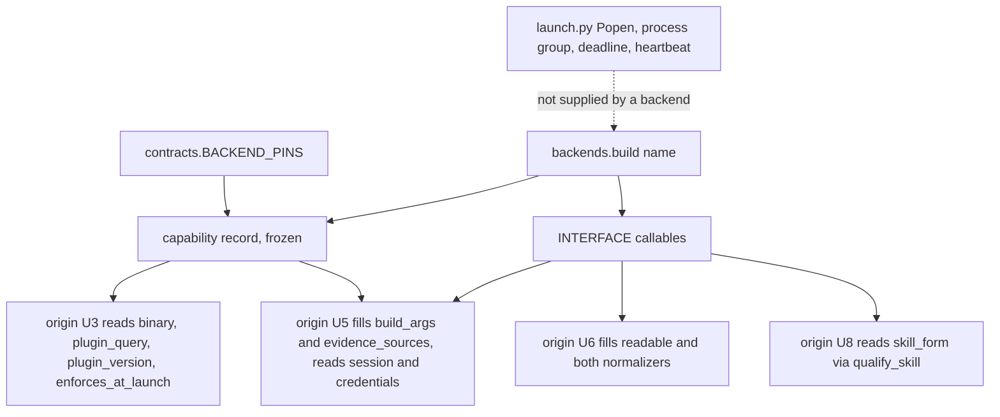

# Backend Package and Capability Record - Plan

This plan is Backends U4 from the origin, issue 19. It is not the tracker adapters unit that the outer loop plan also numbered U4.

## Goal Capsule

- **Objective:** Later units can ask one package for a named backend's frozen capability record, complete against `BACKEND_PINS`, without launching a CLI or guessing pin values.
- **Means:** A backends package whose public callables are a frozen interface, plus a frozen capability record copied from `contracts.BACKEND_PINS` (this plan's KTD1 and KTD2).
- **Product authority:** Origin plan `docs/plans/2026-08-28-1101-feat-pluggable-cli-backends-plan.md` (parent R6, R8, R23, R25, KTD1, KTD4, KTD8, KTD9, KTD16). Relay `CONCEPTS.md` and `README.md`.
- **Execution profile:** New backends package, plus `extra_writable_dirs: ()` on the Claude and Grok pins in `contracts.py`. `launch.py`, `manifest.validate`, `classify.py`, and `tail.py` stay unchanged. A machine missing `codex` and `grok` can still construct `claude`.
- **Stop conditions:** Stop rather than invent an unobserved pin. Stop rather than put `Popen`, teardown, a deadline, or a process group kill on a backend.
- **Tail ownership:** The caller owns commit, push, and PR.
- **Open blockers:** None.

---

## Product Contract

**Product Contract preservation:** narrowed to origin unit U4. Origin R1 to R25 keep their meaning and IDs in the origin file. This plan's R IDs are local. They cite the origin Rs they realize. No origin requirement is rewritten.

### Summary

Add a `backends` package that is the only per backend table the rest of the seam may read. `build(name)` returns the module for `claude`, `codex`, or `grok`. Each module exposes the same public callables and a frozen capability record filled from origin U1 pins. Construction does no I/O.

### Problem Frame

Origin U1 recorded every launch fact in `contracts.BACKEND_PINS`. Origin U2 put `backend` on the Task. Nothing yet answers the seam as one object. Without that package, origin U3 would hardcode binary names inside `manifest.py`, and origin U5 would hardcode argv inside `launch.py`. Those two tables would drift from the pins the way Grok's `dontAsk` leaked onto paper before origin U1 ran. Origin KTD1 exists to stop that.

### Key Decisions

- **The backend seam is primitives plus a capability record, not a workflow object.** (origin KTD1) Chosen over a plain dict keyed by backend name, the shape `brief.TEMPLATES` uses: a backend carries behavior, not only a value, and the shared surface test stops one backend from growing a method the others lack. Governs R1, R3, R4.
- **Pins are the producer. The record is a view.** (origin U1 outcome, R25) Chosen over retyping observed values into three modules: a second handwritten table is how a flag list was mistaken for behavior. Governs R2, R5.

### Requirements

**Dispatch**

- R1. `build(name)` returns the module for each of `claude`, `codex`, and `grok`, importing that module inside the matching branch. An unknown name raises `backends.ConfigurationError` naming the valid set. (origin R6, origin KTD1)

- R2. Building a backend performs no subprocess call and touches no filesystem. (origin R17 is origin U3's job. Construction must not become a probe.)

**Capability record**

- R3. Each backend carries one frozen capability record whose fields are the `BACKEND_PINS` key set, including `extra_writable_dirs` on every backend (empty tuple when unused). Values are copied from the pins, not restated. `None` is a valid value where the pin is `None`. (origin R6, R8, R23, R25)

- R4. `enforces_at_launch` is the demonstrated bit from origin U1, not inferred from a flag list. (origin R25)

- R5. The credential list on the record is `credential_prefixes`. Exact credential variable names were never observed and are not invented. (origin R23, KTD16)

**Interface**

- R6. The public callable surface of each backend module is exactly `INTERFACE`. No more names, no fewer. (origin KTD1)

- R7. `INTERFACE` is this frozen tuple: `build_args`, `parse_version`, `evidence_sources`, `readable`, `normalize_transcript`, `normalize_stream`, `qualify_skill`. Environment treatment and the version probe are not on it. (origin KTD8, KTD16)

- R8. `parse_version` and `qualify_skill` are complete in this plan. `build_args`, `evidence_sources`, `readable`, `normalize_transcript`, and `normalize_stream` exist as callables whose bodies belong to origin U5 and U6. (origin KTD2, origin KTD4)

### Success Criteria

- `python3 -m unittest test_backends` from `tests/` passes on a machine that has only `claude`.
- `launch.py`, `classify.py`, `tail.py`, and `manifest.validate` are byte identical to before this plan, except `contracts.py` gaining `extra_writable_dirs: ()` on the Claude and Grok pins.
- Every capability field on every backend is present. Empty string, `TODO`, and `TBD` do not appear. `None` appears only where the pin is `None`.

### Scope Boundaries

**Deferred for later (origin units, not this plan)**

- Origin U3 readiness probe inside `manifest.validate`.
- Origin U5 wiring `launch.build_args`, `child_env`, `cli_version`, and `find_transcript`.
- Origin U6 normalizer bodies and the three state readability predicate.
- Origin U8 skill form at the four call sites, permission posture in Briefs.
- Plugin list output parsing. `plugin_query` is stored. How to read `plugin list` is origin U3.

**Outside this work**

- Tracker adapters (`skills/relay/scripts/relay/adapters/`). That package is the outer loop's U4, already shipped.
- A backend supplying `Popen`, teardown, a deadline, heartbeat, merge, push, or Verify-landed.
- A fourth CLI.
- Exact credential variable names.
- Live proof runs (origin U14).

### Sources

- Origin: `docs/plans/2026-08-28-1101-feat-pluggable-cli-backends-plan.md`, section `### U4. Backend package and capability record`.
- Pins: `skills/relay/scripts/relay/contracts.py` `BACKEND_PINS`.
- Pattern: `skills/relay/scripts/relay/adapters/__init__.py` and `tests/test_adapters.py` `SharedContract`.
- Issue 19, part of issue 16.

---

## Planning Contract

### Key Technical Decisions

- KTD1. **`build(name)` returns the module, not a class instance.** Copy the adapter enforcement shape (`INTERFACE`, local imports inside `build()`, `ConfigurationError` in `backends/__init__.py`, one shared surface test). Do not copy adapter classes, constructor injection, or `assertIsInstance`. On a module the surface test counts public callables only (names that do not start with `_` and are callable). The capability record is a non callable attribute, so it does not join `INTERFACE`. Construct each module's `CAPABILITY` through a private factory `_record(name)` defined in `backends/__init__.py` next to the dataclass type. Backend modules call `_record` only, so the type object never appears as a public callable on the module. Backend modules do not import `ConfigurationError`. Only `build()` raises it. Chosen over returning class instances: origin U4 already says "returns the right module", and a class is a workflow object with a teardown temptation. Governs R1, R6.

- KTD2. **The capability record is a frozen copy of `BACKEND_PINS`, not a subset and not a second table.** Add `extra_writable_dirs: ()` to the Claude and Grok pins so the field is uniform. Codex keeps `("<repo>/.git",)`. `"<repo>"` is a substitution token for origin U5, not a placeholder. Store observed `plugin_version`. Do not store a per backend plugin floor. The floor is `PLUGIN_MIN_VERSION`. Origin U3 compares them. Chosen over the origin U4 approach list, which omitted `extra_writable_dirs`, `session_id_choosable`, `binary`, and `version_output_sample`: omitting any of those forces origin U3 or origin U5 to hardcode a second table. Governs R3, R4, R5.

- KTD3. **`INTERFACE` does not include environment treatment or the version probe.** Prefixes, nesting markers, and `credential_file` live on the record. The run level versus child split stays in `launch.child_env` (origin KTD16). The fail closed probe stays in `launch.cli_version` (origin KTD8), which sits after Lease acquire. `parse_version` is the backend primitive the probe will call. `qualify_skill` interpolates `skill_form`. The other five names exist so origin U5 and U6 cannot add a method to one backend only. Their U4 bodies return a harmless dummy (empty list, empty tuple, or `None`) and are not tested against fixtures. Chosen over implementing argv and normalizers here: U4 would agree with itself by construction, the defect in `docs/solutions/logic-errors/stubbed-seams-agree-by-construction-first-live-run-found-five-contract-defects.md`. Governs R7, R8.

- KTD4. **`backends.ConfigurationError` is its own class.** Do not import `adapters.ConfigurationError`. Do not import `manifest` from `backends`. Valid names may be `BACKEND_PINS` keys. One test asserts `manifest.BACKENDS`, `BACKEND_PINS` keys, and the names `build()` accepts are the same set. Governs R1.

### High-Level Technical Design

What this package owns, and what it must not.



### Output Structure

```text
skills/relay/scripts/relay/backends/
  __init__.py      INTERFACE, ConfigurationError, build(name)
  claude.py
  codex.py
  grok.py
tests/test_backends.py
```

`tests/fixtures/backends/` is origin U1 capture data. Do not put the package there.

### Assumptions

- `build()` returning a module is the origin's wording. The callable filter makes the surface test work without wrapping each backend in a class. Unvalidated agent bet, recorded because this run could not confirm the fork with the operator.
- Dummy bodies for the five deferred callables are enough for the surface test. Origin U5 and origin U6 replace them. Unvalidated agent bet.
- A uniform `extra_writable_dirs` field, empty on Claude and Grok, is a pin completion rather than a new observation. Unvalidated agent bet.

### Sequencing

This plan's U1 then this plan's U2. U2's tests import the package U1 creates. Neither unit touches `launch.py`.

---

## Implementation Units

### U1. Package, dispatch, and capability record

**Goal:** `build(name)` returns a module whose capability record is a complete copy of that backend's pins.

**Requirements:** R1, R2, R3, R4, R5. Cites KTD1, KTD2, KTD4.

**Dependencies:** Origin U1 and U2, both landed.

**Files:** `skills/relay/scripts/relay/backends/__init__.py` (new), `backends/claude.py` (new), `backends/codex.py` (new), `backends/grok.py` (new), `skills/relay/scripts/relay/contracts.py` (add `extra_writable_dirs: ()` on Claude and Grok only), `tests/test_backends.py` (new), `CONCEPTS.md` (verify Backend and Capability record entries exist).

**Approach:**

1. Mirror `adapters/__init__.py`: module docstring naming the contract, `INTERFACE` as KTD3's tuple, `ConfigurationError(ValueError)`, `build(name)` as an if chain with a local import per branch.
2. Define a frozen dataclass and a private factory `_record(name)` in `backends/__init__.py`. Each backend module sets `CAPABILITY = _record("claude")` (or `codex` / `grok`). It does not import the dataclass type.
3. Pad Claude and Grok pins with `extra_writable_dirs: ()` so the dataclass fields are identical across backends. Pin copy is the only work a backend module does at import. Do not call `which` or any probe at import.
4. Do not probe, parse plugin list output, or import `manifest`.
5. Verify `CONCEPTS.md` already defines Backend and Capability record. Do not rewrite those entries if they match.

**Patterns to follow:** `skills/relay/scripts/relay/adapters/__init__.py` `INTERFACE`, `build()`, `ConfigurationError`. Frozen dataclasses as in `manifest.Task`. Error wording: `"unknown backend %r; expected claude, codex, or grok" % name`.

**Test scenarios:**

- `build("claude")`, `build("codex")`, and `build("grok")` each return that module.
- `build("unknown")` raises `backends.ConfigurationError` and the message names `claude`, `codex`, and `grok`.
- Building each backend with `subprocess` and filesystem functions replaced by sentinels that fail if called does not call them.
- `manifest.BACKENDS`, `contracts.BACKEND_PINS.keys()`, and the names `build()` accepts are the same set.
- Every capability field declared on the dataclass is present on every backend, and the field set equals that backend's `BACKEND_PINS` keys (construct with `Capability(**pins)` so a pin key the dataclass dropped is a TypeError). No field is `""`, `"TODO"`, or `"TBD"`. `allow_flag` and `deny_flag` may be `None` on Codex. `extra_writable_dirs` is `()` on Claude and Grok and `("<repo>/.git",)` on Codex.
- `enforces_at_launch` is `True` for Claude and Grok, `False` for Codex.
- `credential_prefixes` is non empty on every backend. There is no `credential_variables` field.
- `forbidden_permission_modes` is non empty on every backend. Grok includes `dontAsk`. Codex includes `--dangerously-bypass-approvals-and-sandbox`.

**Verification:** The dispatch and record tests in `test_backends.py` pass. Importing `backends` does not require any CLI on `PATH`.

### U2. Interface callables and the shared surface test

**Goal:** Every backend module's public callables are exactly `INTERFACE`, with `parse_version` and `qualify_skill` real and the other five named for later units.

**Requirements:** R6, R7, R8. Cites KTD1, KTD3.

**Dependencies:** U1.

**Files:** `skills/relay/scripts/relay/backends/claude.py`, `backends/codex.py`, `backends/grok.py`, `tests/test_backends.py`.

**Approach:**

1. Implement `parse_version(text)` per backend. It takes the CLI stdout string, strips it, never raises, and returns `None` on empty input or no match. Claude's parse is the existing `launch._VERSION_TOKEN_RE` match: a version only when the stripped text leads with a digit. Codex and Grok skip the leading name token and take the following version token, matching `version_tested` on each `version_output_sample`. No subprocess.
2. Implement `qualify_skill` as interpolation of `CAPABILITY.skill_form`.
3. Add the other five names as callables that return a dummy (`[]`, `()`, or `None`) and do not read `tests/fixtures/backends/`.
4. Shared surface test: public callables on the module equal `set(INTERFACE)`. Helpers start with `_`. Construct `CAPABILITY` via `_record` so the dataclass type is not a public callable on the module.

**Patterns to follow:** `tests/test_adapters.py` `test_every_adapter_implements_the_whole_interface` and `test_no_adapter_exposes_a_method_outside_the_read_side_interface`, applied to the module `build()` returns, filtering to public callables.

**Execution note:** Do not assert fixture Envelopes or argv contents. Those proofs belong to origin U5 and U6.

**Test scenarios:**

- Each backend module's public callable names equal `INTERFACE`, no extra public function.
- `parse_version` on each `version_output_sample` returns that backend's `version_tested`.
- `parse_version` on empty string and on a banner with no version returns `None` rather than raising.
- `qualify_skill("ce-plan")` returns `compound-engineering:ce-plan` on Claude, `$ce-plan` on Codex, `/ce-plan` on Grok.
- The five deferred callables exist and are callable. No test reads a file under `tests/fixtures/backends/`.
- A method added to one backend module and not the others fails the surface test.

**Verification:** `python3 -m unittest test_backends` from `tests/` is green. Adding a stray public function to `grok.py` makes it red.

---

## System-Wide Impact

- **Two U4 numbers exist.** Tracker adapters already shipped as the outer loop's U4 (`tests/test_adapters.py` still says "U4" in its docstring). This package is Backends U4, issue 19. Do not edit the adapters package to "make the numbers match".
- **Credential prefixes overlap nesting markers.** `CLAUDE_` is a prefix of `CLAUDE_CODE_`. The same holds for `CODEX_` and `GROK_`. This plan only records both tuples. Origin U5 must scrub markers first. A test that only checks prefixes will stay green while origin KTD16 is wrong.
- **Closeout still synthesizes a Task without `backend`.** After this plan, `task.backend` exists and `build()` works, but Closeout still falls through to `claude` until origin U9. Do not "fix" that here.

---

## Risks and Dependencies

| Risk | Consequence | Mitigation |
|---|---|---|
| Implementing `build_args` or normalizers against fixtures in this plan | A green suite that proves the stub matches the author | KTD3: dummy bodies, no fixture assertions |
| Wrapping backends in classes to reuse `test_adapters.py` verbatim | A workflow object the origin forbade | KTD1: modules, callable filter |
| Leaving `extra_writable_dirs` off Claude and Grok | Origin U5 special cases Codex by name | KTD2: uniform field |
| Inventing `ANTHROPIC_API_KEY` and friends | Unobserved names become the scrub list | R5: prefixes only |
| `build()` calling `cli_version` | Construction fails on a machine missing a CLI, and a probe exception can strand a Lease if someone later calls it at the wrong time | R2: no subprocess at build |

**Dependencies.** Origin U1 pins and origin U2 `Task.backend` are on `main`. Standard library only.

---

## Verification Contract

| Gate | Command | Applies to |
|---|---|---|
| Unit | `python3 -m unittest test_backends` from `tests/` | U1, U2 |
| Full suite | `python3 -m unittest discover -s tests` from the repo root | after both units |
| Unchanged launch path | `launch.py`, `classify.py`, `tail.py`, and the validate function in `manifest.py` differ only if an import was added and reverted. They should not need an import. | both units |
| No live CLI | The new tests pass with `codex` and `grok` absent from `PATH` | both units |

---

## Definition of Done

- Both units landed. `test_backends` is green. The full suite is green.
- `backends.build` constructs all three names with no I/O.
- Capability records match `BACKEND_PINS`, including uniform `extra_writable_dirs`.
- Public callables equal `INTERFACE`. `parse_version` and `qualify_skill` are real.
- No abandoned scaffolding left in the diff (no unused class wrapper, no second pin table).
- `CONCEPTS.md` defines Backend and Capability record.
- Origin plan is not rewritten. Progress is the git commit and issue 19, not an edit to the origin file.
