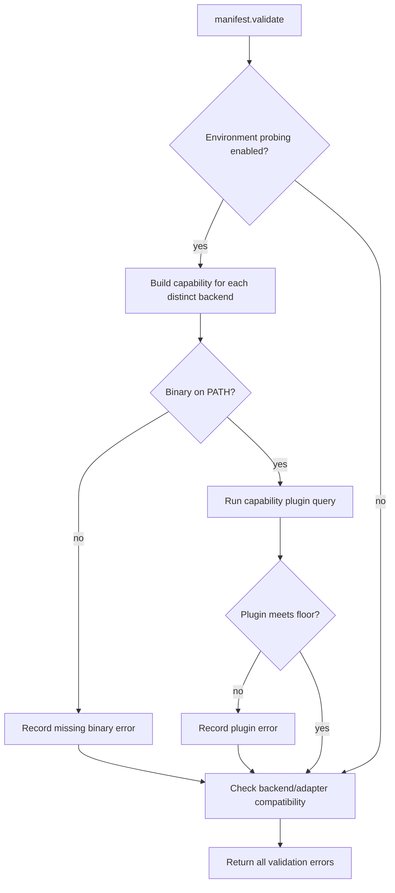

# Backend Readiness Preflight Plan

## Goal Capsule

- **Objective:** An operator learns that a chosen Task backend cannot complete the Relay pipeline before the run can start any Task process.
- **Means:** Extend manifest validation with capability record driven environment readiness checks and adapter compatibility checks. (KTD1, KTD2)
- **Product authority:** `docs/plans/2026-08-28-1101-feat-pluggable-cli-backends-plan.md` R17, R18, R22, R25 and its U3 implementation unit.
- **Execution profile:** Backward compatible for existing Claude only manifests when Claude and its installed plugin are available.
- **Stop conditions:** Stop if the capability record cannot provide a binary, plugin probe, or enforcement value for every declared backend.
- **Tail ownership:** The LFG pipeline owns review, commit, push, and PR creation.

---

## Product Contract

### Summary

Relay will validate the environment required by every distinct backend in a manifest before it starts a run.
It will also reject a backend/adapter combination when that backend cannot perform the Closeout tracker write.

### Problem Frame

Manifest validation currently checks schema and target repository conditions but can accept a backend whose executable or compound engineering plugin is unavailable.
That failure would otherwise appear only after the run begins, where it can waste a lease and leave the queue in a misleading state.

### Requirements

- R1. For each distinct backend named by a manifest, validation checks that the capability record's binary is on `PATH` when environment probing is enabled.
- R2. For each present backend binary, validation runs its capability record plugin query and refuses a missing or below floor compound engineering plugin before any Task launches.
- R3. Validation identifies the backend and distinguishes a missing binary from a missing or inadequate plugin. (Covers AE1.)
- R4. Validation rejects `jira` paired with `codex` or `grok` regardless of the environment probing setting, and identifies the incompatible pair. (Covers AE6.)
- R5. Schema only validation does not run backend subprocess probes.

### Scope Boundaries

- Deferred to later work: building backend argv, child environment treatment, and runtime version recording belong to the parent plan's U5.
- Out of scope: evidence normalization and follower behavior belong to U6.

---

## Planning Contract

### Key Technical Decisions

- KTD1. **Read backend facts only through `backends.build(name).CAPABILITY`.** This uses U4's frozen capability record instead of recreating a backend table in validation. Governs R1, R2, R6.
- KTD2. **Keep adapter compatibility independent of environment probing.** A schema only validation must still expose a Closeout that cannot write. Governs R4, R5.
- KTD3. **Treat plugin output as capability owned evidence.** Each capability supplies the version extraction rule for its plugin query output. Validation compares the extracted version to `PLUGIN_MIN_VERSION`. Governs R2, R3.
- KTD4. **Add an explicit environment probing validation option.** CLI validation and `run` enable it. Direct schema and repository validation remains deterministic unless a caller opts into backend probes. Governs R1, R2, R5.

### High Level Technical Design

### Assumptions

- The parent plan's U10 exclusively owns the unenforced backend acceptance sentence and Task path bound validation. This U3 plan does not duplicate those controls.

---

## Implementation Units

### U1. Capability driven backend preflight

- **Goal:** Refuse unusable backend selections before a run reaches adapter construction or process launch.
- **Requirements:** R1, R2, R3, R4, R5; parent plan R17, R18, R22, R25; KTD1, KTD2, KTD3, KTD4.
- **Dependencies:** The parent plan's U2 manifest backend field and U4 backend capability record are already present on `main`.
- **Files:** `skills/relay/scripts/relay/manifest.py`, `skills/relay/scripts/relay/cli.py`, `skills/relay/scripts/relay/backends/__init__.py`, `skills/relay/scripts/relay/backends/claude.py`, `skills/relay/scripts/relay/backends/codex.py`, `skills/relay/scripts/relay/backends/grok.py`, `tests/test_backends.py`, `tests/test_manifest.py`, `tests/test_cli.py`.
- **Approach:**
  1. Extend the capability record with a plugin version extraction rule and add representative plugin list evidence for every backend.
  2. Add small validation helpers that read binary, plugin query, and extraction facts from the resolved backend capability, deduplicate backends, and report probe specific failures without raising.
  3. Compare extracted plugin versions to `contracts.PLUGIN_MIN_VERSION` and classify absent, malformed, nonzero, and below floor output as plugin failures.
  4. Add adapter compatibility checks to the validation path that remains active when environment probing is off; keep binary and plugin probes behind the explicit environment probing option.
  5. Keep `cmd_validate` and `cmd_run` on their current shared validation result so an invalid manifest cannot reach adapter construction or `run.run`.
- **Patterns to follow:** `manifest.validate()` aggregates errors; `backends.build()` is the backend dispatch; `CliCase.call()` observes CLI output and exit status.
- **Test scenarios:**
  - A manifest naming a backend whose binary lookup fails is invalid and names that backend and the missing binary.
  - A manifest whose binary exists but whose plugin query reports no qualifying plugin is invalid and distinguishes the plugin failure from binary absence. Covers AE1.
  - A manifest with repeated Tasks on one backend runs that backend's environment checks once.
  - A `jira` manifest with a `codex` or `grok` Task is invalid with environment probing disabled, while a supported adapter/backend pairing remains valid. Covers AE6.
  - Schema only validation performs no binary lookup or plugin subprocess call.
  - Plugin extraction accepts the captured plugin list shape for each backend and rejects an absent or malformed compound engineering entry.
  - `relay run` returns a configuration failure and does not acquire state or launch a Task after readiness validation fails.
- **Verification:** Manifest and CLI tests prove each preflight failure shape, the probe bypass behavior, and the run before launch boundary.

---

## Verification Contract

| Gate | Evidence |
| --- | --- |
| Focused validation behavior | `python3 -m unittest tests/test_manifest.py` passes. |
| CLI boundary | `python3 -m unittest tests/test_cli.py` passes. |
| Regression suite | `python3 -m unittest discover -s tests` passes. |

---

## Definition of Done

- U1 is complete when each distinct named backend is preflighted from its capability record before a run can launch a Task.
- Missing binaries, missing or too old plugins, and incompatible adapter pairs are separately diagnosable.
- Schema only validation remains free of backend environment probes.
- Focused tests and the full suite pass with no abandoned implementation paths left in the diff.
