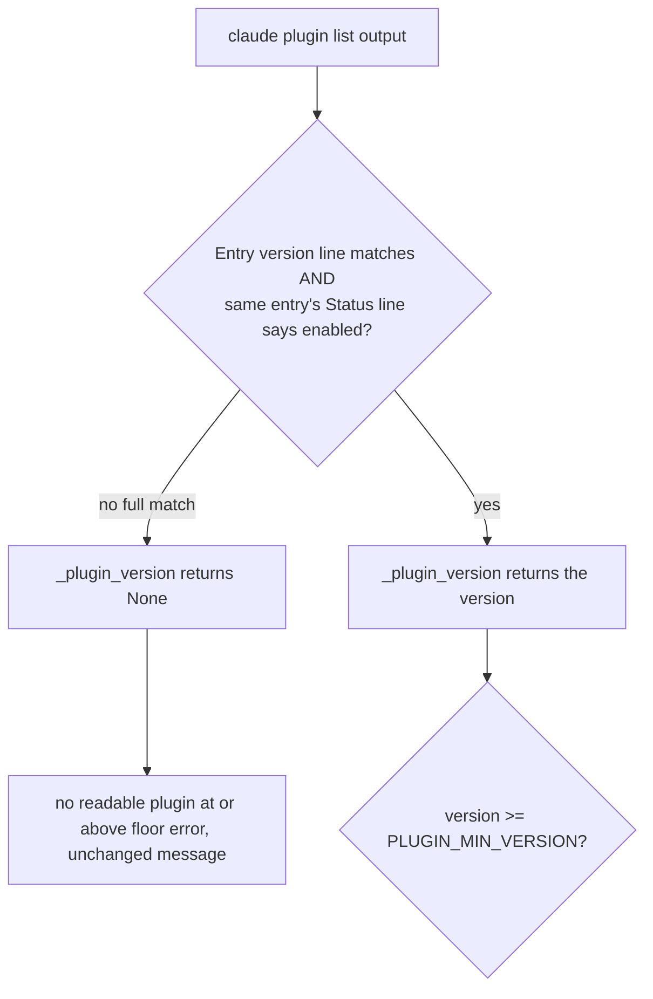

# Require Enabled Compound Engineering Plugin For Readiness

## Goal Capsule

- **Objective:** An operator running `relay run` never gets a false-ready verdict for a backend whose compound-engineering plugin is installed at a qualifying version but disabled, since a disabled plugin cannot provide the skills the Task process needs.
- **Means:** Tighten Claude's plugin-version extraction pattern so it only matches an entry whose own `Status:` line says enabled, add a real disabled-plugin fixture, and add a regression test that `validate(..., check_environment=True)` refuses it. (KTD1)
- **Product authority:** none; this is a bootstrap fix for finding `skills-relay-contracts-129-disabled-plugin-ready` (P1, confidence 100, adversarial reviewer) raised against `feat/backend-readiness-preflight` at `4ed4bd6`.
- **Execution profile:** Backward compatible; an enabled plugin at or above the floor version still validates exactly as before.
- **Stop conditions:** Stop if a backend's plugin-list output carries no signal distinguishing enabled from disabled, since there is nothing in the text to require.
- **Tail ownership:** This Relay task owns review, commit, and the project gate; the runner owns merge and push.

---

## Product Contract

### Summary

`manifest._backend_readiness_errors` treats a matching plugin version as sufficient for readiness. For the `claude` backend this is wrong: `claude plugin list` prints `Version:` and `Status:` as separate lines inside the same entry, and a disabled plugin still reports its installed version. Validation currently reads the version and never looks at `Status:`, so a disabled compound-engineering plugin passes as ready even though its skills (`ce-plan`, `ce-work`, `ce-code-review`, ...) will not resolve when a Task process invokes them.

### Problem Frame

Verified live against the installed `claude` CLI (2026-08-30): `claude plugin list` prints one block per plugin, e.g.

```
  ❯ compound-engineering@compound-engineering-plugin
    Version: 3.23.4
    Scope: user
    Status: ✔ enabled
```

Disabling a plugin (`claude plugin disable <name>`) changes only the last line, to `Status: ✘ disabled` — the `Version:` line and the reported version are unchanged. `manifest.py:374`'s `_plugin_version` call uses `contracts.BACKEND_PINS["claude"]["plugin_version_pattern"]`, which matches `Version:\s*(?P<version>...)` and stops; it never inspects `Status:`. A disabled-but-version-qualifying plugin therefore extracts a version, clears the floor comparison, and reports no error, even though the Task process that later runs `compound-engineering:ce-plan` etc. will find the skill unavailable.

Live-checked the other two backends the same way:

- **codex**: `codex plugin list` has no disable/enable subcommand at all (`codex plugin --help` lists only `add`, `list`, `marketplace`, `remove`). Its two observed states are `installed, enabled` and `not installed` — there is no reachable disabled state. `BACKEND_PINS["codex"]["plugin_version_pattern"]` already requires the literal text `installed,\s+enabled` immediately before the version, so it already excludes every state but the fully-usable one. No fix needed here.
- **grok**: `grok plugin list --json` exposes only `"status": "installed"` regardless of enabled/disabled; disabling and re-enabling the plugin live left the JSON identical. There is no field in this CLI's output for the pattern to require. This is a real gap, but it is a missing signal in the underlying CLI, not a bug in Relay's extraction — captured as an accepted limitation below rather than "fixed."

### Requirements

- R1. `claude`'s plugin-version extraction matches only when the same plugin entry's `Status:` line reports enabled; a matching version on a disabled entry does not extract a version.
- R2. The existing enabled-plugin extraction and floor comparison behavior is unchanged (no regression for the common case).
- R3. A disabled-but-version-qualifying `claude` compound-engineering plugin makes `manifest.validate(..., check_environment=True)` fail, with an error distinguishable from the existing "no readable plugin" and "below floor" cases only insofar as it's the same "no readable plugin at or above floor" message — no new error class is introduced (see KTD2).
- R4. `codex`'s existing pattern is proven, not just assumed, to already reject every state its CLI can produce other than `installed, enabled`.
- R5. `grok`'s inability to signal disabled state is documented in `contracts.py` next to its pattern so a future reader does not assume parity with `claude`/`codex`.

### Scope Boundaries

- Out of scope: adding a new validation error class or message distinguishing "disabled" from "version too low" from "absent." `_backend_readiness_errors` already has one catch-all message for "no readable qualifying plugin" (manifest.py:378-379); a disabled plugin is one more cause of that same, already-correct message. Splitting it into a new class is a larger contract change than this finding calls for.
- Out of scope: adding a `grok`-side fix, since there is no field in `grok plugin list --json` output to check. Out of scope: changing `grok`'s CLI or filing anything against it.
- Out of scope: an INTERFACE-level "usable plugin" method added to every backend module. Only `claude`'s pattern needs to change; `codex` already enforces this by construction. Adding a parallel abstraction that two of three backends would trivially satisfy is unwarranted structure for a one-backend fix.

---

## Planning Contract

### Key Technical Decisions

- KTD1. **Fold the enabled requirement into the existing `plugin_version_pattern`, the same mechanism `codex` already uses.** `codex`'s pattern requires the literal text `installed, enabled` before capturing the version — it already encodes "usable," not just "present," inside the one regex the capability record exposes. Extending `claude`'s pattern to require its own `Status:` line say enabled reuses the same one-field-per-backend shape instead of introducing a second capability field or a new per-backend INTERFACE method. Governs R1, R2.
- KTD2. **No new error class.** `_backend_readiness_errors` already reports "no readable %s plugin at or above %s" when `_plugin_version` returns `None` (manifest.py:377-379). A disabled plugin now also returns `None` from extraction, so it falls into that existing branch. The message is accurate (a disabled plugin is not "readable" for Relay's purposes) and adding a fourth branch to distinguish "disabled" from "absent" is not something the finding or the current error taxonomy asks for. Governs R3.
- KTD3. **Bound the interior scan to one plugin block.** `claude plugin list` prints multiple entries back to back, each starting with a `❯` bullet. The pattern's interior span between `Version:` and `Status:` must not cross into the next entry's `❯` line, or a disabled compound-engineering entry could accidentally match a later, unrelated enabled plugin's `Status:` line. Use a negated-lookahead-bounded interior (`(?:(?!❯).)*?`) rather than an unbounded `.*?`. Governs R1.

### High Level Technical Design

Current `claude` pattern (contracts.py:130-131):

```
(?ims)^\s*❯\s*compound-engineering@compound-engineering-plugin\s+Version:\s*(?P<version>\d+(?:\.\d+)+)
```

New pattern (directional sketch, not final regex syntax — the implementer verifies against the live samples captured below):

```
(?ims)^\s*❯\s*compound-engineering@compound-engineering-plugin\s+
Version:\s*(?P<version>\d+(?:\.\d+)+)
(?:(?!❯).)*?              # scan forward, never crossing into the next ❯ entry
Status:\s*(?:\S+\s+)?enabled\b
```

The `(?:\S+\s+)?` before `enabled` optionally consumes the `✔`/`✘` glyph so the pattern does not depend on a specific symbol surviving a future CLI cosmetic change — it only depends on the word `enabled` appearing where `disabled` does not (verified: `"enabled"` is not a substring of `"disabled"`, so no additional negative lookahead is needed).



### Assumptions

- The compound-engineering plugin's on-disk `Status:` line stays `enabled`/`disabled` text (with an optional leading glyph) rather than switching to a purely iconographic or numeric encoding. If the CLI changes this wording, `test_plugin_version_patterns_parse_the_observed_list_shapes`-style tests will fail loudly rather than silently passing a disabled plugin, which is the fail-closed behavior this fix wants.
- `grok`'s missing enabled/disabled signal is accepted as a documented limitation for this fix, not a blocker to it (see Scope Boundaries).

---

## Implementation Units

### U1. Require an enabled Status entry in the Claude plugin pattern

- **Goal:** `manifest._backend_readiness_errors` refuses a `claude` backend whose compound-engineering plugin is listed and version-qualifying but disabled, and keeps accepting an enabled, qualifying plugin exactly as before.
- **Requirements:** R1, R2, R3, R4, R5; KTD1, KTD2, KTD3.
- **Dependencies:** None; `manifest.py`'s `_plugin_version`/`_backend_readiness_errors` and `contracts.BACKEND_PINS` are already on `main`.
- **Files:**
  - `skills/relay/scripts/relay/contracts.py` (the `claude` entry's `plugin_version_pattern`, plus a short comment on `grok`'s entry noting the CLI exposes no enabled/disabled signal)
  - `tests/test_backends.py` (the truncated `claude` sample in `test_plugin_version_patterns_parse_the_observed_list_shapes` doesn't currently include a `Status:` line at all; replace it with the real captured block, and add a case proving a disabled entry with the same qualifying version does not extract)
  - `tests/test_manifest.py` (`BackendReadiness.claude_plugin_output` helper currently omits `Status:`; extend it to build a real enabled block by default and add a sibling helper/test for the disabled case wired through `mf.validate(..., check_environment=True)`)
- **Approach:**
  1. Update `contracts.BACKEND_PINS["claude"]["plugin_version_pattern"]` to require the same entry's `Status:` line say enabled before the `version` group is considered matched, per KTD1/KTD3. Keep the named group `version` so `_plugin_version` needs no change.
  2. Update the `claude` sample string in `tests/test_backends.py`'s `test_plugin_version_patterns_parse_the_observed_list_shapes` to the real, full block (`Version:` + `Scope:` + `Status: ✔ enabled`) captured live against the installed CLI, rather than the current truncated two-line sample that has no `Status:` line to check.
  3. Add a `test_backends.py` case: a `claude` block with a qualifying version and `Status: ✘ disabled` extracts `None` via `mf._plugin_version`.
  4. Add a `test_backends.py` case guarding KTD3: two back-to-back entries where the compound-engineering block is disabled and a later, different plugin's block is enabled; extraction must still return `None`, not borrow the later block's enabled status.
  5. Extend `tests/test_manifest.py`'s `BackendReadiness.claude_plugin_output` helper to include `Scope:`/`Status: ✔ enabled` lines by default (so every existing caller keeps validating the realistic shape), and add a `claude_plugin_output(..., status="disabled")`-style variant or a sibling helper for the disabled case.
  6. Add a `BackendReadiness` test: with the disabled-but-qualifying claude plugin output, `mf.validate(self.load(), check_repo=False, check_environment=True, env=self.environment())` is not `.ok`, and the error text still names the backend and plugin (same assertion shape as `test_missing_plugin_is_distinct_from_missing_binary`), proving R3.
  7. Add a `test_backends.py` case (or extend an existing one) asserting `codex`'s pattern does not match a hypothetical `installed, disabled` STATUS value even though the live CLI cannot currently produce it — this documents R4 as a property of the pattern itself, not just an observed absence of the state.
  8. Add a one-line comment on `contracts.BACKEND_PINS["grok"]["plugin_version_pattern"]` noting `grok plugin list --json` carries no enabled/disabled field as of the version tested, so this pattern cannot enforce R1's property for `grok` (R5).
- **Patterns to follow:** `tests/test_backends.py`'s existing `samples` dict keyed by backend name in `test_plugin_version_patterns_parse_the_observed_list_shapes`; `tests/test_manifest.py`'s `BackendReadiness` class, which already has `plugin_result`/`claude_plugin_output` helpers and a `test_below_floor_plugin_is_refused` case shaped exactly like the new disabled-plugin case.
- **Test scenarios:**
  - `mf._plugin_version` on a real enabled `claude` block still returns `"3.23.4"` (regression, R2).
  - `mf._plugin_version` on the same block with `Status: ✘ disabled` returns `None` (R1).
  - `mf._plugin_version` returns `None` when the compound-engineering entry is disabled even though a later, different plugin's entry in the same output is enabled (KTD3, R1).
  - `mf.validate(..., check_environment=True)` on a manifest whose only `claude` Task's plugin is listed, version-qualifying, and disabled is not `.ok`, and the error names the backend (R3).
  - `mf._plugin_version` on a `codex` block with a hand-built `installed, disabled` STATUS value returns `None`, proving the existing pattern already excludes it (R4).
  - Existing `codex`/`grok` enabled-sample cases in `test_plugin_version_patterns_parse_the_observed_list_shapes` and `test_grok_pattern_does_not_borrow_another_plugins_version` continue to pass unchanged (no regression to the two backends not touched by this fix).
- **Verification:** `python3 -m unittest tests/test_backends.py tests/test_manifest.py`, then the full suite.

---

## Verification Contract

| Gate | Evidence |
| --- | --- |
| Focused pattern behavior | `python3 -m unittest tests/test_backends.py` passes, including the new disabled-plugin and cross-entry cases. |
| Readiness preflight behavior | `python3 -m unittest tests/test_manifest.py` passes, including the new `BackendReadiness` disabled-plugin case. |
| Regression suite | `python3 -m unittest discover -s tests` passes. |

---

## Definition of Done

- A `claude` backend whose compound-engineering plugin is listed, version-qualifying, and disabled fails `manifest.validate(..., check_environment=True)` instead of passing.
- An enabled, version-qualifying `claude` plugin still validates exactly as before (no regression).
- The fixture and regex changes are grounded in plugin-list output captured live against the installed CLI (both enabled and disabled), not invented text.
- `codex`'s existing pattern is proven by a test to already exclude every state but fully usable, and `grok`'s inability to expose this signal is documented at the pattern, not silently left unaddressed.
- Full suite passes with no abandoned implementation paths left in the diff.
