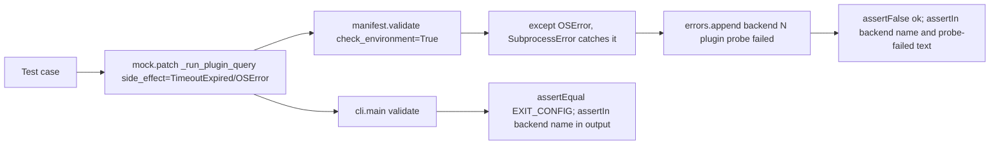

# Test Plugin Probe Exception Handling Plan

## Goal Capsule

- **Objective:** The plugin probe's exception path in `manifest._backend_readiness_errors` (`skills/relay/scripts/relay/manifest.py:369-373`) is directly exercised for both a timeout and an OS-level launch failure, at the validation layer and through the `validate` CLI verb.
- **Means:** Add cases to `tests/test_manifest.py::BackendReadiness` that make `_run_plugin_query` raise `subprocess.TimeoutExpired` and `OSError`, asserting `validate(..., check_environment=True)` reports a distinct, non-raising error naming the backend; add one matching case to `tests/test_cli.py::Validate` proving the CLI refuses with `EXIT_CONFIG` rather than crashing.
- **Product authority:** Finding `skills-relay-manifest-371-plugin-probe-exception` from the `feat/backend-readiness-preflight` review (severity P2, confidence 75).
- **Execution profile:** Test-only change; no production code path changes.
- **Stop conditions:** None expected; the `except (OSError, subprocess.SubprocessError)` clause already exists at `manifest.py:371` and needs no new code, only coverage.
- **Tail ownership:** N/A, this plan is executed and verified within the Relay task session that owns it.

---

## Product Contract

### Summary

`manifest._backend_readiness_errors` wraps `_run_plugin_query` in `try/except (OSError, subprocess.SubprocessError)` so a probe that times out or fails to launch is reported as a validation error rather than raising out of `validate()`. `subprocess.TimeoutExpired` is a subclass of `subprocess.SubprocessError`, so both a timeout and a raw `OSError` (e.g. the binary vanishing between `shutil.which` and exec) are meant to be caught. No test drives `_run_plugin_query` to raise either exception, so nothing pins that this branch actually executes, that it appends a message naming the backend, or that it does not re-raise and crash `validate()` or the `validate` CLI verb.

### Problem Frame

The existing `BackendReadiness` suite in `tests/test_manifest.py` covers a missing binary, a missing plugin, a below-floor plugin version, and per-backend probe de-duplication, but every case supplies `_run_plugin_query` as a return value, never a raise. A regression that narrowed the `except` clause, dropped it, or changed the appended message would pass the full suite today.

### Requirements

- R1. A manifest-level test makes `_run_plugin_query` raise `subprocess.TimeoutExpired` and asserts `validate(..., check_environment=True)` returns `ok=False` with an error naming the backend, without the exception propagating out of `validate`.
- R2. A manifest-level test makes `_run_plugin_query` raise `OSError` and asserts the same outcome as R1, and that the two failure messages are distinguishable from the missing-binary and missing-plugin messages already covered.
- R3. A CLI-level test drives one of these two exceptions through `validate` (`cli.main(["validate", ...])`) and asserts exit code `cli.EXIT_CONFIG` with the backend named in the printed output, proving the CLI refuses cleanly rather than crashing on an uncaught exception.

### Scope Boundaries

- Out of scope: changing `_backend_readiness_errors`, `_run_plugin_query`, or any production behavior. This is additive test coverage only.
- Out of scope: the `run` verb's own readiness-gated refusal path; it shares the same `manifest_module.validate` call already covered at the unit level, and the finding names validation and CLI refusal, not `cmd_run` specifically.

---

## Planning Contract

### Key Technical Decisions

- KTD1. **Raise via `side_effect` on the same seam the existing suite already patches** (`mock.patch.object(mf, "_run_plugin_query", side_effect=...)`), matching `tests/test_manifest.py::BackendReadiness`'s existing `mock.patch.object` style rather than introducing a new stubbing mechanism.
- KTD2. **Construct `subprocess.TimeoutExpired` with its required `cmd` and `timeout` arguments** (e.g. `subprocess.TimeoutExpired(cmd=["claude"], timeout=15)`), matching the real call site's `timeout=15` at `manifest.py:357` so the fixture stays representative.
- KTD3. **Add the two manifest-level cases to the existing `BackendReadiness` class** in `tests/test_manifest.py`, and the one CLI-level case to the existing `Validate` class in `tests/test_cli.py`, matching how both classes already group every readiness/validate-verb behavior (same pattern as the prior `tests-test-cli-65-validate-readiness-failures` plan).
- KTD4. **Assert the error message distinctly** (e.g. contains "probe failed" or the exception text) rather than only asserting `ok is False`, so the test would fail if the except clause were removed and the exception instead propagated (which `assertFalse(result.ok)` alone would not catch, since an uncaught exception fails the test differently but a `pytest.raises`-style silent pass-through is the real risk to guard against here — the assertion must confirm graceful handling, not just non-raising).

### High Level Technical Design

### Assumptions

- `self.manifest_path` / `self.load()` fixtures (from the existing `ManifestCase` / `RunCase` setups) name a `claude` backend task by default, matching the rest of `BackendReadiness` and `Validate`, so `"claude"` is the backend name asserted.
- No new stub binaries or queue fixtures are needed; the probe is bypassed entirely by mocking `_run_plugin_query`, exactly as the existing suite already does.

---

## Implementation Units

### U1. Manifest-level exception coverage

- **Goal:** Pin that a `TimeoutExpired` or `OSError` from `_run_plugin_query` is caught and turned into a validation error naming the backend, not a crash.
- **Requirements:** R1, R2; KTD1, KTD2, KTD4.
- **Dependencies:** None; the `except (OSError, subprocess.SubprocessError)` clause already exists at `manifest.py:371`.
- **Files:** `tests/test_manifest.py`.
- **Approach:**
  1. In `BackendReadiness`, add `test_a_probe_timeout_is_reported_as_a_validation_error`: patch `mf.shutil.which` to return a path and patch `mf._run_plugin_query` with `side_effect=subprocess.TimeoutExpired(cmd=["claude"], timeout=15)`. Call `mf.validate(self.load(), check_repo=False, check_environment=True, env=self.environment())` and assert `result.ok is False` and that some error contains `"claude"` and `"probe failed"`.
  2. Add `test_a_probe_os_error_is_reported_as_a_validation_error`: same shape with `side_effect=OSError("no such file or directory")`, asserting the same outcome.
  3. Import `subprocess` in `tests/test_manifest.py` if not already imported (check existing imports first).
- **Patterns to follow:** `tests/test_manifest.py::BackendReadiness.test_missing_binary_names_the_backend_before_launch` and `test_missing_plugin_is_distinct_from_missing_binary` for structure; the production message format at `manifest.py:372` (`"backend %s plugin probe failed: %s"`) for the assertion text.
- **Test scenarios:** The two scenarios in R1/R2 are the only new scenarios.
- **Verification:** `python3 -m unittest test_manifest` from `tests/` passes with the two new cases present.

### U2. CLI-level refusal coverage

- **Goal:** Prove the `validate` verb exits `EXIT_CONFIG` and names the backend when the probe raises, rather than propagating an uncaught exception through `cmd_validate`.
- **Requirements:** R3; KTD1, KTD3.
- **Dependencies:** U1 confirms the underlying `validate()` behavior; this unit proves the CLI wiring on top of it.
- **Files:** `tests/test_cli.py`.
- **Approach:**
  1. In `Validate`, add `test_a_probe_exception_exits_config_and_names_the_backend`: patch `manifest_module.shutil.which` to return a path and patch `manifest_module._run_plugin_query` with `side_effect=OSError("no such file or directory")` (one exception type is sufficient here since U1 already covers both at the validation layer; the CLI test's job is proving the wiring doesn't crash, not re-proving both exception branches).
  2. Call `self.call("validate", self.manifest_path)`, assert `code == cli.EXIT_CONFIG` and that the output names `"claude"`.
- **Patterns to follow:** `tests/test_cli.py::Validate.test_a_missing_backend_plugin_exits_config_and_names_the_backend`.
- **Test scenarios:** The one scenario in R3.
- **Verification:** `python3 -m unittest test_cli` from `tests/` passes with the new case present.

---

## Verification Contract

| Gate | Evidence |
| --- | --- |
| Focused manifest tests | `python3 -m unittest test_manifest` (run from `tests/`) passes, including the two new cases. |
| Focused CLI tests | `python3 -m unittest test_cli` (run from `tests/`) passes, including the new case. |
| Regression suite | `python3 -m unittest discover -s tests` (run from repo root) passes. |

---

## Definition of Done

- `tests/test_manifest.py::BackendReadiness` has one test for `TimeoutExpired` and one for `OSError` from `_run_plugin_query`, each asserting the resulting validation error names the backend and describes a probe failure.
- `tests/test_cli.py::Validate` has one test proving the `validate` verb exits `EXIT_CONFIG` and names the backend when the probe raises.
- No production code changes.
- Full suite passes.
