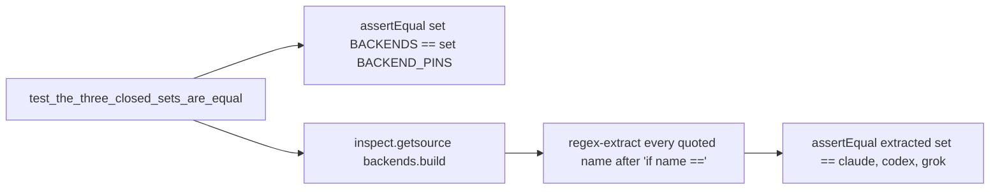

# Test Closed Set Ignores Extra Build Names Plan

## Goal Capsule

- **Objective:** `Dispatch.test_the_three_closed_sets_are_equal` in `tests/test_backends.py` fails if `backends.build` ever grows an `if name == ...` branch for a name outside `claude`, `codex`, `grok`, even when that name is never added to `mf.BACKENDS` or `contracts.BACKEND_PINS`.
- **Means:** Replace the "accepted" loop (which drives `build` only with names already in `mf.BACKENDS` plus `"unknown"`, so it cannot see a branch keyed on any other name) with an `inspect.getsource(backends.build)` assertion that the only `if name == "..."` lines in the function body name `claude`, `codex`, and `grok`, in that set, plus nothing else. Keep the existing `set(mf.BACKENDS) == set(contracts.BACKEND_PINS)` assertion.
- **Product authority:** Finding `tests/test_backends.py:47:Closed set test ignores extra build names` (severity P2, confidence 75), sourced from branch `feat/backend-package-capability-record` at `b5bf00bd61500a18db2fb2ffb5e99f015e77eb2c`, part of #19 / #16.
- **Execution profile:** Test-only change; no production code path changes.
- **Stop conditions:** None expected; `backends.build` at `skills/relay/scripts/relay/backends/__init__.py:125-140` already has exactly three `if name == ...` branches (`claude`, `codex`, `grok`), so the new assertion passes immediately against current code.
- **Tail ownership:** N/A, this plan is executed and verified within the Relay task session that owns it.

---

## Product Contract

### Summary

`test_the_three_closed_sets_are_equal` proves two things today: `mf.BACKENDS` and `contracts.BACKEND_PINS` have the same keys, and calling `backends.build` on every `mf.BACKENDS` name plus `"unknown"` accepts exactly the `mf.BACKENDS` names. That second check only drives `build` with names drawn from `mf.BACKENDS` itself (and one always-unknown sentinel), so it can never observe a fourth `if name == "something-else":` branch inside `build` that accepts a name absent from both closed sets. A future edit could add such a branch, and this test would stay green because it never calls `build` with that name.

### Problem Frame

`tests/test_backends.py:47` builds `accepted` from `list(mf.BACKENDS) + ["unknown"]`, calls `backends.build` on each, and asserts the accepted set equals `set(mf.BACKENDS)`. This is a closed-set proof by construction: it can only confirm behavior for names it already knows about. It gives no signal if `backends.build` grows a new accepting branch for a name outside the two closed sets (e.g. a fourth CLI wired directly in `build` without updating `mf.BACKENDS` or `contracts.BACKEND_PINS`).

### Requirements

- R1. `set(mf.BACKENDS) == set(contracts.BACKEND_PINS)` remains asserted, unchanged from today.
- R2. The test independently proves that `backends.build`'s source contains exactly the `if name == "claude"`, `if name == "codex"`, and `if name == "grok"` branches, and no other `if name == "..."` branch, by reading the function's source rather than driving it with a fixed name list.
- R3. The existing "no subprocess/filesystem access" and "returns the named module" tests (`test_build_returns_the_named_module`, `test_build_performs_no_subprocess_and_touches_no_filesystem`) are unchanged.

### Scope Boundaries

- Out of scope: changing `backends.build`'s implementation or the shape of `mf.BACKENDS` / `contracts.BACKEND_PINS`.
- Out of scope: other tests in `tests/test_backends.py`; only `test_the_three_closed_sets_are_equal` changes.

---

## Planning Contract

### Key Technical Decisions

- KTD1. **Use `inspect.getsource(backends.build)` plus a regex over `if name == "(\w+)"` lines**, per the finding's suggested fix, rather than AST parsing. A regex against the small, single-function source is sufficient to extract every quoted name following `if name ==` and keeps the test readable; AST would be more robust to formatting changes but is unwarranted machinery for a three-branch dispatch function guarded by the surrounding `test_build_returns_the_named_module` test, which already fails if `build`'s branch structure diverges from returning the right module.
- KTD2. **Assert the extracted name set equals `{"claude", "codex", "grok"}` exactly**, not `set(mf.BACKENDS)`, so the test also catches the case where `mf.BACKENDS` itself grows a name that `build` does not yet branch on (that gap is already covered by `test_build_returns_the_named_module` iterating `mf.BACKENDS`, but pairing the literal set here keeps this assertion self-contained and readable without an indirect reference).
- KTD3. **Keep the `set(mf.BACKENDS) == set(contracts.BACKEND_PINS)` assertion in the same test method** rather than splitting into two test methods, matching the existing structure and the finding's "Keep BACKENDS vs PINS set equality" instruction.

### High Level Technical Design



### Assumptions

- `backends.build`'s source is plain Python with `if name == "claude":`-shaped lines (confirmed by reading `skills/relay/scripts/relay/backends/__init__.py:125-140`); no dynamic dispatch or string formatting obscures the literal name.

---

## Implementation Units

### U1. Replace the accepted-loop assertion with a source-inspection assertion

- **Goal:** Make `test_the_three_closed_sets_are_equal` fail if `backends.build` ever gains an `if name == ...` branch for a name outside `{claude, codex, grok}`, independent of `mf.BACKENDS` / `contracts.BACKEND_PINS` contents.
- **Requirements:** R1, R2, R3; KTD1, KTD2, KTD3.
- **Dependencies:** None.
- **Files:** `tests/test_backends.py`.
- **Approach:**
  1. Add `import inspect` and `import re` to the top-level imports in `tests/test_backends.py` (alongside the existing `os`, `shutil`, `subprocess`, `sys`, `unittest` imports).
  2. In `Dispatch.test_the_three_closed_sets_are_equal` (line 47), keep the first line: `self.assertEqual(set(mf.BACKENDS), set(contracts.BACKEND_PINS))`.
  3. Replace the `accepted = []` loop and its final `assertEqual` with:
     ```python
     source = inspect.getsource(backends.build)
     branch_names = set(re.findall(r'if name == "(\w+)"', source))
     self.assertEqual(branch_names, {"claude", "codex", "grok"})
     ```
  4. Leave the method's other structure (docstring-free, same class) unchanged.
- **Patterns to follow:** The existing test's `assertEqual(set(...), set(...))` style for the kept first assertion; import placement matches the existing grouped stdlib imports at the top of the file.
- **Test scenarios:** No new test method; the existing method's second assertion changes from a construction-driven loop to a source-inspection check. Manually verify by temporarily adding a fourth `if name == "fake":` branch to `backends.build` locally (not committed) and confirming the test fails, then removing it.
- **Verification:** `python3 -m unittest test_backends` from `tests/` passes with the new assertion present.

---

## Verification Contract

| Gate | Evidence |
| --- | --- |
| Focused backends tests | `python3 -m unittest test_backends` (run from `tests/`) passes, including the rewritten assertion. |
| Regression suite | `python3 -m unittest discover -s tests` (run from repo root) passes. |

---

## Definition of Done

- `tests/test_backends.py::Dispatch.test_the_three_closed_sets_are_equal` keeps the `BACKENDS`/`BACKEND_PINS` set-equality assertion and replaces the accepted-loop assertion with an `inspect.getsource(backends.build)`-based check that the only `if name == "..."` branches are `claude`, `codex`, and `grok`.
- No production code changes.
- Full suite passes.
