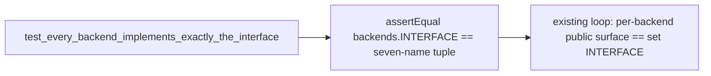

# Test INTERFACE Contents Are Pinned Plan

## Goal Capsule

- **Objective:** `SharedSurface.test_every_backend_implements_exactly_the_interface` in `tests/test_backends.py` pins `backends.INTERFACE` itself to the exact seven-name tuple, not just that each backend module's public surface equals whatever `INTERFACE` happens to hold.
- **Means:** Add one assertion at the top of the existing test that `backends.INTERFACE == (...)` the seven names, before the per-backend loop.
- **Product authority:** Finding `tests/test_backends.py:112:INTERFACE contents are not pinned` (severity P2, confidence 75), sourced from branch `feat/backend-package-capability-record` at `b5bf00bd61500a18db2fb2ffb5e99f015e77eb2c`, part of #19 / #16.
- **Execution profile:** Test-only change; no production code path changes.
- **Stop conditions:** None expected; `backends.INTERFACE` at `skills/relay/scripts/relay/backends/__init__.py:30-38` already equals the seven names, so the new assertion passes immediately.
- **Tail ownership:** N/A, this plan is executed and verified within the Relay task session that owns it.

---

## Product Contract

### Summary

The surface test loops `backends.INTERFACE` and checks that every backend module (`claude`, `codex`, `grok`) exposes exactly those callables and no more. It never checks what `INTERFACE` itself contains. A later change that adds a new name (e.g. `child_env` or a version probe) to `INTERFACE` and to all three backend modules together stays green under the current test, silently expanding the shared backend surface and letting environment-treatment logic land on the backend layer against KTD3 of the capability-record plan (backends stay environment-agnostic; the runner owns environment).

### Problem Frame

`tests/test_backends.py:112` (`SharedSurface.test_every_backend_implements_exactly_the_interface`) asserts `public == set(backends.INTERFACE)` per backend, which only proves internal consistency between `INTERFACE` and each module. It provides no signal if `INTERFACE` itself grows or changes shape.

### Requirements

- R1. The test asserts `backends.INTERFACE` equals exactly `(build_args, parse_version, evidence_sources, readable, normalize_transcript, normalize_stream, qualify_skill)` before the existing per-backend loop runs.
- R2. The existing per-backend coverage (each module's public callables equal `set(backends.INTERFACE)`) is unchanged.

### Scope Boundaries

- Out of scope: changing `backends.INTERFACE` or any backend module's public surface. This is additive test coverage only.
- Out of scope: `adapters/__init__.py:40` also defines an `INTERFACE`; the finding names `tests/test_backends.py:112` specifically, so the adapter surface is not in scope here.

---

## Planning Contract

### Key Technical Decisions

- KTD1. **Assert the tuple, not a set**, matching the finding's suggested fix and `backends.INTERFACE`'s own definition as an ordered tuple, so a reordering also fails the test rather than passing by set-equality accident.
- KTD2. **Add the assertion inline at the top of the existing test method** rather than a separate test, since the fix is one line pinning a single module-level constant and the existing test already owns "the interface is what the backends surface" as its subject.

### High Level Technical Design

### Assumptions

- None beyond the finding's own suggested fix; `backends.INTERFACE` already equals the seven names, confirmed by reading `skills/relay/scripts/relay/backends/__init__.py:30-38`.

---

## Implementation Units

### U1. Pin INTERFACE contents in the surface test

- **Goal:** Fail the test if `backends.INTERFACE` ever changes shape, independent of whether the backend modules stay in sync with it.
- **Requirements:** R1, R2; KTD1, KTD2.
- **Dependencies:** None.
- **Files:** `tests/test_backends.py`.
- **Approach:**
  1. In `SharedSurface.test_every_backend_implements_exactly_the_interface` (line 112), before the `for name in mf.BACKENDS:` loop, add: `self.assertEqual(backends.INTERFACE, ("build_args", "parse_version", "evidence_sources", "readable", "normalize_transcript", "normalize_stream", "qualify_skill"))`.
  2. Leave the rest of the test body unchanged.
- **Patterns to follow:** The existing test's own `assertEqual(public, set(backends.INTERFACE), ...)` style for the second assertion; this new assertion uses `assertEqual` against a tuple literal instead.
- **Test scenarios:** No new test method; the existing test method gains one assertion covering R1.
- **Verification:** `python3 -m unittest test_backends` from `tests/` passes with the new assertion present.

---

## Verification Contract

| Gate | Evidence |
| --- | --- |
| Focused backends tests | `python3 -m unittest test_backends` (run from `tests/`) passes, including the new assertion. |
| Regression suite | `python3 -m unittest discover -s tests` (run from repo root) passes. |

---

## Definition of Done

- `tests/test_backends.py::SharedSurface.test_every_backend_implements_exactly_the_interface` asserts `backends.INTERFACE` equals the exact seven-name tuple before its existing per-backend loop.
- No production code changes.
- Full suite passes.
