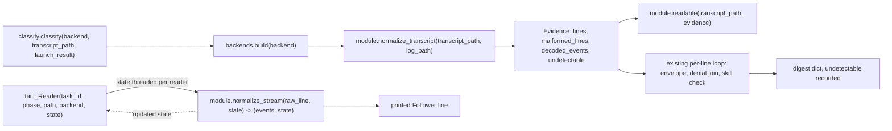

# Evidence Line Shape and Normalizers - Plan

This plan is Backends U6 from the origin, issue 22. It is not the unrelated U6 the outer-loop
plan also numbers.

## Goal Capsule

- **Objective:** A Task run on Codex or Grok gets the same Envelope, halt class, and finding set
  a Claude run gets for the same logical content, and a finding a backend cannot observe reads as
  unavailable rather than as a false "none found".
- **Means:** Each backend turns its own evidence into one written line shape, Claude's own
  transcript primitive, so the classifier's Envelope parser, denial join, and skill-substitution
  check stay single-implementation (origin KTD2).
- **Product authority:** Origin plan `docs/plans/2026-08-28-1101-feat-pluggable-cli-backends-plan.md`
  (R9, R11, R13, KTD2, KTD4). Relay `CONCEPTS.md` and `README.md`.
- **Execution profile:** `backends/claude.py`, `backends/codex.py`, and `backends/grok.py` fill
  the `readable`, `normalize_transcript`, and `normalize_stream` stubs origin U4 left as dummies.
  `classify.py` and `tail.py` stop parsing Claude's JSON shapes inline and dispatch to the
  Task's backend instead. One call site in `run.py` gains `backend=task.backend` because nothing
  else can supply it to the classifier.
- **Stop conditions:** Stop rather than approximate a finding a backend's evidence cannot show.
  Declare it unavailable (R13) instead of scanning prose for a heuristic match no fixture
  demonstrates is reliable.
- **Tail ownership:** The caller owns commit, push, and PR.
- **Open blockers:** None.

---

## Product Contract

**Product Contract preservation:** narrowed to origin unit U6. Origin R1 to R25 keep their
meaning and IDs in the origin file. This plan's R-IDs are local and cite the origin Rs they
realize. No origin requirement is rewritten.

### Summary

Give `classify.py` and `tail.py` one written line shape that every backend's evidence normalizes
into, so the Envelope parser, the denial join, the `last_message`/`last_message_tail` split, and
the skill-substitution check keep one implementation. Fill `backends.claude/codex/grok`'s
`readable`, `normalize_transcript`, and `normalize_stream` stubs against the U1 fixtures.

### Problem Frame

`classify.classify()` and `tail.decode()` today parse Claude's own JSON shapes inline: an
`assistant`/`user` transcript with `text`/`tool_use`/`tool_result` content blocks. `backends.build`
already resolves a Task's backend (origin U4) and `launch.py` already launches it (origin U5), but
`readable`, `normalize_transcript`, and `normalize_stream` are still the `_none` dummy origin U4
left them as. Fed a Codex Task today, `launch.find_transcript` predicts the `--output-last-message`
file as `transcript_path` and `classify.classify()` tries to `json.loads()` every line of that
plain-text file: every line fails, `envelope` is `None`, and a Task that actually finished with a
`status: complete` Envelope is misread as `no_envelope`. Fed a Grok Task, `classify.classify()`
never opens `~/.grok/sessions/.../updates.jsonl` at all; it reads whatever `launch.find_transcript`
predicted from `contracts.transcript_path`, a Claude-shaped path that does not exist for Grok.
Both backends' Envelope, tool-call, and denial detection are silently broken until this unit fills
the three stubs.

### Key Decisions

- **Declare skill-substitution, and on Codex denial detection, undetectable rather than
  approximated.** Neither the Codex nor the Grok fixture shows a structured, tool-call-shaped
  skill invocation the way Claude's `Skill` tool carries `input.skill`; Codex invokes skills by
  shelling out to `cat`/`sed` on the skill file, and Grok emits a plain slash-command string with
  no distinguishing tool call at all. Scanning either for an unqualified name is a heuristic no
  fixture demonstrates is reliable, and R13 makes an honest "unavailable" the correct answer
  over a false "none found". Governs R3, R4.

### Requirements

**Evidence normalization (classify.py, backends/\*.py)**

- R1. `classify.classify()` resolves the Task's backend and calls
  `backends.build(backend).normalize_transcript(transcript_path, log_path=launch_result.log_path)`,
  then `module.readable(transcript_path, evidence)`. The existing per-line loop, the Envelope
  parser, the denial join, and `required_skill_for()` read the returned shape unchanged. (origin
  R9, R11. Cites origin KTD2.)

- R2. The written line shape (`backends.Evidence`) carries `lines` (a list of `(line_number,
  dict)` pairs shaped exactly like a parsed Claude transcript object: `type` of `assistant` or
  `user`, `message.content` a list of `text`, `tool_use`, or `tool_result` blocks),
  `malformed_lines` (int), `decoded_events` (int, the count of lines a normalizer successfully
  decoded into an event, whether or not that event produced a `lines` block), and `undetectable`
  (a frozenset of the halt-class constants this backend's evidence cannot show). (origin KTD2)

- R3. A normalizer that detects a denial synthesizes Claude's exact sentence, `"Permission to use
  %s has been denied"`, into a synthesized `tool_result` block, so `contracts.DENIAL_REGEX` and
  the existing join match every backend unchanged. A backend with no per-tool deny signal (Codex)
  emits no denial-shaped block and adds `contracts.HALT_DENIED_TOOL`,
  `contracts.HALT_PATH_GATE`, and `contracts.HALT_TRACKER_WRITE_DENIED` to `undetectable`
  instead, since all three depend on a denial existing first. (origin R13, R25)

- R4. A normalizer never emits a `Skill`-named `tool_use` unless its native evidence carries a
  structurally equivalent call. Codex and Grok have none, so both add
  `contracts.HALT_SKILL_SUBSTITUTION` to `undetectable`. `required_skill_for()` is unchanged.
  (origin R13)

- R5. `classify.classify()` records the union of every consulted normalizer's `undetectable` as a
  sorted list on the digest, so a reader can tell "not checked" from "checked, none found" per
  finding class. The existing `findings_unavailable` boolean is unchanged and keeps its own
  meaning: the evidence source did not open at all. (origin R13)

- R6. `readable()` is a boolean per-backend predicate the classifier consults after normalizing,
  replacing a bare file-open test. Claude and Grok are readable when the primary evidence file
  opened, matching today's behavior exactly. Codex is readable only when the last-message file
  exists and `evidence.decoded_events >= 1` from the stdout log. Evidence has a third,
  never-written state, but `readable()` never sees it: `classify.classify()`'s existing
  precedence checks `launch_result.timed_out` before it normalizes or calls `readable()` at all,
  so a killed run whose last-message file was never written stays the timeout class untouched by
  this predicate. (origin R9. Cites origin KTD4.)

**Stream normalization (tail.py, backends/\*.py)**

- R7. `tail`'s per-line decode becomes a per-backend dispatch,
  `backends.build(task.backend).normalize_stream(raw_line, state)`, keyed off the Task each log
  belongs to (`manifest.tasks`, already carrying `.backend`). `state` is an opaque value the
  caller holds per log reader and threads into every call for that reader; the call returns
  `(events, state)`. Claude's and Codex's bodies ignore `state` and always return it as `None`;
  Claude's event logic is the existing `tail.decode()` body, moved and otherwise unchanged.
  (origin R9, R11)

- R8. The Codex stream normalizer tolerates the one non-JSON line the launcher's stderr merge
  produces (`Reading additional input from stdin...`, confirmed in U1) and keeps decoding the
  JSON events around it.

- R9. The Grok stream normalizer assembles one printed message from a contiguous run of `text`
  events, because Grok's `--output-format streaming-json` stdout carries one JSON object per
  token; the run ends at the next non-`text` event. The in-progress token buffer is carried in
  the `state` value R7 defines, scoped to one log reader, never in module-level or closed-over
  state the backend module holds, because one Follower runs many concurrent readers of the same
  backend and a shared buffer would interleave their partial text. A `thought` event is
  suppressed the same way Claude's `thinking` blocks are.

**Follower guard (tail.py)**

- R10. A Task log that grows past a byte threshold while producing zero decoded events prints
  exactly one Follower warning naming the Task and its backend, counted per Task rather than per
  poll. (origin approach step 6 under U6)

### Success Criteria

- The same logical Task, run on each of the three backends, produces the same Envelope status
  and the same finding classes when read from that backend's U1 fixtures.
- A Codex or Grok digest with a `status: complete` Envelope is classified `routable`, not
  `no_envelope`, which it is not today.

### Scope Boundaries

**Deferred for later (origin units, not this plan)**

- Origin U8's permission-posture and skill-form templates. This plan only produces
  `undetectable`; U8 decides what a Brief says about it.
- Origin U9's Closeout-runs-on-its-own-backend wiring.
- Origin U10's landing audit and landing refusal, which reads the `tool_use` findings this unit
  makes available but does not itself gate a merge.
- Origin U11's record and summary rendering of `undetectable` for a human reader. U11 also owns
  `contracts.HALT_LINES`' Cause-line wording: `HALT_DENIED_TOOL` and `HALT_PATH_GATE` both read
  "denied under dontAsk", which is only true for Claude. This unit is what first lets a Grok
  denial reach that renderer with a mode other than `dontAsk` (Grok enforces under `auto`, and
  `dontAsk` is in Grok's own forbidden-mode tuple), so U11 needs backend-neutral wording before
  an operator reads a Grok Cause line. Flagged here, not fixed here: `contracts.py` and
  `summary.py` are outside this unit's files.
- Origin U12's test stubs for `codex` and `grok`. This plan's tests read the U1 fixtures, not a
  stub, per `tests/fixtures/backends/README.md`.

**Outside this work**

- New `contracts.BACKEND_PINS` fields. No new launch fact was observed; `undetectable` reuses
  the existing halt-class constants.
- A fourth backend.
- `launch.find_transcript`'s pre-launch path prediction, which serves a different purpose
  (naming a file before the process starts) and is not touched.
- Live proof runs. This unit is proven against the U1 fixtures (origin U14 is the live-run unit).

**One deliberate deviation from the issue's file list.** `run.py`'s single
`classify.classify(...)` call site gains `backend=task.backend`. Nothing else in scope can supply
the backend name to the classifier: `launch.LaunchResult` does not carry it, and `task` is the
only value already in that scope that does. No other `run.py` behavior changes.

### Sources

- Origin: `docs/plans/2026-08-28-1101-feat-pluggable-cli-backends-plan.md`, section `### U6.
  Evidence line shape and normalizers`, and KTD2 and KTD4.
- Fixtures: `tests/fixtures/backends/{claude,codex,grok}/*` and their `README.md`, captured in U1.
- Current code: `skills/relay/scripts/relay/classify.py`, `tail.py`, `launch.py`
  (`find_transcript`, `LaunchResult`), `backends/__init__.py` and its three backend modules.
- Issue 22, part of issue 16.

---

## Planning Contract

### Key Technical Decisions

- KTD1. **The written line shape replays Claude's own transcript primitive; a normalizer
  translates, it does not invent a new schema.** A normalized `tool_use`/`tool_result` pair
  looks exactly like the dict `classify.classify()` already destructures today. Chosen over a
  neutral schema unrelated to any one CLI: reusing Claude's shape keeps the Envelope parser, the
  `last_message`/`last_message_tail` split, the denial join, and the skill-substitution check
  exactly as they are, and Claude's own normalizer becomes the identity wrap the origin plan
  predicted it would be. Governs R1, R2.

- KTD2. **Undetectable is declared per finding class, not per backend.** `Evidence.undetectable`
  holds the exact halt-class constants (`contracts.HALT_DENIED_TOOL`, `HALT_PATH_GATE`,
  `HALT_TRACKER_WRITE_DENIED`, `HALT_SKILL_SUBSTITUTION`) a backend's evidence cannot show,
  reusing the closed halt-class vocabulary rather than a second one. Chosen over one
  backend-level "no denial detector" flag, which cannot say that skill-substitution is
  separately undetectable on a backend that does have a denial detector: Grok has both;
  Codex has neither. Governs R3, R4, R5.

- KTD3. **`readable()` runs after normalization, not before.** `classify.classify()` normalizes
  first, then calls `module.readable(transcript_path, evidence)`, so Codex's "decoded at least
  one event" test reads the parse the classifier already did rather than opening the log a
  second time. `launch.find_transcript`'s own `os.path.exists` check is unrelated and unchanged:
  it predicts a path before the process starts, when no evidence exists yet to normalize.
  Governs R6. (Cites origin KTD4.)

- KTD4. **classify's Grok normalizer and tail's Grok normalizer read different files and share no
  reassembly routine.** classify reads `~/.grok/sessions/.../updates.jsonl`, whose
  `agent_message_chunk` events are already complete per-turn text; the last one is `last_text`
  with no reassembly. tail reads the raw `--output-format streaming-json` stdout, whose `text`
  events are one token each; a printed message is the last contiguous run of them. Chosen over
  one shared reassembly routine: the two files are not the same shape, and forcing one routine to
  cover both would hide that the session file needs none of this work. Governs R1 (Grok's
  `normalize_transcript`), R9.

- KTD5. **Codex's last-message file is read directly as `last_text`; the stdout log is never
  hunted for it.** The CLI already extracts the final message into
  `--output-last-message <file>` for exactly this purpose; re-deriving it from the last
  `item.completed:agent_message` event in the stream risks disagreeing with the file the
  Closeout's terminal-line contract also reads. The stdout log is parsed only for tool-use
  synthesis and the decoded-event count `readable()` needs. Governs R1 (Codex's
  `normalize_transcript`).

- KTD6. **`normalize_stream` threads an opaque `state` value; no backend module holds mutable
  state of its own.** Grok's token-run reassembly (R9) needs a buffer that survives from one
  call to the next, but `tail._Reader` runs one instance per log file and a Follower drains many
  readers of the same backend concurrently; state living on the `grok` module itself, or in a
  closure the module builds once, would interleave two Tasks' partial messages. `_Reader` owns
  one `state` value per reader and passes it into every `normalize_stream` call for that reader,
  the same shape a fold or reduce threads an accumulator. Chosen over a per-backend class
  instance: `INTERFACE` (origin KTD1, KTD3) is a fixed set of module-level callables precisely so
  no backend can grow a shape the others lack, and a stateful instance for Grok alone would
  break that parity test. Governs R7, R9.

### High-Level Technical Design

### Output Structure

No new files. `backends/__init__.py` gains the `Evidence` dataclass and the shared `_read_jsonl`
helper both `claude.py` and `grok.py` call; `classify.py`'s own `read_transcript` is removed once
`backends.claude.normalize_transcript` replaces its call sites; `tail.py`'s free function
`decode()` becomes `backends.claude.normalize_stream` (kept as a thin call-through only if a test
still names `tail.decode` directly).

### Assumptions

- Codex's `file_change` items normalize to an `Edit`-named `tool_use` for every changed path.
  The fixtures only show single-path `changes` lists; a multi-path change synthesizes one block
  per path. Unvalidated agent bet, recorded because no captured fixture exercises it.
- Grok's `tool_call` name resolves from `_meta["x.ai/tool"]["name"]`, falling back to `title`
  when absent. Only `read_file` appears in the captured session-transcript fixture; the fixture's
  own `stdout-complete.jsonl` confirms `toolName` carries `run_terminal_command` in the raw
  stream shape, which is the mapping this plan grounds `Bash` detection in.
- A `SILENT_LOG_BYTES` threshold for the Follower guard is a new constant sized like `tail`'s
  existing `TEXT_CHARS`-scale constants; no specific byte count was requested and none is
  load-bearing to a test scenario beyond "past some threshold, exactly one warning".

### Sequencing

U1 first: it defines `Evidence` and rewires `classify.classify()`'s Claude path, which must stay
byte-identical before Codex or Grok are added. U2 and U3 each add one backend's
`normalize_transcript`/`readable` and can run in either order once U1 lands. U4 (tail.py) depends
on U1 for the dispatch pattern and on U2/U3 for normalizers to call. U5 proves all three together
against the fixtures.

---

## Implementation Units

### U1. Shared evidence contract and the Claude normalizer

**Goal:** `classify.classify()` reads through `backends.build(...).normalize_transcript()` and
`.readable()` instead of its own inline parser, with Claude's own behavior byte-identical to
today.

**Requirements:** R1, R2, R6 (Claude half), R5. Cites KTD1, KTD3.

**Dependencies:** Origin U4, U5, U7 (all done).

**Files:** `skills/relay/scripts/relay/backends/__init__.py`, `backends/claude.py`,
`skills/relay/scripts/relay/classify.py`, `skills/relay/scripts/relay/run.py` (one call site),
`tests/test_classify.py`.

**Approach:**

1. Define a frozen `Evidence` dataclass in `backends/__init__.py`: `lines`, `malformed_lines`,
   `decoded_events`, `undetectable`. Add a shared `_read_jsonl(path)` helper there: open the file,
   `json.loads()` each stripped non-empty line, count a `ValueError` or a non-dict result as
   malformed, and return `(lines, malformed_count)`. This is `classify.read_transcript()`'s body,
   moved so `backends/grok.py` can call it too.
2. `backends/claude.py.normalize_transcript(transcript_path, log_path=None)` calls `_read_jsonl`,
   wraps the result: `decoded_events` is the count of parsed lines, `undetectable` is
   `frozenset()`.
3. `backends/claude.py.readable(transcript_path, evidence)` returns whether the file opened
   (the same `OSError`/`TypeError` test `classify.classify()` runs today).
4. `classify.classify()` gains a `backend="claude"` keyword so every existing call site is
   unchanged. It calls `backends.build(backend).normalize_transcript(transcript_path,
   log_path=getattr(launch_result, "log_path", None))`, then `module.readable(...)`, then walks
   `evidence.lines` exactly where it walks `lines` today. Remove `classify.read_transcript`.
5. Append `"undetectable": sorted(evidence.undetectable)` to the digest dict (R5). Leave
   `findings_unavailable` untouched.
6. In `run.py`, change the one `classify.classify(...)` call to pass `backend=task.backend`.

**Test scenarios:**

- Every existing `test_classify.py` test passes unmodified (backend defaults to `claude`,
  behavior unchanged).
- A Claude digest carries `"undetectable": []`.
- `backends.build("claude").readable(transcript_path, evidence)` returns `False` for a
  transcript path that does not exist and `True` for one that does, matching today's
  `transcript_present` semantics.

**Verification:** `python3 -m unittest test_classify` from `tests/` is green with an unchanged
pass count for every pre-existing test.

### U2. Codex normalizer for classify

**Goal:** A Codex run's Envelope, tool-call findings, and undetectable classes come from its two
evidence files.

**Requirements:** R3, R4, R6 (Codex half). Cites KTD2, KTD3, KTD5.

**Dependencies:** U1.

**Files:** `skills/relay/scripts/relay/backends/codex.py`, `tests/test_classify.py`.

**Approach:**

1. `normalize_transcript(transcript_path, log_path=None)` reads `transcript_path` (the
   `--output-last-message` file) directly as `last_text`; it is prose, not JSON, and needs no
   parse.
2. Parse `log_path` with `backends._read_jsonl`, which already skips and counts the one
   non-JSON line (R8's scenario, proven here against the classifier's malformed-line count).
3. Map each `item.completed` event to a synthesized `tool_use` block: `command_execution` to
   name `Bash`, `input={"command": item["command"]}`; `file_change` to name `Edit`, one block per
   entry in `item["changes"]`, `input={"file_path": entry["path"]}`. Other item types count
   toward `decoded_events` but synthesize no `tool_use`.
4. Never emit a `tool_result` or a `Skill` `tool_use`. Set
   `undetectable = frozenset({contracts.HALT_DENIED_TOOL, contracts.HALT_PATH_GATE,
   contracts.HALT_TRACKER_WRITE_DENIED, contracts.HALT_SKILL_SUBSTITUTION})`, matching Codex's
   `enforces_at_launch: False` and its absent deny flag.
5. `readable(transcript_path, evidence)` returns
   `os.path.exists(transcript_path) and evidence.decoded_events >= 1`.

**Test scenarios (against `tests/fixtures/backends/codex/`):**

- `last-message-complete.txt` plus `stdout-complete.jsonl` normalizes into a `status: complete`
  Envelope.
- `last-message-blocked.txt` plus `stdout-blocked.jsonl` normalizes into a `status: blocked`
  Envelope carrying its prose blocker.
- `closeout-last-message-skipped-long.txt` classifies as `complete` (the closeout terminal line
  past the 200-character head).
- The non-JSON line in `stdout-complete.jsonl` is skipped without losing the JSON events
  around it; `tool_calls` still counts every `command_execution` and `file_change`.
- A Codex run whose last-message file does not exist and whose launch result is `timed_out`
  stays the timeout class, not a runner fault (regression test on existing precedence).
- A Codex run whose stdout log exists but decodes zero events is not readable, even though the
  file opened.
- A Codex digest records `denied_tool`, `path_gate`, `tracker_write_denied`, and
  `skill_substitution` under `undetectable`, and reports no finding of any of those classes.

**Verification:** `python3 -m unittest test_classify` is green with the new Codex fixture tests.

### U3. Grok normalizer for classify

**Goal:** A Grok run's Envelope and tool-call findings come from its session file, with a real
denial detector.

**Requirements:** R3, R4, R6 (Grok half). Cites KTD2, KTD3.

**Dependencies:** U1.

**Files:** `skills/relay/scripts/relay/backends/grok.py`, `tests/test_classify.py`.

**Approach:**

1. `normalize_transcript(transcript_path, log_path=None)` reads `transcript_path`
   (`updates.jsonl`) with `backends._read_jsonl`. Each line's `params.update.sessionUpdate` picks
   the mapping: `agent_message_chunk` to a `text` block (`content.text`, already one complete
   per-turn message); `tool_call` to a `tool_use` block (`id` from `toolCallId`, `name` from
   `_meta["x.ai/tool"]["name"]` falling back to `title`, mapping `run_terminal_command` to
   `Bash` with `input={"command": rawInput.get("command")}` and leaving other names as-is with
   `input=rawInput`); `tool_call_update` to a `tool_result` block only when `status == "failed"`
   and its content text contains the literal substring `"Denied by permission policy"`,
   synthesizing Claude's canonical denial sentence (KTD1) with the tool name from the joined
   `tool_call`. A `tool_call_update` whose `status` is `"failed"` for another reason (a missing
   file, or Grok's own `auto`-mode judgment call, phrased "Auto mode blocked this action ...")
   is not a denial and produces no block, matching how a free-form model refusal in Claude's own
   transcript is not specially classified either. Every other `tool_call_update` and every other
   `sessionUpdate` kind counts toward `decoded_events` but produces no block.
2. `undetectable = frozenset({contracts.HALT_SKILL_SUBSTITUTION})` only: Grok has a demonstrated
   deny mechanism but no structured skill-invocation call to check for substitution.
3. `readable(transcript_path, evidence)` matches Claude's: the file opened.

**Test scenarios (against `tests/fixtures/backends/grok/`):**

- `session-transcript-complete.jsonl` normalizes into a `status: complete` Envelope, its
  `last_text` matching the last `agent_message_chunk`.
- `session-transcript-complete.jsonl` also carries one embedded `tool_call_update` with
  `status: "failed"` and content naming `Denied by permission policy: deny rule on bash matching
  "rm -rf*"`, alongside that run's ordinary tool calls; it produces a `denied_tool` finding
  naming `run_terminal_command` and the `rm -rf` argument. `tests/fixtures/backends/grok/
  denial-refusal.jsonl` is the raw `--output-format streaming-json` stdout shape, the same shape
  `stdout-complete.jsonl` uses, not the `updates.jsonl` shape this normalizer reads; it is U4's
  fixture, not this unit's.
- `session-transcript-blocked.jsonl` normalizes into a `status: blocked` Envelope with its prose
  blocker; its own embedded `"Auto mode blocked this action"` `tool_call_update` produces no
  denial finding, proving the two failure phrasings are told apart.
- `closeout-last-message-skipped-long.txt`'s companion classifies as `complete`.
- A Grok digest records `skill_substitution` under `undetectable` and still reports `denied_tool`
  findings normally, proving the two are independent per KTD2.

**Verification:** `python3 -m unittest test_classify` is green with the new Grok fixture tests.

### U4. tail.py per-backend stream normalizers and the Follower guard

**Goal:** `relay tail` and `run --follow` render Codex's and Grok's stdout the same way they
render Claude's, and a silently growing log warns exactly once.

**Requirements:** R7, R8, R9, R10. Cites KTD1, KTD4.

**Dependencies:** U1 for the dispatch pattern; U2 and U3 so a real normalizer exists to call
(tail's `normalize_stream` is separate code from classify's `normalize_transcript` on the same
module, per KTD4, but both units touch the same three files).

**Files:** `skills/relay/scripts/relay/tail.py`, `backends/claude.py`, `backends/codex.py`,
`backends/grok.py`, `tests/test_tail.py`.

**Approach:**

1. `tail.candidates(manifest, store)` gains each Task's backend alongside its id and phase.
   `_Reader` carries it, plus a `stream_state` attribute it initializes to `None` and never
   inspects (KTD6). The caller (`emit()`'s inner loop) calls
   `events, reader.stream_state = backends.build(reader.backend).normalize_stream(raw,
   reader.stream_state)` instead of the free function `tail.decode()`, so the returned state
   feeds back into that same reader's next call and no other reader's.
2. `backends/claude.py.normalize_stream(raw, state=None)` is `tail.decode()`'s body, moved
   verbatim, returning `(events, None)`. Remove `tail.decode()` once nothing else calls it,
   keeping a thin call-through only if an existing test names `tail.decode` directly.
3. `backends/codex.py.normalize_stream(raw, state=None)`: return `([], None)` for a line
   `json.loads()` cannot parse (R8). Render `item.completed:agent_message` text (bounded to
   `tail.TEXT_CHARS`, `thinking` has no Codex equivalent so nothing is suppressed) and
   `item.started:command_execution`/`item.started:file_change` as the existing
   `"  > %-10s %s"` tool-call line, argument from `command` or the first `changes[].path`;
   always returns `(events, None)`, since Codex needs no state across calls.
4. `backends/grok.py.normalize_stream(raw, state=None)`: `state` is the in-progress text-token
   buffer (a list of strings, or `None` before the first token). On a `text` event, append its
   token to the buffer and return `([], updated_buffer)`. On any other event, flush a non-empty
   buffer into one printed line first, then render `tool_call` as the existing tool-call line
   (argument from `rawInput`) and suppress `thought` the way Claude's `thinking` is suppressed
   (R9); return `(events, None)`, clearing the buffer.
5. Follower guard (R10): in `tail.follow()`, track bytes drained and decoded-event count per
   Task. Add a `SILENT_LOG_BYTES` constant. Once a Task's log has drained past that many bytes
   with zero decoded events, `announce()` one line naming the Task id and its backend, and mark
   it warned so the check never fires twice for that Task.

**Test scenarios:**

- Each backend's `stdout-complete.jsonl` fixture decodes into tool-call lines in the existing
  `"  > name argument"` shape and text lines bounded to `TEXT_CHARS`.
- The Codex stream normalizer skips the interleaved non-JSON line without losing the JSON events
  around it (R8, proven here against the stream reader rather than the classifier).
- The Grok stream normalizer assembles one printed line from a contiguous run of `text` events
  and starts a new line after an intervening `tool_call`.
- Two `_Reader` instances for two Grok logs, driven with interleaved calls and each holding its
  own `stream_state`, never mix their partial text into the other's printed line (proves KTD6).
- `tests/fixtures/backends/grok/denial-refusal.jsonl` decodes into a `tool_call` line for
  `run_terminal_command` and a `text` line reporting the command did not run; the Follower shows
  the attempt the way it shows any tool call, since deciding it was a denial is classify's job,
  not tail's.
- A `thought` (Grok) or `thinking` block (Claude) is never printed. Codex has no such event and
  needs no suppression test.
- A log that grows past `SILENT_LOG_BYTES` with zero decoded events emits exactly one Follower
  warning across a scripted multi-poll run, not one per poll.

**Verification:** `python3 -m unittest test_tail` from `tests/` is green, including the scripted
guard test.

### U5. Cross-backend parity proof

**Goal:** The same logical Task, run on any of the three backends, produces the same Envelope and
the same finding classes, proven against the U1 fixtures rather than against code written in this
same session.

**Requirements:** Ties R1 through R10 together against the origin's own U6 verification line. No
new requirement.

**Dependencies:** U1, U2, U3, U4.

**Files:** `tests/test_classify.py`, `tests/test_tail.py`.

**Approach:**

1. Run the origin's own U6 test-scenario list once per backend directory in
   `tests/fixtures/backends/`, rather than Claude-only: the complete pair reads `complete`, the
   blocked pair reads `blocked` with its prose blocker, the long closeout terminal line reads
   `complete`, a malformed line is counted and skipped on every backend.
2. Do not add a fourth "does the stub agree" test.
   `docs/solutions/logic-errors/stubbed-seams-agree-by-construction-first-live-run-found-five-contract-defects.md`
   is why these read the U1 fixtures, never `tests/stub-claude/`.

**Test scenarios:** The origin's U6 list, reread as "on every backend" once per backend rather
than Claude-only (already itemized under U2, U3, and U4 above; this unit is where they run
side by side and any drift between backends' results on the same shape surfaces).

**Verification:** `python3 -m unittest test_classify test_tail` passes against the U1 fixtures,
and the same logical run on three backends produces the same Envelope and the same finding
classes, matching the origin's own U6 verification line.

---

## System-Wide Impact

- **classify's Grok file and tail's Grok file are not the same file.** classify reads
  `~/.grok/sessions/.../updates.jsonl`; tail reads the Task's captured stdout
  (`--output-format streaming-json`). A future change to one must not be assumed to cover the
  other (KTD4).
- **`undetectable` is inert until origin U10 and U11 read it.** This unit only records it on the
  digest. Landing this unit changes no operator-visible output for Claude runs (byte-identical)
  and, for Codex and Grok runs, turns today's silent `no_envelope` misclassification into a
  correct one for the first time.
- **`run.py` gains one keyword argument at one call site.** No other `run.py` behavior changes;
  see the Scope Boundaries deviation note.

---

## Risks and Dependencies

| Risk | Consequence | Mitigation |
|---|---|---|
| A future Codex or Grok CLI release changes its stream schema | A normalizer silently mis-parses new evidence | Tests read literal captured fixtures; a schema change is caught by a future U1-style re-capture, not by this plan |
| Synthesizing Claude's denial sentence for Grok makes a Cause line read as Claude-authored | A reader assumes Claude-specific wording elsewhere | The synthesized string is scoped to the `tool_result` block feeding the existing join; no other Claude-specific prose is synthesized |
| `contracts.HALT_LINES` still reads "denied under dontAsk" once a Grok denial reaches it | A Grok operator's Cause line blames a permission mode (`dontAsk`) that backend never used and is barred from using | Flagged in Scope Boundaries for origin U11 to fix; `contracts.py` and `summary.py` are outside this unit's files |
| Marking skill-substitution permanently undetectable on Codex and Grok | A real substitution on those backends is never caught by this seam | Deliberate (Key Decision above); origin U10's operator-acceptance and landing-bound controls compensate, not this unit |
| The `run.py` deviation surprises a reviewer expecting only the issue's named files | Review friction | Called out explicitly in Scope Boundaries and in this table |

**Dependencies.** Origin U4, U5, and U7 are on `main`. Standard library only.

---

## Verification Contract

| Gate | Command | Applies to |
|---|---|---|
| Classifier unit | `python3 -m unittest test_classify` from `tests/` | U1, U2, U3, U5 |
| Follower unit | `python3 -m unittest test_tail` from `tests/` | U4, U5 |
| Full suite | `python3 -m unittest discover -s tests` from the repo root | after all units |
| Fixtures, not stubs | The new tests import `tests/fixtures/backends/`, not `tests/stub-claude/` | U2, U3, U4, U5 |
| Claude unchanged | Every pre-existing `test_classify.py` and `test_tail.py` test passes with no edit to its assertions | U1, U4 |

---

## Definition of Done

- All five units landed. `test_classify` and `test_tail` are green. The full suite is green.
- A Codex or Grok fixture pair normalizes into the Envelope a hand read of the fixture predicts.
- `undetectable` is recorded on the digest for every backend, empty on Claude, and matches the
  set each Key Technical Decision names.
- No abandoned scaffolding in the diff: `classify.read_transcript` and `tail.decode()` are
  removed once nothing calls them, not left beside their replacements.
- Origin plan is not rewritten. Progress is the git commit and issue 22, not an edit to the
  origin file.
