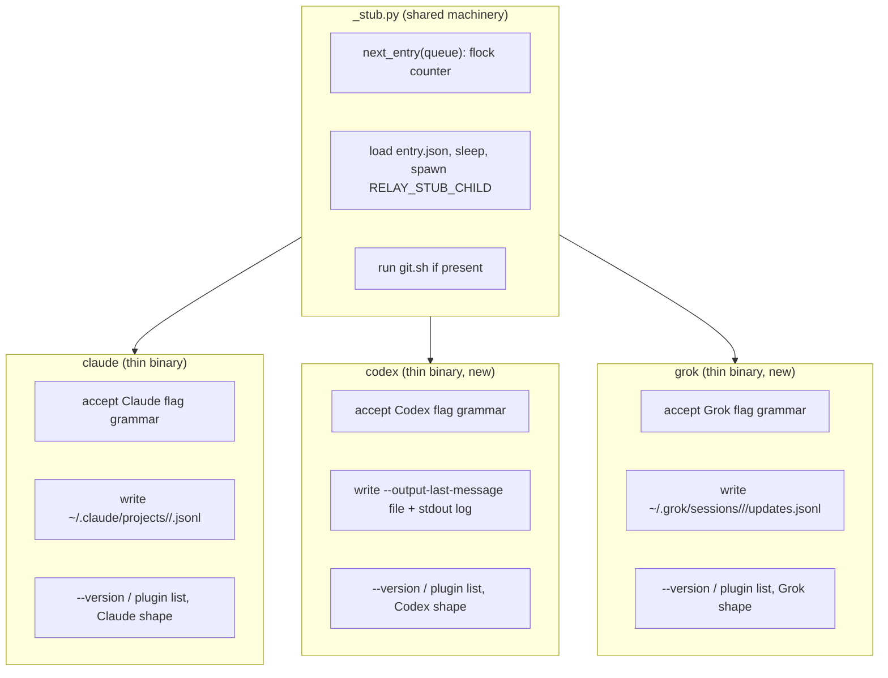

# Test Stubs for Codex and Grok - Plan

This plan is Backends U12 from the origin, issue 27, part of issue 16. It is not the unrelated
U12 the outer-loop plan also numbers.

## Goal Capsule

- **Objective:** The suite can exercise all three backends' run-loop branching, launch, timeout,
  orphan-kill, and evidence discovery, without ever launching a real `codex` or `grok` CLI.
- **Means:** Factor the existing `claude` stub's shared queue and process machinery into a module
  the three thin binaries import, then give each binary its own backend's flag grammar, version
  output, plugin-list output, and evidence write location, so `tests/stub-claude/` already on
  `PATH` covers `claude`, `codex`, and `grok` alike.
- **Product authority:** Origin plan `docs/plans/2026-08-28-1101-feat-pluggable-cli-backends-plan.md`
  (R6, R9). Relay `README.md` and `CONCEPTS.md`.
- **Execution profile:** `tests/stub-claude/_stub.py` is new shared machinery; `tests/stub-claude/claude`
  shrinks to a thin binary against it with behavior unchanged; `tests/stub-claude/codex` and
  `tests/stub-claude/grok` are new. No `skills/relay/scripts/relay/` file changes: the seam these
  stubs exercise (`backends/*.py`, `launch.py`) already exists from origin U1 through U6.
- **Stop conditions:** None identified; this is test infrastructure with no external dependency.
- **Tail ownership:** The caller owns commit, push, and PR.
- **Open blockers:** None.

---

## Product Contract

**Product Contract preservation:** narrowed to origin unit U12. Origin R1 to R25 keep their
meaning and IDs in the origin file. This plan's R-IDs are local and cite the origin Rs they
support. No origin requirement is rewritten.

### Summary

Give the test suite a stub `codex` and a stub `grok` binary, sharing their queue-and-replay
machinery with the existing stub `claude`, so any test that launches a Task or a Closeout can
choose a backend without a real CLI. The stubs prove the run loop's branching (argument grammar,
evidence location, timeout, orphan survival); they do not prove the normalizers, which origin U6
already tests against captured fixtures, and they do not prove real CLI behavior, which origin
U14's live runs do.

### Problem Frame

`tests/stub-claude/claude` is a single Python script combining shared machinery (a flock-guarded
queue reader, fixture replay into a named transcript path, an orphan child spawn, a `git.sh` hook)
with Claude-specific decisions (its flag names, its `~/.claude/projects/<slug>/<id>.jsonl`
transcript location, its `plugin list` and `--version` output shapes). `backends/codex.py` and
`backends/grok.py` (origin U2, U3, U4) and their `build_args`/`evidence_sources` are already
written and already tested against captured fixtures (origin U6), but nothing on `PATH` can stand
in for the real `codex` or `grok` binary those functions describe. A test that wants to launch a
Task on either backend today has no stub to launch, so `launch.py`'s per-backend branches
(argument list construction, evidence path resolution, the timeout-then-kill path, the orphan
group-kill path) are exercised for `claude` only.

### Key Decisions

- **The three stubs share one machinery module and diverge only where the backends actually
  do.** `_stub.py` owns the queue protocol, entry consumption, sleep, child spawning, and the
  `git.sh` hook, identical machinery today's `claude` stub already has. Each thin binary supplies
  only its own backend's four points of difference: the flag grammar it accepts, its evidence
  write location(s), its `--version` output, and its `plugin list` output. Governs the whole
  Approach.

### Requirements

**Shared stub machinery (`tests/stub-claude/_stub.py`)**

- R1. `_stub.py` exposes the queue protocol (`next_entry`, entry loading, sleep, child spawn,
  `git.sh` execution) as functions a thin binary's `main()` calls, with behavior byte-identical to
  today's `claude` stub: same env vars (`RELAY_STUB_QUEUE`, `RELAY_STUB_SLEEP`, `RELAY_STUB_CHILD`,
  `RELAY_STUB_CLI_VERSION`), same queue directory layout, same counter-under-flock consumption
  order. (supports origin R6, R9)
- R2. `tests/stub-claude/claude` is rewritten against `_stub.py` with no behavioral change: every
  existing `test_stub.py` test for the `claude` binary passes unmodified.

**Codex stub (`tests/stub-claude/codex`)**

- R3. Given `RELAY_STUB_QUEUE` entries, the codex stub writes its queued fixture as the file its
  own `--output-last-message <path>` argument names (prose, not JSON) and, when a `stream` entry
  is set, echoes queued JSON-lines events to stdout the way a real Codex `--json` run interleaves
  tool events with its own non-JSON `Reading additional input from stdin...` line. (supports
  origin R9; matches `backends.codex.evidence_sources`)
- R4. The codex stub accepts exactly the flag set `backends.codex.build_args` builds:
  `exec --sandbox <mode> --model <model> -C <repo> --output-last-message <path> --json --add-dir
  <path> <brief>`. An unrecognized flag is a hard error (nonzero exit, message naming the flag),
  so a `build_args` change that drifts from what the stub accepts fails loudly instead of the stub
  silently ignoring it. (supports origin R6)
- R5. `codex --version` prints `contracts.BACKEND_PINS["codex"]["version_output_sample"]` by
  default, overridable by `RELAY_STUB_CLI_VERSION`, so the printed text parses through
  `backends.codex.parse_version` to `contracts.BACKEND_PINS["codex"]["version_tested"]`.
- R6. `codex plugin list` prints one line shaped so
  `contracts.BACKEND_PINS["codex"]["plugin_version_pattern"]` matches it and captures
  `contracts.BACKEND_PINS["codex"]["plugin_version"]`.

**Grok stub (`tests/stub-claude/grok`)**

- R7. Given `RELAY_STUB_QUEUE` entries, the grok stub writes its queued fixture to
  `~/.grok/sessions/<url-encoded-cwd>/<session-id>/updates.jsonl`, the exact path
  `backends.grok.evidence_sources` computes, using the same realpath-then-encode rule the stub's
  slug rule already proves for Claude. (supports origin R9)
- R8. The grok stub accepts exactly the flag set `backends.grok.build_args` builds: `-p <brief>
  -s <session-id> --model <model> --effort <effort> --permission-mode <mode>` plus zero or more
  repeated `--allow <rule>` / `--deny <rule>` pairs and `--output-format streaming-json`. An
  unrecognized flag is a hard error, matching R4's codex rule. (supports origin R6)
- R9. `grok --version` prints `contracts.BACKEND_PINS["grok"]["version_output_sample"]` by
  default, overridable by `RELAY_STUB_CLI_VERSION`, parsing through `backends.grok.parse_version`
  to `contracts.BACKEND_PINS["grok"]["version_tested"]`.
- R10. `grok plugin list --json` prints a JSON object matching
  `contracts.BACKEND_PINS["grok"]["plugin_version_pattern"]` and carrying
  `contracts.BACKEND_PINS["grok"]["plugin_version"]`.

**Cross-backend proof (`tests/test_stub.py`)**

- R11. One test drives a queue with a Task entry launched on one backend and a Closeout entry
  launched on another, and asserts both consume the shared counter in order (no double-take, no
  skip). (supports origin R9)
- R12. One test per new stub proves `RELAY_STUB_CHILD=1` spawns a surviving orphan the way the
  existing `claude` test does, bounded to the shortest viable grace per the origin unit's
  suite-time note; the cheaper flag-grammar and evidence-path assertions are not repeated at this
  cost.
- R13. One test per new stub proves an argument outside its backend's own grammar (R4, R8) exits
  nonzero rather than being silently accepted.

### Success Criteria

- `launch.launch(...)` against a manifest Task with `backend="codex"` or `backend="grok"`,
  pointed at `tests/stub-claude` via `PATH`, completes and leaves evidence exactly where
  `backends.codex.evidence_sources` / `backends.grok.evidence_sources` predicts, with no change to
  `launch.py` itself.
- `python3 -m unittest discover -s tests` passes with the three stubs in place, and suite time
  stays at or under the origin unit's four-minute ceiling.

### Scope Boundaries

**Deferred for later (origin units, not this plan)**

- Proving the normalizers (`backends.codex.normalize_transcript`, `.normalize_stream`, and
  Grok's equivalents) produce correct findings. Origin U6 already proves those against captured
  fixtures in `tests/fixtures/backends/`; this plan's stubs write arbitrary queued bytes to the
  right location and are never asked whether those bytes are semantically realistic.
- Live-CLI parity. Origin U14's live proof runs are what confirm a stub's grammar still matches
  the real binary's; a stub that drifts from the real CLI is a U14 finding, not a U12 one.

**Outside this work**

- Any change to `skills/relay/scripts/relay/` files. This plan only adds and refactors files
  under `tests/stub-claude/` and extends `tests/test_stub.py`.
- A fourth backend or a change to `contracts.BACKEND_PINS`.

### Sources

- Origin: `docs/plans/2026-08-28-1101-feat-pluggable-cli-backends-plan.md`, section `### U12.
  Test stubs for codex and grok`, and R6, R9.
- Current code: `tests/stub-claude/claude`, `tests/test_stub.py`, `tests/_paths.py`,
  `skills/relay/scripts/relay/backends/{__init__,claude,codex,grok}.py`,
  `skills/relay/scripts/relay/contracts.py` (`BACKEND_PINS`), `skills/relay/scripts/relay/launch.py`.
- The four PATH setup sites that already point at `tests/stub-claude`: `tests/test_closeout.py`,
  `tests/test_launch.py`, `tests/test_manifest.py`, `tests/test_run.py`.
- Issue 27, part of issue 16.

---

## Planning Contract

### Key Technical Decisions

- KTD1. **A thin binary owns only its backend's four points of difference; everything else lives
  in `_stub.py`.** The four are: the flag grammar it accepts (R4, R8), where it writes evidence
  (R3, R7), its `--version` text (R5, R9), and its `plugin list` text (R6, R10). Chosen over
  copying the whole `claude` stub twice and editing each copy: three independent copies of the
  queue-and-replay machinery is exactly the class of defect the origin unit's own execution note
  warns about (stubs and normalizers written together in one session agree by construction), and
  a queue-protocol bug fixed in one copy silently stays present in the other two. Governs R1, R2.

- KTD2. **Flag grammar is validated by an explicit allow-list per backend, not by tolerating
  anything.** R4 and R8 make an unrecognized flag a hard failure. Chosen over accepting any
  `--flag value` pair the way a lenient stub would: a lenient stub cannot catch a `build_args`
  regression that adds or renames a flag, because the stub would silently accept the drifted
  argument list and the test would stay green. This is the one place these stubs intentionally
  diverge from being maximally permissive. Governs R4, R8, R13.

- KTD3. **Version and plugin-list output are derived from `contracts.BACKEND_PINS`, not
  re-typed.** R5, R6, R9, R10 read `version_output_sample` and `plugin_version` off the existing
  pins rather than hardcoding a second copy of either string in the stub. Chosen over inlining
  literal strings the way the `claude` stub's default (`"2.1.250 (Claude Code)"`) does today: that
  literal already drifted once from `contracts.CLI_VERSION_TESTED` in spirit (the stub's comment
  warns "bump both together"), and reading the pin directly removes the chance of the two drifting
  silently on a version bump for `codex` or `grok`. The `claude` stub's own literal default is left
  as-is (R2 requires no behavior change to it); only the two new stubs read the pin. Governs R5,
  R6, R9, R10.

- KTD4. **Grok's evidence path is computed the same way the runner computes it, not re-derived
  independently.** R7 has the stub call the same `urllib.parse.quote` encoding
  `backends.grok.evidence_sources` uses, imported from the `relay` package rather than
  reimplemented, so the stub and the code under test cannot silently drift on the encoding rule
  (e.g. which characters `safe=""` leaves unescaped). Governs R7.

### High-Level Technical Design

### Output Structure

- `tests/stub-claude/_stub.py` (new): the queue protocol functions, parameterized by the caller's
  evidence-write callback and env-var defaults.
- `tests/stub-claude/claude` (rewritten, same behavior): flag parse, transcript path, `--version`,
  `plugin list`, calling into `_stub.py` for the rest.
- `tests/stub-claude/codex` (new): same shape, Codex specifics.
- `tests/stub-claude/grok` (new): same shape, Grok specifics.
- `tests/test_stub.py` (extended): existing `StubClaude` tests untouched; new test classes for
  `codex` and `grok`, plus the cross-backend queue-order test (R11).

### Assumptions

- The codex stub's queued `stream` entry, when present, is treated as literal lines to echo to
  stdout (matching the existing `claude` stub's `stream` behavior exactly), including one
  deliberately non-JSON line when a test wants to prove R8's tolerance path (origin U6's R8) is
  exercised end to end at the stub layer too. No new queue field is added; a test composes that
  line into its own fixture file.
- `RELAY_STUB_SLEEP` and `RELAY_STUB_CHILD` apply identically across all three binaries (global
  env vars, not per-backend-named), matching how the existing `claude` stub already reads them and
  how the four PATH setup sites already scope one stub invocation at a time.

### Sequencing

R1/R2 (extract `_stub.py`, rewrite `claude` against it) land first and must leave every existing
`test_stub.py` assertion green before either new binary is written, since both new binaries import
the same module. R3 through R6 (codex) and R7 through R10 (grok) can then proceed in either order.
R11 through R13 are proven last, once both new binaries exist.

---

## Implementation Units

### U1. Extract shared stub machinery

**Goal:** `tests/stub-claude/claude` behaves exactly as it does today, with its queue-and-replay
machinery factored into `_stub.py` so `codex` and `grok` can import it.

**Requirements:** R1, R2. Cites KTD1.

**Dependencies:** none.

**Files:** `tests/stub-claude/_stub.py` (new), `tests/stub-claude/claude`, `tests/test_stub.py`.

**Approach:**

1. Move `next_entry`, the queue-counter flock logic, entry loading, the `RELAY_STUB_SLEEP` sleep,
   the `RELAY_STUB_CHILD` spawn, and the `git.sh` run into `_stub.py` as plain functions (no
   class), taking the queue directory and env as arguments the way the current inline code already
   reads them.
2. `_stub.py` exposes one `run(write_evidence, version_text=None, plugin_text=None)` entry point
   whose `write_evidence(entry, session_id, argv, flags, cwd)` callback is the only backend-specific
   piece: it receives the loaded queue entry and returns nothing, writing wherever its backend
   locates evidence. `main()` in each thin binary parses its own flags, prints its own `--version`
   / `plugin list` output, and calls `_stub.run(...)`.
3. `tests/stub-claude/claude` keeps its own `parse_args`, `slug_for`, the `~/.claude/projects/...`
   write, and the `--version` / `plugin list` branches, deleting only what moved to `_stub.py`.
4. No change to the queue protocol, entry file format, or any environment variable name.

**Test scenarios:**

- Every existing `StubClaude` test in `tests/test_stub.py` passes unmodified against the rewritten
  binary (byte-identical transcript contents, same exit codes, same spent-queue 97, same orphan
  child behavior).

**Verification:** `python3 -m unittest test_stub` from `tests/` passes with an unchanged assertion
count for every pre-existing test.

### U2. Codex stub

**Goal:** A queued fixture reaches exactly where `backends.codex.evidence_sources` predicts, and
an argument list outside Codex's own grammar is refused.

**Requirements:** R3, R4, R5, R6. Cites KTD2, KTD3.

**Dependencies:** U1.

**Files:** `tests/stub-claude/codex` (new), `tests/test_stub.py`.

**Approach:**

1. `parse_args` accepts exactly: `exec` (positional), `--sandbox <mode>`, `--model <model>`, `-C
   <repo>`, `--output-last-message <path>`, `--json`, zero or more `--add-dir <path>`, and the
   brief text as the final positional. Any other `--flag` exits nonzero with a message naming it.
2. The queued entry's `fixture` (if a `last_message` key is present) or, absent that key, the
   `fixture` field itself, is copied to the path `--output-last-message` named. A queued `stream`
   entry is echoed to stdout unchanged, matching the existing `stream` convention.
3. `--version` prints `RELAY_STUB_CLI_VERSION` if set, else
   `contracts.BACKEND_PINS["codex"]["version_output_sample"]`.
4. `plugin list` prints one line matching `contracts.BACKEND_PINS["codex"]["plugin_version_pattern"]`,
   carrying `contracts.BACKEND_PINS["codex"]["plugin_version"]`.

**Test scenarios (against `tests/fixtures/backends/codex/` where a fixture is needed):**

- A queued entry's fixture is written to the exact path `backends.codex.evidence_sources(...)`
  returns for the same home/cwd/session-id/log_path, proven end to end (write, then locate).
- `codex --version`'s stdout parses through `backends.codex.parse_version` to
  `contracts.BACKEND_PINS["codex"]["version_tested"]`.
- `codex plugin list`'s stdout matches `contracts.BACKEND_PINS["codex"]["plugin_version_pattern"]`
  and the captured group equals `contracts.BACKEND_PINS["codex"]["plugin_version"]`.
- An argument list built by `backends.codex.build_args(...)` for a representative Task is accepted
  (exit 0); the same list with one flag renamed exits nonzero (R13).
- `RELAY_STUB_CHILD=1` spawns a surviving orphan (R12), at the shortest viable grace.

**Verification:** `python3 -m unittest test_stub` passes with the new codex assertions included.

### U3. Grok stub

**Goal:** A queued fixture reaches exactly where `backends.grok.evidence_sources` predicts, and an
argument list outside Grok's own grammar is refused.

**Requirements:** R7, R8, R9, R10. Cites KTD2, KTD3, KTD4.

**Dependencies:** U1.

**Files:** `tests/stub-claude/grok` (new), `tests/test_stub.py`.

**Approach:**

1. `parse_args` accepts exactly: `-p <brief>`, `-s <session-id>`, `--model <model>`, `--effort
   <effort>`, `--permission-mode <mode>`, zero or more repeated `--allow <rule>` / `--deny <rule>`
   pairs, and `--output-format streaming-json`. Any other `--flag` exits nonzero with a message
   naming it.
2. Import `urllib.parse.quote` the same way `backends.grok.evidence_sources` does (KTD4), compute
   `~/.grok/sessions/<quoted-cwd>/<session-id>/updates.jsonl`, create parent directories, and copy
   the queued fixture there. A queued `stream` entry is echoed to stdout unchanged.
3. `--version` prints `RELAY_STUB_CLI_VERSION` if set, else
   `contracts.BACKEND_PINS["grok"]["version_output_sample"]`.
4. `plugin list --json` prints a JSON object matching
   `contracts.BACKEND_PINS["grok"]["plugin_version_pattern"]`, carrying
   `contracts.BACKEND_PINS["grok"]["plugin_version"]`.

**Test scenarios (against `tests/fixtures/backends/grok/` where a fixture is needed):**

- A queued entry's fixture is written to the exact path `backends.grok.evidence_sources(...)`
  returns for the same home/cwd/session-id, including a cwd whose realpath needs URL-encoding.
- `grok --version`'s stdout parses through `backends.grok.parse_version` to
  `contracts.BACKEND_PINS["grok"]["version_tested"]`.
- `grok plugin list --json`'s stdout matches `contracts.BACKEND_PINS["grok"]["plugin_version_pattern"]`
  and the captured group equals `contracts.BACKEND_PINS["grok"]["plugin_version"]`.
- An argument list built by `backends.grok.build_args(...)` for a representative Task, including
  one with two `--allow` rules and one `--deny` rule, is accepted (exit 0); the same list with one
  flag renamed exits nonzero (R13).
- `RELAY_STUB_CHILD=1` spawns a surviving orphan (R12), at the shortest viable grace.

**Verification:** `python3 -m unittest test_stub` passes with the new grok assertions included.

### U4. Cross-backend queue order

**Goal:** One shared queue, consumed by a Task on one backend and a Closeout on another, is drained
in strict numeric order regardless of which binary does the draining.

**Requirements:** R11.

**Dependencies:** U2, U3.

**Files:** `tests/test_stub.py`.

**Approach:**

1. Write a two-entry queue. Invoke entry 1 through the `claude` binary and entry 2 through the
   `codex` binary (or another cross-backend pair), both pointed at the same `RELAY_STUB_QUEUE`.
2. Assert each invocation took the entry its position predicts (by asserting the written evidence
   matches the fixture queued at that position), and that a third invocation against the now-spent
   queue exits 97 regardless of which binary makes it, proving the counter is shared state, not
   per-binary state.

**Test scenarios:**

- A `claude` invocation followed by a `codex` invocation against the same queue consumes entries
  1 then 2, not both taking entry 1.
- A third invocation against the spent two-entry queue, from either binary, exits 97.

**Verification:** `python3 -m unittest test_stub` passes with this test included.

### U5. Full-suite proof

**Goal:** The whole suite is green with all three stubs in place, within the origin unit's
four-minute ceiling.

**Requirements:** none new; this unit is verification of R1 through R13 together.

**Dependencies:** U1, U2, U3, U4.

**Files:** none (verification only).

**Approach:**

1. Run the full suite and confirm no regression outside `tests/stub-claude/` and `tests/test_stub.py`.
2. Time the run and compare against the origin unit's four-minute ceiling.

**Test scenarios:** none new.

**Verification:** `python3 -m unittest discover -s tests` passes, and wall time is at or under
four minutes.
