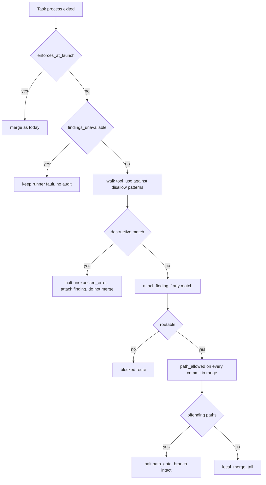

# Backends U10, Unenforced Restrictions - Plan

## Goal Capsule

- **Objective:** What a backend cannot refuse at launch is recorded, bounded at the landing, and audited afterwards, without destroying the Task's work.
- **Means:** Require the operator's acceptance sentence and a set Task path bound at validation, record unenforced restrictions as a plain scalar, check the Task commit with a non-destructive helper before merge, and scan normalized `tool_use` blocks after exit. (KTD1, KTD2, KTD3, KTD6)
- **Product authority:** `docs/plans/2026-08-28-1101-feat-pluggable-cli-backends-plan.md`, section `### U10. Unenforced restrictions: record, bound, audit`, requirements R10, R19, R21, R24, flows F1 and F2, acceptance examples AE2 and AE7, key decisions KTD7, KTD13, KTD14.
- **Execution profile:** Surgical. Eight modules (`contracts.py`, `manifest.py`, `gitwrite.py`, `classify.py`, `closeout.py`, `run.py`, `brief.py`, `summary.py`), one example manifest, the tests those modules already own. No new halt class in `HALT_CLASSES`. No new Closeout placeholder.
- **Stop conditions:** Stop if the bound helper would need to call `reset_hard`. Stop if matching a real Codex `command_execution` requires changing the parent U6 line shape. Stop if generalizing `path_gate`'s Cause line would make the `.claude/` backstop print a false sentence.
- **Tail ownership:** The calling process owns commit and the project gate.

---

## Product Contract

**Product Contract preservation:** new file. Parent R10, R19, R21, and R24 keep their meaning and IDs. This plan's R-IDs, KTD-IDs, AE-IDs, and U-IDs are local and cite those parents.

### Summary

U8 already landed the Brief half of parent R10. A Codex Task is told the run's allow list and disallow list as instructions. Nothing yet records which restrictions went unenforced, nothing yet requires the operator's acceptance sentence or a set Task path bound, and nothing yet checks the commit or the evidence before merge.

This plan adds those three controls. Validation refuses a Codex Task without the sentence and without a set bound. The Runner writes a plain scalar onto the Task record. Before merge it diffs the Task branch against the bound without resetting anything. After the process exits it walks normalized `tool_use` blocks, attaches a finding for a disallowed call that ran, and refuses the landing when that call is in the named destructive set.

Claude and Grok already enforce at launch. They run none of these controls.

### Problem Frame

Codex cannot refuse a tool call at launch. Verify-landed and the Lease were always the real guards, and a misbehaving process is caught the same way regardless of backend. Recording the gap and leaving the merge unprotected are different acts. A Codex Task that edits outside the bound, or that ran `rm -rf`, can still merge today. Reusing the Closeout's scope check to stop that would hard-reset the Task branch the operator needs to inspect.

### Key Decisions

- A backend that cannot enforce a restriction at launch carries it in the Brief and records it as unenforced. (session-settled: user-approved, chosen over holding Codex until it gains launch-time denial: Verify-landed and the Lease were always the real guards.) Inherited from the parent plan. Governs parent R10, this plan's R3, R8.
- What a backend cannot refuse at launch is gated at authoring, bounded at the landing, and audited afterwards. Plan-time addition on the parent, not part of the settled decision above. Governs parent R19, R21, R24, this plan's R1, R2, R4, R5.
- `git clean*` and `git checkout -- .*` land with a finding. They sit in `DISALLOWED_TOOLS` and outside the named destructive subset. Expanding the subset would be a new product choice. Governs R5.

### Requirements

**Authoring gate**

- R1. When any Task names a backend whose `enforces_at_launch` is False, the manifest must carry the operator's own sentence accepting that condition, and validation refuses without it. Presence after strip is the only check. (parent R19)
- R2. The same condition requires `permissions.task_allowed_paths` to be set and non-empty. Unset still means the whole repository on backends that enforce at launch. (parent R19, parent KTD13)

**Record**

- R3. After such a Task launches, the Task record names which restrictions went unenforced, as a plain scalar so a Cause line can render it. (parent R10)

**Landing bound**

- R4. On such a Task, the Runner checks the Task commit against the Task path bound before it merges, refuses the merge when the commit falls outside it, and leaves the Task branch intact. The bound covers commit scope only. (parent R21, AE2)

**Evidence audit**

- R5. After such a Task's process exits, the Runner scans normalized `tool_use` blocks for calls matching the manifest's disallow patterns, records each match as a finding naming the tool, the argument, and the line, still lands when the match is outside the destructive set, and refuses the landing when it is inside. Detection after execution, not prevention. (parent R24, AE7)

**Non-interference**

- R6. A Claude or Grok Task runs no audit, needs no acceptance sentence, and is not checked against the Task path bound. (parent AE7, parent U10 Claude Task scenario)
- R7. `HALT_CLASSES` is unchanged. A new stop reason reuses a class already in that set, or attaches as a finding-only class the way `CLOSEOUT_UNFINISHED` does.
- R8. A Codex Brief names the landing bound and the evidence audit in the existing unenforced insert, now that both exist. No new template placeholder. (parent R4)

### Scope Boundaries

- Out of scope: Closeout on the Task's backend. That is the parent plan's U9. `_run_closeout` still omits `backend=`. This unit's bound, audit, and record do not need that call. Findings reach Closeout through `digest["findings"]`.
- Out of scope: the routing rubric, the skill asking for the sentence, and `CONCEPTS.md` documentation beyond the Task path bound glossary entry. Parent U13.
- Out of scope: record schema bump, summary backend rendering, `RECORD_FIELDS`. Parent U11. `store.upsert` already keeps an unknown scalar.
- Out of scope: a new member of `HALT_CLASSES`. Outer-loop KTD6 stays closed.
- Out of scope: a new placeholder in `brief-closeout.md`.
- Out of scope: making Codex refuse tools at launch.
- Out of scope: expanding the destructive set to `git clean*` or `git checkout -- .*`.
- Out of scope: snapshotting remotes, `.git/config`, or `.git/hooks` around an unenforced Task. A Codex process can rewrite those because the repo `.git` is extra-writable. That is a real residual, not this unit's bound or audit.

### Acceptance Examples

- AE1. Covers R1, R2.
  - **Given:** A manifest names a Codex Task and has no acceptance sentence, or has no set `task_allowed_paths`.
  - **When:** The operator validates.
  - **Then:** Validation refuses before any Task launches. Adding the missing field lets it validate.
- AE2. Covers R3, R4. Parent AE2.
  - **Given:** A Codex Task, the operator's sentence, and a Task path bound narrower than the repository.
  - **When:** That Task's commit touches a path outside the bound.
  - **Then:** The record names the restrictions unenforced, the Runner refuses the merge, and the Task branch still contains the Task's commits.
- AE3. Covers R5. Parent AE7, land half.
  - **Given:** A Codex Task whose evidence shows a disallowed non-destructive call.
  - **When:** The Runner classifies the exit.
  - **Then:** A finding names the tool, the argument, and the line, and the Task still lands if otherwise routable.
- AE4. Covers R5. Parent AE7, refuse half.
  - **Given:** A Codex Task whose evidence shows a call in the destructive set.
  - **When:** The Runner classifies the exit.
  - **Then:** The landing is refused. The call has already run.
- AE5. Covers R6.
  - **Given:** A Claude Task, with or without an acceptance sentence, with or without a set bound.
  - **When:** The Task runs.
  - **Then:** No audit finding, no bound check from this unit, and the `.claude/` backstop still behaves as it does today.

---

## Planning Contract

### Key Technical Decisions

- KTD1. **Build a new non-destructive helper from `gitwrite.path_allowed()` applied to every path that will land in history.** Do not call `gitwrite.closeout_scope_check()`. Its failure path calls `reset_hard()`, which would destroy the branch AE2 requires be left intact, and it folds in working-tree state that is meaningless for a Task branch about to merge. `gitread.diff_name_only` compares tip trees only. `merge_no_ff` publishes every commit on the Task branch, so a file committed outside the bound and deleted before the tip would still land in default-branch history. Collect paths from every commit in `baseline..branch`, then apply `path_allowed`. The helper returns offending paths and mutates nothing. Call it from `_merge_route` before `local_merge_tail`. The diff is ref based and does not need a checkout. Governs R4.
- KTD2. **A bound miss reuses `path_gate` and generalizes its Cause line.** `HALT_PATH_GATE` already refuses a merge and leaves the Task branch. Its current template names only the `.claude/` backstop, which would be a lie for a bound miss on `src/foo.py`. The template takes a scalar `{detail}` filled by the raiser, so both the backstop and the Task path bound tell the truth. `summary._pending_checks` uses the same `{detail}` rather than hardcoding the `.claude/` sentence. `paths` is a joined string, never a list, because `line_fields` drops lists. Governs R4, R7.
- KTD3. **A destructive match halts as `unexpected_error` and also attaches a finding-only class.** `continue_past_task_halt` plus a clean tree would start the next Task after a hard reset or recursive delete. The only run-scoped classes are `remote_advanced`, `runner_crashed`, and `unexpected_error`. The first two are false here. `unexpected_error` always stops the run. Fill `{error_type}` and `{error}` with the same sentence the finding prints so the record class is a blunt stop and the finding names the tool, the argument, and the line. Raise `_Halt` before the routable or blocked split, so `_blocked_route` cannot swallow a destructive match. The finding-only class follows `CLOSEOUT_UNFINISHED`: it sits in `FINDING_CLASSES` and `LINE_CLASSES`, not in `HALT_CLASSES`. Do not reuse `denied_tool`. Codex marks that class undetectable, and its Cause line says the call was denied. Governs R5, R7.
- KTD4. **`DESTRUCTIVE_TOOLS` is a named subset of `DISALLOWED_TOOLS`.** Force push, hard reset, and recursive delete. Pin the boundary with a test that names one member and one non-member (`git clean*` is the non-member). Do not author a second list. Governs R5.
- KTD5. **The acceptance sentence is `permissions.unenforced_acceptance`, a string.** Manifest-level, next to the bound it accompanies. Validate with the existing qualifying presence check: `isinstance(str)` and strip. Do not inspect wording. Do not default a sentence. An excluded Codex Task still trips the requirement, so un-excluding later cannot sneak past. Governs R1.
- KTD6. **The audit walks normalized `tool_use` blocks, not `digest["tool_calls"]`.** That digest field is a count. Match against the full `input.command`, never the 120-character `_target_of` slice. Strip an optional path plus `zsh` or `bash` plus `-lc` or `-c`, including a `/bin/` prefix. A glob hit on the whole inner script, or on any `&&`, `||`, semicolon, or newline segment, is a match. Store the matched `DISALLOWED_TOOLS` pattern on the finding so U5 can test membership in `DESTRUCTIVE_TOOLS`. Skip the audit when `enforces_at_launch` is True, and skip it when `findings_unavailable` is True, so an unreadable log is not a clean audit. Copy new findings onto `digest["findings"]` and `ctx.findings` before `_routable`. Governs R5, R6.
- KTD7. **The unenforced scalar is one comma-separated string of inner operations.** Codex has no deny flag, so the whole resolved disallow list is unenforced. The allowed list is not a restriction. Do not store the raw `Bash(...)` tuple. Governs R3.
- KTD8. **Add one factual sentence to the existing Brief insert. No new placeholder.** The insert currently ends "The runner reads the evidence your process leaves behind." Replace that with the truth now that the controls exist: a commit outside the Task path bound will not land, and a destructive disallowed call will not land. Put the new sentence in a named constant and run it through `defang()`, the way `UNENFORCED_LEAD` already is, so a card cannot inject a second copy. Governs R8.

### High-Level Technical Design

The audit and the bound are two gates on the unenforced path. Neither substitutes for the other. Claude and Grok never enter this path.

### Assumptions

- Only Codex has `enforces_at_launch` False today. Grok enforces. The code keys on the capability flag, not on the name `codex`.
- Parent U9 is not on this unit's critical path. Findings reach Closeout through the digest. The missing `backend=` argument in `_run_closeout` stays U9's one line.
- `docs/examples/manifest-github-projects.toml` Task 413 stays mixed. The example gains a placeholder acceptance sentence that is obviously not an operator's words, plus a non-empty `task_allowed_paths`, so `test_examples` still validates.
- A live Codex capture of a `command_execution` line exists under `tests/fixtures/backends/codex/` or can be taken from parent U6's fixtures. The matcher is pinned against a `/bin/zsh -lc` wrapped script, not a hand-built `git reset --hard`.
- Generalizing `path_gate`'s Cause line can keep the `.claude/` backstop honest by putting the existing sentence in `{detail}` at that raiser.

### Sequencing

U1 (vocabulary) first, then U2 (validation) and U3 (helper) in either order, then U4 (audit matcher), then U5 (runner wiring and Brief sentence). U5 is the only unit that composes the others.

---

## Implementation Units

### U1. Destructive set, finding class, generalized path_gate line

- **Goal:** The closed halt set is unchanged, the destructive boundary is pinned, and both new stop reasons have a Cause line that can tell the truth.
- **Requirements:** R5, R7; KTD2, KTD3, KTD4.
- **Dependencies:** None.
- **Files:** `skills/relay/scripts/relay/contracts.py`, `skills/relay/scripts/relay/gitwrite.py`, `skills/relay/scripts/relay/classify.py`, `skills/relay/scripts/relay/summary.py`, `tests/test_contracts.py`, `tests/test_summary.py`, `tests/test_gitwrite.py`.
- **Approach:**
  1. Add `DESTRUCTIVE_TOOLS` beside `DISALLOWED_TOOLS` as a named subset covering force push, hard reset, and recursive delete.
  2. Add a finding-only class for an unenforced disallowed call that ran. Put it in `FINDING_CLASSES` and `LINE_CLASSES`. Do not put it in `HALT_CLASSES`. Give it a `HALT_LINES` template whose placeholders are `tool`, `argument`, `line`, and `pattern`.
  3. Change `HALT_LINES[path_gate]` to a `{detail}` template. Fill `{detail}` at every existing raiser in the same landing: `local_merge_tail` for the `.claude/` backstop, and `classify` for any `path_gate` finding it already emits. Update `summary._pending_checks` to print that `{detail}` rather than hardcoding the `.claude/` sentence.
  4. Put `path_gate` in `FINDING_ROWS` with a `detail` copied from the backstop sentence. Change any `RECORD_ROWS` `path_gate` evidence from a `paths` list to the joined `detail` string. Extend `FINDING_ROWS` with a copy of what the audit raiser will pass. Pin `set(HALT_LINES) == set(LINE_CLASSES)` still holds.
- **Patterns to follow:** `CLOSEOUT_UNFINISHED` for a Cause line that is not a record's own class. `tests/test_contracts.py` `test_disallow_list_covers_the_four_r10_operations` for the member and non-member pin.
- **Test scenarios:**
  - `DESTRUCTIVE_TOOLS` is a subset of `DISALLOWED_TOOLS`.
  - One named member is in the subset. `Bash(git clean*)` is not.
  - `HALT_CLASSES` is byte identical to today's tuple.
  - The new finding class is in `FINDING_CLASSES` and `LINE_CLASSES` and not in `HALT_CLASSES`.
  - `cause_line` for the new class renders tool, argument, and line with no `?`.
  - `cause_line` for `path_gate` renders the raiser's `{detail}` and no longer hardcodes `.claude/` in the template.
  - `local_merge_tail`'s backstop result fills `{detail}` with the existing `.claude/` sentence, and `_pending_checks` reads that same field.
- **Verification:** `python3 -m unittest test_contracts test_summary test_gitwrite` passes.

### U2. Acceptance sentence and required Task path bound

- **Goal:** A manifest that names an unenforced backend cannot validate without the operator's sentence and a set Task path bound.
- **Requirements:** R1, R2; KTD5.
- **Dependencies:** None.
- **Files:** `skills/relay/scripts/relay/manifest.py`, `tests/test_manifest.py`, `docs/examples/manifest-github-projects.toml`, `tests/test_examples.py`.
- **Approach:**
  1. Load `permissions.unenforced_acceptance` as an optional string, next to `task_allowed_paths`.
  2. In `validate`, when any Task's `backends.build(task.backend).CAPABILITY.enforces_at_launch` is False, refuse unless the sentence is a non-empty stripped string and `task_allowed_paths` is a non-empty list that already passes the existing grammar checks. This is a schema check, not `check_environment`.
  3. Keep unset `task_allowed_paths` meaning the whole repository when no Task is unenforced.
  4. Give example Task 413 both fields. The sentence must be obviously a fixture, not an operator's words. Leave the other two example manifests on Claude-only.
- **Patterns to follow:** the qualifying presence check and the jira/codex pair refusal, both schema-only.
- **Test scenarios:**
  - Covers AE1. A Codex Task and no sentence is refused. Adding the sentence lets it validate once the bound is also set.
  - Covers AE1. A Codex Task and no `task_allowed_paths` is refused. Setting the bound lets it validate once the sentence is also present.
  - A Claude-only manifest with neither field still validates.
  - An excluded Codex Task still requires both fields.
  - Whitespace-only sentence is refused.
  - `docs/examples/` still validates against a temporary repository, including the mixed GitHub example.
- **Verification:** `python3 -m unittest test_manifest test_examples` passes.

### U3. Non-destructive Task path bound helper

- **Goal:** A commit outside the bound is visible as a list of paths, and inspecting that list does not move git.
- **Requirements:** R4; KTD1.
- **Dependencies:** None.
- **Files:** `skills/relay/scripts/relay/gitwrite.py`, `tests/test_gitwrite.py`.
- **Approach:**
  1. Add a helper next to `path_allowed` that lists every path changed by any commit in `baseline..branch`, then returns the paths for which `path_allowed` is False.
  2. Return the list. Do not checkout. Do not reset. Do not read the working tree.
  3. Callers pass the tuple from `manifest.task_allowed_paths()` only when it is not `None`. Empty `allowed_paths` still means allow nothing inside `path_allowed`.
- **Patterns to follow:** `claude_dir_backstop`, which diffs two refs and returns hits. Contrast with `closeout_scope_check`, which must keep resetting.
- **Execution note:** Implement the helper test-first against AE2. A test that deletes the Task branch before a second run cannot catch a helper that reset it.
- **Test scenarios:**
  - Covers AE2 at helper level. A commit outside the bound returns that path. `RecordingOps` shows no `reset_hard`. The branch still points at the Task head. Default and origin are unchanged.
  - A file committed outside the bound and deleted in a later commit on the same branch still appears in the helper's result.
  - A commit inside a directory prefix returns an empty list.
  - An exact file bound allows that file and refuses a sibling.
  - `closeout_scope_check` still resets on its own failure path. That class of tests stays green.
- **Verification:** `python3 -m unittest test_gitwrite` passes, and the out-of-scope case proves the branch survived.

### U4. Unenforced evidence audit

- **Goal:** A disallowed call that actually ran is a finding with tool, argument, and line, matched on Codex-shaped evidence.
- **Requirements:** R5, R6; KTD6.
- **Dependencies:** U1.
- **Files:** `skills/relay/scripts/relay/classify.py`, `skills/relay/scripts/relay/closeout.py`, `tests/test_classify.py`.
- **Approach:**
  1. Give `classify.classify` an optional disallow-pattern argument, the way `write_tool_patterns` already works.
  2. In the existing `tool_use` loop, when patterns are supplied, match per KTD6 on the full `input.command`. Emit the finding-only class from U1, including the matched `pattern`. Do not change `halt_class` or `routable` here. Landing refusal is U5. Do not use `_target_of` as the match input.
  3. Skip matching when the backend's capability has `enforces_at_launch` True, even if patterns are passed, so a caller mistake cannot double-count a Claude denial.
  4. Skip matching when `findings_unavailable` is True.
  5. Add the new class to `closeout.FULL_DEPTH_FINDINGS` so a landed Task with this finding gets a full compound. Do not add a Closeout placeholder.
- **Patterns to follow:** the Skill-substitution scan in the same `tool_use` loop. `_target_of` for the argument scalar.
- **Execution note:** Pin the matcher against a live-shaped `/bin/zsh -lc '… && rm -rf …'` line, not a bare `rm -rf`. A line authored to the matcher is the failure `docs/solutions/logic-errors/denial-regex-anchored-immediately-after-tool-name-missed-real-bash-denials.md` already records.
- **Test scenarios:**
  - Covers AE3. A Codex-shaped `tool_use` whose command matches a non-destructive pattern produces a finding with tool, argument, and line, and `routable` stays True.
  - Covers AE4 at classify level. A match against a destructive member produces the same finding shape. Classify still does not set `halt_class`.
  - A Claude transcript with a launch-time denial still produces `denied_tool` and does not also produce the new class.
  - `findings_unavailable` True yields no audit finding.
  - A `/bin/zsh -lc` wrapped script with `&&` still matches the inner glob on a segment.
  - `digest["tool_calls"]` remains an int.
- **Verification:** `python3 -m unittest test_classify` passes, and the audit case proves the finding carries the argument.

### U5. Record, refuse, merge bound, Brief sentence

- **Goal:** The Runner records the gap, refuses a destructive landing, refuses an out-of-bound merge without destroying the branch, and the Codex Brief names both controls.
- **Requirements:** R3, R4, R5, R6, R8; KTD1, KTD2, KTD3, KTD7, KTD8.
- **Dependencies:** U1, U2, U3, U4.
- **Files:** `skills/relay/scripts/relay/run.py`, `skills/relay/scripts/relay/brief.py`, `tests/test_run.py`, `tests/test_brief.py`, `tests/test_gitwrite.py`.
- **Approach:**
  1. After classify, if the Task's backend does not enforce at launch, upsert the unenforced scalar from KTD7.
  2. Pass `resolved_disallowed(manifest)` into classify only for that backend.
  3. If any audit finding's stored `pattern` is in `DESTRUCTIVE_TOOLS`, raise `_Halt` with `unexpected_error` plus the finding. Do this after classify and before the timeout short circuit, not only before `_routable`. `_timeout_route` treats a clean tree as blocked, `timeout` is not run scoped, and `git reset --hard` leaves a clean tree. Name `_timeout_route` beside `_blocked_route` as a swallow path the halt must precede. Do not compare `finding["tool"]` to the `Bash(...)` rule strings.
  4. Copy audit findings onto `digest["findings"]` and `ctx.findings` so Closeout `$findings` is not "none".
  5. In `_merge_route`, when the backend does not enforce and the bound is set, run U3's helper. On offending paths raise `_Halt` with `path_gate` and a `{detail}` that names the paths and the bound. Do this before `local_merge_tail`.
  6. Replace the insert's closing sentence per KTD8. Claude Briefs stay empty at that placeholder.
  7. Do not pass `backend=` into `closeout.run`. That is U9.
- **Patterns to follow:** `test_a_path_gate_exit_blocks_that_task_and_the_run_continues` for a pre-merge halt that leaves the branch. `brief.UnenforcedRestrictions` for the insert tests.
- **Test scenarios:**
  - Covers AE2. A Codex Task whose commit is outside the bound halts as `path_gate`. Merge did not happen. The branch still contains the Task commits. Origin default is unchanged.
  - Covers AE3. A Codex Task that ran a non-destructive disallowed tool lands. The finding is on the digest Closeout reads. The unenforced scalar is on the Task record and is a string.
  - Covers AE4. A Codex Task that ran a destructive tool halts as `unexpected_error` with the finding attached. `_blocked_route` is not taken. A timed-out Codex Task whose tree is clean after `git reset --hard` still takes this halt, not `_timeout_route`. `continue_past_task_halt` cannot start the next Task.
  - Covers AE5. A Claude Task is unaffected by the sentence, the bound, and the audit.
  - A Codex Brief names the bound and the audit. A Claude Brief is unchanged at the insert, including whitespace.
  - A card that copies the new sentence still carries the real insert via `defang()`.
- **Verification:** `python3 -m unittest test_run test_gitwrite test_brief` passes. The out-of-scope case proves the merge did not happen and the branch survived. The audit case proves the finding carries the argument.

---

## Verification Contract

| Gate | Evidence |
| --- | --- |
| Parent unit line | `python3 -m unittest test_run test_gitwrite` passes. The out-of-scope case proves the merge did not happen and the branch survived. The audit case proves the finding carries the argument. |
| Modules this plan moves | `python3 -m unittest test_run test_gitwrite test_manifest test_contracts test_classify test_examples test_brief test_summary` passes. |
| Regression suite | `python3 -m unittest discover -s tests` passes from the repo root. |
| Closed halt set | `HALT_CLASSES` is unchanged. The new class is finding-only. |
| KTD1 trap | No production call from the Task bound path to `closeout_scope_check`. The out-of-scope test spies `reset_hard` and expects zero. |
| Closeout placeholder set | `git diff` on `skills/relay/templates/brief-closeout.md` is empty. |
| Live run obligation | Not dischargeable inside a Relay run. `CLAUDE.md` requires a live Codex Task against a throwaway target after a halt-record, classify, or Brief change. Two tasks: one whose commit falls outside the Task path bound (AE2), and one whose evidence shows a non-destructive disallowed call that still lands (AE3). Keep AE4 stub covered. A real destructive call has already run. The envelope names this. |

---

## Definition of Done

- A Codex Task without the acceptance sentence or without a set Task path bound fails validation. A Claude-only manifest does not.
- The Task record of an unenforced Task carries a string naming the unenforced restrictions.
- A Codex commit outside the bound is refused, and the Task branch still holds those commits.
- A non-destructive disallowed call on Codex lands with a finding that names tool, argument, and line.
- A destructive disallowed call on Codex does not land.
- Claude and Grok run no audit and need neither new field.
- `closeout_scope_check` is not used for the Task bound.
- `HALT_CLASSES` is unchanged.
- `brief-closeout.md` is unchanged.
- The full test suite passes.

---

## Sources

- `docs/plans/2026-08-28-1101-feat-pluggable-cli-backends-plan.md` U10, R10, R19, R21, R24, KTD7, KTD13, KTD14, AE2, AE7.
- `docs/plans/2026-08-30-1808-feat-backends-u8-permission-posture-and-skill-form-plan.md`, the Brief half already landed.
- `docs/solutions/logic-errors/cause-line-contract-split-degraded-to-placeholders.md`
- `docs/solutions/logic-errors/stubbed-seams-agree-by-construction-first-live-run-found-five-contract-defects.md`
- `docs/solutions/logic-errors/continue-past-halt-checked-general-state-blind-to-the-branch-its-own-skip-left.md`
- `docs/solutions/workflow-issues/change-spanning-a-live-template-and-a-frozen-module-breaks-the-landing-run.md`
- `docs/solutions/logic-errors/denial-regex-anchored-immediately-after-tool-name-missed-real-bash-denials.md`
