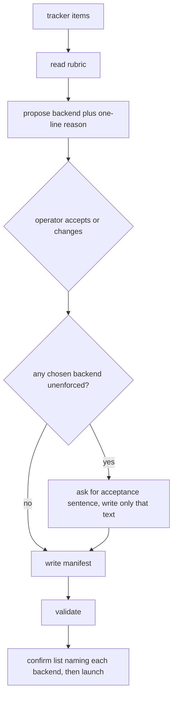

# Backends U13, Rubric Skill and Docs - Plan

## Goal Capsule

- **Objective:** An operator can author a mixed manifest with guidance, and the vocabulary names what the system now has.
- **Means:** A written rubric the skill points at, authoring steps that propose a backend per Task, and docs that name the new fields. (KTD1, KTD2)
- **Product authority:** `docs/plans/2026-08-28-1101-feat-pluggable-cli-backends-plan.md`, section `### U13. Rubric, skill, and docs`, requirements R14, R15, R16, R19, flow F1, acceptance example AE5, key decision KTD12.
- **Execution profile:** Surgical. One new rubric file, three prose surfaces, and the existing excluded-task reason check extended so a Task whose backend differs from the default is refused without a reason string. A Task whose backend matches the default still needs no reason.
- **Stop conditions:** Stop if parent U2, U3, or U10 is not on `main`. Stop if a second Backend glossary heading would be needed rather than editing the one that already exists.
- **Tail ownership:** The calling process owns commit and the project gate.

## Product Contract

**Product Contract preservation:** new file. Parent R14, R15, R16, and R19 keep their meaning and IDs. This plan's R-IDs, KTD-IDs, AE-IDs, and U-IDs are local and cite those parents.

### Summary

The runner already carries a backend per Task, a defaults table, readiness preflight, the acceptance sentence, and the Task path bound. The operator still authors without a rubric, the skill still does not propose a backend, and README still describes every Task as a Claude process.

This plan writes the rubric, teaches `/relay` to propose and to ask, refuses a Task whose backend differs from the default when it carries no reason, and names the new fields in README and CONCEPTS. `/relay` itself still runs in Claude Code. Only the launched processes vary.

### Problem Frame

Routing knowledge has nowhere to live, so it is re-derived every time a manifest is written. A mixed queue is already valid. Authoring still treats every Task as Claude unless the operator already knows the fields. The unenforced-backend condition is accepted in a sentence the skill could invent, which would make R19 a checkbox rather than the operator's own words.

### Key Decisions

- Routing is a rubric-guided recommendation made in `/relay` while the manifest is authored, never a runtime Runner decision. (session-settled: user-approved — chosen over a static attribute-to-backend table and over runtime selection by the Runner: a rubric holds judgment a table cannot, and keeping the choice at authoring time leaves the Runner's decision surface unchanged.) Inherited from the parent plan. Governs parent R14, R15, R16, this plan's R1, R2, R3, R4.
- The skill asks for the acceptance sentence and writes only what the operator supplies. Validation can check that a sentence is present, never who meant it. Inherited from parent R19. Governs this plan's R6.

### Requirements

**Rubric**

- R1. A durable rubric file under `skills/relay/references/` names all three backends and what distinguishes them for routing. (parent R16, parent KTD12)
- R2. The rubric states what degrades on a backend that does not enforce at launch: one layer of defence in depth is replaced by a commit-scope bound and a post-execution audit, the landing guarantee itself is untouched, and the audit detects rather than prevents. (parent R21, R24)

**Authoring**

- R3. `/relay` proposes a backend per Task from the rubric and states a one-line reason for each proposal. (parent R14)
- R4. The operator sees every proposal and can change any of them before the manifest is written. No Task reaches a manifest with a backend the operator did not see. Nothing re-applies the rubric afterwards. (parent R15, parent AE5)
- R5. When a Task's resolved backend differs from the resolved default, the manifest carries a reason string on that Task. A match needs none. (parent KTD12)
- R6. Where any chosen backend does not enforce restrictions at launch, the skill states the condition and asks the operator to write the acceptance sentence, recording only what they wrote. (parent R19)
- R7. The confirm-before-launch task list names each Task's backend.

**Docs**

- R8. README documents the backend field, the `[defaults]` table, `reason` when a Task's backend differs from the default, `task_allowed_paths`, the acceptance sentence, and the refused adapter pairs, and it keeps the statement that `/relay` itself runs in Claude Code.
- R9. CONCEPTS defines Backend in the format its existing entries use.

### Key Flows

- F1. Authoring a mixed manifest
  - **Trigger:** The operator asks `/relay` to build a manifest from tracker items.
  - **Steps:** The skill reads the rubric from this skill's own directory, proposes a backend and a one-line reason per Task during the existing include and model questions, the operator accepts or changes each, the skill requires a reason string on any Task whose backend differs from the default, asks for the acceptance sentence and a set Task path bound when an unenforced backend is chosen and records only what the operator wrote, writes the manifest, then validates.
  - **Outcome:** A manifest whose every Task carries a backend the operator saw.
  - **Covered by:** R3, R4, R5, R6. Realizes parent F1's authoring steps.

### Acceptance Examples

- AE1. The operator's override wins
  - **Covers R3, R4.** Parent AE5.
  - **Given:** The rubric proposes `codex` for a Task and states its reason.
  - **When:** The operator changes it to `claude`.
  - **Then:** The manifest carries `claude` for that Task, and nothing re-applies the rubric to it afterwards.

- AE2. A Task whose backend differs from the default needs a reason
  - **Covers R5.**
  - **Given:** The resolved default is `claude` and a Task names `codex`.
  - **When:** The manifest is validated with no reason string on that Task.
  - **Then:** Validation refuses. Adding a non-empty reason lets it validate (subject to the other existing checks).

- AE3. Matching the default needs no reason
  - **Covers R5.**
  - **Given:** A Task inherits or names the same backend as the resolved default.
  - **When:** The manifest is validated with no reason string on that Task.
  - **Then:** Validation does not refuse for a missing reason.

### Success Criteria

- An operator reading only the rubric and the skill can author a mixed manifest without reading the runner source.
- The acceptance sentence in a resulting manifest is the operator's own words.
- CONCEPTS names Backend in the same shape as Runner and Manifest.

### Scope Boundaries

**Deferred for later**

- Runtime routing, a cross-run ledger, and a rubric informed by past backend outcomes. Inherited from the parent plan.

**Outside this work**

- Launch, evidence, Closeout, and record-shape units. They already landed.
- Live proof runs (parent U14).
- The `/relay` skill itself running anywhere but Claude Code.
- The unrelated U13 on the outer-loop plan.

**Deferred to Follow-Up Work**

- None.

### Dependencies and Assumptions

Parent U2, U3, and U10 are on `main`. This unit reads those fields and does not re-implement them.

## Planning Contract

### Key Technical Decisions

- KTD1. **The rubric is `skills/relay/references/backend-rubric.md`, and `SKILL.md` points at it.** It is judgment an operator can edit, not a table the Runner reads. Governs R1, R2, R3. Cites parent KTD12.
- KTD2. **Reuse `Task.reason` for a backend that differs from the resolved default.** Compare the Task's resolved backend to the resolved default (`[defaults] backend` or `claude`). Do not add a second reason field. Presence check mirrors the excluded-task rule already in `manifest.validate`. An excluded Task that also differs from the default is covered by one non-empty `reason`. When the operator accepts a non-default proposal, the skill's one-line reason is that string. When the operator changes the backend, they supply the string. Governs R5. Cites parent KTD12.
- KTD3. **The skill never authors `permissions.unenforced_acceptance`.** It asks, then writes the operator's sentence verbatim, the same way it already treats the four qualifying sentences. Governs R6.

### High-Level Technical Design

Authoring stays in the skill. Validation stays in the runner. The Runner still does not choose a backend.

### Assumptions

These are un-validated agent bets from a headless scoping pass.

- The existing `## Backend readiness` section in `SKILL.md` already names the preflight failures. This unit adds one clause in the Validate section that points at it, rather than duplicating the table.
- CONCEPTS already has Backend, Capability record, and Task path bound from earlier units. This unit edits those entries in place if authoring-time facts are missing, and does not add a second Backend heading.
- Parent U13's Files list omitted `manifest.py`. The parent test scenarios still require the reason-string refusal, so this plan's U2 owns that check.
- A fixture reason on `docs/examples/manifest-github-projects.toml` Task 413 is acceptable, labeled as a fixture the way the example's acceptance sentence already is.

### Sequencing

U1 writes the rubric the skill must point at. U2 is independent of the skill and can land in parallel with U1. U3 depends on U1. U4 depends on U2 so README describes the reason field that validate now requires.

## Implementation Units

### U1. Routing rubric

- **Goal:** The routing judgment lives in a file an operator can read and edit.
- **Requirements:** R1, R2. Cites KTD1.
- **Dependencies:** none.
- **Files:** `skills/relay/references/backend-rubric.md` (new).
- **Approach:**
  1. Name `claude`, `codex`, and `grok`.
  2. Distinguish them for routing on launch-time enforcement, residual credential exposure under the operator's home, and the compensating controls on an unenforced backend (parent R19, R21, R24, and the System-Wide Impact residual).
  3. State that the audit detects rather than prevents, and that Verify-landed is unchanged.
  4. Do not encode a static Task-attribute-to-backend table.
- **Patterns to follow:** `CONCEPTS.md` tone. Short, glossary-adjacent prose. No dashes of any kind in the prose.
- **Test scenarios:**
  - The file exists and names `claude`, `codex`, and `grok`.
  - The file states that an unenforced backend loses launch-time refusal, that the landing bound covers commit scope only, and that the audit detects after execution.
- **Verification:** The skill unit can point at this path. An operator can read it without opening runner source.

### U2. Reason string when backend differs from default

- **Goal:** A Task that leaves the default backend cannot reach a valid manifest without a reason.
- **Requirements:** R5. Cites KTD2. Covers AE2, AE3.
- **Dependencies:** none.
- **Files:** `skills/relay/scripts/relay/manifest.py`, `tests/test_manifest.py`, `docs/examples/manifest-github-projects.toml`, `tests/test_examples.py`.
- **Approach:**
  1. After backend enum validation, refuse a Task whose resolved backend differs from the resolved default and whose `reason` is missing or whitespace.
  2. Leave matching-default Tasks unchanged, including a Task that names the default explicitly.
  3. Put a fixture `reason` on example Task 413, labeled as a fixture.
  4. Do not change the excluded-task check.
- **Patterns to follow:** the excluded-task reason error and its test in `tests/test_manifest.py`.
- **Test scenarios:**
  - Covers AE2. A Task on `codex` with default `claude` and no reason is refused. The same Task with a non-empty reason validates (given the existing acceptance sentence and Task path bound).
  - Covers AE3. A Task that inherits or names the default needs no reason.
  - A Task that names the default explicitly still needs no reason.
  - Whitespace-only reason is refused the same way as missing.
  - An excluded Task on the default still fails only the existing excluded-without-reason check.
  - An excluded Task whose resolved backend differs from the default validates with one non-empty reason, and is refused when reason is missing.
  - Every file under `docs/examples/` still validates against a temporary repository and still passes the leak scan.
- **Verification:** `python3 -m unittest test_manifest test_examples` from `tests/` passes.

### U3. Skill authoring steps

- **Goal:** `/relay` proposes backends, asks for the acceptance sentence, and shows backend on the pre-launch list.
- **Requirements:** R3, R4, R6, R7. Cites KTD1, KTD3. Covers AE1.
- **Dependencies:** U1.
- **Files:** `skills/relay/SKILL.md`.
- **Approach:**
  1. Point at `<this skill's directory>/references/backend-rubric.md` from the Author a manifest section, the same way the runner path is resolved, so a session in a target repo still finds the file.
  2. Fold the rubric proposal into the existing per-Task confirmation (include, order, model, effort). Propose a backend with a one-line reason, then wait for accept or change. Do not write a backend the operator has not seen.
  3. When any chosen backend does not enforce at launch, state the condition and ask for the acceptance sentence and a set `task_allowed_paths`. Write only what the operator supplies for both. Never invent either, including to make validate pass.
  4. Require a reason on any Task whose backend differs from the default, using the same `reason` key excluded Tasks already use. Per KTD2, an accepted non-default proposal copies the skill's one-line reason; an operator change of backend asks them for the string; one string covers exclusion plus a differing backend.
  5. Add the backend to the confirm-before-launch task list.
  6. Add one clause in the Validate section that a readiness failure is a validate refusal, pointing at the existing Backend readiness section rather than copying it.
- **Patterns to follow:** the four qualifying-sentence questions, which already refuse to invent operator text. The existing Backend readiness table stays the owner of those error strings.
- **Test scenarios:**
  - Covers AE1. The skill text says the operator can change a proposal and that the rubric is not re-applied afterwards.
  - The skill text forbids authoring `unenforced_acceptance` on the operator's behalf.
  - The skill references `backend-rubric.md`.
- **Verification:** An operator following only the skill and the rubric can produce a mixed manifest. No runner source is required.

### U4. README and CONCEPTS

- **Goal:** The public vocabulary and the install doc name what the system now has.
- **Requirements:** R8, R9.
- **Dependencies:** U2.
- **Files:** `README.md`, `CONCEPTS.md`.
- **Approach:**
  1. Replace the README claim that every Task is a Claude process. Name the closed backend set, the `[defaults]` table, per-Task `backend`, `reason` when it differs, `task_allowed_paths`, `unenforced_acceptance`, and the `jira` plus non-Claude refusal.
  2. Keep the statement that `/relay` itself runs in Claude Code, and that only the launched processes vary.
  3. Keep CONCEPTS as a glossary. Edit the existing Backend entry so it names authoring-time choice and Closeout on the same backend. Edit the Task entry so `reason` also covers a backend that differs from the default, not exclusion only. Do not add a second Backend heading. Do not turn README into a second spec.
- **Patterns to follow:** existing CONCEPTS entry shape (heading, then one or two short paragraphs). README's current section order.
- **Test scenarios:**
  - `CONCEPTS.md` defines Backend in the format its existing entries use.
  - README still says `/relay` runs in Claude Code.
  - README names `defaults`, `task_allowed_paths`, and the acceptance sentence.
- **Verification:** An operator reading README and CONCEPTS can name the new fields without opening `manifest.py`.

## Verification Contract

| Gate | Command | Applies to |
|---|---|---|
| Reason-string validation | `python3 -m unittest test_manifest test_examples` from `tests/` | U2 |
| Full suite | `python3 -m unittest discover -s tests` from the repo root | every unit |
| Authoring check | an operator reading only the rubric and the skill can author a mixed manifest | U1, U3 |

## Definition of Done

- The rubric file exists, is referenced by the skill, and names all three backends.
- A Task whose backend differs from the default is refused without a reason and accepted with one.
- A Task whose backend matches the default needs no reason.
- `/relay` proposes, waits for the operator, and never authors the acceptance sentence.
- README and CONCEPTS name the new fields. `/relay` itself still runs in Claude Code.
- `docs/examples/` still validate and still pass the leak scan.
- Abandoned-attempt code is not left in the diff.
