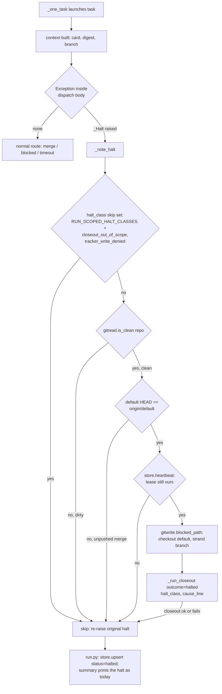

# Visible In-Progress and Halted Cards - Plan

## Goal Capsule

- **Objective:** an operator glancing at the tracker board during a run sees which cards are
  actually being worked (not still `Todo`) and which ones stopped with a reason, without
  watching the run or reading `relay status`.
- **Means:** the launched task process moves its own card to `in_review_status` as the first
  step in its brief (KTD1); a halted task gets a tracker comment from an extended Closeout
  process, gated by repo-state safety checks (KTD2, KTD3).
- **Authority:** `run.py`'s existing halt taxonomy and Closeout mechanism are the seams; this
  plan does not add a new halt class or a new process type.
- **Stop conditions:** a halt whose class is run-scoped (`remote_advanced`, `runner_crashed`,
  `unexpected_error`) or whose tree is dirty gets no comment attempt — the existing halt record
  is the operator's evidence, and touching the repo or launching a process there is unsafe.
- **Execution profile:** local_merge shipping mode only. `pr_terminal` is unimplemented in the
  run loop (`manifest_module.UNIMPLEMENTED_SHIPPING_MODES`) and its brief already shows PR state
  instead of a card status; out of scope.
- **Tail ownership:** `ce-work` builds and ships this plan under mode:return-to-caller; the
  calling Relay task process runs the gate, moves the tracker card, and commits.

## Product Contract

### Summary

Today a task's tracker card only moves once, when the task tells it to near the end of its own
session, and a card is never commented when the runner itself halts the task (as opposed to the
task reporting `status: blocked`). This plan makes the card move to `in_review_status` as the
task process's first action, and extends the Closeout process — which already writes to the
tracker after a landed or blocked outcome — to comment the halt class and cause line after a
halt, when the repository state makes that safe.

### Problem Frame

Relay task 50's origin card (Phillip, 2026-08-30) states the board does not reflect what is
in progress during a run: a task building for half an hour still reads `Todo`, and a task that
halted also reads `Todo`. Both readings are wrong in the same way — the card's status lags the
actual state the runner already knows.

### Requirements

**Early in-progress signal**

- R1. The task brief's first step moves the tracker card to `manifest.tracker.in_review_status`,
  before any other work, so the card leaves `Todo` as soon as the task process starts acting on
  it.
- R2. The task brief's existing near-end tracker step drops its now-redundant status move and
  states only the duty to comment the head commit, since R1 already made the move.
- R3. Under the markdown adapter, which has no `in_review_status` concept
  (`adapters/markdown.py`'s two-state design), the first step is a no-op explanation, matching
  the existing no-op shape of its near-end step.

**Halt visibility**

- R4. When a task process has launched and then the run halts (a `run._Halt` raised after
  `launch.launch` returned), the tracker card receives one comment naming the halt class and the
  cause line — the same values the run's own summary line prints — without changing the card's
  status field.
- R5. The halt comment is skipped, and the halt record is unaffected, when the halt class is one
  of `contracts.RUN_SCOPED_HALT_CLASSES` (`remote_advanced`, `runner_crashed`,
  `unexpected_error`), or is `closeout_out_of_scope` or `tracker_write_denied` — these mean the
  repository, a second runner, or the Closeout mechanism itself is in an uncertain state, and
  launching another Closeout process into it is unsafe.
- R6. The halt comment is skipped, and the halt record is unaffected, when the working tree is
  not clean at the point the halt is caught — a dirty tree is the operator's own evidence to
  inspect by hand, not a workspace to launch a process into.
- R6a. The halt comment is skipped, and the halt record is unaffected, when the default branch's
  local `HEAD` is ahead of `origin/<default>` — this means a merge already completed locally but
  was never confirmed pushed and verified, and the halt-comment process's own commit (if any)
  would otherwise carry that unverified merge to origin alongside it.
- R6b. The halt comment is skipped, and the halt record is unaffected, when the run's lease can
  no longer be confirmed as this runner's at the moment the halt is caught — the same freshness
  check `run._continue_past` already applies before its own repository mutation.
- R7. Before launching the halt-comment process, the repository returns to the default branch
  (reusing the existing return-to-default step the blocked route already uses), leaving the
  task branch stranded exactly as a blocked task's branch is stranded today.
- R8. A failure inside the halt-comment process itself (timeout, its own halt, an unreadable
  transcript) is logged and swallowed; it never replaces or masks the evidence of the halt that
  was already raised.
- R9. Landing keeps moving the card to `manifest.tracker.status_field` exactly as it does today;
  this plan does not touch that path.

### Key Decisions

- **Move the card from inside the task's own brief, not a new pre-task process.** (session-settled:
  user-directed — chosen over a dedicated pre-task closeout-style process: the origin card states
  the brief route "costs nothing extra" since the task process already runs, while a new process
  type would be an extra launch for one tracker write.) Governs R1, R3.
- **Extend the existing Closeout process with a third outcome instead of a new process type.**
  Closeout is already the seam that writes to the tracker after a halt is classified for landed
  and blocked outcomes (per the origin card); a third outcome reuses its template, tool
  allowlist, and commit/scope-check/push machinery rather than duplicating it. Governs R4, R7,
  R8.

### Scope Boundaries

- `pr_terminal` shipping mode (`skills/relay/templates/brief-pr-terminal.md`,
  `closeout_instructions` for that mode) is out of scope — it is unimplemented in the run loop
  and its brief does not use `in_review_status` at all.
- A pre-launch halt (the pre-flight refusal, before a task process ever runs) is never commented,
  including on a `--retry-blocked` retry whose card was already moved to `in_review_status` by
  R1 in the attempt that led to the earlier `blocked` status. On a first attempt this is exactly
  right (the card was never moved, so `Todo` stays accurate). On that retry case it is an
  accepted residual gap, not a hidden one: the card can read `in_review_status` while the retry
  itself halted at pre-flight with nothing running. Correcting it needs a second card-comment
  path from `_clear_blocked_branch`'s own failure, which is deferred rather than folded into this
  plan's single `_note_halt` seam.
- Duty two (the compound-judgment learning capture) is not restricted for the new `halted`
  outcome — it reuses the same Closeout brief and duty two section unconditionally, matching how
  it already applies to `landed` and `blocked` outcomes today. No new logic is needed for this;
  noted here because it was considered and rejected as unnecessary scope, not overlooked.
- No new halt class, no new finding class, and no change to `contracts.HALT_CLASSES` or
  `contracts.RUN_SCOPED_HALT_CLASSES` — the halt taxonomy is a closed set per this repo's own
  `CLAUDE.md` (KTD6), and this plan's gating (R5) reads that set rather than adding to it.

## Planning Contract

### Key Technical Decisions

- **KTD1. Reuse `adapters.task_tracker_steps` for the new start-of-session step.** Add a
  `start_step` key alongside the existing `review_step`/`blocked_step`, mirroring their per-adapter
  shape (a real instruction for github/jira, a no-op explanation for markdown). (session-settled:
  user-directed — chosen over inventing a separate helper: the function already exists exactly to
  supply per-adapter tracker-step text to the brief renderer, per its own docstring.) Governs R1,
  R2, R3.

- **KTD2. Add `closeout.OUTCOME_HALTED` and thread `halt_class`/`cause_line` through
  `closeout.render`/`closeout.run`.** `render()` gains a branch that composes the "What the
  runner saw" block from `halt_class`/`cause_line` instead of a landing reference, checked before
  the existing `OUTCOME_LANDED` branches. Every adapter's `closeout_instructions(outcome)` gains a
  `OUTCOME_HALTED` case: comment only, never transition or close. `cause_line` is
  `brief.defang()`-ed before it is interpolated — it can carry task-influenced text (a destructive
  call's captured argument, a dirty tree's file list from `git status`), the same untrusted-text
  concern R56 already tracks for tracker text and transcript findings. Governs R4, R9.

- **KTD3. Gate the halt-comment launch on four checks, then return to default via
  `gitwrite.blocked_path` first.** In order: the halt class is not in the widened skip set
  (`contracts.RUN_SCOPED_HALT_CLASSES` plus `closeout_out_of_scope` and `tracker_write_denied`,
  R5); the working tree is clean (R6); the default branch's local `HEAD` matches
  `origin/<default>` (R6a); the lease is still confirmed as this runner's via
  `cfg.store.heartbeat()` (R6b). Several halt raise points inside `gitwrite.local_merge_tail` (via
  `run._merge_route`) leave `HEAD` on the task branch, sometimes with a dirty tree — exactly the
  state pre-flight (R16) already refuses to launch a task process into. A gate refusal at the
  `local_merge_tail` push step (`HALT_GATE_REFUSED`) leaves a clean tree with the merge already
  applied locally but never pushed or verified, which the tree-cleanliness check alone would miss
  — R6a closes that gap, because a commit the halt-comment Closeout makes on top would otherwise
  carry the unverified merge to origin alongside it. A stale lease that expired without the
  raising halt itself being `runner_crashed` (a late `HALT_GATE_REFUSED` from the mirror push, or
  `HALT_PARTIAL_LANDING` from final verify — neither calls `still_ours()`) would otherwise pass
  every other check and let two processes touch the same repository — R6b closes that gap, reusing
  the same freshness check `run._continue_past` already applies before its own mutation. Launching
  a second, unattended Claude process onto any of these states risks disturbing the evidence an
  operator needs, or operating alongside a second live runner. Every check reuses an existing
  primitive (`gitread.is_clean`, `gitread.rev_parse`, `store.heartbeat`, `gitwrite.blocked_path`)
  rather than adding a new one. Governs R5, R6, R6a, R6b, R7.

- **KTD4. Wrap `run._one_task`'s post-launch body in `try`/`except _Halt`, calling a new
  `run._note_halt` helper before re-raising.** The wrap starts after `context = _Context(...)` is
  built (post-launch), which is also the earliest point every downstream raise site already has a
  populated `digest`, `card`, and `branch` to hand to Closeout. `_note_halt` swallows any exception
  the halt-comment attempt raises and streams a note instead of letting it propagate, so a second
  failure never overwrites the first halt's recorded evidence (this repo's own CLAUDE.md: "every
  stop is a named class with evidence, not an exception"). Pre-launch halts (the pre-flight
  refusal, which happens before a task process ever ran) are not covered on a first attempt — the
  card was never moved by R1 either, so `Todo` stays accurate and there is nothing to correct. A
  `--retry-blocked` retry that halts at pre-flight (via `_clear_blocked_branch`) is the one case
  where this reasoning does not hold, since an earlier attempt's R1 already moved the card; that
  gap is named explicitly in Scope Boundaries rather than folded into this wrap. Governs R4, R5,
  R6, R6a, R6b, R8.

### High-Level Technical Design

The diagram covers the new branching only; the existing merge/blocked/timeout routing (box D) is
unchanged.

### Assumptions

- The halt-comment Closeout call runs with the same tool allowlist as the existing
  landed/blocked Closeout calls (`closeout.allowed_tools`) rather than a narrower set. A narrower,
  comment-only allowlist was considered and rejected: the markdown adapter's halt comment needs
  `Edit`/`Write` to append a line to the tracker file, so a shared narrower allowlist would break
  it, and the existing scope-check-and-push guard already bounds what any Closeout commit may
  touch.
- `halt.message` (the raiser's own sentence, per `run._Halt`'s docstring) is what is passed as
  `cause_line` — the same text the summary's Cause line already prints — not a re-derivation from
  `contracts.HALT_LINES`.
- A halt that fires after `_run_closeout(ctx, OUTCOME_LANDED, ...)` already ran for the same task
  (e.g., a mirror push or final verify failure) produces a second, `halted`-outcome comment on a
  card that already carries a landed comment. No extra "already landed" framing is added to that
  comment: `cause_line` is `halt.message`, and the existing messages for those halt classes
  already name the specific post-landing step that failed (`HALT_GATE_REFUSED`'s "the mirror push
  was refused for %s", `HALT_PARTIAL_LANDING`'s "landed at %s but card reads %s"), which already
  distinguishes a post-landing failure from an unlanded one without a new field.

## Implementation Units

### U1. Start-of-session tracker step (R1, R2, R3, KTD1)

**Files:**
- `skills/relay/scripts/relay/adapters/__init__.py` (`task_tracker_steps`)
- `skills/relay/scripts/relay/brief.py` (`values`)
- `skills/relay/templates/brief-local-merge.md`

**Approach:**
- `task_tracker_steps(manifest, branch)` gains a `start_step` key in both branches (markdown and
  the shared github/jira/generic branch), following the existing text style of `review_step`.
  Reword the non-markdown `review_step` to drop the move duty (now only "comment the head commit
  of `%s` on the tracker card... last tracker write you make...").
- `brief.values()` adds `"tracker_start_step": tracker_steps["start_step"]` to the returned dict.
- `brief-local-merge.md`'s `## Steps` list gets a new first entry, `1. $tracker_start_step`, and
  every existing step renumbers by one (the old step 7, `$tracker_review_step`, becomes step 8).
  The `## The return envelope` section's `plan_path: <the plan path from step 2>` line is a prose
  reference to the same steps from outside the `## Steps` list; update it to `step 3` (the new
  number of the `Run $ce_plan` step) in the same edit, and grep the whole template for any other
  step-number prose reference before calling the renumbering done.

**Test scenarios** (`tests/test_adapters.py`, `tests/test_brief.py`):
- `task_tracker_steps` for a github/jira-shaped manifest returns a `start_step` that names
  `manifest.tracker.in_review_status` and says it is the first tracker write.
- `task_tracker_steps` for the markdown adapter returns a `start_step` that is a no-op
  explanation naming the tracker file, parallel to its existing `review_step`.
- `brief.render` for `local_merge` mode places `$tracker_start_step`'s text before
  `Create $branch from $default_branch` and places the (reworded) `$tracker_review_step` text
  before the return-envelope step, for both a github/jira-shaped manifest and a markdown-shaped
  one.
- The reworded `review_step` text for a non-markdown manifest no longer contains the verb "Move".
- The rendered brief's return-envelope block reads `plan_path: <the plan path from step 3>`, not
  `step 2`.

### U2. `closeout.OUTCOME_HALTED` and per-adapter instructions (R4, R9, KTD2)

**Files:**
- `skills/relay/scripts/relay/closeout.py` (`OUTCOME_HALTED`, `render`, `run`)
- `skills/relay/scripts/relay/adapters/__init__.py` (`OUTCOME_HALTED`)
- `skills/relay/scripts/relay/adapters/github.py`, `jira.py`, `markdown.py`
  (`closeout_instructions`)

**Approach:**
- `closeout.py`: add `OUTCOME_HALTED = "halted"` beside the existing `OUTCOME_LANDED`/
  `OUTCOME_BLOCKED`. `render(...)` gains `halt_class=None, cause_line=None` parameters; its
  `landing_line` computation checks `outcome == OUTCOME_HALTED` first and composes
  `"Halt class: %s\nCause: %s" % (halt_class or "unknown", brief.defang(cause_line or "no cause line recorded"))`,
  falling through to the existing landed/else branches otherwise. `run(...)` gains the same two
  parameters and passes them to `render(...)`.
- `adapters/__init__.py`: add `OUTCOME_HALTED = "halted"` beside its own
  `OUTCOME_LANDED`/`OUTCOME_BLOCKED` copies (the existing duplication pattern between this module
  and `closeout.py`).
- Each adapter's `closeout_instructions(outcome)` imports `OUTCOME_HALTED` from `.` and adds a
  branch before the final `blocked` `return`: github comments via `gh issue comment` without
  closing or moving the project item; jira adds a comment without transitioning; markdown appends
  one indented comment line under the task's entry (same mechanic as its blocked case) without
  checking the box.

**Test scenarios** (`tests/test_closeout.py`, `tests/test_adapters.py`):
- `closeout.render(..., outcome=OUTCOME_HALTED, halt_class="gate_refused", cause_line="gate refused relay/50 at abc1234; output in ...")`
  produces a "What the runner saw" block containing both values and no `Landing reference` line.
- `cause_line` containing a copy of `DATA_BEGIN`/`DATA_END` (or the unenforced-restriction
  sentences) is defanged in the rendered brief, matching the existing defang coverage for
  `title`/`description`/findings.
- `closeout.run(..., halt_class=..., cause_line=...)` renders and writes the brief the launcher
  receives, without raising, for a stub launch (mirrors existing `run()` tests for `landed`/
  `blocked`).
- Each adapter's `closeout_instructions(OUTCOME_HALTED)` returns text that does not mention
  closing/transitioning/checking the box, distinct from its `OUTCOME_LANDED` text.

### U3. Gated halt-comment dispatch in the run loop (R4, R5, R6, R6a, R6b, R7, R8, KTD3, KTD4)

**Files:**
- `skills/relay/scripts/relay/run.py` (`_one_task`, `_run_closeout`, new `_note_halt`)
- `skills/relay/scripts/relay/contracts.py` (new `CLOSEOUT_MISBEHAVED_HALT_CLASSES` tuple)

**Approach:**
- `contracts.py`: add `CLOSEOUT_MISBEHAVED_HALT_CLASSES = (HALT_CLOSEOUT_OUT_OF_SCOPE, HALT_TRACKER_WRITE_DENIED)`,
  named separately from `RUN_SCOPED_HALT_CLASSES` since these are not run-scoped for any other
  purpose (`_continue_past` still treats them as continuable).
- `_run_closeout(ctx, outcome, landing_ref=None, branch=None, commit_range=None, gate=None, halt_class=None, cause_line=None)`
  passes the two new parameters through to `closeout.run(...)`.
- Add `_note_halt(ctx, halt)`, checking in order, each a `return` (streaming a one-line note
  naming the task and the check that failed) on failure:
  1. `halt.halt_class in contracts.RUN_SCOPED_HALT_CLASSES or halt.halt_class in contracts.CLOSEOUT_MISBEHAVED_HALT_CLASSES`.
  2. `not gitread.is_clean(ctx.repo)`.
  3. `gitread.rev_parse(ctx.repo, ctx.default) != gitread.rev_parse(ctx.repo, "origin/" + ctx.default)`.
  4. `not ctx.store.heartbeat()`.

  Only once all four pass: call `gitwrite.blocked_path(ctx.repo, ctx.default, ctx.branch, ops=ctx.store, task_id=halt.task_id, env=ctx.env)`
  and then `_run_closeout(ctx, closeout.OUTCOME_HALTED, halt_class=halt.halt_class, cause_line=halt.message)`
  inside its own `try`/`except Exception`, streaming a note on failure rather than raising.
- In `_one_task`, wrap the existing body from `if launched.launch_error:` through the final
  `return _blocked_route(...)` in `try: ... except _Halt as halt: _note_halt(context, halt); raise`.
  No other control flow in that block changes; this is an indentation-only wrap plus the two new
  lines.

**Test scenarios** (`tests/test_run.py`):
- A stubbed halt raised inside the wrapped body (e.g., `launched.launch_error` set) with a clean
  tree, `default` == `origin/default`, a fresh lease, and a class outside both skip tuples
  triggers a Closeout launch with `outcome=halted` carrying the correct `halt_class`/`cause_line`,
  and the original halt still reaches the caller with its original class and message unchanged.
- The same halt with `halt_class=contracts.HALT_RUNNER_CRASHED` triggers no Closeout launch (R5).
- The same halt with `halt_class=contracts.HALT_CLOSEOUT_OUT_OF_SCOPE` triggers no Closeout launch
  (R5) — the mechanism that just misbehaved is not relaunched.
- The same halt with a dirty working tree (simulate via the test's git fixture) triggers no
  Closeout launch and the tree is left exactly as it was (R6) — assert no `checkout` call reached
  git.
- The same halt with a clean tree but the local `default` branch one commit ahead of
  `origin/default` (simulate an unpushed local merge) triggers no Closeout launch (R6a).
- The same halt with `ctx.store.heartbeat()` stubbed to return false (lease no longer ours)
  triggers no Closeout launch (R6b).
- A halt from inside `_merge_route` after the branch was already checked out to the task branch
  (e.g., `HALT_GATE_REFUSED` from a failing gate command, with `default` in sync with origin)
  results in `HEAD` on `default` after `_note_halt` runs, with the task branch still present (R7)
  — mirrors the existing `blocked_path` test fixture in `tests/test_run.py` or
  `tests/test_gitwrite.py`.
- The halt-comment Closeout launch itself failing (stub the launcher to time out or raise) does
  not change the halt that reaches the run's own halted-record; the record's `halt_class` and
  `halt_message` are the original ones (R8).
- A halt from `_merge_route` raised *after* `_run_closeout(ctx, OUTCOME_LANDED, ...)` already ran
  (e.g., a mirror push failure, with `default` already pushed and in sync with origin) still
  triggers a second, `halted`-outcome Closeout call — this is expected and additive, not a
  regression; assert two Closeout launches occurred for that task.

## Verification Contract

| Command | Applies to | Done signal |
|---|---|---|
| `python3 -m unittest discover -s tests` (repo root) | All units | Full suite passes; ~2.5 minutes |
| `python3 -m unittest test_brief` (from `tests/`) | U1 | New start-step assertions pass |
| `python3 -m unittest test_adapters` (from `tests/`) | U1, U2 | New per-adapter step/instruction assertions pass |
| `python3 -m unittest test_closeout` (from `tests/`) | U2 | New `OUTCOME_HALTED` rendering assertions pass |
| `python3 -m unittest test_run` (from `tests/`) | U3 | New gated-dispatch assertions pass |

Per this repo's `CLAUDE.md`, the stub `claude` in `tests/stub-claude` cannot produce what a real
process produces. This plan changes a brief template's step numbering and the closeout brief's
`landing_line` shape for a new outcome — both are the kind of contract-between-processes change
`docs/solutions/logic-errors/stubbed-seams-agree-by-construction-first-live-run-found-five-contract-defects.md`
warns about. Before this plan is treated as done, run one live task against the throwaway proof
target (`~/Documents/PhilAI/relay-proof`, per this repo's own memory) and confirm: the launched
process's transcript shows it moved the card first; and, separately, a forced halt (e.g., a
failing gate command) produces a tracker comment naming the halt class and cause line.

## Definition of Done

- All three implementation units land with their test scenarios passing under
  `python3 -m unittest discover -s tests`.
- `brief-local-merge.md`'s renumbered steps read correctly end to end (no stale step numbers left
  in surrounding prose).
- No new halt class, finding class, or adapter write method was added — `contracts.HALT_CLASSES`
  and `contracts.RUN_SCOPED_HALT_CLASSES` are unchanged.
- `pr_terminal` template and its `closeout_instructions` branch are untouched (Scope Boundaries).
- The one live-run check in the Verification Contract has been run, or is recorded as
  deliberately deferred with a reason (this plan does not require the live run before `ce-work`
  finishes coding and testing — the origin task's own gate is the unit-test suite — but it is the
  standard risk this repo asks every contract change to close before calling the change trusted).
- No dead code from an abandoned approach remains in the diff.
