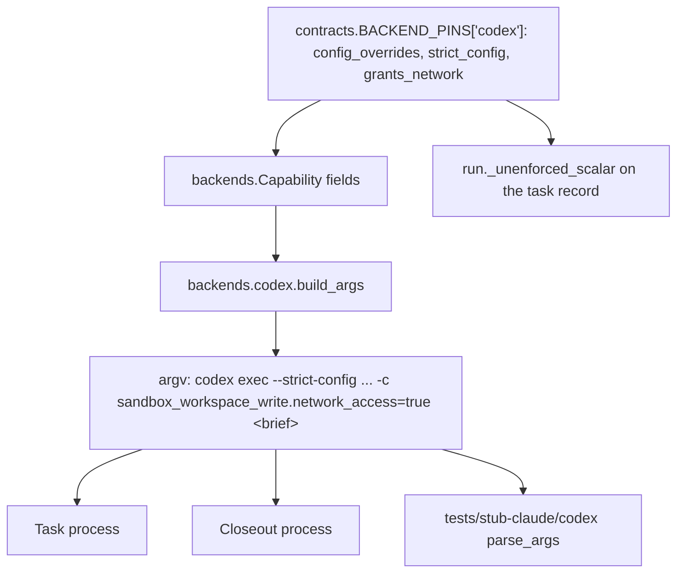

# Codex Sandbox Network Access for Tracker Writes - Plan

## Goal Capsule

- **Objective:** A Relay task assigned to the `codex` backend records its own landing on the tracker, so the operator stops paying a hand landing for work the task already finished and passed the gate on.
- **Means:** Grant the `codex` sandbox network access at launch through a config override carried on `BACKEND_PINS`, make an unrecognized override fail loudly at launch instead of silently, and say on the record what the grant permits. (KTD1, KTD2, KTD6, KTD8)
- **Authority:** The Product Contract's R-IDs govern behavior. KTDs govern mechanism. `contracts.BACKEND_PINS` stays the single producer of per backend launch facts. The halt class set in `contracts.py` stays closed (KTD6 of `docs/plans/2026-08-25-1346-feat-relay-outer-loop-plan.md`).
- **Execution profile:** Four units. One pin and record change, one argv and stub change, one run record change, one docs change. No new module, no new halt class, no change to the Runner's blocked handling.
- **Stop conditions:** Stop and report if a future `codex` release renames or moves `sandbox_workspace_write.network_access`. The observed failure mode is silent, so KTD6 is what turns it into a launch error; if `--strict-config` cannot be carried for an unrelated reason, the silent mode returns and KTD1 needs rethinking.
- **Tail ownership:** `ce-work` implements and verifies locally. The Relay runner owns the gate, the merge, and the push.

---

## Product Contract

### Summary

Add two launch facts to the `codex` backend: a config override that turns on network access inside the `workspace-write` sandbox, and `--strict-config`, which makes the CLI refuse an override key it does not recognize. The override is pinned in `contracts.BACKEND_PINS`, copied onto `backends.Capability` as a new field, and emitted by `backends.codex.build_args` as `-c <token>`. `claude` and `grok` pin an empty tuple and their argv does not change. The grant is not scoped to a host, so the pin comment records that, `SKILL.md` discloses it at manifest authoring time, and the per task record names it on every run.

### Problem Frame

Two `codex` tasks on 2026-08-31, issues #24 and #26, wrote their code, passed the gate, and then could not move or comment their own card. `gh` could not reach `api.github.com` from inside `codex exec --sandbox workspace-write`. The blocked outcome was honest and useless: the work was already done, and only the tracker write was impossible. The operator then paid the seven step hand landing repair in `docs/solutions/workflow-issues/hand-landing-repair-lands-only-when-a-commit-names-the-issue-number-as-a-word.md`, which names issue #51 as its standing producer. Every `codex` task cost that repair, so the backend was effectively unusable for unattended runs even though its code work landed clean.

The fence turns out to be optional. It is a default in the sandbox policy, not a property of the sandbox.

### Requirements

**Tracker reach**

- R1. A Task process launched on the `codex` backend can reach the tracker's API from inside the sandbox, so it can move its card to `In Progress` and comment its head commit.
- R2. The Closeout process for a `codex` Task gets the same reach. It launches through `launch.launch`, which calls the same `backends.codex.build_args`, so R1 satisfies R2 through one code path rather than two.
- R3. `claude` and `grok` argv are byte for byte unchanged by this work.

**Producer discipline**

- R4. The override token lives in `contracts.BACKEND_PINS` and reaches `build_args` only through `backends.Capability`. No module restates the token.
- R5. The pin table names the same key for all three backends, `claude` and `grok` holding an empty tuple, so a reader can tell "this backend needs none" from "this backend was not considered".

**Honest posture**

- R6. The pin comment states that `codex`'s `workspace-write` sandbox exposes network as a single switch with no scoping to a host, and names the observation that establishes it. A reader must not be able to mistake the grant for `api.github.com` only.
- R7. The `/relay` skill's posture disclosure for a backend that does not enforce tool restrictions at launch also tells the operator that a `codex` Task has network reach, so the acceptance sentence they write covers the condition that actually holds.
- R10. The `unenforced_restrictions` scalar on each `codex` task record, and the summary line that renders it, name the network grant alongside the disallow list that is not enforced. An operator running an existing manifest, whose acceptance sentence predates the grant, still sees the condition on every run.
- R11. The plan records that the grant makes every remote mutating spelling in `DISALLOWED_TOOLS` and `CLOSEOUT_DISALLOWED_EXTRA` reachable on `codex` for the first time. Those lists never reach the `codex` argv, because the pin carries `deny_flag: None`, so the absent network was what held them shut.

**Failure that is visible**

- R9. An override key the installed `codex` refuses is a launch error, not a silent no op. Without this the sandbox stays fenced, every gate in this plan still passes, and the only symptom is the blocked halt this work exists to remove.

**Grammar drift**

- R8. The `codex` stub refuses an argv that drops the config override or `--strict-config`, the same way it already refuses one that drops `--sandbox`.

### Acceptance Examples

- AE1. **Covers R1.** Given `codex exec --sandbox workspace-write` with the override on the argv, when the process runs `gh api user --jq .login`, then the command exits 0. Without the override the same command exits 1 with `error connecting to api.github.com`. Both halves were observed on 2026-09-01 against `codex-cli 0.151.0`.
- AE2. **Covers R3.** Given a `claude` Task and a `grok` Task, when `launch.build_args` runs, then no `-c` and no `--strict-config` token appears in either argv.
- AE3. **Covers R8.** Given a `codex` argv with every flag except the config override, when the stub parses it, then the stub exits non zero and names the missing flag on stderr.
- AE4. **Covers R9.** Given `--strict-config` on the argv and an override key the CLI does not recognize, when the process launches, then it prints `Error loading config.toml: unknown configuration field ... in -c/--config override` and never starts. Without `--strict-config` the same unknown key is accepted, the run proceeds, and the sandbox stays fenced with no error anywhere. Both halves were observed on 2026-09-01.
- AE5. **Covers R1.** Given the override, when the process runs `gh project item-list 4 --owner philgutowski`, then the command exits 0 and returns the board. This is the GraphQL Projects path and the account scope a card move needs, not just the REST path AE1 exercises. Observed on 2026-09-01.

### Scope Boundaries

- The Runner's handling of a blocked envelope does not change. A blocked envelope keeps meaning what it means.
- The Closeout keeps running on the Task's backend. Nothing here moves it to `claude`.
- The Jira adapter stays incompatible with `codex` and `grok` (`manifest.py`, KTD10 and R22). That rule is about Atlassian MCP tools, not network reach, so this fix does not touch it. The `github` adapter is what this fix unblocks.
- No halt class is added or retired.

#### Deferred to Follow-Up Work

- Detecting a push made from a `codex` Task or Closeout, issue #60. R11 records that the grant makes one reachable; nothing here detects one. The candidate control is to compare `origin/<default>` against the sha the runner itself pushed, after the Closeout process exits. That is a Runner control with its own halt semantics, so it is its own issue rather than a unit here.
- An end to end live Relay task on the `codex` backend against the throwaway proof target, exercising a real card move and a real comment. AE1, AE4, and AE5 prove the flag, the failure mode, and the GraphQL account scope live; the one thing still unproven is a tracker mutation from inside the sandbox.
- Re-pinning the rest of the `codex` capability record against `codex-cli 0.151.0`. The installed CLI is ahead of `version_tested`, which is genuine drift, and KTD4 explains why this plan does not silence it.
- An egress spelling list for the unenforced audit, so a `curl` or `scp` from a `codex` task lands as a finding on the record, noted in issue #60. `DISALLOWED_TOOLS` names git, `rm`, and kill spellings only, so the audit cannot currently see network use at all.

---

## Planning Contract

### Key Technical Decisions

- KTD1. **Grant the sandbox network at launch. Reject both Runner side options.** The task named three options. Option one, teaching the Runner to treat a blocked envelope whose only blocker is a tracker write as a landing candidate, weakens what `blocked` means and leaves the Task unable to do a write it was told to do. Option two, routing the card move through the Closeout, does not fix anything by itself, because the Closeout runs on the Task's own backend today. Option three exists and works. A fence that turns out to be a default, not a property, is removed rather than worked around. Governs R1, R2.
- KTD2. **Carry the override as a new pin key, `config_overrides`, a tuple of `key=value` tokens.** `backends.codex.build_args` emits `-c` once per token, exactly the shape `extra_writable_dirs` and `--add-dir` already use. A literal string inside `build_args` would put a launch fact outside the pin table the comment above `BACKEND_PINS` reserves for it. Governs R4, R5.
- KTD3. **Record that the grant is not scoped to a host, on an observation rather than an inference.** `codex exec --strict-config -c 'sandbox_workspace_write.allowed_domains=["api.github.com"]'` is refused with `unknown configuration field`. The `sandbox_workspace_write` table carries four fields, `writable_roots`, `network_access`, `exclude_tmpdir_env_var`, `exclude_slash_tmp`, and no host allowlist. So the grant is all or nothing, and the pin comment says so beside the key rather than leaving a reader to assume the narrow thing the issue asked for. Governs R6, R7.
- KTD4. **Leave `version_tested` at `0.149.0`.** The network facts were observed on `codex-cli 0.151.0`, and the pin comment records that version next to the new key. Bumping `version_tested` would assert that every other `codex` pin was re-observed on 0.151.0, which did not happen, and it would silence the drift `run._write_terminal` reports by comparing pinned against observed. The drift is real and belongs to its own re-pin task. Governs R6.
- KTD5. **The stub requires the override when the pin is non empty.** `tests/stub-claude/codex` derives its required flag set from the pin it already reads, so `-c` is required for `codex` and would not be required for a backend whose tuple is empty. An allow list alone proves nothing was added or misspelled and says nothing about a dropped flag, which is the regression shape a diff read misses. `docs/solutions/logic-errors/allow-list-flag-grammar-missed-a-dropped-required-flag.md` is the reason this is a grammar rule and not only an argv assertion. Governs R8.
- KTD6. **Carry `--strict-config` on the `codex` argv, accepting that it also validates the operator's `~/.codex/config.toml`.** Without it, an override key the CLI no longer recognizes is accepted and ignored: the process runs, the sandbox stays fenced, and the first symptom is the blocked halt plus the hand landing this plan removes. Neither the suite nor the stub can see that, because both derive the argv from the same pin. With it, the same key produces `Error loading config.toml: unknown configuration field` and the process never starts, which the Runner already records as a launch failure. The cost is that a field the operator's own config file carries and this `codex` version does not recognize would fail every launch. That is a loud, diagnosable failure rather than a silent one, and the operator's current config passes today. Governs R9.
- KTD7. **The test spells the expected token as a literal, not as a read of the pin.** `build_args` and the stub's required set both derive from `contracts.BACKEND_PINS["codex"]["config_overrides"]`, so a later edit that empties that tuple would stop the emit and stop the requirement together and no test would fail. Spelling `sandbox_workspace_write.network_access=true` in the assertion is what makes an emptied or renamed pin a failure instead of a silent loss of tracker reach. `docs/solutions/logic-errors/miss-tests-for-the-unenforced-audit-passed-with-nothing-audited.md` is the same shape. Governs R8.
- KTD8. **Say the grant on the record, not only in the skill.** `SKILL.md` fires when a manifest is authored, so an operator running a manifest written before today would never be told the posture changed, and `validate` only checks that `permissions.unenforced_acceptance` is non empty. `run._unenforced_scalar` already writes the unenforced posture onto every record for a backend that does not enforce at launch, and the summary renders it, so that scalar is where a run states what it actually ran under. Governs R10.

### High-Level Technical Design

Two launch facts travel one path, and both processes that a task spawns read them from the same place.

`launch.build_args` wraps `backends.codex.build_args` and is the only production caller, for the Task launch and for the Closeout launch alike, so R2 needs no separate code. `_reject_forbidden` scans every argv piece for the backend's forbidden permission spellings; neither new token contains one.

### Assumptions

- The operator's machine keeps `gh` authenticated outside the sandbox. The sandbox grant restores reach, it does not supply credentials. The credential the Task reaches with is the operator's ambient `gh` login, which is scoped to their account rather than to the one card, and `launch.child_env` does not scrub it because it is not a manifest named token.
- The brief text stays the last positional argument on the `codex` argv. The stub only accepts a bare positional in final position, so both new tokens go ahead of it.
- The operator's `~/.codex/config.toml` carries no field the installed `codex` rejects. Observed to hold on 2026-09-01, since a `--strict-config` run started normally.

### Sequencing

U1 first, because U2 reads the fields U1 adds. U4 also reads a U1 field. U3 touches no code, so it can land anywhere in the series, though its text describes the state U1 and U2 create and reads oddly ahead of them.

---

## Implementation Units

### U1. Pin the two launch facts and copy them onto the capability record

- **Goal:** `config_overrides`, `strict_config`, and `grants_network` exist as launch facts on all three backends, with the `codex` entries carrying the network token and the comment that keeps them honest.
- **Requirements:** R4, R5, R6, R11. Cites KTD2, KTD3, KTD4, KTD6.
- **Dependencies:** none.
- **Files:**
  - `skills/relay/scripts/relay/contracts.py`
  - `skills/relay/scripts/relay/backends/__init__.py`
  - `tests/test_backends.py`
- **Approach:**
  1. Add `config_overrides` to each of the three tables in `BACKEND_PINS`. `claude` and `grok` get `()`. `codex` gets a one entry tuple holding `sandbox_workspace_write.network_access=true`.
  2. Add `strict_config` and `grants_network` to each table, both bools. `claude` and `grok` get `False`, `codex` gets `True` for each. `grants_network` states what the override means so `run.py` never has to read meaning out of a `-c` token: a token pinned as `network_access=false` would satisfy any substring test and put a false claim on the record.
  3. Write the comment above the `codex` entries in the shape the neighbouring `extra_writable_dirs` comment uses: what the default refuses, what the override restores, the version and date it was observed on, the KTD3 finding that the sandbox takes no host allowlist, and the KTD6 reason `--strict-config` rides along.
  4. Amend the existing `enforces_at_launch` comment, which currently names R19's acceptance sentence, R21's landing bound, and R24's audit as the compensating controls. Add that the absent network was also holding `CLOSEOUT_DISALLOWED_EXTRA` and the remote mutating half of `DISALLOWED_TOOLS` shut on this backend, and no longer is (R11).
  5. Add the matching `config_overrides: tuple`, `strict_config: bool`, and `grants_network: bool` fields to `backends.Capability`, next to `extra_writable_dirs`.
- **Patterns to follow:** the `extra_writable_dirs` key and its U1 finding comment in `contracts.py`, and the `Capability` field order in `backends/__init__.py`.
- **Test scenarios:**
  - Every backend in `BACKEND_PINS` carries all three keys, mirroring `test_extra_writable_dirs_is_uniform_and_codex_keeps_the_git_token`.
  - `backends.build("codex").CAPABILITY.config_overrides` equals a one entry tuple whose single element is the literal string `sandbox_workspace_write.network_access=true`, spelled in the test rather than read back from the pin (KTD7).
  - `backends.build("codex").CAPABILITY.strict_config` and `.grants_network` are both `True`; the `claude` and `grok` ones are `False` and their `config_overrides` are empty.
  - `Capability(**BACKEND_PINS[name])` still constructs for all three names, which `test_every_record_is_a_complete_copy_of_the_pins` already asserts and which a forgotten dataclass field would break.
- **Verification:** `tests/test_backends.py` passes, the pin comment states the no scoping finding without claiming the grant is limited to one host, and the `enforces_at_launch` comment no longer describes a bound that only held while the sandbox had no network.

### U2. Emit both tokens on the codex argv and teach the stub the grammar

- **Goal:** A launched `codex` process carries the override and refuses an unrecognized override key, and the stub refuses an argv that lost either token.
- **Requirements:** R1, R2, R3, R8, R9. Cites KTD2, KTD5, KTD6, KTD7.
- **Dependencies:** U1.
- **Files:**
  - `skills/relay/scripts/relay/backends/codex.py`
  - `tests/stub-claude/codex`
  - `tests/test_backends.py`
  - `tests/test_launch.py`
  - `tests/test_stub.py`
- **Approach:**
  1. In `backends.codex.build_args`, append `--strict-config` when `cap.strict_config`, then extend the argument list with `-c` plus the token once per entry in `cap.config_overrides`, both before the `--add-dir` loop and before the brief is appended. Keep `-c` in the position the live probes used, after the `exec` subcommand and among the other flags.
  2. In the stub, add `-c` to the repeatable value flag handling alongside `--add-dir`, collecting into a list rather than a scalar key, and add `--strict-config` to the boolean flags. `-c` and the existing `-C` are distinct keys and must stay distinct.
  3. In the stub, derive the required set so `-c` is required when `contracts.BACKEND_PINS["codex"]["config_overrides"]` is non empty and `--strict-config` is required when the pin says so. Keep `--add-dir` outside the required set; tightening that one is a separate concern and not this unit's change.
- **Execution note:** Write the dropped flag stub test before the stub change, so the test is seen failing against the current lenient grammar rather than passing by construction.
- **Patterns to follow:** the `--add-dir` branch in the stub's `parse_args` for a repeatable value flag, the `extra_writable_dirs` loop in `build_args` for the emit shape, and `StubCodex.test_build_args_grammar_accepted_a_renamed_flag_rejected` in `tests/test_stub.py` for how a grammar test runs the stub as a subprocess and asserts on the exit code rather than on a raised exception.
- **Test scenarios:**
  - A `codex` argv built by `launch.build_args` contains `--strict-config`, and contains `-c` immediately followed by the literal `sandbox_workspace_write.network_access=true`.
  - The brief text is still the final element of the `codex` argv after both tokens are added.
  - A `claude` argv and a `grok` argv contain neither token.
  - The stub, run as a subprocess on a full `codex` argv including both tokens, exits 0.
  - The stub exits non zero and names the missing flag on stderr when the `-c` pair is removed from an otherwise complete argv.
  - The stub exits non zero when `--strict-config` is removed from an otherwise complete argv.
  - The stub still exits non zero on an unrecognized flag, so widening the value flag set did not widen the grammar generally.
  - `launch.build_args` for `codex` still passes `_reject_forbidden`, with neither `danger-full-access` nor `--dangerously-bypass-approvals-and-sandbox` reachable through either token.
- **Verification:** `tests/test_backends.py`, `tests/test_launch.py`, and `tests/test_stub.py` pass, and every existing `codex` path test in the suite still passes against the strict stub.

### U4. Name the grant on the task record and in the summary

- **Goal:** Every `codex` run states the posture it actually ran under, whatever the manifest's acceptance sentence was written against.
- **Requirements:** R10. Cites KTD8.
- **Dependencies:** U1.
- **Files:**
  - `skills/relay/scripts/relay/run.py`
  - `tests/test_run.py`
- **Approach:**
  1. In `run._unenforced_scalar`, append one clause naming the unscoped network grant when the backend's capability carries `grants_network`.
  2. Keep the value a single line. The scalar is Cause line safe today and the summary renders it verbatim, so a newline would break both.
- **Patterns to follow:** the existing composition of `_unenforced_scalar` and `contracts.UNENFORCED_BOUND`, which already put a posture statement and its detection bound on one line.
- **Test scenarios:**
  - A `codex` task record's `unenforced_restrictions` names the network grant alongside the unenforced disallow list.
  - The scalar stays a single line with no newline, which is what keeps it usable on a Cause line.
  - A `grok` record, which is also unenforced at launch but carries no network grant, does not gain the clause.
  - The summary renders the extended scalar without truncation or reflow.
- **Verification:** `tests/test_run.py` and `tests/test_summary.py` pass, and a `codex` record read by hand states the grant.

### U3. Correct the operator disclosure and the standing repair note

- **Goal:** The places that describe the old condition stop describing it.
- **Requirements:** R7. Cites KTD3, KTD8.
- **Dependencies:** U1 for the fact, none for the text.
- **Files:**
  - `skills/relay/SKILL.md`
  - `docs/solutions/workflow-issues/hand-landing-repair-lands-only-when-a-commit-names-the-issue-number-as-a-word.md`
- **Approach:**
  1. In `SKILL.md` step 3 of the manifest authoring sequence, add one sentence to the plain words disclosure: a `codex` Task also runs with network reach inside its sandbox, granted so it can write to the tracker, and not limited to the tracker's host. The existing instruction to write only what the operator supplies is unchanged.
  2. In the solution doc, date stamp every passage that states the fence in the present tense as fixed on 2026-09-01, naming this plan. That is the Context paragraph's `blocks network, so gh cannot reach api.github.com` clause and the later `can hit the exact same wall` clause. Keep the account of what happened on 2026-08-30 and 2026-08-31 intact; only the tense and the standing claim change.
  3. In the same doc's Related list, replace the line calling issue #51 the standing producer of the repair with one saying the fence was removed on 2026-09-01 and naming this plan. The repair itself stays live, since its own Context names three other producers.
- **Patterns to follow:** the existing sentence structure of `SKILL.md` step 3, which states a condition and then asks the operator for their own words.
- **Test scenarios:** Test expectation: none. Prose only, and `tests/test_examples.py` asserts only that `SKILL.md` carries an invocation per CLI verb, which this does not touch.
- **Verification:** `tests/test_examples.py` still passes, and neither file still tells a reader in the present tense that the codex sandbox blocks the tracker write.

---

## Verification Contract

| Gate | Command | Applies to |
|---|---|---|
| Unit suite | `python3 -m unittest discover -s tests` from the repo root | U1, U2, U3, U4 |
| Single module during work | `python3 -m unittest test_backends`, `test_launch`, and `test_stub` from `tests/` | U1, U2 |
| Single module during work | `python3 -m unittest test_run` and `test_summary` from `tests/` | U4 |

The suite takes about two and a half minutes. A local pre push hook, not tracked in git, runs it again on push.

The live CLI seam is proven for every fact this plan adds. AE1, AE4, and AE5 were all run against the installed `codex-cli 0.151.0` on 2026-09-01. The repo's live run rule in `CLAUDE.md` names the contracts between processes: the envelope grammar, the closeout terminal line, a brief template, the halt record, the classify digest keys. The launch argv is not one of them, and the stub plus the live probes cover it from both sides. What the probes do not cover is a tracker mutation from inside the sandbox, which stays in Deferred to Follow-Up Work.

---

## Definition of Done

- R1 through R11 hold.
- The suite passes from the repo root.
- The three new pin keys appear in `contracts.py` as values and `backends/__init__.py` as fields; `backends/codex.py` reads `config_overrides` and `strict_config` for the argv, `run.py` reads `grants_network` for the record clause, and `tests/stub-claude/codex` reads the pin to derive its required set. Nowhere else.
- `run.py` never parses a `-c` token to learn what an override means. `grants_network` states it.
- The `codex` pin comment names the observed version, the date, the refused host allowlist key, and the reason `--strict-config` rides along.
- At least one test asserts the override token as a literal string rather than reading it back from the pin.
- No dash of any kind appears in the prose this work adds, in either the code comments or the docs.
- No abandoned attempt is left in the diff. If the config key shape changed during the work, only the landed shape remains.

---

## Sources

Live probes, all run 2026-09-01 against `codex-cli 0.151.0` at `/opt/homebrew/bin/codex`, in a throwaway git repo, with `codex exec --sandbox workspace-write -C <dir> "<prompt>"` as the base command.

- Default, no override: header prints `sandbox: workspace-write [workdir, /tmp, $TMPDIR]` and `gh api user --jq .login` exits 1 with `error connecting to api.github.com`.
- With `-c sandbox_workspace_write.network_access=true`: header prints the same line plus `(network access enabled)` and the same command exits 0.
- Same override, `gh project item-list 4 --owner philgutowski --limit 1 --format json` exits 0 and returns the board, which is the GraphQL Projects path and the account scope a card move needs.
- With `--strict-config` and `-c 'sandbox_workspace_write.allowed_domains=["api.github.com"]'`: refused before launch with `Error loading config.toml: unknown configuration field 'sandbox_workspace_write.allowed_domains' in -c/--config override`. This is the observation behind KTD3.
- The same unknown key without `--strict-config`: accepted silently, the run proceeds, and the header shows the sandbox with no network note. This is the observation behind KTD6.

Other sources.

- The shipped `codex` binary's own help text: "In `workspace-write`, network access still depends on your Codex configuration (for example `[sandbox_workspace_write] network_access = true`)". Its `sandbox_workspace_write` field list is `writable_roots`, `network_access`, `exclude_tmpdir_env_var`, `exclude_slash_tmp`.
- `docs/solutions/logic-errors/allow-list-flag-grammar-missed-a-dropped-required-flag.md`, why the stub gets a required set check and not only an argv assertion.
- `docs/solutions/logic-errors/miss-tests-for-the-unenforced-audit-passed-with-nothing-audited.md`, why the expected token is spelled as a literal in the test.
- `docs/solutions/workflow-issues/hand-landing-repair-lands-only-when-a-commit-names-the-issue-number-as-a-word.md`, the operator cost this fix removes, and the three other producers of that repair which it does not.
- `docs/plans/2026-08-30-2217-fix-closeout-task-backend-plan.md`, why the Closeout runs on the Task's backend, which is what makes option two in the issue a non fix.
- `skills/relay/scripts/relay/manifest.py`, the Jira and non claude backend incompatibility, MCP based and untouched here.
