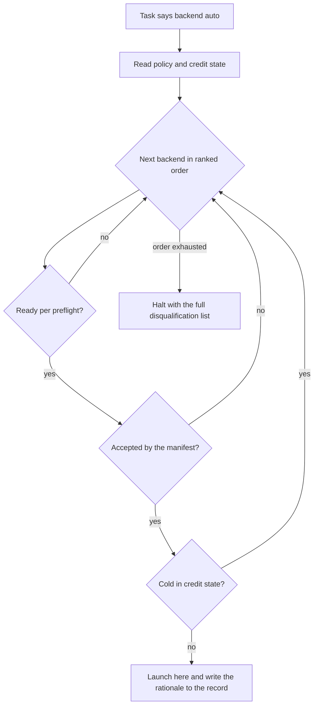

# Backend Router - Plan

## Goal Capsule

- **Objective:** An operator authors a manifest by writing `auto` on the tasks any accepted backend can carry, and the run lands each one on a subscribed backend that is ready, accepted, and has credit, with every routing choice explained on the record. A quota death on one backend no longer cascades into the tasks behind it.
- **Means:** A Router seam in the Runner that resolves `backend = "auto"` per task, just before launch, from three inputs: the policy file's ranked backend order, the existing backend readiness preflight, and a per machine credit state file fed by learned cooldowns and live rate limit telemetry.
- **Product authority:** GitHub issue #61 plus the 2026-09-01 dialogue. Issue #61's settled constraints are binding: the Router never routes to a backend the manifest has not accepted through `unenforced_acceptance`, records distinguish operator pinned from router chosen, and no routing decision is silent.
- **Open blockers:** Depends on issue #57 (a grok session dies without an envelope when a commit uses command substitution) and issue #58 (retry ignores a deliberate manifest reassignment) landing first. Routing work onto grok is unsafe until #57's brief fix lands, and routed retries need #58's reassignment semantics underneath them.

---

## Product Contract

### Summary

Add `backend = "auto"`: the Runner resolves it per task at launch by taking the first backend in the policy file's ranked order that passes readiness, is accepted by the manifest, and is not in a credit cooldown. Credit state is a per machine file fed by learned quota cooldowns on every backend and a preemptive utilization threshold where telemetry exists, with a CLI surface to view and override it.

### Problem Frame

A task's backend is a static manifest field today, chosen by hand at authoring time from the rubric. The operator's subscriptions change independently of any manifest: a codex plan can lapse, a grok plan can be upgraded, the anthropic weekly window can close mid run. Round eight supplied the live evidence: grok landed docs and mechanical cards cheaply while opus carried design seams, and nothing in Relay could act on that pattern.

The sharper cost is what happens when credit runs out. An exhausted usage window kills a task in a way the classifier cannot distinguish from a crash, the run continues, and every later task launches into the same dead window and records the same misleading `no_envelope` block. The telemetry that would say otherwise, live utilization and reset timestamps on `rate_limit_event` lines, is already written into files Relay owns and is discarded by design (`docs/solutions/workflow-issues/quota-exhaustion-reads-as-no-envelope-and-the-rate-limit-telemetry-is-already-discarded.md`). The only defenses today are a human reading `/usage` before launch and hand surgery on state afterward.

### Key Decisions

- KD1. **Resolve per task, just before launch.** (session-settled: user-approved — chosen over resolving every auto task once at run start: per task resolution uses the freshest credit and readiness state, so a cooldown learned from one task's death routes the next task around the wall instead of into it.) `CONCEPTS.md`'s Backend entry is amended: the Runner resolves `auto` at each launch but still never changes a launched task's backend. Governs R5, R6.
- KD2. **No kind taxonomy in this version.** (session-settled: user-directed — chosen over operator defined kinds ranked in the policy file: smallest version that delivers value; the Router routes on availability and credit only, and judgment about which work suits which backend stays at authoring time.) Governs R7.
- KD3. **A single ranked backend list in the policy file decides preference.** (session-settled: user-approved — chosen over hardcoded spend preferences: one operator written order, portable to any fork's subscription mix.) Governs R7.
- KD4. **An empty candidate set halts with the full disqualification list.** (session-settled: user-approved — chosen over sleeping until the earliest known reset: an honest stop with diagnosis quality evidence, retried by the next run.) Governs R9.
- KD5. **Only explicit `auto` opts a task into routing.** (session-settled: user-directed — chosen over the policy file's presence flipping the default for tasks naming no backend: a manifest must mean the same thing on every machine, and existing manifests must keep their exact meaning.) Governs R1.
- KD6. **Credit state is reactive everywhere and preemptive where telemetry exists.** (session-settled: user-approved — chosen over reactive cooldowns only: the utilization warning is already on the wire for claude, so the first death into a known exhausted window is preventable, not just the second.) Governs R13, R14, R15.
- KD7. **The credit state gets a full operator surface: view, mark cold, clear.** (session-settled: user-approved — chosen over view only: a wrong learned cooldown must never require hand surgery on a json file, the lesson issue #58 taught about `state.json`.) Governs R17.
- KD8. **`/relay` authoring is unchanged: the operator writes `auto` where they want it.** (session-settled: user-directed — chosen over the rubric proposing auto or a pin per task: safest first version; the rubric keeps proposing concrete backends and the operator substitutes `auto` deliberately.) Governs R2.
- KD9. **An auto task omits `model`; the policy maps effort to a model per backend.** (session-settled: user-approved — chosen over the model constraining the candidate set or backends translating model names: model names are backend specific and every backend passes `task.model` straight to its CLI flag, so the mapping must live where the ranking lives.) Governs R3, R11.

### Requirements

**Manifest and opt in**

- R1. A task may name `backend = "auto"`, and `[defaults] backend` may be `"auto"`. Nothing else opts a task into routing; the policy file's presence never changes any manifest's meaning.
- R2. `/relay` keeps proposing concrete backends from the rubric exactly as today; it documents `auto` and writes it only when the operator asks for it on a task.
- R3. An auto task carries `effort` and no `model`; validate refuses an auto task that names one. Pinned tasks are unchanged.
- R4. The existing reason rule applies to `auto` unchanged: a task whose resolved backend value differs from the resolved default carries a `reason`, and a task matching the default needs none.

**The Router**

- R5. The Runner resolves each auto task immediately before launching it, and never re resolves or changes the backend of a task already launched.
- R6. The Router walks the policy's ranked order and picks the first backend that passes all three gates: the readiness preflight, manifest acceptance, and credit. The record must let a reader reconstruct the walk.
- R7. The Router considers only machine and manifest state, never the work's content: ranked order, readiness, acceptance, credit. It holds no judgment about which work suits which backend.
- R8. Manifest acceptance means the Router may only choose a backend the manifest could have named validly itself: a backend that does not enforce at launch qualifies only when `permissions.unenforced_acceptance` and `permissions.task_allowed_paths` are present, and a jira tracker restricts the candidate set to claude. The Router widens no trust surface the manifest did not already accept.
- R9. When no backend qualifies, the task halts before launch and its evidence names every backend with the reason it was ruled out, including any known reset time. The halt's home in the closed class set is an outstanding question for planning.
- R10. A routed task may resolve to a different backend on retry; an operator pinned backend is never overridden by the Router on any run or retry. This composes with issue #58's reassignment semantics.

**Policy file**

- R11. The policy file is per machine, operator written config with its own lifetime: the ranked backend order, a per backend mapping from `effort` to the exact CLI model string, the preemptive utilization threshold, and the default cooldown duration for backends with no telemetry. Nothing in the repo or the manifest hardcodes anyone's subscriptions.
- R12. A manifest containing auto tasks is refused at validate when the policy file is missing or invalid. Validate reports each auto task's effective candidate set, naming any backend the manifest's own gates exclude, so narrowing is visible before an unattended run rather than discovered in its summary.

**Credit state**

- R13. Credit state is derived per machine data in its own file, written by the machine and the credit CLI only, never shipped, with a lifetime separate from the policy file.
- R14. Reactive learning: when a task process's exit stream carries a recognizable quota or rate limit signal, the backend is marked cold until the reset time the stream names, or for the policy's default duration when it names none. An exit with no recognizable signal teaches nothing, so a plain crash can never poison routing.
- R15. Preemptive hold: the last rate limit telemetry seen on a backend's stream is captured into the credit state, and the Router treats that backend as cold while its utilization exceeds the policy threshold and the reset is still ahead. Today claude is the only backend with such telemetry; the mechanism is per backend, not claude specific.
- R16. The same captured telemetry attaches to `no_envelope` halt evidence, so a cause line can state the last known window reading at the moment a process died. No new halt class is created for this.
- R17. A CLI surface shows each backend's credit state with reset times, marks a backend cold until a stated time, and clears a learned cooldown. No workflow requires editing the credit file by hand.

**Record and summary**

- R18. Every task record states whether its backend was operator pinned or router chosen. A router chosen record carries the full rationale: the ranked order consulted and each higher ranked backend's disqualification.
- R19. The run summary renders routing the way it renders halts today: a reader who was not watching learns what routed where and why without opening a transcript or a log.

### Key Flows

- F1. **Routed launch.**
  - **Trigger:** The Runner reaches a task whose backend is `auto`.
  - **Steps:** Read the policy and credit files; walk the ranked order through the three gates of R6; write the choice and rationale to the record; launch on the chosen backend.
  - **Outcome:** The task runs on a warm, accepted backend and its record explains the choice.
  - **Covers R5, R6, R18.**
- F2. **Quota death mid run.**
  - **Trigger:** A task process dies and its stream carries a recognizable quota signal.
  - **Steps:** The exit handling records a cooldown with the reset time; the next auto task's resolution finds that backend cold and picks the next in rank.
  - **Outcome:** One death per exhausted window instead of a cascade; the summary shows the death and the reroute.
  - **Covers R14, R6.**
- F3. **Nothing qualifies.**
  - **Trigger:** An auto task's walk exhausts the ranked order.
  - **Steps:** The task halts before launch with per backend disqualification evidence; existing `continue_past_task_halt` semantics decide whether the run continues.
  - **Outcome:** An honest diagnosis instead of a launch into a wall.
  - **Covers R9.**
- F4. **Operator correction.**
  - **Trigger:** The operator knows something the machine cannot, a window burned in another terminal or a wrong learned cooldown.
  - **Steps:** They run the credit CLI to mark cold or clear; the next resolution reads the corrected state.
  - **Outcome:** Operator knowledge enters routing without hand editing state.
  - **Covers R17.**

### Acceptance Examples

- AE1. **Covers R6, R18.** Given a policy ranking grok, codex, claude and a manifest carrying `unenforced_acceptance` and `task_allowed_paths`, when grok is in a cooldown, an auto task launches on codex and its record names grok's cooldown with its reset time as the reason it was passed over.
- AE2. **Covers R8, R12.** Given the same policy but a manifest with no `unenforced_acceptance`, validate reports the effective candidate set for auto tasks as grok and claude, codex excluded; under a jira tracker it reports claude alone.
- AE3. **Covers R15.** Given captured claude telemetry reading the seven day window at 0.97 with the reset tomorrow and a policy threshold of 0.95, an auto task routes past claude to the next ranked backend.
- AE4. **Covers R10.** Given a task pinned `backend = "grok"` that halted, retry relaunches it on grok. Given a router chosen task that halted because grok went cold, retry re resolves and may choose another backend, and the record shows the new resolution.
- AE5. **Covers R3.** Given an auto task that also names `model = "opus"`, validate refuses the manifest.
- AE6. **Covers R14.** Given a task that died leaving a truncated transcript and no quota signal anywhere in its stream, the credit state is unchanged and the next auto task may still resolve to that backend.

### Success Criteria

- The operator authors a real round with `auto` on most eligible tasks and reports less friction than assigning a backend per task, the stated bar for this epic.
- A run that hits an exhausted window loses at most one task to it; the tasks behind it land elsewhere or halt honestly.
- Routing needs no transcript reading: pinned vs chosen, the rationale, and any disqualifications are legible from records and the summary alone.

### Scope Boundaries

Deferred for later:

- The kind taxonomy and any skill affinity input to the Router; affinity judgment stays at authoring time.
- `/relay` proposing `auto` per task from the rubric.
- Waiting for a reset instead of halting when nothing qualifies.
- The cross run outcome ledger and an outcome informed rubric, deferred by the parent backends plan and still deferred.
- Mid task intervention: rising utilization never stops or moves a task already launched.

Not this work:

- Implementing any of this, editing runner modules, or launching runs; this artifact is requirements only.
- The open cards #43 through #58, which other sessions own.

### Dependencies / Assumptions

- Depends on issue #57: until the grok brief stops command substitution commits, a routed grok task dies at its commit, so routing there converts cheap credit into stranded branches.
- Depends on issue #58: routed retry behavior (R10) needs the retry reassignment semantics that issue defines.
- Assumption: codex and grok streams carry some recognizable signal when quota kills a session. Unverified; if they do not, those backends never learn cooldowns automatically and the manual cold path (R17) is their only credit control. The stubbed seams learning applies: confirm against the live CLIs before treating any signal as recognizable.
- `CONCEPTS.md`'s Backend entry and `skills/relay/references/backend-rubric.md`'s "never chooses during a run" sentence are amended by the implementing work, per KD1.

### Outstanding Questions

Deferred to Planning:

- The empty candidate halt's home: amend KTD6 with a new halt class through the plan, or attach the disqualification evidence to an existing class as a finding. The closed set rule requires planning to choose explicitly rather than inherit a default.
- The policy and credit files' exact locations and formats, alongside the existing state root convention.
- Which stream shapes count as a recognizable quota signal per backend, established against the live CLIs, not assumed from documentation.

### Sources / Research

- GitHub issues #61 (this epic), #57, #58, #53 on `philgutowski/relay`.
- `docs/solutions/workflow-issues/quota-exhaustion-reads-as-no-envelope-and-the-rate-limit-telemetry-is-already-discarded.md`: the credit signal gap, the discarded telemetry, and the argument against a new halt class.
- `docs/plans/2026-08-28-1101-feat-pluggable-cli-backends-plan.md`: R2 treats a mixed manifest as single backend and names runtime routing out of scope; this epic is the deliberate reversal of that deferral.
- Code anchors verified 2026-09-01: backend resolution and defaults `skills/relay/scripts/relay/manifest.py:273`, reason rule `manifest.py:511`, readiness preflight `manifest.py:369` invoked once per run at `skills/relay/scripts/relay/cli.py:114` and `cli.py:144`, record wins on retry `skills/relay/scripts/relay/run.py:373`, unenforced acceptance gate `manifest.py:518`, telemetry discard pinned at `tests/test_tail.py:102`, per backend pins `skills/relay/scripts/relay/contracts.py:127` with no model field on any pin.
