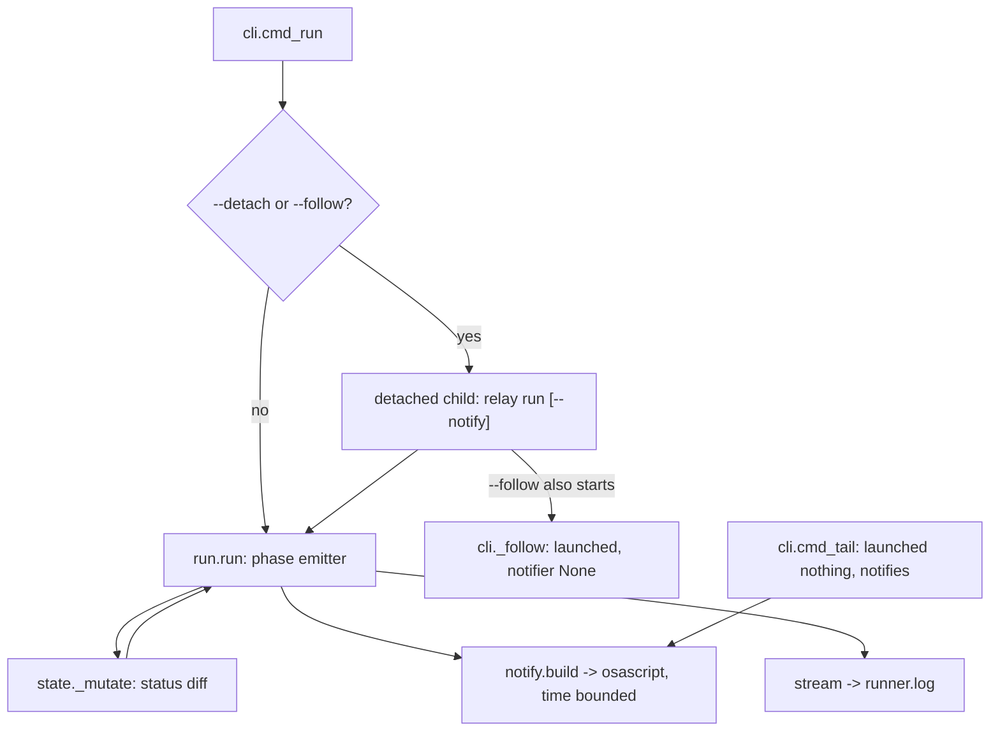
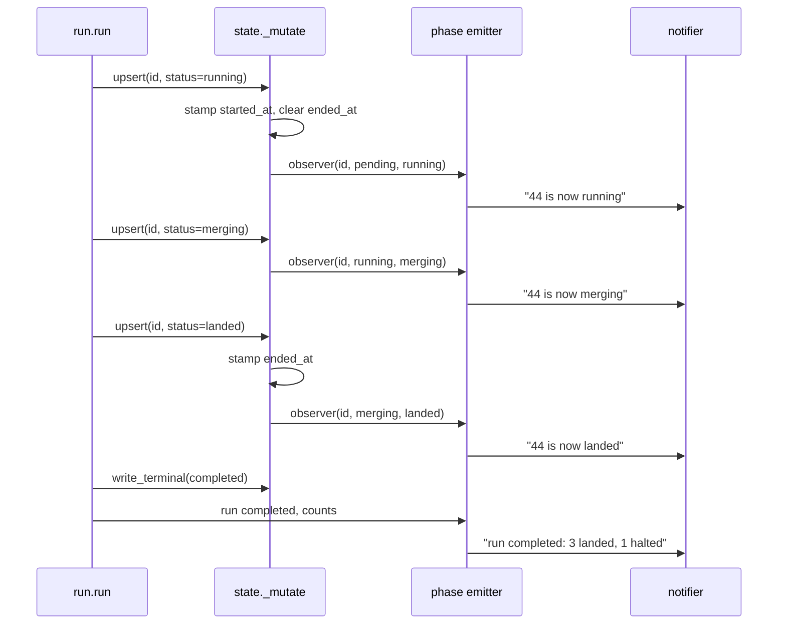

# Runner Notifications and a Progress View - Plan

## Goal Capsule

- **Objective:** an operator who launched a run and walked away learns that it moved, and can ask how far along it is and roughly how much is left, without attaching a Follower and without reading a log.
- **Means:** the Runner honors `--notify` itself and `status` grows a progress view (KTD1, KTD6).
- **Authority:** the R-IDs below win on behavior. The KTDs win on mechanism. A unit overrides neither.
- **Execution profile:** six units, dependency ordered, each landable as one commit. Unit test coverage against the existing suite, plus one hand run that the suite cannot perform.
- **Stop conditions:** stop and report if the notify path cannot be both exception isolated and time bounded, or if the progress numbers cannot be computed without acquiring the Lease.
- **Tail ownership:** the runner that launched this task owns the gate, the merge, and the push.

---

## Product Contract

### Summary

Two changes reach the operator of an unattended run. First, `--notify` becomes a Runner flag as well as a Follower flag, so a detached run fires a desktop notification on each phase event whether or not anybody is attached, and the terminal record's notification carries the run's counts. Second, `relay status` grows a one screen progress view: per task status and elapsed, the run's counts, total elapsed, and a rough remaining estimate from the mean landed duration. Supporting both, a Task record gains real `started_at` and `ended_at` stamps, which today are declared and never written.

### Problem Frame

A Relay run is invisible unless somebody watches it. Two paths reach the operator today and both need a person present. `relay status` reports the cursor as N of M plus one line per task, which says where the run is but not how long it has taken or how much is left. `--notify` belongs to the Follower, and the Follower is a foreground reader, so a run started bare with `--detach`, as round six stage A was through launchd, notifies nobody at all. Even the launch `SKILL.md` documents, `run --follow --phases --notify --for 540`, notifies only for its first nine minutes, because the Follower exits at the `--for` bound and the run keeps going with nobody attached. The 2026-08-28 follower plan named the bare `--detach` half of this cost and accepted it (KTD4 there). Round six's stage A is what made it expensive: hours of run with nothing on the desktop and nothing in `status` that answered "how much longer".

The timing data needed for the second half is half absent. `state.RECORD_FIELDS` declares `started_at` and `ended_at`, `run.py` writes `started_at=None` at the running transition, and nothing writes `ended_at` at all. `wall_seconds` exists but measures the Task process alone and appears only after that process exits, so a running task has no elapsed measure of any kind.

### Requirements

**Runner side notification**

- R1. A run launched with `--detach --notify` fires a desktop notification on every phase event, with no Follower attached.
- R2. A Runner phase event is a Task record's status changing, or the run writing its terminal record. The Runner reports two of the three moments `CONCEPTS.md` names a phase event: a Task's log starting is announced as its transition into `running`, which the Runner writes immediately before it launches the Task process, and the per log header stays the Follower's alone because only the Follower reads those files. Both Runner events also print one line to the Runner's stream, so `runner.log` carries them whether or not notifications are on.
- R3. The terminal record's phase event carries the run's outcome and its per status counts in one line.
- R4. A failure in the notify path leaves the run's outcome, its records, and its exit code unchanged, and a notifier that blocks rather than fails cannot stall the run.
- R5. A phase event fires exactly one notification. The Runner is the only component that notifies for a run it was launched with, including under `--follow`, where the Follower prints its lines without notifying.
- R6. The suite fires no notification. No test passes `--notify` and no test executes the notifier's argv.

**Progress view**

- R7. `relay status` prints one line per Manifest Task, in Manifest order, carrying its status and its elapsed time, then any record whose id the Manifest no longer names, sorted by id, keeping its existing marker and carrying no elapsed.
- R8. `relay status` prints one counts line covering landed, running, merging, halted, blocked, excluded, and todo.
- R9. `relay status` prints the summed working time of every Task in the state directory, named as that rather than as wall clock since the run started.
- R10. `relay status` prints a rough remaining estimate derived from the mean elapsed of landed Tasks, beside the number of landed Tasks that mean came from, and says plainly that there is no estimate when no landed Task carries a usable elapsed.
- R11. `relay status` keeps its current behavior: it reads state and nothing else, acquires no Lease, and its existing lines stay.

**Timing data**

- R12. A Task record carries `started_at` when it enters `running`, and `ended_at` when it moves from a non terminal status into a terminal one. Entering `running` clears any `ended_at` a previous attempt left. Both stamps are ISO 8601 UTC, the same shape the Lease stamps already use.
- R13. A record whose stamps are missing, partial, or unparseable produces no elapsed number rather than a wrong one.

**Documentation**

- R14. `CONCEPTS.md` no longer says the Follower is the only component that notifies, and the Runner entry names which of the three phase event moments the Runner reports.
- R15. `skills/relay/SKILL.md` and `README.md` describe `--notify` on a bare `run` and the new `status` output, and the documented launch line still produces notifications past its `--for` bound.

### Success Criteria

- A run launched by launchd with `--detach --notify` and no attached reader announces its first Task starting and its terminal record on the operator's desktop, confirmed by one hand run rather than by the suite.
- `relay status` against a half finished run answers "how far along and how much longer" without the operator opening `runner.log`, `state.json`, or a transcript.

### Scope Boundaries

**Deferred for later**

- Notifications on Linux and Windows. `osascript` stays the only backend, unchanged from the 2026-08-28 plan.
- A notification carrying a Cause line per halted Task. The terminal record's counts line names how many halted; the Cause lines stay in `summary`.
- Notification rate limiting or coalescing. A serial run's transition rate is a handful per Task and needs none.
- A third Runner phase event for a Task's log starting, distinct from its `running` transition. R2 maps the card's three events onto the Runner's two because the Runner writes `running` immediately before it launches the process, so a separate event would fire microseconds later and say the same thing. Only the Follower can report the per log header, because only the Follower reads the logs.

**Deferred to Follow-Up Work**

- Backfilling `started_at` and `ended_at` onto records written by older runs. New stamps appear from the next transition forward; older records show no elapsed, which R13 already covers and which R10's estimate guard accounts for.

**Outside this work**

- Suppressing a second notification when the operator separately launches `relay tail --notify` beside a run already started with `--notify`. That operator asked twice, on two command lines, and R5's exactly once property covers the components one launch creates. `_detach` cannot reach a Follower started later.
- A new Halt class. A new outcome is a finding attached to a record, per `CLAUDE.md`.
- Any Tracker write from the Runner.
- Changing `summary`'s JSON schema. The progress numbers are a separate module, per KTD7.
- An eighth verb. Per KTD6 the progress view extends `status`.

---

## Planning Contract

### Key Technical Decisions

- KTD1. **`--notify` reaches the detached Runner through its own argv.** `_detach` builds the child's command line in `detach_command` and the child is an ordinary `relay run` with no `--detach`. Appending `--notify` there means the child takes the same code path a foreground `relay run --notify` takes, so one implementation serves both and there is no second channel, no environment variable, and no state file key to keep in sync. Governs R1.

- KTD2. **A status change observer inside `StateStore._mutate` is the Runner's phase seam.** Every state write goes through `_mutate`, which holds the file lock around one read, one callback, and one atomic write. Snapshotting each record's status before the callback and diffing after it catches every status move by construction: the ten status setting `upsert` calls in `run.py` and `verify.py`, the reclaim in `_mark_crashed`, and the R33 downgrade in `validate`. The last two write `record["status"]` directly and would be invisible to a seam placed on `upsert` alone, and the reclaim is the event an away from the desk operator most needs told about. The diff also announces exactly what `state.json` records, which is the same fact the Follower derives by diffing that file, and that is what keeps the two accounts of one run identical. Governs R2.

- KTD3. **The same transition rule stamps `started_at` and `ended_at`.** The stamps and the phase events answer the same question, "did this record's status move", so deriving both from one comparison inside `_mutate` means they cannot disagree. Entering `running` stamps `started_at` and clears `ended_at`, because Relay's normal shape is repair and re run and a retried record still carries the previous attempt's `ended_at`. Moving from a non terminal status into a terminal one stamps `ended_at`; a terminal to terminal move does not, so `verify.startup_reverify` promoting a halted record to landed leaves the stamp from the run that did the work rather than restamping it at the next run's startup and poisoning the mean R10 divides by. An explicit value from the caller still wins, so nothing loses the ability to set a stamp itself. Governs R12.

- KTD4. **The Runner notifies for every run it was launched with, and a Follower that launched its own run does not.** `--follow` implies `--detach`, so the child exists on that path too and gets `--notify` like any other child. The Follower's notifier is built as `None` when it launched the run it is following, which is the one condition `_follow` already tracks. Two things fall out. Each phase event notifies once rather than twice. And the notifications outlive the `--for` bound, which matters because the launch `SKILL.md` documents is `run --follow --phases --notify --for 540`: under the alternative, stripping `--notify` from the child, the operator's own documented launch would go quiet nine minutes into a run measured in hours. A `tail --notify` the operator starts separately still notifies, because it launched nothing. Governs R5.

- KTD5. **Isolation from the notify path is an exception guard and a time bound, not one or the other.** This reverses the 2026-08-28 plan's KTD4, which kept notifications out of the run loop so a failed notification could never touch a run's outcome. The reason for that isolation is still right; only its mechanism changes. `notify.send` already swallows `OSError` and passes `check=False`, so the failure that actually reaches a serial run loop is duration: `subprocess.run` there has no `timeout`, and a hung `osascript` would stall the run and the Lease heartbeat it renews. So `notify.send` gains a short timeout and catches `subprocess.TimeoutExpired` beside `OSError`, matching the bound every other external call in the run path already carries, and the Runner's own emitter wraps the whole announce in a guard so nothing from the stream or the notifier escapes. `_mutate` calls its observer plainly, without a guard, so a genuine defect in some future observer is not swallowed at the state layer; the Runner's own observer is the guarded one. Governs R4.

- KTD6. **The progress view extends `status` rather than adding an eighth verb.** `status` is already the read only verb an operator reaches for, already loads the Manifest and the records, and already prints per Task lines. Adding elapsed, counts, and an estimate to it is additive. A new verb would need the same inputs, would need documenting in the verb list in three files, and would split "what is this run doing" across two commands. Governs R7, R8, R9, R10, R11.

- KTD7. **The progress numbers live in a new `progress.py`, not in `summary.py`.** `summary.py` carries `SCHEMA_VERSION = 1` and a strict rule that the JSON is the summary and the text is rendered from it; adding clock derived fields would change that contract for every consumer. A separate module also gives the arithmetic an injectable `now`, which is what makes elapsed and the estimate testable without a wall clock. It mirrors `summary.py`'s shape, a `build` returning data and a `lines` returning text, so the two read alike. Governs R7, R8, R9, R10.

- KTD8. **Total elapsed is the sum of the per Task elapsed values, and the line says so.** The Runner is serial by definition, one Task process at a time, so the sum is the run's working time. It composes correctly across a resumed run, where the state directory holds records from more than one run and a single start stamp would be from whichever run went first. It is not a stopwatch: it excludes Lease acquisition, startup re verify, pre flight, and the Tracker reads before each `running` stamp, and on a resumed run it takes in the earlier run's landed Tasks. The line therefore names it as the summed working time of every Task in this state directory rather than as elapsed since the run started, because a number that reads like a stopwatch and is not one is worse than no number. Governs R9.

- KTD9. **The estimate is the mean landed elapsed times the todo count, plus whatever the running Task has left against that mean.** A Task in flight is counted once, in the second term, never also in the first. It is labeled rough and prints the size of the sample it came from beside it, because on a five task run the mean is drawn from one or two Tasks that Relay defines as independent Tracker cards of arbitrary size, and a one sample extrapolation sitting beside measured counts should be legible as one. It is omitted with a plain sentence when no landed Task carries a usable elapsed, which is a different test from "no Task has landed": a Task an operator finished by hand and `startup_reverify` promoted, and any record written before this work ships, both read landed with nothing to average. A running Task already past the mean contributes zero rather than a negative. Excluded Tasks are not counted as remaining work. Governs R10.

### High-Level Technical Design

Where a notification comes from under each launch shape. Every detached shape routes through the same child, and the Follower notifies only when it did not launch the run.

One Task's transitions, and what each produces. The diff sees the write, the emitter decides what it says.

Which flag combination notifies from where.

| Launch | Runner notifies | Follower notifies |
|---|---|---|
| `run <manifest>` | no | none attached |
| `run <manifest> --notify` | yes | none attached |
| `run <manifest> --detach` | no | none attached |
| `run <manifest> --detach --notify` | yes | none attached |
| `run <manifest> --follow --notify` | yes, and past the `--for` bound | no, it launched this run |
| `tail <manifest> --notify` | whatever its launch asked for | yes, it launched nothing |

### Assumptions

- The operator wants a notification per status transition rather than only at the start and the end. A serial run of five Tasks produces roughly fifteen transitions over hours, which reads as progress rather than noise. If it proves noisy, coalescing is the follow up named in Scope Boundaries.
- A status change made by a repair path, `verify.startup_reverify` promoting a hand landed Task or `state.validate` downgrading a landed record under R33, is worth announcing. It is a real change to what the run is about to do, and the Follower would report it too.
- `--phases` and `--for` remain Follower only in meaning even though argparse already accepts them on `run`. This work does not change that, and a bare `run --phases` stays the no op it is today.
- Two existing tests are expected to need updating, and neither is a defect. `tests/test_cli.py::test_notifications_are_off_unless_the_flag_is_given` asserts `notify.build` is called exactly once with `False`; adding the call in `cmd_run`'s foreground path makes it two calls, both `False`. And any test asserting the Runner's full stream output rather than a substring will see the new phase lines in `runner.log`.

---

## Implementation Units

### U1. Record stamps and the status change observer

- **Goal:** `StateStore` stamps `started_at` and `ended_at` on a status transition and reports every transition to an optional observer, whichever code path made the write.
- **Requirements:** R12, R13, and the seam R2 depends on.
- **Dependencies:** none.
- **Files:** `skills/relay/scripts/relay/state.py`, `skills/relay/scripts/relay/contracts.py`, `skills/relay/scripts/relay/run.py`, `tests/test_state.py`.
- **Approach:**
  1. Add `TERMINAL_STATUSES` to `contracts.py` beside `IN_FLIGHT_STATUSES`, covering landed, blocked, halted, and excluded. This is a status set, not a Halt class, so the closed set rule in `CLAUDE.md` does not apply.
  2. Give `StateStore.__init__` an `observer=None` parameter, held as an attribute.
  3. In `_mutate`, snapshot `{task_id: status}` before calling `fn(state)` and diff it against the same map after. Apply the stamp rule to each changed record before `_write_locked`: entering `STATUS_RUNNING` stamps `started_at` and clears `ended_at`; a move from a status not in `TERMINAL_STATUSES` into one that is stamps `ended_at`. Use the module's existing `_iso(self.now())`. A key the caller passed explicitly in the same write wins over the stamp.
  4. Fire the observer for each changed record after `_mutate`'s `finally` has released the lock, never inside it, so no subprocess is spawned while the flock is held. Do not guard the call here; KTD5 puts the guard in the Runner's own observer.
  5. Remove `started_at=None` from the running `upsert` in `run.py`, which currently clears the field the transition rule now sets.
- **Patterns to follow:** `_iso`/`_epoch` in `state.py` for the timestamp shape. `validate()` for the shape of a rule applied inside `_mutate`.
- **Test scenarios:**
  - A record moving pending to running gains a parseable ISO `started_at` and no `ended_at`.
  - A record moving running to landed gains `ended_at` and keeps the `started_at` it already had.
  - A second `upsert` with the same status does not restamp `started_at`.
  - A blocked record retried into running gets a fresh `started_at` later than the first, and no `ended_at` from the previous attempt.
  - A halted record promoted to landed, the shape `verify.startup_reverify` writes, keeps the `ended_at` it already had rather than taking a new one.
  - A pending record moved straight to excluded, the shape `run._one_task` writes for a skipped card, gains `ended_at` and has no `started_at`.
  - An `upsert` that passes `started_at` explicitly keeps the passed value.
  - An `upsert` that changes no status field leaves both stamps untouched and fires no observer call.
  - An observer records exactly the transitions it was given, with the previous and current status, in order, across a landed and a halted record.
  - A reclaim through `acquire()` that marks an in flight record halted fires the observer for that record.
  - The R33 downgrade in `validate()` fires the observer for the downgraded record.
  - A store built with no observer behaves exactly as before, asserted against an upsert sequence.
  - `TERMINAL_STATUSES` names four statuses and does not include running, merging, or pending.
- **Verification:** `cd tests && python3 -m unittest test_state` passes, and the full suite still passes because no existing caller passes an observer.

### U2. The Runner's phase emitter

- **Goal:** the run loop announces each status transition and its terminal record, to the stream always and to a notifier when one was built, and nothing in that path can change the run's outcome or its duration.
- **Requirements:** R2, R3, R4.
- **Dependencies:** U1.
- **Files:** `skills/relay/scripts/relay/run.py`, `skills/relay/scripts/relay/notify.py`, `tests/test_run.py`, `tests/test_notify.py`.
- **Approach:**
  1. Give `notify.send`'s `subprocess.run` an explicit short timeout and catch `subprocess.TimeoutExpired` beside the existing `OSError`, per KTD5. Update the module docstring, which currently says the notifier is the Follower's alone.
  2. Add a `notifier=None` parameter to `run.run`, matching how `tail.follow` already takes one.
  3. Build one `announce(text)` local that writes to `stream` and then calls `notifier`, wrapped so any exception from either is swallowed. `stream` may be `None`, which the run body already guards for at six call sites, so `announce` tolerates it rather than relying on the wrapper to hide a `TypeError`. Mirror `tail.follow`'s `announce` so the printed line and the notification cannot drift.
  4. Attach the store's observer to an emitter that formats a transition as `<task id> is now <status>`, the same sentence `tail.note_statuses` prints, so a run watched two ways reads identically. Attach it immediately after the store is built and before `store.acquire()`, so a stale lease reclaim is announced rather than missed.
  5. At each `_write_terminal` call, announce the run's outcome plus its counts. Build the counts from `store.records()` rather than from a tally the loop maintains, so a record another path wrote is included. Keep the line short enough to read in a notification.
  6. Leave `RunOutcome` and every exit code unchanged.
- **Execution note:** prove the isolation twice, with a notifier that raises on every call and with one that sleeps past the bound, asserting in both cases that the run's exit code, terminal record, and records match the same run with no notifier.
- **Test scenarios:**
  - A completed run with a recording notifier fires one notification per status transition, in transition order, and one final notification naming `completed`.
  - The final notification's text carries the per status counts and the run status.
  - A halted run's final notification names `halted`.
  - A notifier that raises on every call leaves the run's exit code, terminal record, and records identical to a run with no notifier.
  - A notifier that blocks past the bound leaves the run's exit code and records unchanged.
  - A stream that raises leaves the run's exit code unchanged.
  - `run.run` called with `stream=None` and a notifier still notifies and raises nothing.
  - `run.run` called with no notifier fires nothing and still prints the phase lines to the stream.
  - A run whose store was supplied by the caller still emits transitions.
  - An excluded Task's transition is announced like any other.
  - `notify.send` passes a timeout to its runner, asserted against a fake runner without executing an argv.
- **Verification:** `cd tests && python3 -m unittest test_run test_notify` passes. `runner.log` from a stub run carries one `is now` line per transition.

### U3. `--notify` from the command line to the detached Runner

- **Goal:** `run --notify` builds a notifier for the run loop, every detached child inherits the flag, and a Follower that launched its own run does not notify.
- **Requirements:** R1, R5, R6.
- **Dependencies:** U2.
- **Files:** `skills/relay/scripts/relay/cli.py`, `tests/test_cli.py`.
- **Approach:**
  1. In `cmd_run`'s foreground path, build `notify.build(args.notify)` and pass it to `run_module.run`.
  2. Give `detach_command` a `notify` parameter and append `--notify` when it is true. `_detach` passes `args.notify` unconditionally, including under `--follow`, per KTD4.
  3. In `_follow`, build the notifier as `notify.build(getattr(args, "notify", False) and not launched)`. `launched` is the flag that function already computes from whether a `proc` was passed, so this needs no new state.
  4. Update the `--notify` help text in `_add_follow_options`, since the flag now means the Runner's notifications on `run` and the Follower's on `tail`.
  5. Update `tests/test_cli.py::test_notifications_are_off_unless_the_flag_is_given` to expect two `notify.build` calls, both `False`, one from the foreground run and one from the follower, per the Assumptions above.
- **Patterns to follow:** the existing `--retry-blocked` handling in `detach_command`, which is the same shape.
- **Test scenarios:**
  - `detach_command` with notify true carries `--notify`; with notify false it does not.
  - `detach_command` still carries `-u` and `--retry-blocked` under every combination of the two flags.
  - `_detach` with `--detach --notify` builds a child argv carrying `--notify`.
  - `_detach` with `--follow --notify` builds a child argv carrying `--notify` too, and builds the Follower's notifier as `None`.
  - `tail --notify` builds a non `None` notifier, because it launched nothing.
  - A foreground `run --notify` passes a non `None` notifier to `run_module.run`, asserted by patching `notify.build` and recording its argument.
  - A foreground `run` without the flag passes `None`.
  - No test in this module executes the notifier's argv, so the suite stays hermetic.
- **Verification:** `cd tests && python3 -m unittest test_cli` passes, and no `osascript` process is spawned by the suite.

### U4. The progress module

- **Goal:** a module that turns a Manifest plus a state store plus a clock into the progress data and its text lines.
- **Requirements:** R7, R8, R9, R10, R13.
- **Dependencies:** U1, since the elapsed values come from the new stamps.
- **Files:** `skills/relay/scripts/relay/progress.py` (new), `tests/test_progress.py` (new).
- **Approach:**
  1. `build(manifest, store, now=time.time, raw=None)` returns data: one entry per Manifest Task with its id, status, and `elapsed_seconds`, then one entry per record whose id the Manifest no longer names, sorted by id, marked as such and carrying no elapsed; a `counts` map; `total_seconds`; `estimate_seconds`; and `landed_sample`, the count of landed Tasks the mean came from. `raw` lets a caller that has already read `state.json` pass it in rather than forcing a second read.
  2. Elapsed per Task: `ended_at` minus `started_at` when both parse; `now` minus `started_at` when the status is in `contracts.IN_FLIGHT_STATUSES` and `ended_at` is absent; otherwise `None`. Never a negative number.
  3. Counts cover every status plus `todo`, which is a Manifest Task with no record or a record still pending.
  4. `total_seconds` is the sum of the per Task elapsed values, per KTD8.
  5. `estimate_seconds` per KTD9: the mean elapsed of the landed Tasks that have one, times the todo count, plus `max(0, mean - elapsed)` for a Task in flight. `None` when `landed_sample` is zero, which is the gate rather than "no Task reads landed".
  6. `lines(data)` returns the text. The total line names itself as summed Task working time in this state directory. The estimate line carries `landed_sample`, and reads as a plain sentence when the estimate is `None`.
  7. Format durations in one helper. Seconds under a minute, minutes and seconds under an hour, hours and minutes above.
- **Patterns to follow:** `summary.build`/`summary.lines`/`summary.render` for the module shape and the data before text direction. `summary.build`'s ordering, Manifest Tasks first then leftover records sorted by id, which is the same question R7 asks. `state._epoch` for parsing a stamp, which already returns `None` on an unparseable value, rather than a second parser. `summary._seconds` for the duration wording.
- **Test scenarios:**
  - A run with two landed, one running, and two pending Tasks reports counts of 2 landed, 1 running, 2 todo.
  - A Task in `merging` is counted as merging, not dropped.
  - A landed record with both stamps reports their difference as its elapsed.
  - A running record with `started_at` and no `ended_at` reports `now` minus `started_at` against an injected clock.
  - A pending record with neither stamp reports `None` and contributes nothing to the total.
  - A halted record with `started_at` and no `ended_at`, the shape a reclaimed crash leaves, reports `None` rather than counting to now.
  - An excluded record with `ended_at` and no `started_at` reports `None`.
  - A record whose `started_at` is unparseable reports `None` and raises nothing.
  - `total_seconds` equals the sum of the reported per Task elapsed values.
  - The estimate with two landed Tasks of 100 and 200 seconds and two todo Tasks is 300 seconds, and `landed_sample` is 2.
  - The estimate adds nothing for a running Task already past the mean.
  - The estimate is `None` when no Task has landed, and `lines` says so in words.
  - The estimate is `None` when a Task reads landed but carries no usable stamps, the shape a hand landed Task and a pre existing record both leave.
  - Entries are in Manifest order, and a record for a Task the Manifest does not name comes after them, marked, with no elapsed.
  - The duration helper renders 45, 605, and 7325 seconds in three different shapes.
- **Verification:** `cd tests && python3 -m unittest test_progress` passes with an injected clock and no wall clock dependency.

### U5. `status` prints the progress view

- **Goal:** `relay status` shows the progress view alongside everything it prints today.
- **Requirements:** R7, R8, R9, R10, R11.
- **Dependencies:** U4.
- **Files:** `skills/relay/scripts/relay/cli.py`, `tests/test_cli.py`.
- **Approach:**
  1. In `cmd_status`, pass the state it has already read to `progress.build` and print the counts, total, and estimate lines.
  2. Replace the current `sorted(records.items())` loop with `progress.build`'s entries, which are already Manifest ordered with strays appended, per R7. Keep the id, the status, and the not in this manifest marker on each line, and add the elapsed. A stray record and a Task with no record both print no elapsed rather than a zero.
  3. Keep every other line, including the stale state warning, the lease line, and the terminal record lines, in its current position and wording.
  4. Acquire nothing. `cmd_status` stays a reader.
- **Test scenarios:**
  - `status` against a run with mixed statuses prints one counts line naming landed, running, and todo.
  - `status` prints a total elapsed line naming what it sums.
  - `status` prints an estimate line with its sample size when at least one landed Task has a usable elapsed, and the no estimate sentence otherwise.
  - Each per Task line carries the id, the status, and an elapsed value.
  - The per Task lines are in Manifest order, not alphabetical, asserted against a Manifest whose Task ids sort differently from their order.
  - A Task with no record prints its line with no elapsed rather than a zero.
  - A record the Manifest no longer names still prints, after the Manifest Tasks, with its existing marker and no elapsed.
  - `status` with no state at all still prints `no state for <manifest> yet` and exits 0.
  - The stale state warning still appears for a state directory holding a different Manifest's records.
  - `status` leaves the Lease untouched, asserted against the lease record before and after.
  - `status` exits 0 in every case, as it does today.
- **Verification:** `cd tests && python3 -m unittest test_cli` passes, including the existing `status` assertions.

### U6. Documentation

- **Goal:** the docs describe what the Runner now notifies about and what `status` now prints.
- **Requirements:** R14, R15.
- **Dependencies:** U3, U5.
- **Files:** `CONCEPTS.md`, `skills/relay/SKILL.md`, `README.md`.
- **Approach:**
  1. `CONCEPTS.md` Follower entry: remove the sentence naming it the only component that notifies, and the clause saying a run halting with nobody following announces itself to nobody. Add that a Follower does not notify for a run it launched itself, per KTD4. Keep the rest of the entry, which is still true.
  2. `CONCEPTS.md` Runner entry: one paragraph saying the Runner notifies when the operator asked for it, naming which two of the `Phase event` entry's three moments it reports, a Task's status moving and the run reaching its terminal record, and saying the log starting moment stays the Follower's because only the Follower reads those files. The `Phase event` entry above the Follower entry owns what a phase event is; the Runner entry cites it rather than restating it. Say that this is a report about a run rather than a part of one, so a failed or slow notification cannot change an outcome.
  3. `SKILL.md`: describe `--notify` on a bare `run` in the options paragraph, and add the flag to the verb list where `--detach` appears. Correct the sentence in that paragraph that scopes `--notify` to the two following verbs. Say what `status` now prints. The documented launch line in the Launch section needs no change, but the prose around it should say the notifications continue past the `--for` bound.
  4. `README.md`: mention the flag in the launch example and say what `status` answers.
  5. No dashes of any kind, per `CLAUDE.md`.
- **Test scenarios:** Test expectation: none, this unit changes prose only. `tests/test_examples.py` is unaffected because no example manifest changes.
- **Verification:** the three files read correctly, carry no dashes, and no entry contradicts another on which component notifies or on which moments the Runner reports.

---

## Verification Contract

| Gate | Command or action | Applies to |
|---|---|---|
| Full suite | `python3 -m unittest discover -s tests` from the repo root | every unit, and the merge gate |
| Single module | `python3 -m unittest test_<name>` from `tests/` | while iterating on one unit |
| Hermetic check | the suite spawns no `osascript` and passes `--notify` nowhere | U2, U3 |
| Hand run | one `relay run <manifest> --detach --notify` against a throwaway target, launched the way round six stage A was, with the operator confirming the first Task's notification and the terminal counts notification appeared | U3, before U6 is called done |

The suite takes about two and a half minutes. A local pre-push hook, not tracked in git, runs it again on every push.

The hand run is not ceremony. R6 keeps `osascript` out of the suite by construction, so nothing automated can prove a notification reaches a desktop, and the launch shape that matters is a `start_new_session` child of a launchd job rather than the foreground Follower where this code has been proven. `notify.available` requires darwin plus `osascript` on that child's `PATH`, which the suite never checks.

Contract seams this work touches: the Runner to Follower agreement on what a phase event says, and the `state.json` record shape. Neither is a seam the stub `claude` can prove differently from the real one, because both are the Runner's own writes and reads rather than a process boundary. The stubbed seams warning in `CLAUDE.md` does not fire here: no brief template, envelope grammar, closeout terminal line, halt record, or classify digest key changes. Confirm that reading is still true before declaring done.

---

## Definition of Done

Global:

- Every R above is satisfied or explicitly deferred in Scope Boundaries.
- `python3 -m unittest discover -s tests` passes from the repo root.
- No test passes `--notify` and no test executes the notifier's argv.
- The hand run in the Verification Contract has happened and its result is recorded.
- No dead code from an abandoned approach remains in the diff.
- Prose in changed files carries no dashes of any kind.

Per unit:

| Unit | Done when |
|---|---|
| U1 | A record's stamps appear and clear on the right transitions, an observer sees every status change including a reclaim and an R33 downgrade, and a store with no observer behaves as before |
| U2 | The run loop announces each transition and its terminal record with counts, and a notifier that raises, one that blocks, and a `None` stream each change nothing about the run |
| U3 | `--notify` builds a notifier for a foreground run, reaches every detached child including under `--follow`, and a Follower that launched its run builds none |
| U4 | `progress.build` returns correct counts, elapsed, total, estimate, and sample size against an injected clock, orders entries by the Manifest, and returns no number where the stamps cannot support one |
| U5 | `status` prints the counts, total, estimate, and per Task elapsed in Manifest order, keeps every existing line, and takes no Lease |
| U6 | `CONCEPTS.md`, `SKILL.md`, and `README.md` describe the Runner's notifications and the new `status` output, with no contradiction left between the Phase event, Runner, and Follower entries |

---

## Sources

- `docs/plans/2026-08-28-0836-feat-relay-foreground-follower-and-notifications-plan.md`, KTD4 and KTD5, which this plan's KTD5 reverses in mechanism and preserves in intent.
- `skills/relay/SKILL.md`, the Launch section's `run --follow --phases --notify --for 540`, which is the launch KTD4 has to keep working past its bound.
- `skills/relay/scripts/relay/tail.py`, the `announce`, `note_statuses`, and `finish` functions, which define what a phase event says today.
- `skills/relay/scripts/relay/state.py`, `_mutate`, `upsert`, `_mark_crashed`, and `validate`, which are the four writers a status change can come from, and `RECORD_FIELDS`, which holds the unused `started_at` and `ended_at`.
- `skills/relay/scripts/relay/verify.py`, `startup_reverify`, whose halted to landed promotion is why KTD3's stamp rule tests the status it moved from.
- `skills/relay/scripts/relay/run.py`, the `upsert` call at the running transition that writes `started_at=None`, and the three `_write_terminal` calls.
- `skills/relay/scripts/relay/notify.py`, `send`, whose `subprocess.run` carries no timeout today.
- `skills/relay/scripts/relay/summary.py`, the data before text direction and the Manifest first ordering this plan's `progress.py` mirrors.
- `CONCEPTS.md`, the Follower entry, which currently states the constraint this work removes.
