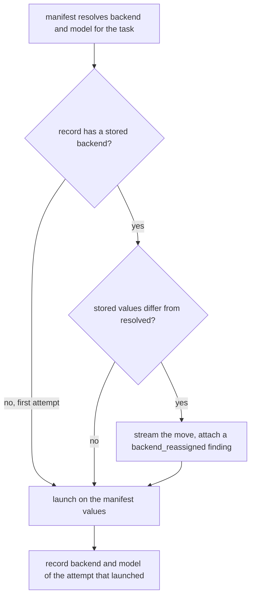

# Manifest Wins Backend Reassignment On Retry - Plan

## Goal Capsule

- Objective: an operator who moves a not yet landed task to a different backend or model by editing the manifest gets that task relaunched where they sent it, and can read afterwards that the move happened.
- Means: drop the record wins rule for backend, record the model beside it, refuse an incoherent pair at validate, and report the move on the runner's output and on the record (KTD1, KTD2, KTD3, KTD10, KTD12).
- Authority: this plan's KTDs own the mechanism. `CONCEPTS.md` owns the vocabulary. `CLAUDE.md` owns the repo rules that outrank both, in particular the closed halt class set and the standard library only constraint.
- Execution profile: six units, dependency ordered, each landable as one commit. The suite is the gate.
- Stop conditions: stop and report if the unittest suite cannot be made green, or if dropping the record wins rule turns out to break a downstream reader this plan did not enumerate. The enumeration was already incomplete once, on `unenforced_restrictions`, so treat a fresh sweep of every record field a backend writes as part of U3 rather than trusting KTD2's list.
- Tail ownership: the caller owns the commit, the gate, and the merge.

---

## Product Contract

### Summary

Make the manifest the authority on which backend and model a task relaunches with. Report a change of either on the runner's output as it happens and on the task's record afterwards. Record the resolved model beside the backend so a reader can see both halves of the routing choice, and refuse at validate a manifest that would hand a model to a CLI known not to accept it.

### Problem Frame

`run.py` `_one_task` currently replaces the manifest resolved backend with the backend stored in the task's record whenever the two differ. The rule landed in commit `7b8a0f2` under `docs/plans/2026-08-31-relay-26-backends-u11-record-summary-shape-plan.md`, whose U1 step 3 asked to "keep resume tied to that stored value rather than a later manifest edit".

Round eight showed the cost. Task 45 halted on grok. The operator edited the manifest to move it to sonnet. The resume relaunched it with `args: ["grok", "-p", ...]` anyway, ran for 1.08 active seconds, produced empty stdout, and classified `no_envelope`, which moved the task from halted to blocked. Why that relaunch produced nothing is not established here and is not this plan's subject; issue #62 owns reading the incident transcripts and deciding what a launch that produces no output at all should classify as. What matters for routing is that the operator's edit did not reach the process, and the only escape available was hand editing `state.json` with the lease free.

That outcome also raised the bar on the next attempt. A blocked record is skipped unless the run is asked to retry blocked tasks, so the operator repeating the same gesture on task 45 needs both a manifest edit and `--retry-blocked` before a reassignment can reach the task at all. R8 carries that.

The behaviour is worse than "the edit is ignored". There is no `model` key in `state.RECORD_FIELDS`, so the manifest already wins for model and only the backend is pinned. The operator's edit lands half applied: the record forces `backend = grok` while the manifest supplies `model = sonnet`. The two halves of one routing choice disagree, and nothing in the record says so.

The manifest can express only half of the pair globally. `backend` is inherited from `[defaults]`, `model` is per task with no default, and `validate` checks only that each task's model is non empty. So an operator who moves every pending task with one `[defaults] backend` edit sends each task's old model string to the new CLI. R9 closes that.

### Requirements

**Routing authority**

- R1. On every relaunch, a task launches on the backend and model the manifest resolves for it, not on values stored from an earlier attempt.
- R2. A record whose stored backend matches the manifest resolved backend relaunches unchanged, so an ordinary resume is not affected.
- R3. The record wins rule stays in force for `branch` and `baseline_sha`, which name artifacts that exist on disk.
- R8. The existing gate on retrying a blocked task is unchanged: a reassignment reaches a blocked record only on a run that retries blocked tasks.
- R9. A manifest that resolves, for one task, a backend together with a model known to belong to a different backend is refused by `validate`, before any task launches. An unrecognised model name is allowed through.

**Visibility**

- R4. When a relaunch resolves a different backend or a different model than the record carries, the runner attaches a finding to that record naming both the previous and the new values.
- R10. The runner reports the reassignment on its own output at the moment it resolves it, immediately before the launch it describes.
- R5. The record carries the resolved model of the attempt that launched, alongside the backend already recorded.
- R6. The summary prints the model beside the backend for each task, and prints the reassignment finding through the existing per task findings lines.

**Documentation**

- R7. `CONCEPTS.md`, `skills/relay/SKILL.md`, and `README.md` state the whole retry routing rule an operator has to act on: the manifest's resolution decides a relaunch's backend and model, the record still owns `branch` and `baseline_sha`, a blocked record needs a retry before a reassignment reaches it, and a task branch carrying commits past its baseline is still refused. Today none of that is written down outside the code.

### Key Decisions

- Manifest wins over the record for routing values. Governs R1, R2, R3.
- The runner reports a reassignment, it never refuses one. What refusal there is happens earlier and elsewhere, in `validate`, against a pair that cannot work at all. Governs R4, R9, R10.

### Scope Boundaries

In scope: the routing resolution in `run.py`, the record fields it writes, the finding vocabulary in `contracts.py`, the backend and model coherence check in `manifest.py` with the capability field it reads, the summary surface, and the three docs that state the resume rule.

Out of scope, and deliberately so:

- The `relay reset <manifest> <task-id>` verb. See Alternatives Considered.
- The one second empty stdout grok relaunch that classified `no_envelope`. Issue #62 owns it, including reading the incident transcripts to establish the cause this plan does not assert.
- Any change to how `manifest.validate` decides a task needs a `reason` for diverging from the default backend. That guard is already the operator's written justification for a per task backend, and `docs/solutions/logic-errors/invalid-defaults-backend-silently-turned-off-the-reason-check.md` warns against folding another condition into its expression. R9's coherence check is a separate check for the same reason.
- Recording whether a routing choice was operator pinned or router chosen. Issue #61 owns that distinction and names this issue as a dependency. R7 is phrased so a later router that resolves a manifest placeholder into a concrete backend does not falsify the documented rule.

### Acceptance Examples

- AE1. Covers R1, R4, R5. Given task `T-2` has a record with `backend = grok` and `model = grok-4`, and the manifest now resolves `backend = claude`, `model = sonnet` for `T-2`, when the runner relaunches `T-2`, then the launched argv opens with `claude`, the record reads `backend = claude` and `model = sonnet`, and the record's findings carry one entry of class `backend_reassigned` naming backend grok to claude and model grok-4 to sonnet.
- AE2. Covers R2. Given task `T-2` has a record with `backend = claude` and `model = sonnet`, and the manifest is unchanged, when the runner relaunches `T-2`, then no `backend_reassigned` finding is attached.
- AE3. Covers R3. Given task `T-2` blocked and left a branch carrying commits past its baseline, when the operator reassigns `T-2` to another backend and reruns, then the stranded branch is still refused by the existing R48 check, because `branch` and `baseline_sha` are untouched.
- AE4. Covers R5. Given a state file written before this change, whose record carries `backend` but no `model`, when the runner relaunches that task with the same backend, then no reassignment finding is attached, because a model absent from the record is not a changed model, and the record now reads the resolved model.
- AE5. Covers R6. Given task `T-2` has a record carrying `backend = claude`, `model = sonnet`, and a `backend_reassigned` finding, when the summary is built, then the task head prints claude and sonnet together, the finding's Cause line prints among that task's findings, and no corresponding entry appears in the pending checks list.
- AE6. Covers R8. Given task `T-2` blocked on grok and left no branch past its baseline, and the manifest now resolves claude, when the operator reruns without retrying blocked tasks, then `T-2` does not launch and no finding is attached; when they rerun with blocked retries on, then `T-2` launches on claude and carries the reassignment finding.
- AE7. Covers R9. Given a manifest whose `[defaults] backend` is grok and whose task `T-2` names the model sonnet, when `validate` runs, then it refuses with an error naming `T-2`, grok, and sonnet, and no task launches. Given the same manifest with a model name no backend claims, `validate` passes.
- AE8. Covers R10. Given the runner resolves a reassignment for `T-2`, when it launches the task, then a line naming `T-2`, the previous backend and model, and the new ones has already been written to the runner's output.

---

## Planning Contract

### Key Technical Decisions

KTD1. Delete the record wins swap in `_one_task` rather than qualifying it. The issue offers "record wins only when the manifest still names the recorded backend". That condition reduces to a no operation: the swap only fires when the two differ, so gating it on them agreeing disables it entirely. Qualifying it on an explicit per task `backend` key instead of the resolved value would not fix the reported incident either, because the manifest block for task 45 carried no `backend` key and inherited `[defaults] backend`. The honest form of option one is a full reversal, so state it as one. Governs R1, R2.

KTD2. Reversing `7b8a0f2` is justified because a backend names no durable artifact. `docs/solutions/workflow-issues/task-branch-namer-empty-is-not-omit-retry-reads-the-stored-name.md` established record wins for the branch name, and its reason is specific: the stored name points at commits on disk, so recomputing it can strand or destroy work. A backend points at nothing that survives the attempt. `launch.launch` mints a fresh session id on every call (`session_id = session_id or str(uuid.uuid4())`), so a relaunch is never a resumption of a session; the record's `binary_path`, `args`, and `transcript_path` are overwritten by the new attempt regardless of which backend runs it. The discriminator is therefore: record wins where the stored value is an identity naming an artifact, manifest wins where it is a routing choice. Governs R1, R3.

KTD9. One backend derived record field is not overwritten by the next attempt and has to be cleared explicitly: `unenforced_restrictions`. `run.py` writes it only when the resolved backend does not enforce tool restrictions at launch, and `upsert` merges rather than replaces, so a record reassigned from a non enforcing backend onto an enforcing one keeps a stale safety disclosure that `summary` then prints about a run which did enforce. This could not happen while the record's backend was immutable across relaunches, so the reversal introduces it. Clear it at the same `STATUS_RUNNING` upsert that already clears `halt_class` and `findings`, so every attempt supplies the scalar afresh from its own resolved backend. Governs R1.

KTD10. A backend and a model that do not belong together are refused at validate, not reported after the fact. The manifest can default a backend for every task but has no `[defaults] model`, and `validate` checks only that each task's model is non empty, so a single `[defaults] backend` edit hands every task's old model string to the new CLI. Reporting that per record after the launch would recreate the split routing this plan exists to remove, one task at a time, across an unattended run. Governs R9.

KTD11. The coherence check is negative, not an allowlist. Each backend's capability record gains the model names that backend is known to accept, and `validate` refuses only a pair where the model is a known name belonging to a different backend. A positive allowlist would refuse a valid new model the day the provider ships one, which turns a routine model bump into a manifest that will not load. The negative form catches the reported hazard, sonnet handed to grok, and stays silent on anything it does not recognise. Put the names on the capability record rather than a second per backend table, per `CONCEPTS.md`. Governs R9.

KTD12. Announce the reassignment on the runner's own output at resolution time, not through the notifier. `_one_task` already writes operator lines through `cfg.stream`, which reaches the console and the run log a detached run writes, so a line there is visible before the launch it describes rather than only in a summary the operator asks for afterwards. It does not go through `announce`: `CONCEPTS.md` defines a Phase event as a closed set of three moments, and a routing choice is not one of them, so putting it on the desktop would both widen that set and make a bulk reassignment N notifications. Governs R10, R4.

KTD3. Report the reassignment as a finding of a new class `BACKEND_REASSIGNED`, not as a bespoke record field and not as a halt class. `CLAUDE.md` fixes the halt classes as a closed set and directs a new outcome to a finding on a record. Findings already render in `summary._task_entry` and in `summary.lines`, so the visibility requirement is met with no new summary machinery. A new finding class costs four coordinated edits in `contracts.py`, because `tests/test_contracts.py` asserts `set(HALT_LINES) == set(LINE_CLASSES)` and `FINDING_CLASSES` is a subset of `LINE_CLASSES`. Governs R4, R6.

KTD4. The finding is not a pending check. `summary._pending_checks` promotes only an allowlist of finding classes into the "what a human still has to do" column. `BACKEND_REASSIGNED` stays off that allowlist: a reassignment the operator asked for is not a chore they owe. Governs R6.

KTD5. Add `model` to `state.RECORD_FIELDS` and write it at the same `STATUS_RUNNING` upsert that already writes `backend`. `RECORD_FIELDS` is not enforced as a closed set (`upsert` keeps unknown keys, and `run.py` already writes `halt_message` and `unenforced_restrictions` outside the tuple), but adding the key is the convention that seeds it to `None` on records `new_record` creates from here on. A record already sitting in a state file keeps its own dict and never gains the key at all, because `upsert` reaches for an existing record before it builds a new one. So every reader takes `model` through `.get`, never a subscript, and no schema version bump or normalizer change is needed. Governs R5.

KTD6. Compare only fields the record actually carries. A reassignment is detected when the record's stored value is present and not `None` and differs from the resolved value, per field. A record written before this change has no `model` at all, so a missing model never counts as a changed model. Without this rule every older record would emit a spurious reassignment finding on its first relaunch. Governs R2, R5.

KTD13. Keep the legacy backend backfill, and rewrite the comment that explains its limit. `state._normalize_legacy_state` fills `backend = "claude"` onto every record in a file below schema version 2, and its own comment is right that this is evidence rather than a guess: before pluggable backends every task did run on claude. That justification survives KTD1 untouched, and it means a legacy state directory resumed under a grok manifest reports a move from claude to grok that genuinely happened. What does not survive is the comment's second half, which explains why the fill stops at the schema boundary by naming the record wins rule as the harm. The surviving reason for the limit is plainer: a current schema record with no backend halted before anything launched, so there is no attempt for a backend to be evidence of, and inventing one would put a CLI on the summary that never ran. Rewrite the comment and the test docstring that repeats it to rest on that, and change no behaviour. Governs R2.

KTD7. Write the finding at the `STATUS_RUNNING` upsert, and prepend it again at the post launch upsert, keeping it out of the digest. The running upsert sets `findings=[]`, and the post launch upsert replaces the list wholesale, so a finding written once is erased twice. The trap is that the record's list and `digest["findings"]` are deliberately the same object today, so the obvious prepend also puts a routing note into the digest, where `closeout` renders it as an Other findings bullet and the Closeout process then comments a tracker card about a routing change. Rebind the digest to its own copy of the classify findings and build the record's list separately. That has one consequence worth stating: a halted task's closeout brief stops inheriting findings an earlier closeout appended, which is correct, since those were never the digest's. Governs R4.

KTD8. Split the two jobs the outer halt handler's backend fill does today. `run.py` around line 250 fills a halt record's backend as `recorded or task.backend`, for two reasons at once: reconciling a swap `_one_task` may have made, and never overwriting a value already on the record. KTD1 removes the first reason. The second has to stay, because three raise sites reach that handler before anything launches, the pre flight refusal, the R48 stranded branch refusal, and any git or adapter error, and AE3 drives one of them. Writing the manifest's backend there would put a CLI on a record whose `args`, `binary_path`, and `transcript_path` still describe the previous attempt, with no finding to explain it, since the finding is written at the running upsert that path never reaches. So keep `recorded or task.backend`, add `model` under the same guard, and rewrite the comment to give the surviving reason. Governs R1.

### High-Level Technical Design

Resolution of one task's routing on relaunch, before and after.

The removed edge is the one that ran from C back into A, replacing the resolved backend with the stored one. Everything else is new. A halt raised before E is the case KTD8 covers: the record keeps whatever backend the previous attempt left on it.

### Assumptions

- The `[defaults] backend` for the manifest that ran task 45 resolved to `claude`, since the task block carried no `backend` key. The plan does not depend on which default it was, only on the manifest resolving something other than grok.
- An operator who edits `[defaults] backend` intends every not yet landed task to move. No confirmation gate is added for it. R10's stream line makes each move visible as it is taken, and R9 refuses the manifest outright when the move would carry a model to a CLI that does not know it.
- `RECORD_FIELDS` may grow without a schema bump, and every reader reaches a record field through `.get`. If a later reader needs `model` present rather than absent, that reader owns the migration, not this change.
- The model names put on the capability records under KTD11 are a partial list by design. They exist to catch a known name on the wrong backend, so they go stale harmlessly: an unlisted name is simply allowed through.

### Sequencing

U1 and U2 are independent and can land in either order. U6 is independent of both. U3 depends on U1 and U2. U4 depends on U1 and U2, because one of its test scenarios renders the finding class U1 creates. U5 depends on U3 and U6 and describes what they did.

### Sources and Research

- `skills/relay/scripts/relay/run.py`, `_one_task` routing swap and the outer halt handler's backend fill.
- `skills/relay/scripts/relay/launch.py`, `launch` mints a fresh session id per call, which is what makes KTD2's discriminator hold.
- `skills/relay/scripts/relay/state.py`, `RECORD_FIELDS`, `upsert`'s reach for an existing record before building a new one, and `_normalize_legacy_state`'s backfill with the comment recording the U14 and T-35 bug.
- `skills/relay/scripts/relay/manifest.py`, `validate`'s per task key check and the absence of a `[defaults] model`, which is why R9 exists.
- `skills/relay/scripts/relay/backends/__init__.py`, the `Capability` dataclass KTD11 extends, and the three backend modules that each pass `task.model` through as `--model`.
- `skills/relay/scripts/relay/closeout.py`, which renders the digest's findings as Other findings bullets in the Closeout brief, the consequence KTD7 avoids.
- `skills/relay/scripts/relay/summary.py`, `_task_entry` and `_pending_checks`, the two surfaces a finding reaches.
- `skills/relay/scripts/relay/contracts.py`, `FINDING_CLASSES`, `LINE_CLASSES`, and `HALT_LINES`, whose agreement `tests/test_contracts.py` asserts.
- `docs/plans/2026-08-31-relay-26-backends-u11-record-summary-shape-plan.md`, the plan this one reverses in part.
- `docs/solutions/workflow-issues/task-branch-namer-empty-is-not-omit-retry-reads-the-stored-name.md`, the near neighbour that supplies KTD2's discriminator.
- `docs/solutions/logic-errors/continue-past-halt-checked-general-state-blind-to-the-branch-its-own-skip-left.md`, the source of the two run test discipline in U3.
- `docs/solutions/logic-errors/classify-call-inside-closeout-run-kept-the-claude-default-for-a-non-claude-transcript.md`, the record of a plan's own backend call site list missing a fifth site. The list re derived for this plan found no missed launch site, but did miss `unenforced_restrictions` on the record until review, which is KTD9.
- Issue #61, the backend routing epic, which names this issue as a dependency and requires the record to distinguish an operator pinned choice from a router chosen one. That distinction is out of scope here, and R7 is worded so the epic does not falsify it.
- Issue #62, the split out half of the round eight incident.

### Alternatives Considered

Do nothing. The operator's escape stays hand editing `state.json` with the lease free, on a tool whose whole point is running unattended. Rejected because the cost is not one edit: the operator has to know which of a record's fields to change, and a mistake there is silent in a way a manifest edit is not.

Report the divergence and launch on the record's backend anyway, a warn only version of the same change. It makes the failure legible without reversing anything, which is a real and cheaper option. Rejected because the operator's next move after reading the warning is still hand editing `state.json`, so it converts a silent block into a documented one. R10's stream line keeps the legibility this alternative was after.

A `relay reset <manifest> <task-id>` verb that clears a non landed record so the next run launches fresh from the manifest. Rejected for four reasons. It does not use the gesture the operator already made, so the manifest edit still silently fails until they learn a second command exists. `state.py` has no record delete API, so it needs either a first of its kind delete or a re seed through `new_record`, and a vanished record silently changes the counts `summary.build` and `progress.build` compute. Clearing the record destroys `branch` and `baseline_sha`, which are exactly the two fields the R48 stranded branch refusal in `_clear_blocked_branch` reads, turning a recoverable blocked record into a task whose old branch blocks its own pre flight with no baseline left to judge it by. And no CLI verb takes the lease today, so a reset run beside a live runner would be overwritten by the in flight process with no warning. Manifest wins reaches the same outcome with no new verb, no new lease question, and no new destructive path.

---

## Implementation Units

### U1. Finding class for a reassignment

- Goal: give the runner a vocabulary entry for "this task relaunched somewhere other than where it last ran".
- Requirements: R4. Implements KTD3.
- Dependencies: none.
- Files: `skills/relay/scripts/relay/contracts.py`, `tests/test_contracts.py`.
- Approach:
  1. Add a `BACKEND_REASSIGNED = "backend_reassigned"` constant beside `CANCELLED_TOOL_CALL`, with a comment naming issue #58 and stating that it is a finding only, so the record's own `halt_class` is unaffected.
  2. Add it to `FINDING_CLASSES`.
  3. Add it to the explicit tuple `LINE_CLASSES` appends to `HALT_CLASSES`.
  4. Add a `HALT_LINES` template with finding local key names, for example `relaunched on {to_backend} {to_model}, previously {from_backend} {from_model}`. Keep it to one line, because a newline in a rendered value corrupts the Cause line. The key names are local for readability, not for shadow safety: `summary._task_entry` renders a finding's line from the finding dict alone and never passes the record, so no record field can reach this template.
- Patterns to follow: `CANCELLED_TOOL_CALL` and `WAITING_LAST_MESSAGE` are the two most recent finding only classes and carry the comment shape to mirror.
- Test scenarios:
  - `tests/test_contracts.py` `OwnVocabulary` still passes with the new class present, proving all four edits were made and not three.
  - `contracts.HALT_LINES[contracts.BACKEND_REASSIGNED]` formats to a single line with no newline when given a finding dict carrying all four keys.
  - A finding dict missing one key renders the placeholder `summary` substitutes for an absent field rather than a blank or a raised error, since a legacy record can carry a backend change with no previous model. Assert the rendered text, not just that it did not raise.
- Verification: the vocabulary test module passes and the new class appears in `FINDING_CLASSES`, `LINE_CLASSES`, and `HALT_LINES`.

### U2. Record the resolved model

- Goal: put the model on the record so both halves of the routing choice are readable, and so a model change can be detected.
- Requirements: R5, R2. Implements KTD5, KTD13.
- Dependencies: none.
- Files: `skills/relay/scripts/relay/state.py`, `tests/test_state.py`.
- Approach:
  1. Add `"model"` to `RECORD_FIELDS`, beside `"backend"`.
  2. Do not bump `contracts.STATE_SCHEMA_VERSION`, and change no behaviour in `_normalize_legacy_state`. A record already in a state file keeps its own dict and never gains the key, so every reader takes `model` through `.get`.
  3. Rewrite the second half of the `_normalize_legacy_state` comment, and the docstring of the test that pins it, so the reason the backfill stops at the schema boundary no longer cites the record wins rule U3 deletes. The surviving reason is KTD13's: a current schema record with no backend halted before anything launched, so there is no attempt for a backend to be evidence of.
- Patterns to follow: `backend`, `binary_path`, and `args` were added to the same tuple in commit `7b8a0f2` without any reader being made to require them.
- Test scenarios:
  - A record from `new_record` carries a `model` key whose value is `None`.
  - A state file written before this change opens, and `record.get("model")` on its existing records returns `None` rather than raising. Assert through `.get`, not a subscript; a subscript would fail and send an implementer after a migration KTD5 rules out.
  - `upsert(task_id, model="sonnet")` persists the value and a fresh `StateStore` on the same path reads it back.
  - The existing schema version 1 backfill test still passes unchanged, since only its docstring moved.
- Verification: `tests/test_state.py` passes, including the existing v1 to v2 legacy tests, and no comment in `state.py` still cites the record wins rule.

### U3. Manifest wins, and the move is recorded

- Goal: relaunch on the manifest's backend and model, and attach a finding when either differs from what the record carries.
- Requirements: R1, R2, R3, R4, R5, R10. Implements KTD1, KTD2, KTD6, KTD7, KTD8, KTD9, KTD12.
- Dependencies: U1, U2.
- Files: `skills/relay/scripts/relay/run.py`, `tests/test_run.py`.
- Approach:
  1. In `_one_task`, delete the `replace(task, backend=record["backend"])` swap. Replace it with a comparison that produces an optional finding dict, computed after the early returns for excluded, landed, and already excluded tasks, so a task that will not relaunch never produces one.
  2. Compare per field, and only where the record's stored value is present and not `None`. A differing backend, a differing model, or both produce one finding carrying all four values.
  3. When there is a finding, write its sentence to `cfg.stream` at once, before the pre flight call, so the operator's log carries the move even on a run that never reaches the launch. Use `cfg.stream`, not `announce`, per KTD12.
  4. Change the `STATUS_RUNNING` upsert to write `model=task.model` alongside `backend=task.backend`, to write the reassignment finding instead of an empty list when there is one, and to clear `unenforced_restrictions` so the next attempt supplies it afresh, per KTD9.
  5. At the post launch upsert, rebind `digest["findings"]` to its own copy of the classify findings, then build the record's list as the reassignment finding followed by that copy. Preserve the existing distinction between an empty findings list and `findings_unavailable`, and keep the reassignment finding out of the digest, per KTD7.
  6. Leave the outer halt handler's `recorded or task.backend` fill in place, add `model` under the same guard, and rewrite its comment to give the surviving reason, per KTD8. Do not write the manifest's backend onto a record whose launch never happened.
- Execution note: run the whole flow twice in the test with no manual repair between the runs. `docs/solutions/logic-errors/continue-past-halt-checked-general-state-blind-to-the-branch-its-own-skip-left.md` records a regression test that passed only because the harness hand deleted a branch before the second run, which made it blind to the bug it was written for.
- Patterns to follow: `tests/test_run.py` `EndToEnd.test_resume_uses_the_recorded_backend_after_a_manifest_edit` is the existing test that pins the rule being removed. Invert it and rename it rather than deleting it, so the reversal is visible in the diff. `UnenforcedRun.load_codex` is the pattern for rewriting the manifest file on disk and reloading, needed for any case a CLI level test drives.
- Test scenarios:
  - Covers AE1. A task's record carries `backend = claude`; the manifest is edited to `codex`; the second run launches with argv opening `codex`, the record reads `backend = codex`, and its findings carry exactly one `backend_reassigned` entry naming claude and codex.
  - Covers AE2. A task's record and the manifest agree on the backend; the second run attaches no `backend_reassigned` finding and the record's findings hold only what classify produced.
  - Covers AE4. A record carrying a backend but no `model` key relaunches on the same backend and attaches no finding.
  - A model only change, with the backend unchanged, attaches one finding naming the two models and the same backend on both sides.
  - Covers AE3. A blocked task that left a branch carrying commits past its baseline is still refused by the R48 check after a backend reassignment, and the stranded branch is still named in the summary's pending checks. Run both runs through the runner with no manual `git branch -D` between them.
  - Covers AE6. A blocked task reassigned in the manifest does not launch on a rerun without blocked retries, and does launch on the reassigned backend with the finding when blocked retries are on. Both runs go through the runner with no record edit between them.
  - Covers AE8. The reassignment sentence appears on the runner's stream before the launched argv does, and it names the task, both backends, and both models.
  - A task refused at pre flight after a reassignment keeps the backend and args of the previous attempt on its halt record, so the two never disagree, and the streamed sentence still explains what was attempted.
  - A record reassigned from a backend that does not enforce at launch onto one that does carries no `unenforced_restrictions` afterwards, and the summary text for that task no longer discloses one.
  - The reassignment finding survives the post launch upsert alongside a classify produced finding, and both appear on the record.
  - The written digest JSON carries no `backend_reassigned` entry, and neither do the Other findings bullets of the Closeout brief rendered for that task.
  - A run where the transcript could not be read keeps `findings_unavailable` semantics: the digest's `findings` stays `None` while the record still carries the reassignment finding.
  - The existing guards still pass: the record carries `backend`, `binary_path`, and `args`; the terminal version map stays keyed on the backends that actually launched; `classify.classify` is still called with `backend=`.
- Verification: `tests/test_run.py` passes, the inverted resume test asserts the manifest's backend, and no test still asserts that a record's backend beats the manifest.

### U4. Summary surfaces the model

- Goal: let an operator reading the summary see which model ran, not only which CLI.
- Requirements: R6. Implements KTD3, KTD4.
- Dependencies: U1, U2. U1 because the cause line scenario below renders the finding class U1 creates.
- Files: `skills/relay/scripts/relay/summary.py`, `tests/test_summary.py`.
- Approach:
  1. Add `"model": record.get("model")` to the dict `_task_entry` returns.
  2. In `lines`, extend the per task head that already appends `(backend)` so it reads the backend and the model together when a model is present, and stays as it is when it is not.
  3. Leave `_pending_checks` alone. `BACKEND_REASSIGNED` is deliberately not promoted to a pending check, per KTD4.
- Patterns to follow: the existing `if entry["backend"]: head += "  (%s)" % entry["backend"]` guard, which already tolerates a legacy record with no backend.
- Test scenarios:
  - A summary built over a record carrying both a backend and a model prints both in the task head.
  - A legacy record with a backend and no model prints the backend alone and does not print `None`.
  - A record carrying a `backend_reassigned` finding prints its Cause line under the task's findings.
  - That same record produces no new entry in the pending checks list.
- Verification: `tests/test_summary.py` passes and the rendered text for a reassigned task names both the finding and the new model.

### U5. Write the rule down

- Goal: state the whole retry routing rule an operator has to act on, in the three places that describe resume today.
- Requirements: R7.
- Dependencies: U3, U6.
- Files: `CONCEPTS.md`, `skills/relay/SKILL.md`, `README.md`.
- Approach:
  1. `CONCEPTS.md`, the `### Backend` entry. It currently ends "The Runner launches on that CLI. It does not choose or change the backend during a run." Keep that sentence, it stays true within a run, and add that between runs the Manifest's resolution decides again. Say "the Manifest's resolution", not "the Manifest", so the routing epic's later placeholder backend does not falsify the entry. Add nothing about file paths or function names; the entry is a glossary entry.
  2. `skills/relay/SKILL.md`, the `## Resume` section. State the four parts of the rule in operator language: the manifest's resolution decides a relaunch's backend and model, the record still owns the branch name and the baseline, a blocked task needs blocked retries turned on before a reassignment reaches it at all, and a task branch carrying commits past its baseline is still refused until the operator deals with it.
  3. `README.md`, the paragraph describing repair and rerun. The same four parts in the README's voice.
- Patterns to follow: existing entries in `CONCEPTS.md` state a rule and then the reason it is that way, in prose, with no code references. `skills/relay/SKILL.md`'s `## What this skill never does` is where a comparable operator guard already reads.
- Test scenarios: Test expectation: none, this unit is documentation. No test reads these three files.
- Verification: the three files state the same four part rule and do not contradict each other, the phrasing survives a later router that resolves a placeholder backend, and none of them uses a dash as punctuation.

### U6. Refuse a model that belongs to another backend

- Goal: stop a manifest whose resolved backend and model do not go together from launching anything.
- Requirements: R9. Implements KTD10, KTD11.
- Dependencies: none.
- Files: `skills/relay/scripts/relay/backends/__init__.py`, `skills/relay/scripts/relay/backends/claude.py`, `skills/relay/scripts/relay/backends/codex.py`, `skills/relay/scripts/relay/backends/grok.py`, `skills/relay/scripts/relay/manifest.py`, `tests/test_backends.py`, `tests/test_manifest.py`.
- Approach:
  1. Add a `known_models` field to the `Capability` dataclass and give each backend the model names it is known to accept. Partial by design, per the Assumptions.
  2. In `manifest.validate`, add a check that a task's resolved backend and model are not a known mismatch: refuse only when the model appears in another backend's `known_models` and not in this one's. An unrecognised name passes.
  3. Write it as its own check, never folded into the existing backend and reason conjunction. `docs/solutions/logic-errors/invalid-defaults-backend-silently-turned-off-the-reason-check.md` records what happens when a guard's halves are joined that way: an invalid value silently disabled the whole condition.
  4. Guard against a backend that names a model another backend also names, by treating a name present in both as valid for both rather than a mismatch.
- Patterns to follow: `validate`'s existing per task loop, which builds a label per task and calls `err` with the task id and the offending value.
- Test scenarios:
  - Covers AE7. A manifest whose defaults backend is grok and whose task names sonnet is refused, and the error names the task, grok, and sonnet.
  - The same manifest with a model no backend claims passes validation.
  - A manifest whose backend and model agree passes, for each of the three backends.
  - The check is independent of the reason check: a manifest with an invalid `[defaults] backend` still reaches the mismatch check for every task rather than skipping it.
  - A model name listed on two backends is accepted on both.
  - `tests/test_backends.py` still passes with the new capability field present on every backend.
- Verification: `tests/test_manifest.py` and `tests/test_backends.py` pass, and the mismatch check fires on its own with the reason check disabled.

---

## Verification Contract

| Check | Command | Applies to |
|---|---|---|
| Full suite, the project gate | `python3 -m unittest discover -s tests` from the repo root, about two and a half minutes | U1 to U6 |
| Vocabulary agreement | `python3 -m unittest test_contracts` from `tests/` | U1 |
| Record shape and legacy state | `python3 -m unittest test_state` from `tests/` | U2 |
| Routing, findings, and the stream line | `python3 -m unittest test_run` from `tests/` | U3 |
| Summary surface | `python3 -m unittest test_summary` from `tests/` | U4 |
| Manifest refusal and capability shape | `python3 -m unittest test_manifest test_backends` from `tests/` | U6 |

A local pre push hook, not tracked in git, runs the full suite again on every push, so the gate cannot be disabled by the merge it guards.

The cross backend tests run on the stubs. `tests/stub-claude` carries executable `claude`, `codex`, and `grok` stubs, and the existing codex run drives one end to end, so a reassignment test needs no live model. The evidence shapes differ per backend, so a cross backend test takes that backend's own fixture rather than the claude one.

On the live run question: `CLAUDE.md` requires one live task against a throwaway target after changing a contract between processes, and names the envelope grammar, the closeout terminal line, a brief template, the halt record, and the classify digest keys. This change leaves what a Task process emits and what the runner parses untouched; only the value fed into an existing launch path differs. It does change the digest, by keeping a finding out of it, and the halt record, by adding `model`, so the honest reading is that the trigger is grazed rather than missed. One live cross backend relaunch against the proof repo is the cheap way to settle it, and it belongs after the merge rather than in the gate.

---

## Definition of Done

Global:

- The full unittest suite passes from the repo root.
- No test asserts that a record's stored backend beats the manifest.
- No comment or docstring in the runner or the state store still cites the record wins rule as a live reason.
- The plan's six units are landed as separate commits on `relay/58`.
- No experimental or dead code from an abandoned approach remains in the diff.

Per unit:

- U1: the new finding class is present in all four places in `contracts.py` and `tests/test_contracts.py` passes.
- U2: `model` is in `RECORD_FIELDS`, legacy state still opens through `.get`, no schema version was bumped, and the backfill comment rests on its surviving reason.
- U3: a manifest edit changes the launched backend, a matching manifest attaches no finding, a record with no stored model attaches no finding, the move is streamed before the launch, a halt before launch leaves the previous attempt's backend on the record, the stale unenforced scalar is gone after a reassignment, and the stranded branch refusal still fires.
- U4: the summary head prints the model when present and the reassignment finding prints without becoming a pending check.
- U5: `CONCEPTS.md`, `skills/relay/SKILL.md`, and `README.md` state the same four part rule.
- U6: a known model on the wrong backend is refused at validate, an unrecognised model passes, and the check fires independently of the reason check.
